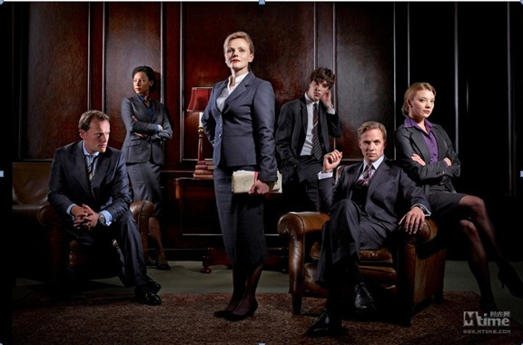
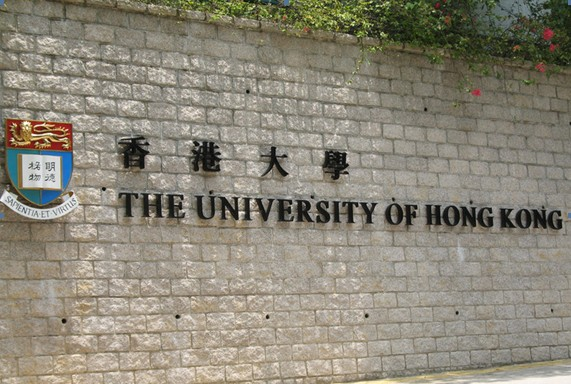

# 七星说法：律师制度在香港

** **

#### **大律师和律师**

因为和英国在历史上的特殊原因，香港律师制度保留了普通法系下最传统的分流制（split profession），在大陆，当我们称一个律师从业人员为“大律师”的时候，多半是为了表示对律师职业的尊重或者是对律师本人的恭维，而在香港，律师和大律师其实是两种不同的职业。

大律师又称为讼务律师，亦在民间被俗称为“大状”，专门从事法庭的诉讼辩护，在法庭上享有充分的发言权，可在所有香港法院进行的案件中代表当事人出庭应讯，还可以接受聘请就涉及诉讼的问题（如是否提起）或其他专门法律问题提供专业意见。

律师又称为事务律师，专门从事非诉讼业务或部分诉讼业务，但在诉讼中，其出庭时的发言权受到限制且只能在一些特定的相对低阶法庭上出庭。

虽然大律师的名头听起来似乎更加霸气侧漏，但实际上两者并无高低之别，只是执业范围不同而已。

第一，大律师作为讼务律师，其主要职责就是代表当事人在法庭上进行诉讼。大律师可以出席任何法庭的诉讼，包括最高法院和地方法院。

而律师，其业务就主要集中在非讼业务。所谓“非诉讼业务”是指律师接受公民、法人或者其他组织的委托，在其职权范围内为当事人处理不与法院、仲裁委员会发生关联的法律事务。在香港，事务律师从事的非诉讼业务具体主要包括一下几项内容：

房地产业务。近年来随着香港房地产业的发展，房地产业务成为香港许多律师事务所的主要业务。房地产业务包括房地产的租赁，买卖楼花，其中以房地产买卖为主。律师在房地产买卖中起了重要作用。通常，某一房屋或物业买卖、按揭（mortgage）时，当事人都委托律师办理一切手续。以房屋买卖流程为例，买方选择好房屋后，可到律师楼委托律师，由律师查看田土厅记录，审查卖方草拟的买卖合约草稿；买卖合约正式签署后，由买方律师负责将合同在田土厅注册，并就地权问题向卖方提出质询；然后，买方律师草拟产权转户合同，由买卖双方签署，至买方付首期款，卖方交钥匙并楼契，楼房即成交。最后，买方签署抵押合同，由买方律师将产权转户合同和抵押合同在田土厅注册，并将注册契据交贷款银行直至买方还清贷款。

商业业务。商业涉及的范围很广，包括公司成立，公司转让、合营，公司上市、股票交易、合伙、银行贷款、税务、信托基金；商标注册、草拟遗嘱、处理遗产托管和继承、离婚及赡养费等。

咨询。向当事人提供各种口头和书面的法律咨询；担任银行、公司或个人的法律顾问。

公证业务。公证业务只能由公证律师负责。香港没有专门的公证机关，所有公证活动均由具有公证资格的律师担任。事务律师要申请公证人资格，首先必须执业l0年以上，并获得30名社会人士的共同推荐，经港英政府审查、英皇室批准，在香港法院注册登记后，取得公证律师资格。公证律师的业务就是为当事人认证有关的法律文件，公证律师只需证明某个法律文件上的签名盖章是真实的，即该文件上的签名、盖章是在律师面前签署的，而无须证明文件的内容是否真实。换言之，公证律师只须对当事人的签名、盖章的真实性负责，而不必对文件内容的真实性负责。

第二，法律规定大律师必须单独执业，不得与其他大律师或事务律师合伙开业。但通常，三、五名甚至更多的大律师会共同租用一个写字楼作为大律师事务所开业。在大律师事务所里，每个大律师都有自己独立的办公室和秘书，有的则是二人共用一个秘书。每人的法律业务、财务、专业职责都是独立的，与同一事务所的其他律师毫不相干，一大律师毋须为另一大律师的行为负任何责任。因此，经常会出现同一事务所的律师作为同一案件的原被告律师在法庭上分庭抗礼的情形。在同一事务所里，大律师之间的关系就是按办公室的大小比例分担房租，共同雇用若干名职员来负责接电话、接待、清洁等日常事务。换言之，在香港的大律师事务所里，大律师们虽然身在同一屋檐下，抬头不见低头见的，却是类似于“井水不犯河水”的的关系，甚至不能算作“同事”。

而事务律师则可以个人开业，也可以与其他律师合伙组成律师事务所，还可以受雇于私人律师事务所。律师事务所是合伙组织，对外承担无限责任。在一个律师事务所里，一般可分为合伙人、助理律师和职员。合伙人是较有威望的律师，也是律师事务所的老板，他们按合伙比例分红。助理律师称为Assistant solicitor，是被律师事务所雇佣的有执业资格的律师，一般是按月支取固定报酬。另外，还有大量的行政人员和职员，负责处理律师事务所繁杂的日常事务，在一些规模较大的律师事务所里，律师、职员多达几百人。

第三，大律师和律师的事务也不是截然区别关系，由于大律师的工作也有不少限制性条件，比如不得直接受理当事人的案件，不论刑事案件或民事案件，必须由从事诉讼的事务律师转聘大律师；除非时间不许可或对某种案件不熟悉外，大律师不得拒绝接受律师的聘请；大律师不得直接与当事人接触，也不能直接向当事人收取报酬，只能向事务律师收取等，所以律师的业务也包括代理大律师与当事人洽谈、接收案件、会晤证人、调查取证等，根据香港法律规定，凡是大律师办理的案件，都须有事务律师协助，事务律师主要负责诉前的准备工作，包括会见当事人、证人、收集证据、草拟答辩书并陪同大律师出庭。

另外律师也可以在低级法院如区域法院、裁判法院等出庭辩护，大量的裁判司法庭和地方法院审理的案件都是由事务律师代里。

****

#### **律师资格的取得**

在香港，要取得大律师或律师资格，须经过不同的途径，大致可以归纳为“三步走”。

 **STEP1：取得法学学士学位**

一般来说，无论要成为大律师或律师，文凭总是一个“敲门砖”。

目前，香港大学(University of Hong Kong)和香港城市理工学院(City Polytechnic of Hong Kong)都开设了法律学士学位课程，学制均为3年，课程包括香港基本法律制度、宪法、行政法、合同法、财产法、刑法、侵权法、信托法、商法、公司法、保险法、税法、证据法、家事法等。学生修完上述课程后，还须在模拟法庭实习，完成毕业论文后方可毕业，取得法律学士学位。除此之外，学生还可以通过学习英国伦敦大学为海外学生开设的校外法律学位课程而取得法律学士学位。

 **STEP2：深造**

学生毕业后，有志成为律师者，还必须申请攻读为期一年的法律深造文凭课(Postgraduate certificate in laws，简称PCLL)。这一年的时间可以说是准律师们开始分化的阶段。在PCLL期间，拟成为大律师的学生，会侧重于判例；拟成为事务律师的学生，则侧重于商法、公司法、合同法等实体法的学习。取得法律深造文凭后，即进入实习阶段。

 **STEP3：实习**

大律师与事务律师的实习方式也有所不同。

要成为大律师，须以学生的身份跟随一位师傅实习年师傅必须是已取得律师资格执业至少年的大律师实习期内，学生要协助师傅准备各种上庭文件，陪同师傅上法庭，出席聆讯，从而取得实际经验。实习期的后半年，学生可以在师傅的指导下独立处理法律事务。

这种师徒传授的方式，也是香港律师制度当中的优良传统。北京市汉卓律师事务所的韩冰律师在一篇文章中写到过：他对于香港大律师制度感触最深的，是“师徒”关系。“这种师徒关系，有着悠久的历史传统，每个大律师都有自己的师傅，而且‘一日为师，终身为师’，任何大律师都不能抛弃这个传统。”

一般来说，前6个月的实习期内，实习律师是无任何收入的，只是在后6个月处理一些简单案件时才有一些酬金。实习期满后，经大律师公会考核合格，取得大律师资格。

要成为事务律师，学生要跟随一名已取得律师资格执业至少年的事务律师实习年，学生以实习律师的身份在律师事务所工作，以掌握成为律师应具备的实务技能。学生在实习期内，可由律师事务所发给固定薪金。实习期满后，经律师公会考核合格，向香港最高法院申请登记注册，取得由律师公会颁发的执业证书。

完成了以上“三步走”之后，一位正式的律师从业人员才算是打造完毕。所以，在香港要成为一名律师或者大律师，至少需要经过5或6年的学习和磨练才能“出道”。

除上述途径外，已在英国取得大律师或律师资格的也可在香港申请执业。另外，曾在香港政府法律部门工作或在香港高等学校法学院工作的法律专业人士，也可以此为理由申请律师执业资格。

#### **结语：**

香港地区的律师制度和大陆有很大的差异性。它是以英国的律师制度为模式发展起来的，所以总体上遵循英国的律师制度传统。因此，了解香港的律师制度之后，很大程度上你也可以在英国的司法实践中找到印证。香港律师制度的内容丰富，还有很多有意思的问题，笔者在这里无法一一穷尽，例如它的历史沿革，御用大律师（现在叫资深大律师）的现状以及香港律师公会和香港大律师公会的发展等等，感兴趣的读者可以做进一步的了解。

 

### **【深入阅读】**

** ** [百年香港律师业(上篇)](http://www.yufenglaw.net/in_new.asp?id=840) [香港三代律师看香港律师业](http://wenku.baidu.com/view/00e1a13667ec102de2bd89c4.html) [香港律师与大陆律师制度之比较](http://blog.tianya.cn/blogger/post_read.asp?BlogID=3731698&PostID=37452746) [香港律师制度](http://blog.sina.com.cn/s/blog_4cbdb1a001000d6r.html) [《香港律师制度》 中国人民大学 法学院教授 林嘉](http://wenku.baidu.com/view/714fc1661ed9ad51f01df27f.html)  

(编辑：于轶婷，林骥)

 
