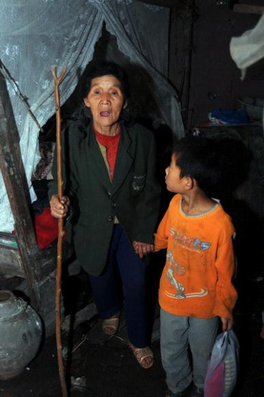
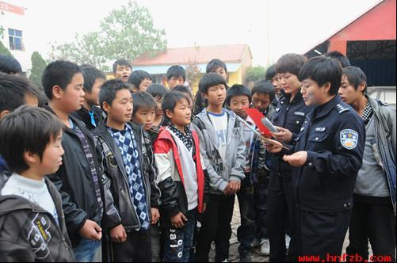

# 七星说法：社会转型之殇——农民工留守子女犯罪问题

** **

近日，湖南省衡阳市蒸湘区批捕了一个涉嫌组织卖淫团伙。团伙中的9名男女都是清一色的“90后”，她们中年纪最小的刚满15岁，并且这个15岁的女孩阿嫣是这个团伙中的大姐大。但是与很多被暴力手段胁迫被迫卖淫的少女不同，这起案件中的多名女孩子是自愿的，她们的男友是她们的“经理人”，负责帮她们联系客人，并且依附她们生活。**值得我们重视的是，本案中的少男少女大多是农民工家庭出身，并由此凸显出来的农民工留守子女犯罪日益严重的问题。**

### 涉嫌组织卖淫罪？

阿嫣这个15岁的女孩组织少女从事卖淫活动，为她们介绍客人，因此具有组织行为，卖淫对象包括自己和其他少女，并且从事了卖淫活动。但是阿嫣是刚满15周岁，还未到组织卖淫罪所规定的刑事责任年龄，因此笔者认为阿嫣不构成犯罪，另外其他女孩已满16岁，已经到达刑事责任年龄，但是**就目前中国的刑法来说，卖淫不是犯罪，顶多是行政处罚或者是行政拘留。另外如果她们在团伙中协助组织其他女孩子卖淫的话，那么她们就要按照协助组织卖淫罪来定罪。而对于这个团伙中的男孩子来说，应当以组织卖淫罪定罪，因为他们兼任“经理”，为她们介绍客人，具有组织行为，并且达到刑事责任年龄。**

或许对于他们来说 ，这只是为了生计，或许也是为了所谓的爱情，但是触犯了法律，就要承担相应的罪名和刑罚，但是在这之外，我们不禁要沉思，是什么原因让这些如花般的少女成为失足少女？是什么原因让这些本应该在学校学知识的未成年人变成违法犯罪的人？

 

### 孰之过？

本案凸显出来的农村农民工留守子女犯罪问题，笔者认为主要存在这么几个原因：

第一， 城乡二元结构导致家庭监督失控。随着中国改革开放的深入和市场经济的发展，中国的城镇化，工业化，现代化有了长足的进展，因此大量的农村剩余劳动力向城市转移，人口流动日趋频繁，农村中劳动力外流家庭数量激增。尽管有的农村劳动力在非农化过程中实现了地域转移，但是由于户籍制度的限制，其农民的身份并没有改变。因此已经进城的农民工及其子女并没有取得市民身份，城市公立学校并没有向农民工子弟完全敞开大门，而且农民工子女即使在城市上了学业必须回原籍地参加中考或者高考。

**在这些因素的影响下，随父母进城并留在父母身边上学的农民工子女只占20%到30%，剩下的农民工子女留在老家上学成为留守子女，爷爷奶奶隔代监护或者委托监护，这样必将导致家庭教育的缺失和家庭监督的失控**。隔代监护的，双方难以进行正常的交流，这给留守子女造成了心理上的阴影问题，并且老年人自己也属于需要照顾的人群。委托监护的，监护人一般在感情上达不到对待亲生子女那样的程度，缺乏家庭温暖气氛和亲情的呵护。再者，由于农民工工作的繁忙和赚钱的所迫再加上农民工所受教育程度不高，对孩子缺少足够的关怀。最多也是问考试得多少分，无法对孩子的学习和行为进行有效的辅导和监督，家庭教育出现真空，其教育和监督职责丧失，这对孩子的心理和学习产生了消极的影响。

第二， 学校教育对农村留守农民工子女的影响。学校教育方法的失当和素质教育的缺失，是造成“留守农民工子女”犯罪的另一客观原因。学校是青少年接受正规化教育的主要场所，学校的作用不仅仅是传播知识，同时还负有塑造美好心灵，灌输正确思想道德观念，培养正确人生观和道德情操的职责。但是，有的学校没有重视这一特殊的群体，有的学校从来没召开过家长会，班主任对自己班上学生的家庭状况知之甚少，根本不知道班上有多少“留守生”。处理问题也仅仅就事论事，挖掘不到学生的思想根源，触及不到学生的灵魂，教育工作缺乏针对性。由于缺乏家长的监护和管束，农民工留守子女在学校一般表现为不遵守学校纪律，不听老师话，学习成绩差等等。而学习成绩差往往会与同龄人成群，更无心思学习。在大力提倡素质教育的今天，应试教育机制仍然在发挥着主导作用。在城里的中学，尤其是在广大的农村中学，他们只重视学生的学科成绩，在思想品德教育、法制教育方面还没有引起足够的重视，对学生的心理辅导和必要的性知识教育普遍比较缺乏，对成绩不好的学生存在偏见，甚至歧视。

**因此，一些升学无望的学生在教师的潜意识里就被无情的抛弃了，而留守农民工子女在升学无望中的比例中占大部分比例，他们得不到老师的关爱。**甚至有的老师把农民工留守子女看成是包袱，看成是拖累整个班级升学率的一个累赘。而农民工留守子女正处于青春叛逆期，学校或者老师的作法让他们产生惧怕、叛逆、敌对、甚至报复等心理，从而导致行为失控，走上了违法犯罪的道路。另外，在中学旁边，对于青少年颇有诱惑力的游戏机厅，网吧等随处可见。留守子女由于父母不在身边，缺乏有效的监督和管教，而学校教育失当，因此这一群体很容易沉迷于网络或者游戏机厅，这让他们仿佛找到了“家”的感觉。而且这些农民工留守子女由于有同样的心理，对学习不感兴趣，很容易惺惺相惜，这样就很容易成为一个群体。而这一群体由于零花钱不够而会想方设法的去搞钱，甚至铤而走险去犯罪。

第三， 法律对农民工留守子女的保障不足。农民工留守子女的另一个重要原因是他们的合法权益本身就缺乏保障。他们作为未成年人中特殊的一类弱势群体，需要一系列的法律体系和保障制度给予保护。**《未成年人保护法》中第16条规定了对农民工留守子女的委托监护制度。还有2006年国务院下发的《关于解决农民工问题的若干意见》中要求做好农民工做子女的教育问题，强调加强对农村留守子女的工作。尽管如此，但这些仍然不足以对农民工留守子女的的生存，发展等权利进行全面、有效的保护。**有关未成年人保障的法律法规中缺乏对农民工留守子女保护的具体措施。由于法律规定的不完善，导致其合法权益得不到保障，农民工留守子女在社会中处于被忽视的地位。这使得他们心理失衡。在学习和生活中出现了各种各样的问题。

第四， 另外，立法缺乏严谨性导致执法机关存在执法缺陷。比如，**我国《刑法》规定，因不满16周岁不予刑事处罚的，责令他的家人或监护人加以管教；在必要的时候，也可以由政府收容教养。**所谓必要的时候，有关解释为例如家中无人管教，或者虽有人管教，但是确实管教不了，或者群众反映强烈，要求政府收容教养。此条文规定**由于缺乏严谨性而导致在实践中操作起来很有难度**。一方面，因为农民工一般都在外务工，家中只留下年迈的祖辈照顾自己的子女，而农村的老人一般读书不多，不懂法，怎样确保孩子怎样不再违法呢?另一方面执法机关为了省事，在司法实践中一般都责令家人或者监护人加以管教，而不考虑由其加以收容教养，这样会让留守子女在心理上产生轻视的态度：违法的成本不高，因此会导致农民工留守子女违法的恶性循环。

 

### 农民工留守子女违法犯罪的预防

毋庸置疑，随着“城市化”进程的进一步加快，农村劳动力进一步向城市转移，在相当长的时间内，农民工留守子女的队伍不仅不会缩小，而且必将进一步扩大。那么，怎样预防农民工留守子女违法犯罪呢？笔者认为可以从以下几个方面来做。

第一， 逐步进行户籍制度改革。对于从农村来到城市打工的父母来说，他们当然也舍不得孩子，狠下心来把孩子留在千里之外的家乡也是一种无奈。一方面由于城里生活成本太高，另一方面是**户籍制度这个无法逾越的沟壑**。因此进城务工的农民工不大可能把子女带在身边。农民工子女在城市的上学，医疗保险等受到一定政策的限制。因此，**要解决此问题，首先要以户籍制度改革为起点，拆除就业、住房、教育等制度壁垒，逐步大批维系多年的城乡二元机构**。其次要逐步改革当前的学籍管理制度，取消多农民工子女就读的不公平、歧视性的政策，采取多种形式，依法保障农民工子女在城市接受义务教育的权利等等。最后，要加大中央和地方财政对教育的投入比重，由于农民工子女的入城接受教育，以前的财政投入不可避免的不满足需求，需要对教育进行加大投资。

第二， 重视农民工留守子女的家庭教育和学校教育**。**由于户籍制度改革的长期和艰巨性，不可能一蹴而就，因此在相当长的时间内户籍制度也许保持原来的样子。因此，**重视农民工子女的家庭教育和学校教育将是预防农民工留守子女违法犯罪的关键点。父母是子女的第一任教师，抚养、保护和教育未成年人子女是父母的法定责任。**一方面，要提高父母对子女教育重要性的认识，正确管束和引导教育孩子。父母双方不要都出去，最好留一个在家中陪伴孩子。这对于孩子的学习和生活有着重大的意义，给了孩子情感上的依靠。另一方面，密切学校和家长的联系。留守未成年人大部分时间在学校度过的，学校和老师要对学生的思想动态保持高度关注，要和学生家长保持通畅联系，告诉学生家长多和学生沟通。学校和班主任要对留守子女在生活上给予足够的关心和照顾，在学习上要与优等生一视同仁，不要要学生感觉老是在歧视自己。帮助学生树立正确的价值观、人生观，防止他们参加不良的社会活动。让留守学生感觉学校和老师是真正关心和爱护他们的，使他们对学校产生归属感和依赖感。

第三， 强化法制教育。对农民工留守子女进行普遍和深入的法制教育，是预防其犯罪的一个极其重要的方面。许多农民工留守子女犯罪时，根本不知道、不认为自己的行为是犯罪，他们对有关法律法规知之甚少或根本不知道，是地地道道的法盲。因此，对他们进行法制教育非常迫切。司法机关可以联合学校结合周边的治安状况，有步骤地采用课堂教学形式，或采用丰富多彩的活动形式，向学生讲明什么是合法、什么是不合法、什么是违法、什么是犯罪、犯了什么罪应当受到什么样的惩罚等等，使学生逐步树立起法制观念和守法意识，进一步规范自身行为，做一个守法公民，并能运用法律武器保卫自己的合法权益，这必能预防和减少农民工留守子女犯罪。

第四， 加大法律对农民工留守子女的保护。首先，通过立法完善父母的监护责任。农民工留守子女犯罪的一个很大原因是父母监护责任的缺位。尽管民法通则和未成年人保护法中规定父母是未成年人的法定监护人，这都是一些比较空泛的规定，并没有对此监护权进行详细的叙述，因此**需要通过立法来细化法定监护权的规定**。其次，我国在1992 年就实施了《未成年人保护法》, 又在1999 年实施了《预防未成年人犯罪法》, 填补了我国少年司法的空白, 保护了未成年人的合法权益。但是现有法律、法规由于线条过粗, 规定过于笼统, 操作起来难度较大。相关部门要在进一步完善立法的基础上, 制定切实可行的防范措施, 使预防农民工留守子女违法犯罪工作真正做到有法可依。最后，营造一个好的法律环境，加大司法保护力度。**良好的法律环境对于惩罚和预防犯罪有着积极作用。司法机关可以通过其职能给农民工子女合法权益维护开设绿色通道来保障其合法权益，法律援助部门要加大对农民工留守子女的法律援助力度，扩大法律援助范围。通过此些法律措施能更好的引导农民工留守子女的行为规范，维护他们的合法权益，切实预防和减少农民工留守子女犯罪。**

**随着改革开放的不断深入，社会关系格局发生了深刻变化，由此产生了新的社会问题和社会矛盾，农民工留守子女犯罪率逐年增长就是对社会转型过程中的隐痛和暗疾的无情揭露。**我国农民工子女占未成年人总数的很大一部分，他们的成长不能被忽略，应该引起整个社会的高度重视。农民工子女能否健康成长对于中国未来的发展和整个中华民族都异常重要，因此我们要正视农民工子女犯罪率上升的事实，分析其背后折射的社会原因，在此基础上采取有效的预防措施，减少农民工留守子女犯罪概率，让他们拥有正常的青少年生活，茁壮成长。

### 

### 

### 【深入阅读】

 1.姚兵，《论预防未成年人犯罪的基本原则》，北京人民警察学院学报，2009（5）； 2.赵聪，《未成年人犯罪的成因及预防》，法学研究，2012（5）； 3.赵军，《家庭因素与未成年人犯罪关系研究》，法学评论。2012（2）； 4.裴小梅，《留守儿童犯罪的社会干预_留守儿童_犯罪引发的思考》，河南师范大学学报，2008(3); 5.黄新，《农村留守儿童犯罪的调查与思考》，湘潭大学硕士论文，2010（5）； 6.冯文林,《农村留守未成年人违法犯罪的原因及预防》，湖北警官学院学报，2012（9）; 7.熊亚，《城镇化进程中农村留守儿童教育问题研究》，华中师范大学硕士论文，2007（5）。 

#### P.S.

 致亲爱的七星说法读者们： 

“七星说法读者群”业已上线，群号：262980026。在这里，你可以去和你喜欢的编辑搭讪，可以咨询法律问题，可以认识许多学法律的孩纸，可以问问怎么考华政的研究生或者司法考试的复习方法，可以探讨法律高深的理论或者有意思的故事，可以和一群有意思的人一起组织法律项目研究，最重要的是，可以深入了解一个有着专业知识但又很有趣的团队——七星说法团队。毕竟，结识朋友，永远是我们来北斗最欣喜的一件事儿。

（编辑：伍永兴，马特，陈澜鑫）

 
