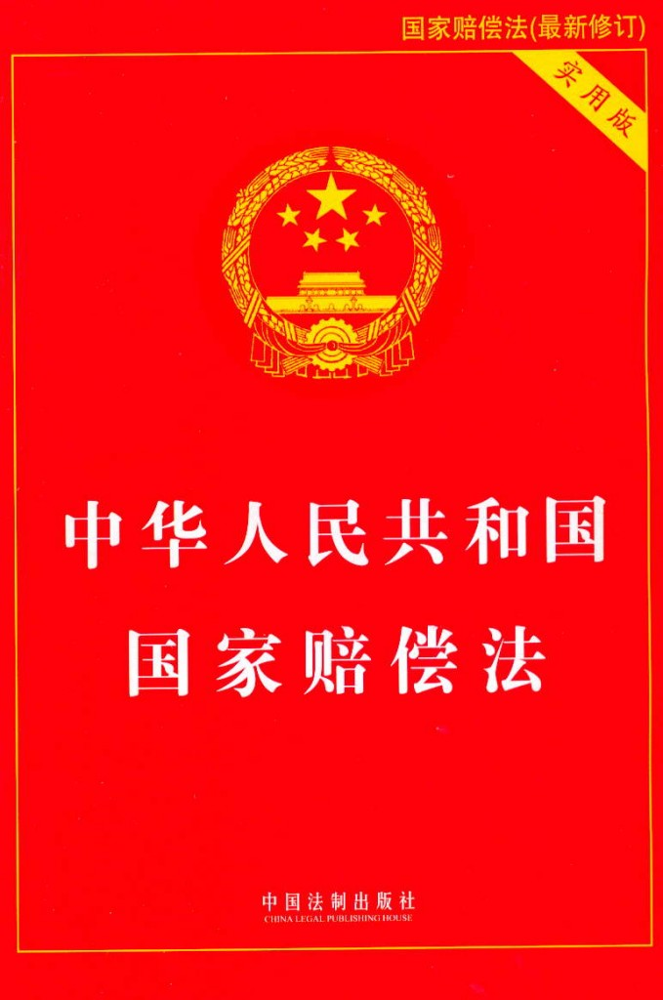

# 七星说法：警察开枪无底线，人民生命无保障

** **

近日，网传一偷窃电动车的男子在逃跑过程中，被河南焦作市温县公安局党委副书记李世轩击毙。10月8日，温县警方对此案进行了详细通报，称这名男子多次作案，在抓捕过程中袭警拒捕，民警多次鸣枪示警，嫌犯仍持砖打砸民警头部，民警生命受到威胁后开枪将其击伤，送医后不治身亡。这起事件在网上引起了极大的争议，支持者认为警察当时处于危险处境，生命受到威胁，可以开枪。

 

### **网友众说纷纭，警察该不该开枪？**

 **支持者**

lgj8866：现在的小偷穷凶恶极，支持击毙!

ahszxw：向公安书记学习，小偷在特定环境下也会成为杀人凶手，击毙小偷，增强了社会安全感，震慑了犯罪分子。

frquan2005：治小偷要根治酒驾一样严厉的话，小偷何至于如此猖狂!赞成向小偷开枪。

 **质疑者**

imzmn：无论你单方面事后如何描述，总是找不出必须一定要数枪将其击毙的充分理由，打它的腿，难道它还能跑了不成?何况你们又是几个人逮一个。法律若是规定小偷必死，那举双手赞成，这些社会渣滓越少越好，监狱空了，国家及纳税人负担也能减轻不少。老百姓担心的是：执法持枪者权力的过度使用，生命不能漠视。相信群众的眼睛更要相信群众的脑子!

zhoudongping：记得以前看过一部美国电影，英雄主义的电影。是说一位海军陆战队的士兵在休假时因为女友被流氓骚扰而发生冲突，失手打死了流氓。结果这位士兵被判刑。理由是他是特种兵。

** **

 

### **开枪违法的法律依据是什么？**

河南温县警方通报称：事发当日，该犯罪嫌疑人驾车拘捕，手持砖头袭警。“在民警生命安全受到严重威胁，经鸣枪警告、口头警告无效的情况下，”为了制服该犯罪嫌疑人，温县公安局党委副书记李世轩将其击伤。但“犯罪嫌疑人疯狂负隅顽抗，卡住抓捕人员的脖子，继续袭警。李世轩及时赶上，和抓捕人员共同将犯罪嫌疑人制服。”犯罪嫌疑人在迅速送往县人民医院抢救中死亡。还称，两犯罪嫌疑人是惯犯，盗窃电动车和摩托车120余辆。

因此当警察击毙拒捕甚至对警察生命造成威胁的犯罪嫌疑人时，一些网友大呼痛快。他们认为警察的行为是符合正当防卫的情形及《中华人民共和国人民警察使用警械和武器条例》规定的。因此警察开枪不算是犯法和警官滥用枪械。

而质疑者认为小偷行为尽管涉嫌违法犯罪，但情节较轻，而且小偷与持刀持枪的歹徒有着明显区别，抓捕他用不着开枪，警察施展拳脚功夫就可制服。毕竟人的生命只有一次，不能轻易剥夺一个人的生命，哪怕他是犯罪嫌疑人。即使犯罪嫌疑人拒捕并袭击警察，训练有素的警察也应该有能力制服他，即使情况紧急到非开枪不可，向犯罪嫌疑人手脚等非致命的部位开枪，使其丧失反抗能力即可，而没有必要一枪击毙。

**就目前搜集的资料而言，笔者认为，温县警方的通报是一家之言，尽管有几张照片为证，但没有完整的现场录像来证明其开枪行为的合法性，这以执法行为的幌子来掩盖其非法的行为，是在替开枪警察开脱责任。**

我国法律对枪支的管理是十分严格的，这不仅反映在严禁公民非法持有枪支，也反映在警察的配备和使用枪支方面。根据《中华人民共和国人民警察使用警械和武器条例》，警察使用武器，必须是在“使用警械不能制止，或者不使用武器制止，可能发生严重危害后果的”情况下，而且“应当以制止违法犯罪行为，尽量减少人员伤亡、财产损失为原则”。**从温县公安局的通报来看，****温县警方在没有使用警械的情况下，直接开枪击伤犯罪嫌疑人，这已经违反了《中华人民共和国人民警察使用警械和武器条例》的规定****。其次，警察有数个人，而犯罪嫌疑人只有一人，根据常理推断，几名警察还是可以通过警械将犯罪嫌疑人制服，而不需要开枪击伤。再者，犯罪嫌疑人已经被警察追赶到陈家沟东牌坊北侧路边一沟内，当时的犯罪行为已经停止，嫌犯已无逃跑的可能。而温县的警察们却无视“尽量减少人员伤亡”的原则开枪击伤小偷，致使犯罪嫌疑人在被送往医院的路上死亡。因此我认为警察的行为属于擅权行为（即不正确的行使职权）。**

开枪击伤小偷的李警官称当时的情形符合正当防卫的规定，从温县公安局的通报来看，表面上符合正当防卫的五个要件，但是警察开枪对犯罪嫌疑人的生命的剥夺超过了正当防卫的必要限度，是防卫过当的行为，其涉嫌过失致人重伤死亡罪，应当对犯罪嫌疑人的死亡负相应的责任。

温县警察开枪击毙犯罪嫌疑人，违反了“合理行政”原则中的“损害最小原则”要求。合理行政是指在所有的行政活动都必须符合理性。这里的合理是指符合最基本最起码的理性，符合一个理智健全的人所应当达到的合理与适当。而“损害最小原则”要求行政机关或者行政执法人员应当采用对当事人权益损害最小的方式，即能用轻微的方式实现行政目的，就不能选择使用手段更激烈的方式。**而温县警察开枪打死犯罪嫌疑人事件明显违反了损害最小原则。警察属于行政人员，在执行抓捕犯罪嫌疑人的过程中可以采用更为轻微的方式抓捕犯罪嫌疑人，如使用警械等工具，而不需要采用开枪这种更为激烈的手段以致使犯罪嫌疑人死亡。因此明显违反了“损害最小”原则。**

**笔者认为温县警察开枪打死犯罪嫌疑人的行为是违法的，因此犯罪嫌疑人的家属可以对公安机关依照《中华人民共和国国家赔偿法》提起国家赔偿**。因为《人民警察使用警械和武器条例》明确规定：人民警察违法使用警械、武器，造成不应有的人员伤亡、财产损失，对受到伤亡或者财产损失的人员，由该人民警察所属机关依照《中华人民共和国国家赔偿法》的有关规定给予赔偿。作为行政机关的温县公安机关应当主动履行赔偿责任。

 

### **为什么警察开枪事件层出不穷？**

近年来，警察开枪杀人的案件似乎越来越多，如今年9月辽宁盘锦警察开枪致1死4伤的惨剧，官方说是警察受到生命危险而依法开枪，今年4月，广东怀集一男子持扁担追打警察，被警察连开6枪当场击毙；今年1月贵州关岭县坡贡镇的郭永华、郭永志，在大街上，被该镇派出所副所长张磊连开5枪毙命；09年8月，四川籍男子杨加赵，因与警官张继红飙车发生纠纷，在“用胶棒拍击警察车窗，推开手枪转身逃跑”后，身中三枪，且均为要害部位，当场死亡； 09年2月，云南红河供电局硅铁厂厂长潘俊，因倒车与警察吉忠春发生纠纷，在“叫骂并殴打警察头、面部，致使其鼻子出血”后，被吉忠春连射3枪，当场死亡；07年11月，广州珠江医院副教授尹方明，因“不配合警方盘问”中弹身亡……

为什么在最近几年，警察开枪杀人的案件层出不穷呢?笔者认为有以下几个原因。

**第一，执法人员的法律素养较低，其在执法活动中很少严格遵循合法性原则的规定。没有严格遵守“执法行为必须合法、合理、适当”的原则，不管是在实体方面还是从程序方面，执法人员的执法行为与行政合法性原则的规定背离甚远。**

**第二，维稳体制导致公权力的无限扩大，没有限制。对于执法机关而言，法律没有明确授权的即是违法额，是不可为的。即所谓的法无明确规定即禁止，这是对公权力的限制。然而，当下的执法现实却并未遵循这一原则。由于片面追求执法效率、执法成果，执法机关通过一系列执法行为扩张了执法权，突破了对公权力应有的限制。从短期内而言，或许执法机关的行为有利于执法的效率，但从长远而言，却破坏了法律应有的正当性和权威性。**

**第三，倒因为果、倒果为因。近几年警察开枪杀人事件（除没有争议性的案件除外），都是披着执法的外衣所行使的违法行为。但正因为所谓的维护正义，大部分此类事件中警察并未受到处罚，相反，警方各种关于合法的回应却助长了此类案件的发生。再加上警察和犯罪分子所处的立场，民众对犯罪分子憎恨的偏好，使得一大批不知情的民众支持警察开枪击毙犯罪分子。这既是警察频繁开枪杀人的原因，也是由此导致的结果。**

 

### **结语**

警察是国家的强制工具，是合法暴力的掌握者，而允许佩戴枪支是这种合法暴力的暴力性的最高实现。警察佩戴上枪支，不是用来滥杀无辜的，而是为了保护广大的人民群众的人身和财产不受犯罪分子侵犯的。因此，警察要加强自己的法律素质，坚定执法为民的信念，贯彻依法行政和合理行政的原则。同时，公权力必须谨守边界，不要越雷池侵犯公民的私权利和侵犯公民的生命财产安全，谨记公权力是为公民服务的，否则，水能载舟亦能覆舟！

 

### **【深入阅读】**

 [击毙小偷的“合法”子弹让人恐惧](http://news.bandao.cn/news_html/201210/20121010/news_20121010_1997168.shtml) [公安局副书记4枪击毙小偷何以引热议? ](http://www.people.com.cn/24hour/n/2012/1009/c25408-19200383.html%20%20) [中华人民共和国人民警察使用警械和武器条例](http://www.chinabaike.com/law/zy/xz/gwy/1333151.html) [该给警察用枪念念紧箍咒了](http://news.163.com/10/0118/04/5T9J0H8C000120GR.html)  

### P.S.

 致亲爱的七星说法读者们： 

“七星说法读者群”业已上线，群号：262980026。在这里，你可以去和你喜欢的编辑搭讪，可以咨询法律问题，可以认识许多学法律的孩纸，可以问问怎么考华政的研究生或者司法考试的复习方法，可以探讨法律高深的理论或者有意思的故事，可以和一群有意思的人一起组织法律项目研究，最重要的是，可以深入了解一个有着专业知识但又很有趣的团队——七星说法团队。毕竟，结识朋友，永远是我们来北斗最欣喜的一件事儿。

 

（编辑：伍永兴，马特）

 
