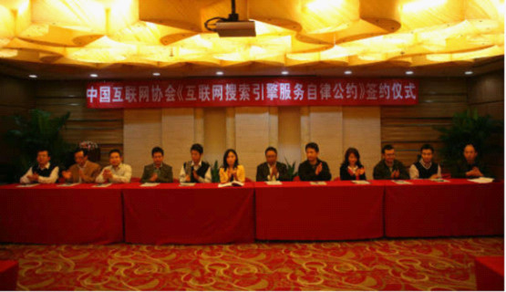

# 七星说法：谁动了我的网络隐私

** **

### 隐私，隐私权，网络隐私

艳照算不算隐私？性取向和性癖好又算不算？那么姓名性别、三围星座、家庭住址、联系方式呢？“隐私”究竟指的什么？

为了突出一下本文读者的智商优势顺带拔高姿势水平，我们先来明确这个概念的范围。传统的“隐私”Privacy，又称私生活秘密或生活。按目前民法学界流行的说法，即是指私人生活安宁不受他人非法干扰，私人信息保密不受他人非法搜集和公开等。而隐私权，就是关于隐私的权利，王利明说它就是“自然人享受的、对其个人的、与公共利益无关的个人信息、私人活动和私有领域进行支配的一种人格权”。这一权利延伸到网络环境中，就发展出了网络隐私和网络隐私权。

鉴于网络环境的特殊性，将网络隐私分化出来并非专家学者们闲得蛋疼。在自由而虚拟的网络环境下，原本不是隐私的也会成为隐私，比如姓名性别：

假设你的名字被同学同事亲人朋友到处念叨，你顶多闲他们嘴碎；又或者你尾行了一个妹子上前问号码，大概也不会觉得侵犯了姑娘的性别隐私；但是当你在网上灌水发泄或者检举揭发爽完之后，有人在跟帖留言中问候楼主的姓名性别，你肯定不仅觉得受到了冒犯，而且觉得冒犯你的这位同学的智商实在“捉急”。

**将隐私权的内容具体到网络隐私方面，就是说，网民们在网络环境下有权支配自己的隐私权，对自己隐私进行隐瞒、维护、利用；并且阻止他人以干扰自己生活的方式使用、公开等。注意，这里的分号划分开了该权利内容中的两个层面，前后分别为积极层面和消极层面。**

举个例子，某姑娘如果在网上自己宣称有E罩杯并且有图有真相，这就是姑娘在积极地使用自己的隐私赚人气；你右键悄悄把她的形象保存在自己硬盘中，这并不侵犯姑娘的隐私；但是如果你有幸约炮成功并且也想火一把，公布了手机里这个波涛乱颤的姑娘，这就是对姑娘隐私权的侵犯了；而姑娘如果义正词严地撰文警告并要求你删除，即使她满篇白字逻辑混乱，也是对隐私的消极维护。

 

### 我们没有隐私权？

不是没有，而是当时我国法律条文里没写。

我们的法律里写了什么呢？《宪法》第38条、第40条分别规定了公民人格尊严不受侵犯和通信自由通信秘密受法律保护。《民法通则》第101条据此规定了公民的人格尊严受到法律保护。“人格尊严”是个广泛的概念，也是法理上“人格权”的法条出处，而“隐私权”不过是法理“人格权”之下可以单列而难以泛指的一项。《刑法修正案（七）》第7条，也不过规定了“国家机关或者金融、电信、交通、教育、医疗等单位的工作人员，违反国家规定，将本单位在履行职责或者提供服务过程中获得的公民个人信息，出售或者非法提供给他人，情节严重的，处三年以下有期徒刑或者拘役，并处或者单处罚金。”

在意识到这一立法空白之后，最高人民法院只得用司法解释作为弥补，于是才产生了唯一使用“隐私”一词的《关于若干问题的解释》第140条：“以书面、口头等形式宣扬他人的隐私，或者捏造事实公然丑化他人人格，应当 认定为侵害公民名誉权的行为。”法院没有立法权，只能把法理上的隐私权解释到名誉权里。这一条的意思就是说——在全国人大还没把隐私权写进法条之前，先将就一下，暂时借“名誉权”这个标签保护隐私权吧。

所幸，2010年我国制定实施的《侵权责任法》为这一问题披上了遮羞布，其中第二条规定：“本法所称民事权益，包括生命权、健康权、姓名权、名誉权、荣誉权、肖像权、**隐私权**、婚姻自主权、监护权、所有权、用益物权、担保物权、著作权、专利权、商标专用权、发现权、股权、继承权等人身、财产权益。”

 

### 谁侵犯了你的网络隐私？

我们的网络隐私，简直像手无缚鸡之力的小萝莉，早在“方周大战”之前就已经被腾讯等一干猥琐大叔调戏过。奇虎、腾讯这一类的侵权方（如果经调查核实确认侵权的话），我们称其为网络服务提供者，或者网络运营商。

**经由网络运营商之手，我们的隐私是如何被泄露的呢？**最常见的行为有：（1）利用在线注册收集隐私信息，用户想获得某种网络服务的时候常常被要求填写个人信息登记单；（2）利用IP地址跟踪用户位置或行踪，如打开QQ总会有对话框提示你登陆地点；（3）利用Cookies等网络机制和技术，追踪用户网络活动（这类手段还有利用木马、黑客入侵、篡改网页或者链接等等，更多详情请自行咨询理工男），借以分析出用户的爱好、需求、政治倾向、健康状况等等。如当你在百度搜索栏里键入“女友怀孕了怎么办”，有可能下次你打开邮箱就会发现安全套或避孕药的推销广告，那就是网络运营商利用你“喜当爹”所进行的人性关怀。

根据美国联邦贸易委员会的在线报告，1400多家被调查网站中85%存在收集客户个人信息的行为，但只有14%的网站对其所为做了通告。即使做了通告又怎么样？有些网络服务，如果你点击不同意其隐私条款几乎就不能使用。比如腾讯，笔者曾经发现其中某些文件可能会趁人不备偷偷获取用户信息并上传至不知名的神秘地方，于是气愤地删除了它们；其结果是导致QQ无法正常运行，并且提示文件损坏需要重新下载安装。

这一类侵权者已经让我们难以招架了，更加让人难以招架的是另一种：其他网络用户。他们作为潜在的侵权者，行为往往简单直接粗暴，引发的却是蝴蝶效应。笔者曾经看过一个帖子，一张博主仅仅发布了一张自家角落鞋架的照片并附上两句话的截图，机智勇敢的网友们经过去粗取精、去伪存真的逻辑分析、层层接力，推断出博主为央视体育频道某位女记者，有理有据令人信服。这不禁让人感慨：幸亏这只是一个鞋架，而这位女记者做派低调，没做出过什么虐猫、不让座、或者宣称E罩杯之类的蠢事。

 

### 人肉搜索与隐私权

是的，上文中的例子就是典型的人肉搜索。

“人肉搜索”这个词最热的时候是2008年，一向以“斗小三”闻名的“天涯八卦”上出现了一篇讲述某人妻因为丈夫出轨而自杀的帖子，并且全文转载该人妻自杀前的博文。网友们在义愤填膺之余，开展了所谓“人肉搜索”，公布了出轨丈夫王菲及其家人、第三者的家庭住址、联系方式、身份证号等等详细资料。王菲父母家门口被网友用油漆涂上脏话，王菲本人被单位辞退并且被其他求职单位退避三舍。不堪其扰的王菲将天涯社区、大旗网等相关的三家网站告上法庭，史称“反人肉搜索第一案”。

所谓“人肉搜索”，就是说这种搜索方式与传统上利用机器引擎不同。它借助“人问人”“人挨人”的关系型网络社区活动，依靠网民的群力群策来寻找搜集信息，由一只蝴蝶到一批蝴蝶翅膀扇动，最终引起一场飓风。

但是，并非所有的人肉搜索都涉及对隐私权的侵犯。泛指的“人肉搜索”，也包括了百度知道、搜搜问问这种搜索工具，由网民提问、网民回答。此外，周正龙“华南虎照”作假的发现和证实也极大地借助了网友们的人肉力量，南京原房产局局长周久耕的快速落马亦是从网友们人肉出他的天价香烟名表发端。在这里，人肉搜索正面而积极，几乎成为舆论监督发挥作用最快捷最强大的方式。

**就像连异性的手都没摸过的宅男忽然间有了一个充气娃娃，人们对言论自由信息自由的长久期盼和急切渴求，让人肉搜索演变成民众疯传、交流信息和宣泄愤怒的出口。从社会学角度，这个角色就叫做“社会安全阀”。**

即使是侵犯了隐私权的人肉搜索，如上述“王菲案”，也往往缘于主人公做出什么蠢事，以至于激起民愤；而网友们纷纷加入也往往出于揭示真相和正义的质朴追求。置身信息时代大潮的他们，也不过把人肉搜索作为一种交流方式，进行虚拟网络中的社会互动而已，很难说每个人都怀揣着能够上升到法律层面的“恶意”去窥探他人隐私，破坏他人生活。

但是，这也仅仅意味着人肉搜索的存在具有相当的合理性。人越多做事情越容易不经过大脑，你很难在民意大潮汹涌扑来之时拉条线拦住它，说它侵犯了一个做了蠢事的人的权利。而立法的意义，就在于事先就建好堤岸，告诉人们要涨潮请沿这条路，别到处乱撞冲坏了河边的民居和庄稼。

 

### 不是结语的结语

就像所有法律评论，结尾部分无一例外地要呼吁加强立法，健全法制体系。尽管现在某些省市已经有了诸如《广东省计算机信息系统安全保护条例》、《山西省计算机信息安全保护条例》、《徐州市计算机信息系统安全保护条例》等地方性法规，但是仅仅有这些显然是不够的。无数人渴望下辈子能投胎的大美利坚，采用了分散立法的模式，除了有各种案例为司法制定规则之外，国会在一些敏感领域（如儿童信息、金融数据等）分别制定了《儿童网上隐私法》《电子通讯隐私法案》《消费者网上隐私法》等法律。不过鉴于我国民法更倾向于大陆法系的传统，最终效仿德国，以宪法为中心和民法人格权为基础的统一立法模式似乎更有可能，广大美粉们要失望了。

在上述两类侵权者当中，第一类（网络运营商）是最强势也是最具有操控力的。如同电影《搜索》中所展现的，网络媒体在激发、引导民意方面也发挥着强大的作用。这也是为什么“王菲案”中的丈夫状告的是三家网站，而非愤怒难平的广大网友。**于是，网络运营商们的行业自律，在网络信息自由与网民隐私权维护之间的利益冲突与平衡方面就显得异常重要。**今年11月1日，中国互联网协会在北京举行《互联网搜索引擎服务自律公约》签约仪式，百度、搜狗、腾讯、网易、奇虎360等12家搜索引擎服务企业共同签署了该公约。这对于信息网络发展的行业协会自律而言，简直是振奋人心的好消息，虽然也疑似有为十八大献礼之嫌。

但是，这也并不意味着第二类（其他用户）不好管就不管了。尽管“法不责众”，但在民意煽动群雄激愤之时往往会出现个别主心骨，以能够引导舆论潮流为人生乐事。这种人有可能是微博大V、公知意领，也有可能一个不小心就是阅读本文的你。虽然网上无法开动坦克轰轰碾倒大片头脑发热的网民，可是事情闹大了揪几个带头闹事的……对警察叔叔来说还是不成问题的。所以，作者在此告诫各位，网络再自由可也别得意忘形，尊重他人才是善待自己。

 

### 【深入阅读】

 1. 张新宝，《隐私权的法律保护》，群众出版社，1998年； 2. 刘德良，《网络时代的民法学问题》，人民法院出版社，2004年； 3. 李德成，《网络隐私权保护制度初论》，中国方正出版社，2001年； 4. 屈茂辉，凌立志，《网络侵权行为法》，湖南大学出版社，2002年； 5. 梁慧星，廖新仲，《隐私的本质与隐私权的概念》，人民司法，2003（4）； 6. 王利明，《隐私权内容探讨》，浙江社会科学，2007（3）； 7. 薛霞，《人肉搜索现象的社会学思考》，中国青年研究，2009（01）； 8. 王英民，《隐私权法律保护的现状与未来——由“人肉搜索”第一案引发的思考》，兰州学刊，2009（1）； 9. 唐维，《试析隐私权的保护——以“人肉搜索”为视角》，法制在线  

（编辑：王卜玄，陈蓉）

 
