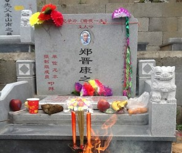
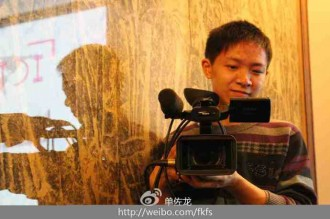

# 不万能的纪录片——专访独立电影导演单佐龙

单佐龙：同济大学纪录片硕士专业，杭州亚洲青年电影节（HAFF）节目策划。2011年入围第61届柏林国际电影节第9届天才训练营。《大众DV》杂志推为“鼓舞2010”DV年度人物，并获得2010罗中立奖学金。2009“感动湖州”年度最具影响力提名人物奖、浙江省湖州市十大杰出青年提名奖等。

纪录片作品《借我一生》、《虹桥弄》获上海电视节MIDA导演计划优胜提案奖、北京大学生电影节短片竞赛单元评委会特别奖以及东京国际录影节佳作奖等。两部片子曾入围维也纳国际电影节、意大利亚洲电影节、贝加莫国际电影会议、汉诺威国际青年电影节以及台湾华语电影论坛等国内外影展。纪录片被作为荷兰Movies That Matter电影节闭幕电影。

纪录片项目《陌上桑》入选柏林国际电影节天才训练营纪录片工作站（Doc Station）与欧洲纪录片联盟发起的CB国际纪录片跨界工作坊。

## ·不服输老头的独角戏《借我一生》

**《借我一生》剧情：**

郑晋康，83岁，未婚无子女。影片用摄像机记录了他对前半生跌宕起伏的口述和如今安老院孤独生活的状态。（注：老人已于2013年3月去世）

郑晋康出生于百万富豪家族，当年上海滩上的小K，从小出入跑马厅、舞厅等上流社会场所，人生前20年生活在纨绔子弟的富足之中；1950年开始人生命运急转直下，接连的政治运动和莫须有的罪名，把他打成了反革命并两次入狱共几十年时间；晚年的他偏安小镇双林，独居安老院，因脾气乖戾不愿与他人同住，执意独居太平间。安老院孤独生活的间隙，老人坐在床头滔滔讲述故去的声色犬马和落难后的牢狱之艰。

片尾，面对镜头，老人讲出他已将自己的后事托付给上海的老朋友。慷慨地高唱着《满江红》，脑海中依旧萦绕着那句

让他悔恨终身的诗句：“莫等闲，白了少年头，空悲切。”

### “我甚至没有想要表达什么，它只是在老人人生中出现的一个节点。”

Q：当初《借我一生》选择这样一个老人作为拍摄对象，是出于什么考虑？

A：一开始我们是去拍整个养老院，去了之后才发现这样一个比较有趣的人物，最终决定要拍他一个人。毫不隐晦的说，一开始拍他是因为他的历史、他的人生经历让我很震撼。但后来在短片完成的时候去参加独立影展，一个导演讲对我这个短片版的观感是“你有点被主人公的给历史镇住了，总觉得自己身边怎么会有这么传奇的人。”于是后来我就发现他的经历不是最重要的，那个时代比他的经历更多、更惨的人只会多不会少，所以他也只是一个代表而已。纪录片还是关于个体的。

Q：在片子完成后，你对郑晋康老人的态度是什么样的？

A：这个态度我一直没有变：去法国之前做的一个版本中，我希望去表现这个老头的倔强，而不是他的历史。因为我觉得他之所以会有这样的经历不完全是这个时代造成的，很大一部分是因为他自己的个性。那你再想他这种倔强的个性是谁造成的？这样一想可能还是体制、时代的原因，所以穿插在整个历史情境当中可能还是他个性中倔强的问题。

他的倔强表现在许多方面：首先是他对于环境的倔强。你看他这么老了，明知道自己身体不行了，还是不愿意到前面去住，还住在这么热的地方，自讨苦吃，不服输嘛；还有一个是对身边的人不服输，无论是对他好的人——比如照顾他的阿姨，还是对他不好的人，或者说还认为他是反革命分子的人，他都是一样的态度；甚至他对体制也不服输，对他过去的遭遇就更不服输了；到最后你会发现他连自己都不服输，连自己都不相信自己的一个人。所以“不服输”这一点可以把他一点一点剖析出来，我当时就是立足于这样的一个点。

Q：影片的名字也很有意思，为什么要命名为“借我一生”？同样是在牵涉到文革的特殊历史背景下，有受到余秋雨先生的著作《借我一生》的影响吗？

A：我知道那本书，翻过几页但是没有看完。其实没有什么关系，事实上我更喜欢的是这个片子的英文名，是我的制片人帮忙取的，叫hard old rock，其实更能反映片子的主题。

Q：不知您是如何看待剧中的一些情节的？比如一个电话就毁了一段感情，一个反革命罪就决定了这个人的一生。

A：我并不是最关心情节。我觉得我们看记录片的态度很不一样，你是从一个观众的角度去看，你看的还是情节和内容，但是我从一个作者的角度，对实在的情节并不关心。换句话讲，我甚至没有想要表达什么，它只是在老人人生中出现的一个节点。

我更在乎的可能是另外一段，给老人剃头那段，他说了自己第二次进监狱的那次经历。而这个就是那位法国剪辑师给我很大的一个帮助吧，我当时其实只是觉得这段素材找的很好，剪辑点很好，但是没办法用，只能表明他在剪头，没有更深的意义在里面。但当他在剃头和口述结合在一起的时候，就完全不一样了，他在剃完头之后整个人生境遇也不一样了。

### “纪录片的真实，应该是态度的真实”

Q：你在片中选择忠实地记录老人的生活，有考虑过像主流电影一样制造戏剧性冲突吗？你对纪录片中使用这种手法反感吗？

A：没有。首先我觉得你说的戏剧性冲突这个东西我并不排斥，对于某些议题的纪录片这是很好的手法，但你觉得我应该怎样在这个老头身上表现戏剧冲突？他一生的所有的戏剧性冲突都在他过去的历史当中。

Q：记录片中，你作为导演也提出了一些问题，你觉得这些问题会不会对影片的客观性造成影响？

A：我们以前一直认为纪录片的本质是真实，更甚之有人会认为纪录片的底线是真实。我觉得在这个时代做纪录片，我们已经没有必要去分清什么是纪录片什么是剧情片了。所以我们觉得真实不是我们要纠结的一个因素，所谓的真实，应该是态度上的真实。

还有一种观点是“无主观，不记录”。没有一部纪录片不是主观的，所有纪录片都是经过导演一轮拍摄、一轮剪辑后的选择。也许我拍了两年，拍到了一百多个小时的素材，这一百多个小时还需要剪辑和加工，甚至时空的交错，来完成最后的整片，这不主观吗？所以最后还是要看导演要说什么，直奔那个东西。

Q：在整个拍摄过程中，拍摄这部纪录片时遇到的最大障碍是什么？

A：以前我们一直说纪录片要有一个故事，这样才会吸引人，但是事实上很多纪录片是没有故事的，或者说他的故事很宏大。讲一个人的历史，几十年的历史放到一个60多分钟的片子里面，相当于一分钟就是一年。这个把握不好也许就变成一个专题片，讲这一年他发生了什么事，那一年他发生了什么事。

所以你需要去找也许是他人生中转折点的那一年，但是他中间会有一些戏剧的冲突在里面，这时候就需要通过他自己的口述、情景再现、以及更多的手法。我觉得最大的难题其实是这个片子不是讲当下故事的，这个老人现在生活就是“起床、吃饭、睡觉”重复，与他过去的生活截然不同。所以我觉得这个把握起来是最难的。

### “剪辑师其实是在帮助导演完成他想要的片子。”

Q：你觉得相比你以前的作品《虹桥弄》，《借我一生》有哪些进步的地方？

A：《虹桥弄》是学生作业，学生作业肯定是有学生作业的方法和观念，到《借我一生》就开始有一种比较规范的工艺操作流程。首先是有投资，这个投资来自于SMG，虽然不多，只有三万五千元，但是当时这些钱也足以在一个小镇上把一个纪录片完成了；其次是它的整个拍摄过程用了一年多时间。另一个方面是在拍摄当中，素材积累比第一个要多，而且有了第一次拍片子的经验，对纪录片的理解也更多了；最后一点就是去年跟法国摄影师的合作，我对剪辑的态度发生了变化。我以前一直认为“纪录片导演是最了解自己素材的人，他不应该把片子交给其他人去剪辑。”跟法国摄影师合作后，我现在发现这个观点是错误的。

Q:您跟法国摄影师的观念不同表现在哪些地方呢？

A：从我的角度出发，我在剪辑那个所谓的国内版时，我的一个指导理论是希望尽可能少的用口述，所以那个版本集中于表现老人当下的状态。另一个想法是即便当时发生了再多事情，最终导致结果还是当下的，所以我决定我要去表现当下的故事。这和我刚刚说的是一个矛盾，当下是没有故事的，当下只有状态。状态、情绪不足以成故事，不过故事本身也是陷阱，不可以完全这么说。

而法国剪辑师和我观念是完全不同的，他认为这个老人语言魅力很大，口述是完全可以支撑起这个故事的，而且他觉得这是一个关于政治和个体、关于历史的故事，必须要通过口述的方式去表现，所以最后我同意了他的做法，这样一种改造也是成功的。

Q：你觉得一个剪辑师对导演有怎样的帮助？

A：我觉得“纪录片导演是最了解自己素材的人。”这一点没错，因为当你在现场去拍这个纪录片的时候，作为导演是最能控制整个片场气息的人，其实按下IC键和按落IC键的过程就已经是第一轮剪辑了。

在这个过程中导演要受很多因素影响，他会有一个大致的范围，知道自己要拍哪个故事，哪些环节必不可少，哪些细枝末节是要去抓住的。但是当所有素材完成后，导演往往会陷在里面，会觉得“这也不能少，那也不能少”，甚至说“我完全不需要剪辑，整个片子放上去就是我想要表达的东西”，其实完全不是这样。因此很需要第三方站在一个第三者的角度去诠释纪录片，“剪辑师其实是在帮助导演完成他想要片子的样子”。

## ·独立电影是门诚意的艺术

### “没必要去大张旗鼓的喊出中国的独立电影这几个词，也许以后可以合流”

Q：我们知道你的作品《百年桥乡》、《虹桥弄》、《借我一生》都是自己一手完成的，那么你是如何理解和定义独立电影的呢？

A：目前为止我还是只能从很传统的角度来定义它。两个层面吧：一个是从它的制作流程上来说它是独立于商业体制、政治体制之外的一种完全自由的电影，但是就因为这样一个状态，所以导致它很少有投资，或者说很少被重头投资看中；第二个就是因为这样，这是独立思考的一种电影，作者独立思考，表达自己的世界观，同时去引导观众独立思考。这是个很传统的理解。

Q：现在绝大多数电影仍然面临着在网上、线下被盗版的情况，你有没有什么思路来解决这个问题？

A：这个没办法，这不是一个人说句话能解决的。但正是因为中国有盗版，才培养出一大批很牛的影评人，很牛的影迷，他们才得以看到世界上那么多电影，甚至变成了比国外专业影评人看过更多电影的人。

所以盗版也培养了中国不少真正的电影观众，这个“历史贡献”是绝对不能被抹去的。而且现在我现在也遇到很多国外的导演，让我从中国买盗版片给他们寄过去这样的情况。我觉得从保护导演的利益上来讲，这肯定是残害导演，尤其是残害纪录片导演，他们拍纪录片这么辛苦，又没有投资又没有回报，拍个片子还要被盗版。但是你应该也听到过一种说法——有些人会把自己的片子被盗版当成一种荣誉，这样至少说明片子有观众嘛，而且去买盗版光盘去看独立电影的人，应该是属于比较优质的电影观众，真正愿意看大片的人应该不会去买盗版碟看。

Q：对目前中国这条独立电影人之路你有什么看法？

A：这个很难说，有那么多人在关注、在看、在做独立电影，还有那么多影评人在分析推动独立电影。我比较不喜欢着重的去提中国独立电影这几个字，有时候没有必要把它分的这么开，这两年纪录片也好，独立电影也好，他们越来越有一种融合的趋势。

比如说，偶尔会有一些独立剧情片跳入主流的视野，去摘主流的果子，共享主流的资源，也可以进院线，获得共识和妥协，也不能不说这是一种成功。而且做电影节的过程也是一种和主流妥协的过程，所以我觉得我们需要去重新定义主流和独立电影的含义，没必要大张旗鼓的喊出中国的独立电影这几个词，也许以后可以合流。

### “纪录片说到底还是无力的”

Q：在现在的中国，在谈到独立电影时，很多人会不由自主和“禁片”这两个字联系起来，您觉得两者的差别是什么？

A：其实差别挺大，而且我觉得这样一种社会观念其实是很不健康的。很多人去看独立电影都是冲着因为这是禁片所以我去看，他们是怀着一种好奇心去看的。这和很多因素都有关，首先是和独立电影的生存状况有关、和中国电影的审查有关，这样想到最后肯定是和政治环境有关。

从这个层面上说，像我们做电影节的策展，很重要的一个任务就是在于要帮助观众改变这样一种看法——独立电影并不等于地下电影，地下电影也并不等于禁片。

Q：所以你认为改变投资的掣肘、缺乏专业院线、缺乏成熟的观影群体等问题主要靠电影节？

A：那不一定，电影节只是其中一个途径，最终要靠谁？最终肯定要靠民间影展、靠国家、靠审查制度（的消失）。

Q：我知道纪录片制作者一向的主张是培养电影观众的“观影素养”，这个素养是指的是什么？

A：这个问题我也没有很系统的想过，我可以表面的说几点：首先作为观众，我们以前一般的观众是纯粹的从主题、剧情去看某一部电影，事实上这是中国的媒体给观众的一个误导。其实我们不应该仅仅这样去看电影或者纪录片，而应该有一个独立思考的姿态，“我要看到它更多的东西”。就像电影节选片原则一样——议题不是最优先的原则，手法才是。

所以这一点必须是当一个国民电影素养发展到一定程度的时候才会出现的——你要看到故事背后的东西，这个东西是情绪，也是人；第二点就是作为观众要懂得怎样去选择要看的电影；第三点就是从电影节策展人的角度来讲，我需要尽可能多的让我的观众接触到更多的好片子。

Q：你在电影节选片时遇到过最好的片子是什么？

A：我昨天就在看一个以色列投过来的片子，我觉得这是我今年看过最棒的一部纪录片，无论是从它的语态上、语言上、手法上、还是议题上，都是最棒的，而且它还是一部学生作品。

Q:能具体说说吗？

A:片子讲的是一个很小、很简单的家庭故事，拍摄者想用一个纪录片去缝合整个家庭的矛盾。我以前看过一个类似的纪录片，内容是一家人有两个人吵架了，甚至有十多年的隔阂，作者用一台摄影机去拍纪录片，最后把他们之间这种隔阂消除了。看完你就发现纪录片的力量有多大。但是我昨天看的这个就不一样，截然不同。

它讲的也是一家人中有两个人有三十年的隔阂，作者作为家里的成员之一，拿着摄像机去拍，希望缝合他们的矛盾。但是结果是有矛盾两的人关系还是那样。这时你会发现这才是纪录片，它是真实的。从这里我们也可以看出纪录片是很无力的，它无法改变很多东西，你说纪录片连一个小小的家庭的矛盾都无法缝合，更不要谈要去重构整个世界了，纪录片的力量事实上没有那么大。

但是你想想真正纪录片的力量在于什么？不是去改变这个世界，而是从改变每一个个体的内心开始。至少这部纪录片影响了我，我把它选到我们电影节来，有200人看到，也许就会影响着200人接下来的十分钟、一个小时的一些行为，我觉得这才是纪录片真正的力量所在。

### “青年人从短片去做电影，最好还是从电影本体出发”

Q：纪录片最吸引你的是什么？虽然你得了很多奖，但你对纪录片的态度似乎一直没有变，你从纪录片中获得了什么？ A：我可以跟你讲我个人的经历，虽然说出去很多人都不愿意相信，但是这是最大的实话。我接触纪录片是大二那一年从一个观影者角度开始的。最初接触的是中国八九十年代的电视纪录片，朗朗上口的几部，比如说：《神鹿啊神鹿》、《最后的山神》这一类，当时一下就被吸引住了。

从那以后我自己观念上的变化特别大，是我大学前两年都没有发生过的深刻的变化。可以说纪录片教会我去独立思考——虽然这种说法很空泛。我们一直说独立纪录片是独立思考的一种体裁，似乎很空洞，但这个在我自己身上就是很生动的例子。大二之前我还在拍学生作品，或者电视散文、专题片那种形式的，当时我一直很膜拜地方电视台拍的那种专题片，觉得那种片子很美，但其实它整个内容是空洞的，它对于电影史是毫无价值的东西。所以我真正接触纪录片之后才知道，原来世界上还有这样一种体裁——它是电影，但它有时候要超过剧情片或者说商业电影这种普通意义上的电影。

这些对我的影响很大，比如说我后来做电影节，纪录片就影响了我对整个电影节定位的思考——我应该做一个怎样的电影节、应该放哪些片。还有我发表的一些文章、一些看法也受到了影响。

所以我对纪录片最为感激之处首先是从一个纪录片观众出发的。像今年电影节我们也收到了几百部片子，发现有几部特别棒的，每当看到有这么好的纪录片，就觉得做这些事是有价值的，也会发现自己做的纪录片还远远不够，甚至会觉得很嫉妒——为什么这么好的片子不是我做的（笑）。

Q：您自身今后有什么打算？有考虑过进入主流内发展吗？

A：可以肯定的一点是我会一直做纪录片，即便以后有转型，纪录片也会绝对不会放弃。至于体制内发展，目前看起来还没有这个想法。

Q：有没有什么经验或者建议想对有电影梦的大学生说的？

A：这个啊（笑），我自己还都没有创作的很好。只能这样说吧，从我们自己电影节的选片状况来看，我们收到的大部分片子都是来自大陆。很不客气的说一句，整体来看大陆的片子，尤其是来自高校的片子，质量是比较差的，我觉得这个东西跟很多因素有关，比如高校的电影教育。而像其它地区投过来的一些片子，它们都有相对健全的一套工艺体系。

而且十多年以前，DV盛行的时候，突然一夜之间所有人拿起DV都是导演了，并且有土豆、优酷打出“世界都在看”、“每个人都是生活的导演”这样的口号，直到这两年微电影开始盛行，整个状况是在变坏而不是变好，拍的东西的质量也越来越差。所以我们真的需要去做一些反思。总而言之，青年人从短片去做电影，最好还是从电影本体出发，注重手法上的锤炼，踏踏实实的去看一些电影、学一些电影语言、电影技巧，掌握怎样用电影语言去讲故事的方法，而不是拿起机器就去拍。

（记者：王凌羽 编辑：李卓 胡璇艺 ）

《借我一生》视频地址：[请点击这里](http://v.youku.com/v_show/id_XMzMwMDQ1MzI4.html)
