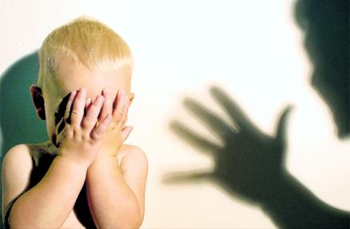
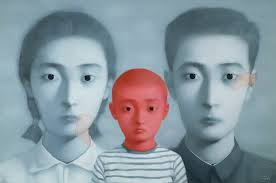

# 不存在的博客

有段时间我发现，我妈在网上百度我的信息。她问我，某某日志是不是你写的？做人态度要平和，不可以那么咄咄逼人。你看你写以前高中语文老师那一段……怎么可以这样说自己的老师呢？关于她所说的我写过的日志，我都一一予以否认，并统一口径说都是无责任转发的别人的。我不想承认任何一篇她找到的文章是我写的，这大抵是因为我一直想保持她对我的认知还停留在十年前的水平。大抵也就是在十年之前，我十多岁的样子，成绩尚好，一切都按照我妈的既定计划进行着。我妈于是便像养成游戏胜利玩家一样，开始把我拉到新年亲戚聚会的饭桌上、同事应酬交际的饭桌上、邻居联络感情的饭桌上当成某种炫耀的资本，或者仅仅是饭局冷场时的谈资。我坐在饭桌上，像是某种被人推着、敲着锣打着红色蝴蝶结丝带绕桌三周的烤全羊一样无知无助。炫耀之后不可避免地就进入了，如同酸碱中和滴定一样的黑历史分享环节，以期使气氛变得不会像是我妈单方面坐在那里炫耀那样尴尬。然后什么我到了四五岁还不会栓鞋带，分不清左右，或者我每天晚上都要跟她抱一下才睡觉这样的糗事，就如同被子破了个洞不断向外涌出的烂棉絮般一泻千里地漫天飞舞。当时坐在一旁，如同瞬间被人强行扒光衣服示众的，在众人的讪笑声中充满怨念地瞪着我妈的我，便发誓我不再会跟她分享我的任何秘密。在那之前我或许有某种程度上弗洛伊德所谓的俄狄浦斯情结，但在那段时间之后，她便再也没有机会得以窥见我的成长轨迹，我将我们的时间定格在十多岁的那个阶段。我开始始终以十多岁的面貌与她相处，她则以为我一直是那个十多岁的、温顺听话的、不谙世事的小孩。

我经常暗自思忖，是什么时候开始，我开始像双面人一样，回到家中便开始隐藏起我在学校的一切蛛丝马迹起来。这当然并不是从某桌令我尴尬万分的饭局开始的，我并不是像被针扎了一下便缩回壳里再也不出来的某只瓣鳃纲动物。每次想要去探查，那些年来我们互相之间巴别塔的修建细节时，记忆便会忽然出现很多，像是《罗拉快跑》一样不断闪回重叠的重复画面：

有一个是，我妈在某个冬日我半睡半醒之际，从衣柜里面翻出了三条棉质秋裤想要往我身上套。我在拼命闪避之余忽然说：“妈，我觉得未来我们可能会无法互相理解。”我妈一脸愠怒地回应：“我是你妈啊，还有谁比我更了解你？”

还有一个是，她在填报大学志愿时偷偷帮我报了临床医学，被我发现之后跟她大吵了一架之后，我愁云惨淡地对她说：“妈，我觉得我们已经没有办法互相了解了。”她则怔怔地，像是选错选项导致游戏结局失败的养成游戏玩家一样有气无力地对我说：“我是你妈啊，还有谁比我更了解你？”

另外一个则是，某次我回国之后，想跟她和我爸去西山三个人逛逛，企图修正这么多年的背离，然而她却叫上了一帮跟她一起炒股的，打麻将的，甚至是基督教会的大婶大妈同行，顿时人声鼎沸，好不热闹。我趁她去帮众人买水的空档拉着她说：“妈，我们真的无法互相理解了么？”

“犯啥子傻呢，还有谁比我更了解你。”

我很沮丧地发现，我无法解释为何每次上演这样相似的剧情，都像被腰斩的连续剧一样没有下文了。我从来没有试图对她作进一步的解释，譬如谈谈这些年到底都发生了什么。就好像安东尼奥尼拍的那些扑灭因果律的闷电影。那些相片中出现的尸体，离奇消失了，去了哪里？为什么？即便你暴跳如雷，抡起遥控器把电视砸得稀巴烂，仍然得不到任何答案。这是一个叙事中心主义者最恐怖的噩梦，这也就是为何我总是不愿回忆我和我的家人扑朔迷离的关系史的原因。

有次她在视频里面盘问我说，我发现你跟你那个初中同学，惠，交往甚密哦。你不要跟她搞在一起哦，我看过她写的东西，她跟很多男生有交往，那种女人不贞洁。想到未来的女友，会被我妈像清宫戏里面的敌对势力——心狠手辣的嬷嬷一样验明正身，我便忍不住想笑。可是一旦笑出声了，那种苦心经营了十几年的，我们之间客套却充满疏离感的，如同隔着有空树脂玻璃窗交流的犯人和探监家属之间的关系，便会砰然崩溃。我还没有做好准备去迎接那样一个上层世界彻底崩溃跌落下沉世界的场景。我只好拼命地忍住笑，整个人如同打开开关的电钻，不由自主地地抖了起来。

我能想象，那些像我妈一样的，四五十岁的，用染发和各种化妆品拼命掩饰自己日渐衰老容颜的、独生子女不在身边的中年妇女的日常生活是多么的百无聊赖。根据我妈每次视频时的描述，我开始脑补出她一天的日程。作为一名小学音乐老师，她每天可能也就那么一两节课，面对一班熊孩子，她已经能游刃有余地、心平气和地无视他们在下面的各种小动作和交头接耳。有次我在成都和一帮子高中同学，坐在一家今年新开的焖锅店扯龙门阵。其中一位说他当时上音乐课看黄书，还被我妈没收过。那时我血气方刚的、风华正茂的母亲，还满脸通红地直接跑向了教务处，后来那个同学就直接在教室外站了两节课。我想现在的我妈，即便是有学生在下面撸管，她也应该也可以像男科女大夫一样处变不惊了。然后剩余的时间，她往往会窝在电脑面前看看股市，然后哭着闹着要我爸买某只她看上的股票，她说一定稳赚不赔，最后往往血本无归，然后被我爸数落一顿。接下来的剩余时间，本来以前应该是为我准备三餐或是打扫房间的时间，便成了大段大段的无所事事的空白。她开始像人肉搜索一样在百度上查找我的每一条相关讯息。我的日志，我的分享，我跟朋友的对话。她拼命地想要一窥我这十多年的生活轨迹，想发现这十多年以来我都背着她折腾出了些什么名堂。她已经察觉到我似乎在有意对她隐瞒我的生活，好像在我那副如绵羊般驯服听话的面孔背后，是一个杀人犯、瘾君子、基佬、蝙蝠侠、天线宝宝甚至派大星一样的存在。

我说，妈你是不是在网上搜索我？你成天这样闲得慌么？她则像做错事的小学生一样矢口否认。她说她并没有搜索我，是我一个小学同学告诉她的，她说我们在网上还有联系。我还依稀记得那个同学，黄子安，小学的时候就住在我家对面，虽然是在隔着一堵墙的两个不同院子里面。当时我们还住在那种墙面都未粉刷过的水泥裸露在外的、两室一厅的矮层单位宿舍里面。我还记得有的时候作业做累了，我能推开那种老式的绿色塑料纱窗，跟他对面相望，打个招呼什么的。我已经完全记不清他的长相，只记得他应该是那种每个班上都会有的、安静憨厚的、不惹眼的小胖墩，像是《名侦探柯南》里面小岛元太一样的角色。我妈说他也是从国外留学回来啊，上次我们跟他家里吃了顿饭，人家现在是某大学的教授了，了不得，身边美女如云啊。你看你什么时候能像他一样。或者是你看人家黄子安，每天都跟家里通一个小时的电话，每次跟你打电话就像赶去投胎一样，说也说不了几句，几分钟就想挂电话了。我已经十多年没有跟他联系过，然而现在，我妈却像从我儿时的玩具箱里面翻出来了某件我当时特别珍爱、现在却已经完全没有印象了的恐龙玩具一样，在我面前不断晃动，以引起我的注意和重视。黄子安，那个已经尘封了十多年的名字，忽然变成了隔壁家的孩子，成为我妈嘴里的紧箍咒。

黄子安已经十多年没有跟我有过联系，所以我妈的确是在网上到处搜罗我的信息。后来我在看今敏的《红辣椒》的时候，忽然想到我是否可以反其道而行之，在网上发一些虚假的博客，来篡改我妈的记忆。好像某些科幻片里的场景，某个月黑风高之夜，我穿着紧身夜行服，从摩天大楼顶部靠悬绳垂下，用钻石刀在玻璃窗上开了个圆洞，然后偷偷潜入记忆储存室，找出某些相册，利用拼接篡改其中的某些画面，譬如把某次拥抱改成一次打斗，把那个在九寨沟的度假之旅的背景换成布达拉宫。

之后我就在网上随便注册了一个秘密博客，开始写一些没有人其他人会看的，只有我妈可能会搜索到的虚构文章。我的第一篇博客，是关于黄子安的。那是类似于台湾校园青春片一样的，好似加了滤镜的镜头拍摄下的某个柔和昏黄的场景。黄子安放学之后，神秘兮兮地把我拉到教学楼后面的跷跷板旁边，然后从兜里掏出一包金光闪闪的东西。后来我知道了那是一包香烟。然后他又从兜里摸出一个打火机，从香烟盒里抽了一根出来，瞬间便把我笼罩在一团呛人却又不乏诱惑香味的蓝色雾霭中。这样的一个场景，我第一次看见同学抽烟的场景，本应该发生在我高一的时候。我把时间和人物换了一下，还在后面续上了我上大学的时候跟某个学文科的神经质同学发生的故事。我写黄子安抽完烟，便吆喝着我跟他一起上楼去，途中有一只掉落的、翅膀受了伤的小麻雀趴着地上。我说，黄子安，我们要不要去救它。黄子安一脸不屑，一脚就踩了上去，那只无助的麻雀，如同一只烂番茄般，在黄子安的脚下绽开了花。

“救下它，然后让它感恩戴德的，如同白素贞一样永远活在人类的股掌之间？舍弃自由换来一生的囚禁？不如现在就送它以极乐解脱。”

我确信我在博客里面一定没有写下如此不符合小学生心理动态的对话。它出自我那个神经质大学同学之口，在剪切嫁接之际被我偷偷削去。后来证明这篇博客效果拔群，它用个残忍的、世故的熊孩子的意象，最大限度地激起了作为一个教育工作者的反感。我妈再也没有用黄子安来刺激过我。他重新被我锁到了童年的玩具箱里面，安安静静地堆满灰尘，直到最终彻底遗忘。

我开始一发不可收拾的，像吸食大麻一样的享受起这项工作来。好像一名记忆园艺师一样，我在博客里面肆意拼接，歪曲甚至直接虚构那些记忆碎片，“斫其正，养其旁条，删其密，夭其稚枝，锄其直，遏其生气”。虚假的记忆在博客里面像民众想象中的转基因生物一样，张牙舞爪地蓬勃生长起来。我还记得小时候被我妈打得最厉害的一次，被她用孝顺子打得背上血肉模糊的一次，是我有一次从她钱包里面偷了十块钱去买零食，结果第二天她在我换下来的外裤裤兜里面发现了用剩下的零钱。我在博客里面写的是，第二天是母亲节，我想用这些钱去买一张贺卡，或是一束花当成节日礼物。当然，那天也许离母亲节还有几个月之遥，但谁又能记得这么详细呢？我至今不知道，我妈是否相信了这样一个俗套如小学生作文一样的故事。我并不想仅仅依靠博客给我妈构建一些负面的虚假记忆。写下这样一个故事，一方面是中和一下我在抹黑黄子安时的负疚感，另一方面大概也希望能够稍微缓和一下我们之间的冷淡关系吧。

我妈一直以来对她流产的第一个孩子怀有某种心结。她怀那个孩子的时候算过生辰八字，天时地利人和，生下来简直就是要当国家主席的真命天子。我每次作死的时候，她就觉得，我真是处处不如那个未出世的孩子。她就总是念叨，要是当时生下的是第一个孩子该有多好。我于是甚至随口胡诌了一篇博文，说是当时怀第一胎的时候是数九寒天，我在她肚子里面嫌外面太冷，南方又没有暖气，实在是受不了这等酷寒，于是干脆又跑到奈何桥附近逗留了几个月，到了第二年春天才又跑回她肚子里。所以她当时流下来的只是一具肉躯壳，真魂儿还在我身上。

后来有段时间我爸到广州去出差几个月，家里忽然只剩下她一个人了，我妈便更加百无聊赖，几乎每天都要跟我视频。我于是就写了好几篇博文，都是写她跟我爸是如何恩爱云云。有些是真的，有些就是随口胡编滥造的，情节无非都是那几样。譬如某年我们一家一起去黄山，我记得那段时间一直在下雨，道路湿滑，我便写成我妈一不小心从湿滑的台阶上面摔倒，差点调到悬崖下面去，我爸便一把拉住她死也不放手，直到她站稳。或是去年在乡下公路上，因为尘土飞扬看不清路况，跟前面急刹车的面包车追尾出了车祸，我爸被直接从车里颠到路边的田坝里面。他恢复意识之后的第一件事，便是返回车中照料已经不省人事的我妈。而事实则是他们实际上只是受了一点轻伤，在等交警前来的时候还神经大条地、屁颠屁颠地跑到旁边的农舍去蹭了一顿农家土菜。这样几篇下来，疗效显著，我妈不再频频催我跟她视频，她说她最近开始翻看以前的老相册，还在视频上面跟我一边翻着相册，一边回忆她跟我爸的那些往事。我发现，那些我随口杜撰的，我自己都觉得肉麻的情节，开始掺杂到我妈的叙述当中。譬如她指着一张在黄山拍的他们两人的合照给我说：“你看，这是我跟你爸当时在黄山，我当时不小心从台阶上滑下来，你爸一把拉住我怎么都不放手，你看你爸有多爱我。”

没过多久这个秘密博客却被迫关闭，是因为我发现有一位匿名访客忽然闯入，在博文下面留下诸如“你妈当年真美啊”、“好想现在就跟她在一起”这样触目惊心的留言。我生怕我妈看到了搞出什么乱子来，赶紧把博客关闭了，然后才来细细思量这是何许人也。难道是我妈年轻时的某个隐秘的追求者？我妈毕竟当年也还是颇有姿色，她也曾是穿过蝙蝠衫和喇叭裤的少女。或许在高中时代，那个匿名访客就已经开始试图约我妈到外面的舞厅跳迪斯科？或是去电影院看一场《庐山恋》？或许他到现在已经身为人父，却依然在每次同学会的时候对我妈心存旧情？或许他竟然就是隔壁的王叔叔，而我爸竟然喜当爹，所以每次那些叔叔阿姨都说我倒是长得不像我爸像我妈？越想越离谱，这个匿名访客，竟然成了我们家庭的定时炸弹，让我在几个月之内都不能释怀。

直到今年春节回家，我爸趁某次我妈去上课不在家的时候，忽然拉住我神秘兮兮地问：

“你知道你以前写那个博客到哪里去了么？我在北京出差的时候，想你妈了，曾经搜到过那个博客，还留过几次言……”

搞了半天，原来那个匿名访客竟然就是我爸，我松了一口气。这样一家三口，每个人都像结网的蜘蛛一样，躲在一旁，暗中透过丝线连接的网络攫取彼此之间的信息，以为终于窥探到了对方最隐秘的部分，却殊不知，这些被人有意拼贴剪切甚至胡编乱造出来的记忆，却反过来开始篡改着，他们各自本来的记忆。

我妈就像这样，天天坐在电脑面前，像FBI特工一样，从网上搜罗各种信息来了解我。或许就真如她所说的那样吧，她真的了解我，从某种意义上来说，只是我无法理解而已。就像人类了解猩猩和猴子，三维生物了解二维生物，碳基生命了解硅基生命一样。我还记得有次视频的时候，我依然心不在焉的跟她有一句没一句地搭着话，她忽然对我吼道：“你好好看一下你妈嘛，你妈现在头发都白完了！”我忽然一怔，整个身体有一种过山车开到最顶点开始往下滑时一样的、本来四散在周围空气中的魂魄全部都忽然集聚于一点的专注感来。这么多年来，我开始不再故意回避她的目光，而是仔细端详她起来。也许是由于视频画质太差，也许是由于她刚染了发，我并没有找到她的白发，但我能从她不再有神的眼睛和憔悴的面容看出，她已经老了。她好像在我没有注意的时候就一夜老了二十多岁。这好像是我第一次意识到，她确实已经老了，她甚至都已经不再是那个能够跟菜市场小贩，跟银行柜员精力充沛地为一些鸡毛蒜皮的事大战三十回合的中年妇女。她已经没有力气再跟我这么隔着玻璃墙耗下去了。她将像秋天树上的柿子一样，开始干瘪，萎缩，最后整个掉落。

她可能根本就无法接受，或者不愿意去接受那个真正的我，她始终是在以她所期望的方式去理解我。所以我们是不是真的互相了解，又有什么所谓呢？?不如变现实以幻想，假虚幻以慰藉。

(采编:朱四四；责编: 刘铮)
 
