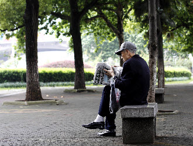
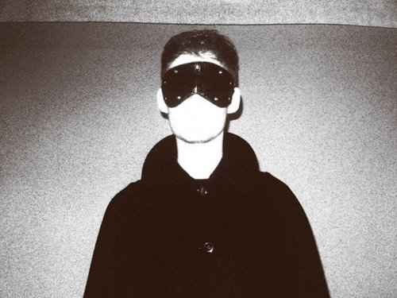

# 不存在的李老头

李大爷不高也不瘦

十三岁那年参加革命今年刚好七十九

李大爷没孩子老伴比他先走

家里再没别人只有一只哈巴狗

每天吃完晚饭李大爷就牵着老狗沿着城墙根上溜

一路找找有什么事能搭上把手

树下有一群老头围着死棋正在发愁

李大爷瞅了两眼就告诉他们怎么走

有只小猫路过老狗吓得直发抖

李大爷掏出来口袋里的猫粮摸着小猫的头说管够，管够

一群小孩在空地上踢球

李大爷不服老抬脚想来个世界波差点伤着了骨头

李大爷的战友只剩下老刘

一起在战场上挨枪子还一起在礼堂里挨过批斗

老刘身体不好插满管子躺在医院里不能乱走

他说不让吃肉喝酒还不如死了算求

李大爷说不成不成我还没活够

你也别这么半死不活的勉强晃悠

要活就要把日子活透

要死别废话抓紧了你赶快走

我准备明年春天去一趟杭州

看看有没有白娘子和我共诉风流

然后我要探访一下北欧

不知道冰岛破产之后人民的棉被还够厚不够厚

临走之前李大爷拍拍老刘的手

你可快点好我的老刘头

现在我只剩下你一个战友

你要是没了我可管不住自己空腹饮酒

李大爷没去杭州也没去成北欧

他甚至没熬过这个深秋

李大爷死的时候手里还攥着遥控器，电视上演的是我的兄弟叫顺溜

老狗饿了直挠门，邻居这才发现已经凉了的尸首

老刘知道了不说话只是躺在病床上默默地摇头

李大爷的追悼会上人人都说他是个好老头

为党的事业奉献一生又红又专忠诚坚贞热爱领袖

认识他的人都来了，包括他年轻时暗恋过的秀秀

站在家属区的，是轮椅上的老刘抱着他的大白狗

狗说汪汪汪，你可掰哭呀老刘

老刘拍拍狗头说我没想啊到你还有河南口

不知道他见着他老伴没有

知道他见了秀秀，朱老师免不了要给他几拳头

老刘抹把眼泪摸了摸老狗的头

老李走了你就跟着我，我没法出门但保证顿顿有肉

我儿子在美国女儿在澳洲

老伴在女儿家带孩子不知会不会永久居留

咱家就咱两个也乐得清净自由

我就一个要求

我要是也死在家里你得留心给我赶赶苍蝇，我不想变得很臭

（采编：杜青铃；责编：刘铮）
