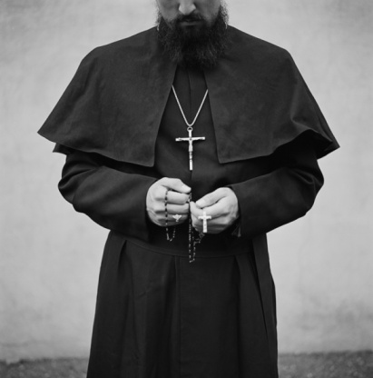
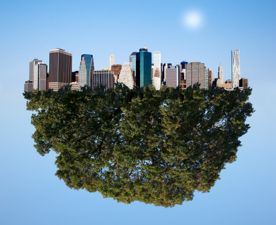

# 世纪中叶

** **

这里是圣无肠岛，中心教堂。时间是圣无肠历1748年9月。这是末日预言的时间：圣无肠岛将会覆灭，而没人知道圣无肠岛之外有无新世界，也没有一艘船足以远航。

也许你觉得这些都是无稽之谈，都是好事之徒制造恐慌的言论。没错，或许真的是这样，没有人确信这个孤独的小岛是否会如期毁灭。但是，恐慌的氛围的确笼罩着这个小岛：糖果厂和消防局同天夜里毁于火灾；警察局连日被劫；军队在岛的南部，命令居民帮助他们制造巨大的远洋船，威胁将杀死不服从他们的人——但谁都知道，他们的火箭弹会落在这个岛的每个角落。是这些对生活的失控，让岛上的每一个人都无比确信死亡，他们只知道：我活着，只是不知道还有多久，也许真的就到“那个时间”为止。

“请闭上你们的眼睛。”面无表情神父用肃穆的口吻对台下坐着的人们说道。他五年前曾得过睾丸癌，仅有的两个蛋蛋都在手术中被医生用刀切掉，或是被剪刀剪掉了。术后，他活了下来，皈依了圣主，做了一名神父。

“离开视觉的世界，你们依然可以用耳朵去感受世界。”

汤姆也坐在教堂里，他的外套下穿着白色的衬衫，上面贴着写有他名字的胶布，有点旧的牛仔裤。他不是圣主的信徒，但是他也闭上了眼睛。

“当你听不到任何声音的时候，你依然能感受到有什么存在着，”神父继续说道，“那便是将要在末世拯救我们的圣主。”

冥想课有用处么？汤姆也不确信，他只是希望能在生命最后的日子里再睡个好觉。

汤姆，52岁，是个心理医生。他简陋的诊所在小岛的北端。诊所有个狭小的阁楼，那里光照一般，汤姆也就住在哪里。汤姆曾有个差不多大的恋人，琳达。她目前住在小岛的南端。他们在5年前刚刚分手，目前都还是独身。

汤姆最近很空闲，因为诊所没有生意，因为大家的心理都出现了问题。

凌晨4点，汤姆还是如往常一样无法入睡。街道上传来摩托车引擎的轰鸣声。摩托车骑士们把速度加得飞快。他们不知道冥想是什么，他们只是在极端的速度下操作着车子。而只要他们一停下，就会不自觉地想到死，他们会感到害怕——而飙车的时候便不会，因为那时，他们的脑子里只有如何避免车毁人亡这样一个简单的想法。

汤姆从写字台前转过身，用手抓住木质的椅背向外挪了下，以便他可以从那个缝隙里移动出来。他走到电视机前，从录像机里取出了刚刚播完的带子，放在黑色的塑料盒里。左手拿着长方体的盒子，反过来垫在左侧的小臂内侧，右手用电视机旁的记号笔在带子的标签上写上了“#43”。他把带子丢在旁边的地上，和其他的42盘录像带放在一起。他蹲下身，打开电视机下面的柜子，拿出一盘没有标签的录像带。

汤姆回到椅子上，一脸倦容，两眼直直地看着电视机屏幕。他摁下录像机遥控器的开关，荧幕上出现两个模糊的裸体，开始交媾。他转回身，向着写字台。他双腿微微用力，让臀部离开椅面，左手从两腿间伸下去，抓住椅面，往前拽了一些。他扭头又看了一眼屏幕，拿起笔在本子上记录着。

纸上已经密密麻麻，都是关于：某人，某人，何种方式，多久。

这些天来，汤姆每天就这么从黑夜来到天明。

汤姆坐在教堂里，闭上眼睛想象着没有感官的世界。

“录像带里的交媾并不制造生命，我们很难说：制造生命和制造死亡中的某一个更加美好。”

“活着和死亡都是未知的，但人们畏惧的往往只有死亡。”

“活着的未知从某种意义上是在‘已知’的范围内的。就像那些录像带：我们不知道谁和谁会在何时何地何种方式交媾，但我们确信它会发生。而死亡也许不一样，但大体上应该没什么太大区别。”

“也许像那盒子一样黑。我们都会从盒子的故事来到盒子外——终有一天，哪怕没有末世的警告，哪怕没有暴民，哪怕没有军队哗变。”

这是汤姆第一次来。他知道这不是冥想，但他感到这种情形很不错。他也在想：如果不是死亡将至，他不会度过这样安稳的一天——他的睡眠一直不好。

这时，距离末日还有10天。汤姆决定：如果可以，最后的日子每天都来参加这里的活动。

神父有时组织信众们冥想，有时组织他们说出心中压抑着的恐惧。汤姆没明白为什么会怕死，他也不“那么”怕死。他更想像婴儿一样睡一觉，而教堂的活动恰好是种特别的放松。

而从距离末日还有7天的时候，小岛的街道上，似乎已经开始弥漫出尸体的味道。汤姆厌恶这种气味胜过厌恶摩托骑士制造的噪音。而事实是，摩托骑士轰鸣的“祷告声”变得越发单薄，而街头来不及被埋葬的尸体越发地多了起来。

在汤姆看来：庸众们在崩溃，而暴民的队伍越发的壮大——壮大到看不出他们和乱军的区别。末日前，他们非但没能控制死亡，甚至无法控制生活。

也许真的是圣主在帮忙，汤姆的“睡眠”开始好了一些。当然，那并非真正的睡着。

神父则是在距离末日还有3天的时候崩溃。

如同往常，汤姆在太阳落山以后来到了中心教堂。那天的活动是诉说恐惧：信众们挨个走上台，讲述自己对末日、对死亡的恐惧，汤姆则在下面专注地听着。

大概在还有几个人，活动就要结束的时候，一个男人走上了台。

“谢谢大家……我是基尔。”男人瘦得可以看出他头骨的样子，根本不用X光。

“真的非常感谢，我想我已经不害怕死亡了……”

“可是，没有男人愿意和我做爱。”

“我有色情录像带，我有润滑剂，我可以帮你们口交，只要有人愿意……”

说着，旁边的神父忽然瘫倒在了台上。

其实，在前一个人讲完的时候，神父便没有说什么。但谁也不知道他当时是不是在想些什么。而就是这么突然，他跪倒在那里，双手撑在地板上，整个人都颤抖着。人们从惊愕中反应过来，基尔第一个上前扶着神父的背，想要把他扶起来。汤姆傻傻地看着，一些人上前开始安慰神父，神父却依然没有站起来——他号泣着，像是一个畸形所致的，嗓音粗重的婴儿。他不管边上人的任何安慰，他把头埋进扶他的人的怀里，埋进了基尔的怀里。

信众们不知所措，但汤姆确信他们应该是知道了：“圣主的信使并没有从圣主那里听到什么有关拯救的消息”，或是“这种自我催眠式的平静比圣无肠岛更早崩溃了”。

晚上，汤姆拨通了琳达的电话，对面很快接起了。

“你好，哪位？”

“琳达，是我。”

“嗯，为什么给我打电话，因为快要死了么？”

“不……不是，我不觉得活着和死了有很大区别。我只是想跟你说我还想你。”

“遗言？我知道了，你安心地去吧，反正没有很大区别。”停了下，琳达又补充道，“不要想我，想了也不用专程告诉我，我会好好活下去的。”

汤姆没有说什么，他在心里认真地考虑了琳达的建议，这期间，电话被挂断了。

是夜，汤姆再次失眠。他花了整整一夜时间，写好了一封装载密封酒瓶里的遗书。不过他似乎还没有下定决心——准确的说法是：尽管他确实没觉得生和死有多明显的区别，但是他的确没有急于自杀。

第二天，也就是末日预言实现和军方威胁时间的前一天，汤姆决定去找琳达。他骑车从圣无肠岛的北端来到南端。差不多下午，他出现在琳达的住处的门前，并发现门是敞开着的。

“琳达？”汤姆站在门外，头伸着，向屋子里喊道，“琳达你在么？”

并没有人应声。

汤姆便走进去，琳达并不在。而尽管门开着，里面却没有任何被动过的痕迹——无论客厅还是厨房，东西都摆放整齐，只有几只碟子和一只玻璃杯上还沾着些水。

汤姆有些不知所措，他找了张椅子坐了下来。等了很久，琳达也没有回来。而外面又是一片混乱，没人会知道一个老女人去了哪里。

“天已经快要黑了，她大概不会回来了。”汤姆决定不再等到最后一天：他准备直接去海边——反正已经这样了，早一天晚一天也没有很大的区别了。

酒瓶和里面的遗书却还在北边的家里。但这显然不会妨碍很多：汤姆找到琳达柜子里剩下的酒，倒空以后，又写了一封新的遗书封了进去。

汤姆来到满是卵石的沙滩。周围已经黑了，空无一人，他向南海岸的更南方走去。

海水像铅一样黑。

海水像铅一样沉。

海水像铅一样冷。

没过腰时，汤姆把酒瓶奋力丢进海里——他和琳达曾经一块丢过，但汤姆觉得，这次丢得更远，也会漂得更久。

他继续向前走，海水没过了他的口鼻。汤姆快要漂离海底的双脚象征性的使了力，海水更快地流进了汤姆的鼻子，充满了他的口腔，灌进了他的耳朵。汤姆睁不开眼，他看不到也听不见，他感受不到圣主，他只是觉得自己就要消失在海水里了。

但结果却是：一种力量强迫他的双脚寻找海底，一种力量强迫他不惜一切代价把头露出海面。汤姆的自杀没有成功，他被呛得咳嗽不止，他走回了岸边，他靠在海边的高崖旁看着铅一样的海水，他就这么看了一夜，不住地抖，不住地哭。

他不住地抖，不住地哭，竟然睡着了——就像个婴儿。

汤姆醒来的时候，太阳刚刚出来，照在涨潮的海浪上，照在被海水冲回来的酒瓶上，照在被海水冲回来的琳达身上。

汤姆拖着浑身的湿衣服跑了过去，那个人的确是琳达。汤姆想抱起琳达的尸体，可死去的琳达太沉——或者说活着的汤姆太虚弱。他只能跪在旁边，大概是等着继续上涨的潮水，大概是等着末日预言的实现。

天空中，开始有火箭弹呼啸的声音；远处的码头，军方制造的木船正在被推进海里；几个拿着武器的军人经过，汤姆看见了他们，他们也看见了汤姆。他们举起了武器，用枪口瞄准了汤姆。汤姆弯下腰，把嘴凑到琳达耳边。

“既然活着和死了差不多，那我自杀还有什么意义呢？”

 

（采编：周拙恒；责编：应鹏华）

 
