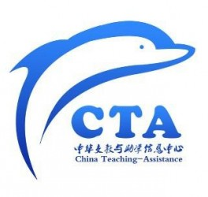

# 中华支教与助学信息中心(CTA)简介

中华支教与助学信息中心由一群热爱公益的人共同创立。英文名字为：China Teaching-Assistance，简称为CTA；CTA作为[NBCO（无利益接触组织）](http://www.cta613.org/thread-7604-1-1.html)先驱、倡导者、实践者，其主要负责支教和助学信息的收集、核实、发布、宣传、以及统筹工作。

中华支教与助学信息中心（CTA）以改善中国贫困地区教育现状为历史使命；秉承NBCO（无利益接触组织）的宗旨，提倡“按需而捐，按需而助”的救助理念；它不靠权力驱使，也不受经济利益驱动，以志愿者精神和公益信仰为原动力。

中华支教与助学信息中心（CTV）为平台式的公益信息发布网站，上有大量支教招募信息以及支教团体信息。

详情点击：[http://www.cta613.org](http://www.cta613.org/)

一、部分长期支教信息简介（详情请点击原文链接）

1、[绿之叶凉山州长期支教志愿者招募（12人）](http://www.cta613.org/thread-7858-1-1.html)

组织简介：如果您拥有一颗热爱生活负责的心，健康的身体，积极的人生态度，您就可以加入我们，帮助贫困边远地区的孩子，圆他们的读书梦！绿之叶支教的目的是用实际行动，解贫困边远地区教育的燃眉之急，为有志投身支教的人士提供机会。您是否想加入绿之叶支教？秋季学期开学在即，我们4个支教校点，还有一个学校差3名老师，如果您有意愿，请填写报名表，加入我们！孩子们在等着你们·····

支教地点：四川省凉山彝族自治州木里藏族自治县卡拉乡苦苦小学和马老小学，四川省凉山彝族自治州美姑县炳途乡瓦托小学 招募人数：每校4人，共12人 服务时间：春节学期为每年2月20日-7月15日，秋季学期为每年8月20日-12月31日。

原文链接：[http://www.cta613.org/thread-7858-1-1.html](http://www.cta613.org/thread-7858-1-1.html)

2、点亮行动小组长期支教教师招募（12人）

组织介绍：点亮行动小组成立于2010年，为致力于改善贫困农村生活及中小学教育状况事业，组织并开展农村中小学长、短期支教活动，以及农民种植和养殖培训，为贫困家庭学习良好学生联系资助，为志愿者提供服务平台的未注册民间公益组织。

我们的愿景：传递爱心 点亮希望

我们的希冀：爱心点亮希望 知识点亮未来

2011，很多志愿者曾陪我们一起走过，回首过去，感谢如许多的爱心人士对我们的支持，谢谢你们。转眼，已步入2012，现面向全社会招募今年第一期长期支教教师，愿用我们的爱心点亮孩子们的支教地点

服务地点：贵州及甘肃农村小学，由于支教地点太多，无法一一介绍。

服务时间：支教地点建议支教时间最短为一学期。

原文链接：[http://www.cta613.org/thread-5847-1-1.html](http://www.cta613.org/thread-5847-1-1.html)

3、[好友营四川长期支教老师招募（42人）](http://www.cta613.org/thread-8130-1-1.html)

组织简介：“好友营支教”成立于2006年10月1日，于2011年12月正式注册为“佛山市禅城区支持教育志愿者协会”是专注于长期支教的纯民间志愿组织。好友营支教的使命是：为边远山区及留守农村的辍学或濒临辍学的孩子组织支教，提供相对持续稳定的志愿师资力量，使他们能够和其他孩子一样，享受到接受教育的权利，获得通过知识改变命运的机会。

服务地点：支教地点：四川木里县白碉乡药铺村小、白碉乡烂房子村小、芽祖乡周家坪村小、白碉乡呷咪坪村小、白碉乡阳山村小和芽祖乡的热地村小。

服务时间：正常教学时间（要求至少服务一个学期）

原文链接：[http://www.cta613.org/thread-8130-1-1.html](http://www.cta613.org/thread-8130-1-1.html)

二、目前CTA正开展的其他活动简介：

1.[“驴行中国教育资源调查”活动](http://www.cta613.org/thread-2282-1-1.html)（点击可打开链接，后不另行说明）

CTA在对支教与助学信息的长期关注与调查过程中，发现中国贫困地区教育资源极度缺乏，更严重的是，这些地区的信息很少为外界所知。在我们看来很简单的教育资源，如一个本子、一支铅笔、一本作文书、一个乒乓球台、一块完整的黑板……对于他们来说都是奢望。此活动的最终目的就是把这类需要援助的贫困地区学校的信息传递出来；CTA核实这些信息后，对其进行发布、宣传、并开展助学活动，发动社会的力量对这些学校进行教育资源援助。

如果你的家乡恰在中国贫困地区，如果你身边有这样的贫困学校，如果在你的旅途中可能会发现这样需要帮助的孩子们，那就加入CTA开展的“驴行中国教育资源调查”活动吧。

2.[CTA公益百宝箱申领活动](http://www.cta613.org/thread-7671-1-1.html)

CTA公益百宝箱是，CTA主动联系各基金会和各大型公益团体，就这些组织发起的免费给贫困地区学校提供有关教育物资项目达成推广协议，并签订协议合同，为CTA合作组织开辟绿色通道，通过CTA可以方便快捷的免费获取这些物资。省去了那些严格而又繁琐的审核流程和相关公文要求。

CTA公益百宝箱目前拥有“创新性课堂工具 一公斤盒子”、“村小药箱”这两个项目。CTA将不断的开发新的免费有关教育物资提供的项目，使其内容多样化，多用途，成为真正意义的公益百宝箱；这样才能更好的为大家服务。

3.[中华支教与助学信息中心（CTA）助学活动](http://www.cta613.org/thread-2123-1-1.html)

CTA在对助学信息的长期关注与调查过程中，发现中国内地对开展助学活动存在不重视捐、需物资的数量、类型等匹配的误区。造成这种误区原因有三：1、不明确学校需要什么；2、捐助者盲目捐助；3、信息不能实时反馈。这种误区导致了以下的严重后果：1、捐非所需；2、物资过剩。

我们杜绝乱捐，滥捐等不切实际的捐助现象，提倡"按需而捐，按需而助"，真正做到物资尽所用，学校得所捐，避免捐助物资和钱财的浪费的现象发生。

为达到以上目的，CTA采取以下捐助措施。具体措施流程如下：

① CTA对学校的请求进行可承接评定，并取得CTA可承接范围内的所需物资的助学活动唯一组织者的资格；

② CTA详细、精确地统计学校所需物资，制定清单；

③ CTA详细、精确地统计爱心人士能捐助物资，制定清单；

④ 根据这两份清单进行信息匹配，优化物资调配；

⑤ 根据信息匹配的最终结果，告知获得信息匹配的爱心人士捐助物资的名称、数量、受捐地址；

⑥ 爱心人士须按CTA的详细安排自行邮寄物资到受捐学校；同时CTA将通知受捐学校查收这批物资。

⑦ 完全募集到学校所需物资清单上的物资后，CTA和受捐学校将一起做好物资反馈工作，将反馈信息发布在CTA官网的助学信息反馈专栏，并第一时间通知爱心人士查看反馈信息；

⑧ 结束此次助学活动；

⑨ 统计本批爱心人士手中可捐助的剩余物资，并列出清单；

⑩ 当开展下一次助学活动时，CTA将根据第9点所列清单，将爱心人士的剩余物资与新受捐学校所需物资进行匹配，并重复以上第4、5、6、7、8点。

通过以上十点措施，不但能使受捐学校获得所需物资，使捐助物资得到的最大利用，达到了避免浪费物资的目的；同时爱心人士手中剩余的可捐助物资，也可通过CTA组织的其他助学活动捐助出去；使其真正达到物尽其用。

为使这九点措施能得到严格的执行，中华支教与助学信息中心（CTA）对爱心人士，受捐学校，CTA三方约束。

4.[中华支教与助学信息中心（CTA）海豚计划之海豚公益图书室项目](http://www.cta613.org/thread-8033-1-1.html)

我国贫困地区小学课外阅读现状不容乐观。图书室的课外阅读课堂教学的延伸及补充，是扩大学生知识面、促进学生全面发展的第二课堂。目前我国贫困地区学校图书室覆盖面不足10%，图书室的现状与教育改革的深入发展、素质教育的全面实施极其不相称。 偏远地区许多坐在破旧书舍读书的孩子们，他们也许能够得到教育的最高保障就是有一席之地能够上课，但他们与城里的孩子们一样，渴望更加了解外面的世界，他们也希望童年有各种美丽童话的陪伴。

通过海豚公益图书馆的活动，使偏远地区的孩子在得到课堂教育的同时能得到更多的课外教育，在课外读物中了解更多不一样的世界，开拓思维。

学校老师或志愿者向CTA海豚公益图书项目组提出申请。项目组按照一定的规范审核申请后，向社会发布书籍需求信息，社会爱心人士根据需求信息购买书籍，并将书籍直接邮寄到公益小学，完成公益小学图书馆（室）的建立工作。

学校收到图书后应该及时给与CTA海豚公益图书项目组反馈，确保所受捐图书用于学生课外阅读的。同时给予学生一周至少一节课的课外阅读时间。

5.[CTA携手海航集团对支教教师与留守儿童关爱产品](http://www.cta613.org/thread-7720-1-1.html)

为方便山区支教老师和留守儿童、孤儿出行，让支教老师和孩子们能多一种舒适的出行选择，海航集团推出了“美丽园丁”和“守爱蓝天”两个产品，分别针对支教老师和留守儿童、孤儿的优惠机票项目。

目前，中华支教与助学信息中心（CTA)与海航集团合作推广这两项优惠购票政策。 CTA特为CTA的合作伙伴开辟绿色通道，如合作组织需要，可以通过CTA提交申请方便快捷地得到廉价机票产品。其他非CTA合作伙伴也可以经过审核后通过CTA申请获得。 

(采编：李秉钧 责编：叶声)
