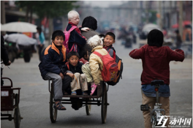

# 中国慈善面临的尴尬

2011年，郭美美的微博风波引发了一场对慈善事业的信任危机，导致该事件发生后的两个月中，全国慈善组织共接收捐赠降幅达到86.6%。接着，随着一系列慈善丑闻的曝光，不仅慈善组织受到了“冷遇”,人们对于慈善人物的态度也发生了变化。

最近的一次质疑发生在今年一月份。因为一场火灾，河南一位总共收养了超过100名弃婴的袁厉害被推向了舆论的风口浪尖。之所以引发争议，是因为在许多人表达着对她的敬意的同时，更多人开始质疑她的动机和行为方式。而二月份《人物》周刊的报道《厉害女士》更是将事件推向高潮。该报道称，这些年，袁厉害的孩子以残疾程度和相貌，被她分为几等。“头等”孩子得以享受最好的照顾，而最需要照顾的下等孩子，一度同垃圾、苍蝇、大小便挤在一起艰难求生；袁厉害在兰考自建或购买多处房产，保守估算超过20套住宅，还在一栋刚被拆除的非法民用建筑里投资了45万元……这一切，都与人们心中“爱心妈妈”的形象相悖。

对于这一报道，有网友认为，对袁厉害“另外一面”的揭示并不影响她对慈善事业的贡献：

_@邓海健：无论是“感动中国”的袁厉害，还是利欲不堪的袁厉害都是真实的人生、真实的人性。如果说，只有其间的一面，反倒显得有些可疑。在这个问题上，只能说，今日的种种爆料，让袁厉害终于走下了神坛，也终于显得像一个平凡而复杂的人。我们既无法拿几十套房产去反证地方民政等部门在孤儿事件中可以推卸责任，更无法以100多个孤儿的命运绑架舆论去遮蔽袁厉害的“另一面”。历史上看，中国人就是弄多了在“伟大人物”身上贴金的事情，不仅自己越来越累，而且弄得外人越来越狐疑，最后只好连是非标准都一并放弃了。因此，当我们重新发现袁厉害的时候，该赞美的仍要赞美，该原罪的必得原罪公民社会或法治中国的意思，起码是要拎得清性质与边界。一个真实的袁厉害，只要没有突破法律的底线，哪怕就是再多不堪，其实比“人造无暇”的袁厉害更令人心安，不是吗？_

但是，有人认为，尽管个人品质的差异无可厚非，但若要从事慈善事业，仍需要一定的品质标准。2001年，当被称为“中国妈妈”的胡曼莉身陷慈善捐款丑闻时，《北京青年报》的记者“老猜”写道：

《南方周末》12月14日用了两个版面“揭发”了中华绿荫儿童村村长胡曼莉的真面目。这位被誉为“中国母亲”的知名人物是如此善于做秀，她用动人的故事换来许多好心人的资助，而儿童村的帐目确是一笔糊涂帐；甚至儿童村里的孩子有受虐待的嫌疑。为了方便“开展工作”，胡曼莉还自称是国务院某副总理的干女儿。撰写该报道的记者感慨道：“不能说胡曼莉是个坏人，她只是缺乏一个慈善从业者的基本元素：诚信。这种诚信是不会因为金钱、健康、家庭和委屈而改变的。应该说胡曼莉不适合从事慈善事业，简单地说是不适合做好事。”

“做好事”需要个人品质要素吗？我们需要关注“好事”本身、还是“做好事”的人呢？著名电视节目主持人杨澜曾经也深陷过慈善丑闻。2011年，有网友爆出杨澜曾给中国青少年发展基金会希望工程捐款20万元，却在捐款第二天领走20万元作为“工作经费”，并称其多次以这种方式领取大额工作经费。杨澜随后作出声明，称1997年她从稿费中取出30万元捐给希望工程，其中10万元给了上海100位贫困生，其余20万受希望工程委托用于海外推广，并非自己拿去。后来，杨澜在接受媒体时表示：

一个人做慈善，无论是出于宗教、感恩，赎罪，快乐等目的都没有问题。大家不应该去探究、质疑别人的动机，而更应该去研究什么样的慈善能够达到最好的效果。可以一起探讨是逢年过节每人发500块钱效果最好还是在当地设一个工厂更好，还是说设完工厂以后在北京找到销路更好。每个人把注意力放到怎么样能够让慈善变得更有效的时候才是真正往前走了。

** **

也许，对慈善人物的争议源于对他们的不信任，而这种不信任，则是由连连爆出的慈善丑闻导致的。这样的状况一方面使得慈善事业难以推进，常常使善意演变为尴尬，例如在2009年，一位白血病少女通过募捐获得一笔捐款，但由于网友的质疑，她甚至不敢使用这笔钱。2013年，一位男子微博求助为白血病儿子捐款，但后来他却花费10万元建新房，受到网友的强烈质疑……但在另一方面，丑闻也许可以推动慈善监管。《广州日报》曾向人们展现了国外的相关经验：

要保持慈善捐款使用的透明，关键在于制度约束。当然，发达国家慈善监督制度的完善，往往是伴随慈善丑闻的发生，这些丑闻往往是强化对慈善监管的“拐点”。

_1992年，美国最大的慈善机构之一联合慈善基金会爆出丑闻，基金会主席阿尔莫尼挪用60万美元善款用于个人度假、购房以及包养情人……这起慈善丑闻让美国民众的慈善热情“很受伤”，美国由此陷入了相当长一段时间的公众募捐低潮，阿尔莫尼后来被判7年徒刑……这次丑闻风波后，美国政府要求慈善机构每年填报报表，规定每个公民都有权查阅报表，确保捐款用途。_

2005年7月，新加坡最富有、最成功的慈善机构肾脏基金会（NKF）主席杜莱被爆连卫生间的水龙头都镀金，最终被迫辞职。对这起丑闻，新加坡政府一直“穷追不舍”，除了坚决追查、公布NKF详细捐款账目之外，还健全了对慈善机构的监管，于2007年11月推出对慈善机构的监管守则，而且更严厉监管慈善机构职责与薪金的监管守则（修订版），也已于2011年4月生效。

种种事故的发生是不幸的，但若能引发改变的决心，也许可以给慈善事业的未来带来希望。如网友刘枭所说：

袁厉害这事，她个人道德如何，口碑怎样，是否牟利，一点都不重要。要关注的是私人慈善的合法性，以及当地的民政生态。” 

如何解决中国的慈善事业面临的尴尬的境地，需要媒体和公众的共同关注与探索。

（编辑：李靖恒； 责编：张舸）
