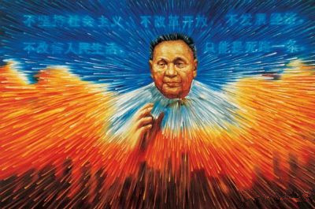
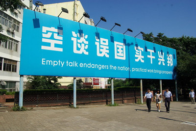
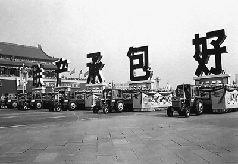

# 中国改革的叙事难题

中国改革是一个很大的话题，其中的问题多样又复杂，并不是三言两语就能讲清楚的。如果写成故事，肯定也是一部皇皇巨著。**企图套用特定的理论或者模型就解释清中国改革的历程并指出方向必然是不可能的，单一的理论路径哪怕只是应用于某一领域也很困难。**

本文不试图在极短的篇幅里对中国改革的众多现象作出评价，而是**把目光对准改革的叙事，也就是由官方话语所统率的总体性改革话语。**中国改革话语从邓小平时代开始，以“对真理标准的讨论”这个话题作为起点。改革开放初期就产生了很多普通人也耳熟能详的故事或者口号，比如用“白猫黑猫论”来比喻改革政策的务实取向、用“先富带动后富，实现共同富裕”来概括发展目标、用“摸着石头过河”来比喻探索的改革过程等等。随着改革进入不同的阶段，为适应不同的社会背景和改革趋势，官方也一直在对改革的纲领性话语进行调整和创新，比如建设“和谐社会”的总体目标和“又好又快发展”的改革取向等等。

**中国的改革叙事还是由官方话语所主导，这一点还是毋庸置疑的。毕竟改革的主体是中国共产党领导的中国政府。而且社会的大众传媒也都在官方控制下，完全以官方话语为基准。**社会的主流人群也习惯了这样的传媒环境，对官方话语总体上是接受的。随着互联网舆论空间的发展，批评和质疑主流话语的声音也非常多。网络意见领袖和活跃的网民在其中起了很大作用。但这些声音也多是讽刺调侃和片段式的批评，并没有出现体系化并且传播广泛的异见话语体系。

从总体上来说，中国的改革叙事有两种思想来源，一种是中国化了的马克思主义意识形态，另一个来源就是**全球普适的现代性唯理主义进步观念和“现代化工程”思想。前者是中国共产党统治的标志，后者是中国在全球化进程中所共享的现代性的逻辑。**中国改革的总体话语又是与改革历程相伴的，它受到领导人、官方论者、社会舆论形势等的影响，保持了一个动态的过程。虽然中国的社会还处在变迁之中，改革叙事也不会结束，但从三十年的历程来看，**中国改革叙事已经具备了几个基本特征，未来的演化也必然是在这几个特征上展开的：**

（1）**首先它是通过一种普遍性、整体性的宏大叙事来论证改革的合法性并为改革奠定价值基础和尺度的。**“改革开放是党在新的时代条件下带领全国各族人民进行的新的伟大革命”。“革命”代表马克思主义式的宏大叙事，而且革命的主体是党带领下的全国各族人民。马克思主义认为无产阶级是革命者，而在中国特色社会主义意识形态中，一直泛化为全体人民。改革的纲领性文件中也一直提及要让“发展成果更多更公平惠及全体人民”。

（2）**它是通过目的性、规划性的理性化方案来指导改革进程的。**中国改革是有目的的，中国改革的目的是：“全面建成小康社会，进而建成富强民主文明和谐的社会主义现代化国家、实现中华民族伟大复兴的中国梦”。为达到这一目的，要借助“马克思列宁主义、毛泽东思想、邓小平理论、‘三个代表’重要思想、科学发展观”等理论工具进行规划，而且这些理论工具被宣称为科学的、理性的。

（3）**通过“社会主义初级阶段”和“转型社会”设定了社会发展阶段。**中国目前处于“社会主义初级阶段”和“转型社会”一直是改革叙事中惯用的描述方法，“转型”必然就是从一种类型转向另一种类型，也就内含了两种以上不同的社会阶段，这多种社会阶段有“初级”和初级以上之分。这也是进化论和二元论社会观的叙事方式。

思想来源决定中国改革叙事本身并无法超越共产主义的蓝图和“发展”的进化论叙事框架，因此它也必然代表一种现代化的普遍主义价值追求。对此来说，首先随着冷战结束和社会主义阵营瓦解，**政治纲领性的马克思主义就被证明是不可行的，中国的现实也与马克思主义的规划渐行渐远。**而且随着现代化进程的深入，**西方对启蒙运动以来形成的宏大叙事和现代化发展观也进行了解构和反思。**在社会实际层面，中国的改革叙事一直由官方的言论控制保障，并且通过教育系统和传媒系统反复灌输给民众，它是一种**显而易见的独断性的权力话语。这些特性造成了中国改革叙事有不可避免的几个问题：**

**（1）普遍性、整体性的目标忽略了社会多元化的利益诉求和价值多样性。**

公平和正义确实是一个社会应有的价值追求，而且改革的成果也应该惠及社会各个群体。但是中国改革叙事中将社会全体人民作为一种抽象形象，并赋予全体人民一个共同的“小康社会”的目标。事实上中国社会目前的利益分化已经非常剧烈，利益群体也非常明显，先富和后富之人皆有之。**但是先富者不一定想带动后富者。**虽然我们现在不提“平均化”这一落后的价值观念，但改革叙事实际上还是实行了一种价值目标的平均化。不同群体的利益博弈在现代政治观念中是被认可的，而社会应该追求的就是给每个利益群体提供发声机会和公平的制度框架来容纳必然的利益冲突。

**（2）改革的主体并没有把社会力量囊括进来，社会和市场的自发性被忽视。**

在十八届三中全会公报这样的纲领文件中，我们会发现**在阐释中都缺少主语。**语种中总是要怎么样怎么样，而没有主语。实际上是**预设主语为文件的发布者，也就是政府官方。**这也体现出改革的主体仍然是党和政府。改革就是一个政府官方按照自己的纲领和方法来实施的过程。当然我们可以将此理解为党代表了社会各方面的力量，党领导的改革也就代表了社会各方的主体性。事实上随着中国社会的发育，社会中非官方的自发力量在社会变化的过程中也起了非常大的作用。而且正如第一点中，改革叙事抽象化了改革的总体价值目标，也是因为抽象化了改革主体。其实这个抽象的主体体现不了改革实际的起作用者，即使在政府，在改革过程中也有不同的诉求和作用。

**（3）“转型”说并没有明确界定社会阶段的特性，而且对“转型”期的强调遮蔽了一些问题和风险。**

“转型”隐含的是从这个阶段转型到下个阶段，但是**改革叙事中没有明确描述过转型前后的状态分别是什么样的，而且也不是比照马克思主义的规划。**继续发展中国特色社会主义制度的下一阶段目标是什么，是并不十分清楚的。像更加现代化、法治化的目标是参照“现代化工程”的普遍化目标制定的。我们缺乏对中国转型的更清晰的规划，比如转型是否要一直转下去。当前我们会把中国社会的很多问题，归结于“转型”，似乎是在说转型之后就没有这些问题了。但实际上，中国目前的很多问题都是与改革相伴的，比如环境污染生态破坏、贫富差距等等。一个非常空洞的“转型”并不引向解决问题的方向。至少中国改革叙事需要厘清哪些是转型带来的暂时现象，哪些问题又是根源于转型中的结构矛盾。

**（4）将不同取向的制度和措施“结合”在一起，隐蔽了其中的紧张关系。**

在中国改革叙事中，我们会发现很多“结合”。比如要把市场和调控相结合，把公有制和非公有制相结合，把党的领导和“人民当家作主”相结合，把“加强顶层设计”和“摸着石头过河”相结合。这是在对待不同取向的制度措施时我们惯常用的一种叙事方式。当然我并不是说这些事情不能结合。**但是“结合”是一种很笼统和模糊的描述，里面有很多关系需要进一步理顺，结合之处也就是制度的适用边界需要明晰，况且在现实层面，有些制度“结合”了，但有些就不能“结合”，只能说是纠结在一起。**

**（5）“搁置争议”忽略话语也成为一种话语。**

十八大以后的新一届领导集体上台之初，国内产生了很多争论，这些争论源于各方对新一代领导施政计划和风格还不甚了解，都在试探能否突破原有的限制。但是新的领导人用“空谈误国，实干兴邦”回应。有论者说中国改革的根本逻辑是世俗理性的回归。改革的主导者确实是放弃了很多意识形态化的口号，采取了更务实更功利的态度，否则也无法应对社会现实的变化。**改革叙事在表面的高大全的漂亮话之外，在触及到改革所改变的深层结构时，往往采取了回避的态度。这时候若不是拿“转型”或者笼统模糊的概念遮挡，就是采取这种“喊破嗓子不如甩开膀子”的态度。而这种看似务实的态度，也符合当下中国社会功利的氛围。这种话语的不清晰反应背后制度的模糊，带来一个问题就是给很多领域的非正式运作留下了空间。**那些不良的非正式运作也成了所谓的制度“变通”。改革确实需要不断突破原有的制度束缚，但是并不意味着丧失规则性。

总之，**中国改革叙事反映的是改革实际运行的逻辑。改革叙事的形成历程简单说来就是在原有统率性意识形态基础上不断把新的东西往里面硬加，反映的就是原有的体制在不断被突破。**

**话语与实践的关系是一种互动性的。**大部分时候是实践在先，比如肯定是先有了安徽小岗村农民的包产到户，才有了“家庭联产承包责任制”的表达。**但是话语对实践也有指导性，**比如官方发布的文件或者某个领导人的口风可能都会让经济形势产生意想不到的变化。实践的根本特点是紧迫性，而且我们之前又说过中国的现象是错综复杂的，改革的主体政府在把握中国改革进程的时候肯定遭遇不少山重水复和力不从心的时刻。而且获得了一**定自由的中国人的自发力量也越来越强，改革的未来趋势必定是更多依赖社会内生的创造力。现有的叙事方式已经不太能适应社会的变化，不能完全反映现实**。虽然实践的演进不能妄加揣测，但是话语的创造和文本的书写是可以把握的。**笔者觉得官方的话语体系需要突破，**

(责编：陈澜鑫)
