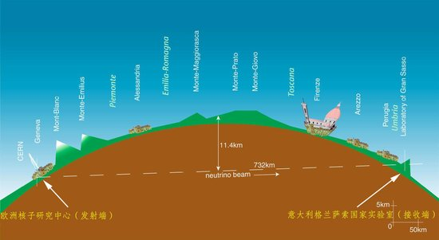
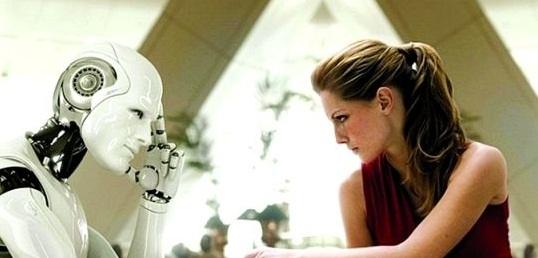

# 中微子与归真堂

**科学知识不是对纯粹实在的反映，它是一个人数不多的科学共同体协商出来的东西，必须存在着一个最基本的、不容讨论的“承认”，科学家才有可能打破“实验者的回归”。只有通过社会学的方式生成了“事实”，人们才能去谈论事实。人们常常认为存在纯粹的观察陈述，这种陈述是不容质疑的。其实这里倒置了因果关系，正是那些达到了共识，不被质疑的观察陈述，才被人们当作纯粹的观察陈述。**  

# 中微子与归真堂

## 文/吴肃然（北京大学）

 

早上起来看到两条新闻。

第一条讲的是举世震惊的超光速中微子实验可能是错的，据称GPS和PC之间的导线有问题，导致系统误差。看到这条新闻，有人长出一口气：“我去，原来如此。”这种感叹很有意思。

如今对科学研究逻辑有些了解、认为自己在做科学研究的人，很多都认可波普的证伪主义。但如果让他们举例，他们还真举不出太多依靠证伪来推动科学进步的例子。当然，他们会记得个别很有名的证伪，比如1919年的日全食观测，证伪了牛顿的引力理论，广义相对论成为新的科学真理。

然而，这次证伪只是一个加工过的故事。当时观测者在西非和南美测到的数据，根本不符合广义相对论的预测，而且两批数据间都有不小出入。不过，观测队的头头爱丁顿爵士是爱因斯坦的粉丝，他绞尽脑汁想出了一个办法，把两批数据进行加权处理（至于怎么加权，这是他说了算），最后凑出一个数据，比较接近爱因斯坦的预测。于是乎爱丁顿宣布：广义相对论是正确的。过了些年人们发现，1919年的观测根本不靠谱，观测设备太落后，系统误差远大于所要分析的理论偏差，爱丁顿等人就是瞎搞。广义相对论究竟是如何取代牛顿力学的，感兴趣的人可以找科学史材料读读。

库恩在评价波普的证伪主义时说道：“波普举的那些例子，都是科学研究中非常罕见的”。科学研究在研究逻辑上从来不是“干净”的，许多哲学争论对于科学研究来说一点意义都没有。卡尔波普发明了“证伪主义”，以此解决了休谟的归纳问题，让很多人心中大快。但这只是科学哲学家的逻辑，如果严格按照证伪主义方法来开展科学研究，科学家们会人格分裂。

之所以许多人支持波普那种干净的证伪主义，是因为人们普遍觉得，科学研究的目的是发现所谓的客观自然规律，因此当科学家在同“实在”打交道获得数据，且此数据与理论不一致时，理论就“错”了。可是他们没有继续追问，究竟什么样的数据才是“真实的”数据？超光速中微子的实验可靠吗？你说不可靠，因为我们发现了系统误差。那么，这种系统误差解释就一定可靠？在没有发现这个系统误差时，为什么很多人就是不相信超光速的可能呢？

英国科学社会学家柯林斯提出过一个著名概念：实验者的回归。此概念说明的是，判断科学研究中某实验是否成功，需要假定实验仪器是好的；但是实验仪器是否有问题，常常又需要先判断哪些实验是成功的哪些实验是失败的。换句话说，哪些理论是可靠的，需要数据来判断；哪些数据是可靠的，往往又需要理论来判断，由此导致一个解释循环。显然，要打破这个循环，靠所谓的“尊重事实”是不行的。

科学知识不是对纯粹实在的反映，它是一个人数不多的科学共同体协商出来的东西，必须存在着一个最基本的、不容讨论的“承认”，科学家才有可能打破“实验者的回归”。只有通过社会学的方式生成了“事实”，人们才能去谈论事实。人们常常认为存在纯粹的观察陈述，这种陈述是不容质疑的。其实这里倒置了因果关系，正是那些达到了共识，不被质疑的观察陈述，才被人们当作纯粹的观察陈述。当我们今天看到这条新闻，我们感慨“我去，原来如此”的时候，我们需要明白，“原来如此”中的“此”是我们既有理论、信念中的“事实”，而不是什么纯粹客观的事实。认识到这点，我们才能理解为何有时科学家明明证伪了，却非说自己实验操作有问题；为何有时科学家总坚持一些根本无法证伪的观念与理论；为何很多社会科学的证伪都是在浪费时间。

第二条新闻比较好笑。记者问归真堂老总：“你不是熊，你怎么知道熊不疼？”归真堂老总反问：“你不是熊，你怎么知道熊会疼？”

这新时代的濠梁之辩充分体现了，在辩论水平上我们需要向老祖宗学习学习。归真堂老总应该反问：“你不是我，你怎么知道我不知道熊不疼？”这样才能把新闻发布会开得更有水平一些。

不过，记者与归真堂老总的对话倒真的揭示出西方哲学的最重要的、最核心的问题。这个问题在维特根斯坦的《哲学研究》里有着大篇幅的论述，我们如何确认一个人疼不疼？如何确认一条狗疼不疼？

现象学哲学家大都借助主体间性的讲法，一个主体能感受另一个主体的疼，维特根斯坦反对这种解释。如果人和人有主体间性，那么人和狗有没有主体间性？一条狗嗷嗷叫着满地打滚，你能因为狗不是主体，就否认它正在疼吗？如果你承认狗是主体，那么你满地打滚的时候，狗是否知道你正在疼？如果你踩了一只蟑螂，它没死透，在地上挣扎，它疼吗？如果一个小孩抓了个虫子，并且很顽皮的把虫子的脚全剪了，虫子在那一动不动，这时候虫子疼吗？如果你撕了一片树叶，树叶流出汁液，此时树叶疼吗？如果你不小心把一个杯子摔破了，它疼吗？如果狗属于主体，那么一只狗蹲在门口，有人说“这条狗在等主人回来”，你同意吗？如果这个人说“这条狗在等主人明天回来”，你还会同意吗？

科学研究者们对疼大概会有另一种看法。不管某个人、某只熊怎么表现，我们可以测测他们的神经反应。只要找到某个可以测量的生理指标，那么就可以准确的说疼或不疼。这时维特根斯坦就会问你，你找了一个指标，他找了另一个指标，那么如何判断你们哪个人的指标是正确的？一旦思考这个问题，你就会发现，原来疼的真伪不是由指标决定的，反而指标的真伪需要由疼这个字的用法来决定。有人会说，疼就是一种感觉，这种感觉是真真切切的，这种感觉所伴随的生理反应也是一样的，科学研究者所要做的，只是找到合适的生理指标、发展更好的测量手段。维特根斯坦举例反驳说，我们做数学题时先苦思冥想，然后突然恍然大悟：“我会做了！”，但是此后继续下去却会是两种结果，一种是把题做出来了，一种是做着做着发现还是不会做。维特根斯坦问道，对于这两种情况来言，当初“恍然大悟”的感觉是否有所不同呢？如果在“恍然大悟”之后不去做题，而是去测量此时的生理反应，那么此时能否测量出来，“我会做了”这句话的真假？

两种对疼的理解都有问题。从维特根斯坦的立场来看，疼这个字有它自己的用法，当人们违背它的正常用法去争论某个东西疼不疼的时候，语言就“休假”了，必然就会产生哲学问题。回到熊的问题上，当记者和归真堂老总争论熊疼不疼时，这种争论是没有科学答案的，它最终需要到语言学和社会学的领域中去寻找。你可以找很多理由来说明熊是不疼的，比如熊没叫喊等等，但这未必能证明熊不疼。你看到一只大花蚊子，“啪”狠狠的一掌把蚊子拍死，这时你甚至会咧嘴笑，可此时你的手不疼吗？你也可以找很多理由来说明熊是疼的，很简单，谁说熊不疼，就让咱平白无故扎他一针试试。可这也说明不了什么，每天拿个头发丝扎你几下，然后吃好喝好，给你发高工资，很多人还求之不得呢。

记者和归真堂老总的争论，表面是在讨论疼，其实跟疼没什么关系。说到底，双方对于动物与人关系的看法不同。如果要就此问题达到共识，那么也必须有自然科学研究中的那种科学共同体的存在。只有存在这样一个权威的、能够将分歧先内部化解的、能够把事实和规范予以先行“驯化”的知识共同体，关于活熊取胆的问题才会在一个“客观”、“理性”的平台上得到辩论，才会让“子非鱼”这种扯淡讨论少一些，才会让某些更严重的分歧和冲突有被化解的可能。这样一个知识共同体在哪里，我的眼前浮现出一个作茧自缚的形象。他是否能破茧而出，就看他有没有勇气破坏自己亲手编织的、某些美好的东西。

 

（采编：麦静；责编：麦静）

