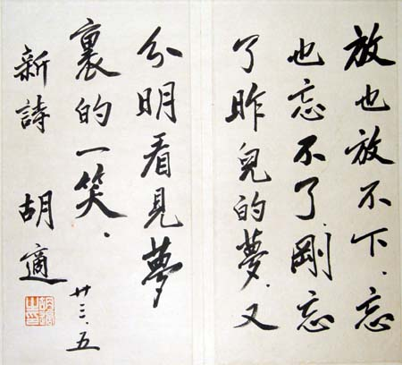

# 中文科教學，白話文還是古文？

之乎者也與我手寫我口，應如何權衡？

近日，與家人爭辯不休，至今尚未有答案的一個議題，就是中文科教學究竟「以白話還是古文為重？」本來，這兩者不應有主從關係，但在中文課有限的課堂時間內，我們就必須去辯論白話、古文在教學上的比例。

綜觀當今的論述，多以意識型態和中華文化的角度，來論述古文、白話文在課本中所佔的比例。擁護古文的常見說法可歸類為幾點：一、學習中華文化本身的根源、體會古人的生活態度、人哲觀念等文化論者的意見。二、古文的句構較精鍊，自主學習門檻較高，所以課堂時間應重古文輕白話。三、古文是一種文體的養分，大多數學生的中文差，來自於受到英語、翻譯文學的影響。

擁護古文的人多認為，若沒有文言，我們找不到回家的路。是文言這種典雅的漢語語感，成就了許多白話文大師。

與古文相對的，是另一批倡議白話文教學的教師、學生。在深藍學生論壇，這一菁英高中藍區區的論壇中，文、白之辯更是一個小型的討論串。擁護白話文的常見說法可歸類為幾點：一、現代文字多為白話文，中文課應著重在學生的表達能力、理解能力、最後文字創作。在文字創作上，白話的分析有其必要，絕非自學即可掌握。二、文學創作首重大量閱讀，古文用字遣詞上的精鍊並不優位於寫作風格的培養，而風格的培養需仰賴不同作家的作品加以分析。三、應著重一種古文、白話文共同教學的中文科。

在餐桌上的爭辯中，身為記者、英文科教師的阿姨屬於前者，身為中文科教師的媽媽、身為研究者，長期寫論述文字的我，則偏向後者。週日的一整個下午，兩者互不相讓，甚至拿出學生作品來品評一番背後的因果關係，究竟來自古文還是白話文的養分？

當然，我們如何審視自己過去的中文教育，也造成我們的分歧。

阿姨說：「我自己擔任記者，一直很羨慕張愛玲那樣的作家，但後來編輯告訴我說，你沒有深厚的古文底子是無法如此的，在創作的過程中，我一直覺得自己的文字不夠順暢，在一個中學教育有限的中文課堂上，我還是覺得大部分的時間應教古文，白話文則讓學生課外閱讀、討論，是比較好的分配方式。」

我則反駁：「妳說好的白話文源於好的古文，我並不認為如此。古文我從小學念到高三畢業，但是我現在真正記得的是什麼？是聲音鐘，是夏夜，這些東西才是我寫作的養分，古文給我的，最多是理解字詞使用上的典故。妳說古文的精鍊，我認為有，但我們現在創作幾乎都使用白話文，只有非常少數的人以古文創作，若是以創作為前提，我認為不應重古文輕白話。不能用自己過去教育的匱乏，來上綱到青少年的中文課。」

媽媽則說：「其實我們在教學生，我們並不認為文字精鍊一定是最好的，我們期待的是風格。一個人一生也許只有一種風格，而風格怎麼來？是透過大量閱讀作品，來形塑出自己的風格。古文妳說精鍊，我認為詩、詞這種詞性轉換，古文確實可拿來應用。但我認為這並不是說我們課堂時間有限，所以全部都拿來教古文，事實上你的說法是我們過去很多體制內老師的說法，但是體制內老師幾乎不會教白話文，可是白話文是要教的，要賞析的。」

阿姨說：「以一個門檻來說，古文門檻確實比較高，如果我們將中學教育的目標訂在終生學習，那我們是不是去補足這一塊，以後自學才不至於跨不進去？以全人來說，我看到很多學生早期就寫出很好的作品，那跟他們大量閱讀古文有關，那白話文不是說不教，是在課外開讀書會討論，例如小說的討論，場景的討論等等。」

我說：「我不認為一個中學的中文課程，目標是要放在教出文學家，以我自己的經驗來說，現在的學生根本連文字的基本表達能力都有問題了，讓學生能夠通順的表達、進一步創作是比較重要的。妳說文學家？或者課外延伸討論小說，我們坦白說，有多少學生願意投入這麼多時間？這是一個文學創作者的定位，但我們要認知到並不是所有學生都對文學有興趣。學校必須要自己定位自己要承擔的「有限責任」。這就好像妳說教英文，是不是應該先從古英文（拉丁文）教起？不可能嘛，可是教古英文是不是能讓我們更理解現代英文，可以阿。但為什麼要這樣教？」

其實，爭辯一段時間後，我們都同意古文、白話文都要教，只是課程分配的比例問題，還有主從問題上，始終沒有共識。一方認為應當是文、白夾雜的教學，一方則認為應重古文將白話移至課外。在中文課的目標上，前者認為應是基本文字表達能力為前提，後者則認為是培養好的文學創作者。

餐桌上的爭論沒有結論，反而在另一次的家庭聚餐中，讓我重新思考古文。這一次，有人以台語朗誦了白居易的「長恨歌」，另一人則以吟唱古詩的方式，唱了李白的「將近酒」。伴隨著台語的音調、起伏，與古詩歌謠的曲調，我頓時回想起自己走訪台灣廟宇，儀式中司儀、主祭等人頌念的詞句。其實，除了以大中國的文化意識來解讀文言，或許這些隔海而來的古文，是以另一種形式被置放在台灣鄉間、城市的廟宇祭典中，以一種在地的文化形式而存活著、流轉著、鑲嵌在我們的日常生活當中。

正如同我總愛求取七王爺的網路籤詩一般。那也是一種較為流俗的文言文。

若重新以一種較為公正的角度，來審視一門中文課，若將目標設在文字表達能力，以及進階的創作能力。那麼「部分」的古文，在「詞性轉換」以及「精鍊」的部分，確實有幫助。古文讀久了，我們對於動詞的詞彙、部分的典故的確相對熟悉。不過，就場景、角色形塑、主題上的演繹來說，我認為白話文在這方面比古文要靈動的多。

via: 小惠買牛奶 http://blog.roodo.com/taminoon/archives/21189394.html 

採編：賴佳翎 責編：羅勉
