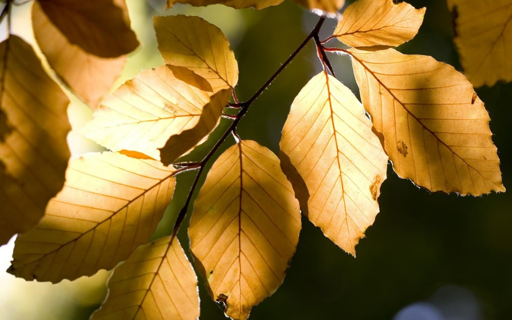

# 中秋往事

** **

近几日来秋意渐浓，白日的晴空愈来愈寥廓，显出一种高远的深蓝色，夜里却忽然就起了风。夏日的虫鸣早已归于寂静，窗外只有簌簌风声，寒意寂寂然地淌到人的身上，最易教人沉入对往事的怀缅之中。

前几天夜里失眠，辗转反侧，一个转身之际忽然想起了几年前的一幕。那时我还在读高中，周日和妈妈去逛街，走进了刚开不久的“面包新语”，那里的面包看起来精致诱人，我想买，却又嫌有点贵，犹疑不决。妈妈说，喜欢吃就买，想什么，别误了回学校的车。说来奇怪，这微末的一幕似乎从来没有在我的记忆里存留过，但那刻一切却无比真切地通通重现在我的周遭：稠密的人群，香喷喷的面粉香味，裹着面包的脆生生的纸袋，妈妈那疼爱又带点不耐烦的口吻，一瞬间似乎全都回来了。

只是那个我想吃什么就会给我买什么的人，再也回不来了。

上个月找户口本，在抽屉那只放贵重票据的铁盒里翻出一张明信片，是我在零六年的时候写的，用纤细的翠绿色水笔。那年妈妈生日，我也一如既往没送什么礼物，只写了满满一张明信片，用上各种漂亮的排比句式，承诺着以后要带她去埃菲尔铁塔上俯瞰巴黎，去看富士山顶的雪，去看郊野里大片的郁金香，要带她去泡温泉，去吃鲍鱼，我描述了许许多多我也没见过的美景，许许多多我觉得她会喜欢的享受，就这样把那张写满字的画片送给她当做礼物。我没想到当时她高兴了好多天，也没想到后来她告诉我，每次她被化疗的反应折磨得觉得快要扛不住了，就把那张明信片翻出来反复看，想着一定要好好活下去，为了以后要让我带着她环游世界。更没想到，她细细藏了那么多年。

过几天便是中秋了，现在我怕见跟这个节日有关的事物。父亲大约也是，家中收到的月饼尽数送了出去。我们没有要过中秋的打算。

去年中秋是九月中旬，那时妈妈正在住院，因为癌细胞脑转移，已经逐渐失去活动能力，意识开始有点模糊，时好时坏。临了中秋的那几天，她忽然闹起脾气来，非要回家过节不可。患病十年，无论有多疼多难受，她也一直硬撑着配合治疗。但那次她却执拗得很，常常去拔输液的软管，又哭又闹，她说，我要回家，不然我就回不去了，求你们了，让我回家。看着她哭，我和父亲也哭，家里住的是楼梯房，她又有八九十公斤的重量，根本不知道有什么办法能把她扛上去，而且更严重的问题是，她整天要输液来控制脑积水的情况，在家根本不具备这样的条件。我们想尽办法安慰她，后来在中秋那天，用轮椅把她带到了医院附近的一家酒楼，叫来了好些家人一起吃了一顿晚饭。好些天没有胃口的她那天破天荒吃了很多，虽然神色仍有点郁郁。

最终她也没有再回过家。十月中旬我到殡仪馆取她的骨灰，交到我手上的是一个袋子，我从没想过有天她会变得这么轻。我把她的骨灰倒入骨灰盒里，最大的骨骸大约也只有指节大小，和许多灰白的粉末一同簌簌地掉落。我的手一直在颤抖，我在想，我从她身体里诞生，几千个昼夜，她抱过我，吻过我，深深爱过我，给我买过这样那样的东西，我们说过那么多的话，她答应过要和我拍毕业照，答应过要让我带着她去环游世界，为什么现在留在我手里的只有这些冰冷的灰屑？它们不会笑，不会和我说话，也没有一丝一毫那张我深爱过的面容的痕迹。再后来我捧着骨灰盒一路随车到了墓园，冰冷的骨灰被放入了更为冰冷的坟墓。她再也回不了家了。

又是一年中秋，月色依旧，人事已非。往事渐已渺远不可追矣。

 

（编辑：周拙恒；组稿：应鹏华，周拙恒）

