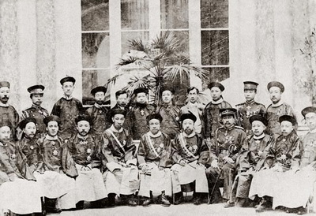

# 为中华之崛起而行宪

** **

#### 一、为什么宪政的支持者必须面对强国的问题

宪政的支持者，在当今中国，多为自由主义者。而自由主义者向来是讳谈爱国、强 国的，因为自由主义者认为人以个体而存在，国家之终极目标，为保障个人之权利与自由。自由主义法统，以普适真理为终极目标，故，在自由主义的语境下，国家是消亡的，主权是虚无的——倘若所有国家皆为自由人之联合体，则所有法统将趋于普适之真理；国界之划分，无异于省界、市界，国家之权柄最终将屈服于真理之光。所以，自由主义者认为“强国”是毫无意义的。

然对真理与理性之崇拜，亦是在崇拜一种神祇。崇拜神祇并非坏事，或者应该说，并无好坏之分。信仰基督教的人有极端狂热的匪徒，信仰社会主义的亦不乏仁者。任何信仰，无神论也好，基督教也罢，都需要崇拜神祇。问题在于，既然自由主义是崇拜一种神祇，自由主义者同时也相信宗教信仰自由，那么自由主义就必须正视非自由主义信仰的存在——比如基督教等一神信仰，同乡会等地域主义信仰，爱国主义和民族 主义等大规模社群主义信仰——并与之共存。正如美国不禁止共产党的煽动颠覆活动、不禁止极端伊斯兰思想的宣传（实质行动谋划恐怖袭击除外），一个宪政的、自由的国家，连极端的思潮都必须容纳，就更没有理由不去正视部分（实际上是绝大部分）民众对国家认同感完全合理和正常的诉求，不管这种认同感的来源是高明的还是愚昧的。我们固然可以讥笑那个自己掏腰包买鞭炮庆祝天宫一号升天却因为吵到领导而被罚款的小贩，但这个小贩的愚蠢并不能掩盖国家认同感诉求的真实存在——这恰恰是自由主义需要面对的问题。

这并不意味着自由主义者在此放弃基本立场——事实上，民众对于国家认同之感情需要，是可以作为宪政和自由的坚实力量的。谈自由，可以不谈爱国；但谈宪政，不应避讳爱国。爱国是一种客观存在的大众情感，是一种世俗化的宗教，而在可以预见的将来，这种宗教不会很快消失。爱国这种宗教同样也可以为变革提供了契机，就像清教徒在美洲大陆最终建立起新的政治文明，起因也是为了逃避宗教迫害。

#### 二、爱国语境下的宪政

当今社会反对变革的声音，都可以归结为一个问题：“你要把共产党拿掉，你能比共产党干得更好？”然而这是一个伪命题。主张行宪，不是因为谁一定能比当今的执政党干的更好，而是宪政制度会比当今的一党专制能干的更好——尤其是当我们的国家站在这个历史的十字路口的时候时，为了长期的发展稳定而计。实行自由宪政是以给人民以更大的经济和政治权利与自由为目标，而不是为了以斗倒一个执政党为目标。

这种自由宪政制度更能维护人民权利、保障个体尊严，这个意义的重要对于自由主义者来说，毋庸赘述。但宪政从更广泛的意义上讲，是一个平台，是一个共识。既然如此，那么支持宪政的人必须回答，在非自由主义尤其是爱国主义的语境下，为什么没有一党专制、人民拥有更大的经济和政治权利与自由的宪政制度优于一党专制。

而这个问题，一百年前的那一批改革者和革命家已经回答过了：革命，是为了救亡图存。救亡图存，救的政府的亡，图的是人民的存。

**1、自由宪政是对政府执政能力的优化**

当今中国的执政者很多人非常钦慕新加坡的精英政治，为体制辩护的人也常常把中国描述为一个低端版本的新加坡。那么，这种理想化的精英政治模式到底是什么？归根结底，是对政治人才的选拔。体制内部的语言常常提到“培养干部”这个概念，强调党组织对政治人才的选拔功能，但自由宪政、两党或多党政治模式是完全赞同 这个目标的——事实上，培养政治人才，本来就是政党这种生物的核心功能之一。而在自由的体制下，政党的这个核心功能只会得到增强和优化。譬如，直接选举迫使政客直接面对选民，这是最好的对宣传工作能力的锻炼。中国的执政党试图用一个又一个学习运动来解决“党员干部脱离人民群众”的问题，但这些学习运动无功而返，官腔作秀丝毫未减，官员威信江河日下。实践证明，靠党组织的宣传教育喇叭，远不如迫使这些人去直面选民收益更大。

中国目前竭力建立贤能政治（meritocracy），试图以官员的政绩考核为升迁的指标。然而，由于考核升迁的权力仍然来自于上方，如北大博士冯军旗的《中县干部》所揭示的，在这种体制下，虚假、浮夸的“政绩”，成了必然的普遍现象。西方的党组织也对党员干部进行政绩考核，但考核的根本依据是不受强迫、不受贿赂的选票。如 果党组织高层试图考察一个人在一个地区当政期间的执政能力、尤其是让民众满意的能力，有什么比让人民用选票说话更直接的呢？

多个政党存在的益处不仅局限于增强政党的固有功能。当今的中国体制下，单一执政党垄断上升渠道，把一切不愿意遵守它的游戏规则的人排除在重要职位之外。同情体制的人当然 可以说，如果一个人真的想做出一番事业，就应该委身遵守游戏规则；而这部分人被排除在外，是他们自己的选择。但是，这对国家来说真的是最好的安排吗？如果一个企业仅仅因为一个人是同性恋或是携带乙肝而拒绝给予其工作，这无疑是愚蠢的行为，因为这些特征并不影响其创造价值的能力。同样，如果一个人仅仅是因为对执政党的理论和作风反感而无法施展才华，对国家而言仍旧是一个损失。

孙中山上书李鸿章主张政治变革救亡图存，第一条理由就是为了“人能尽其才”。不可否认，由于才能卓越的人可能在多方面都表现出众，所以今天的一党制度下强调巴结上司、搞好关系、做好“政绩”的能力这一升迁模式，确实可以选拔出一部分优秀人才。但不可否认的是，也有很多懂得钻营却不懂得执政甚至贪污腐败的庸人因此而上位——他们聪明么？当然聪明，但这种聪明未必是治国安民的聪明。反过来，也有很多不懂得钻营、不会“来事”的人被体制所埋没。

而自由宪政则有效地缓解了这些问题。

首先，在今天体制下脱颖而出的优秀人才，在新的制度下不会被埋没。政党组织（包括共产党）作为领导者的摇篮这一职能不会改变。一个政党做得再好，说白了是这个政党把有才能的人放到了正确的岗位上，而这个功能并不会因为实施多党制而丧失。

第二，在今天体制下上位的贪腐庸人，在新的制度下会更容易被淘汰。民意的压力迫使官员不能再继续偷偷摸摸地阻挠官员财产公示制度的实施，普选制度确保了总体施政满意度的清晰表达，新闻和言论自由保障了对贪腐渎职行为的及时揭发。

第三，在今天体制下被埋没的人才，在新的制度下更容易发挥其价值。在自由宪政的体制下，虽然仍有主流意识形态之外的人无法得到重用，但情况会大大改观。政治生活的多元化，让不同的人可以采取不同的政治升迁渠道。一个人不被一个政党所待见，还有别的政党，总会有一个组织适合他（她）。宪政体制下政府权力受到限制，也让民间力量（无论是盈利为目的的企业还是非盈利机构NGO）可以得到更大的发展、占据更多的公共生活的空间，为那些不喜欢在政界发展的人提供充分的赚取钱财、获得声誉、报效国家的机会。

**2、自由宪政为人民提供更好的“爱国”理由**

美国是政治自由最充分的国家之一，但美国普通民众的爱国热情丝毫不亚于中国的反日愤青们。美国人的这种爱国热情最可敬仰——亦是最可怕的一点是，美国人的爱国热情是以真正把国家的命运和自己的切身利益联系起来为基础的。如果美国遭到侵犯，无论是珍珠港还是九一一，美国人民当然会抛头颅洒热血保家卫国，因为他们认为保卫美国就是保卫自己的权利与自由。美国人从小被灌输的一个观念就是：爱国，所以要勇于发出自己的声音、勇于捍卫自己的自由，勇于用演讲和选票把不称职的政客赶下台；反过来，正是因为美国的宪政制度给了你发出自己声音、捍卫自己自由、用演讲和用选票把不称职的政客赶下台的权利，所以你应该保卫美国的宪政制度、尊敬那些保卫美国的人。

如果美国被别的国家灭了会怎样？——美国知识分子中不乏崇拜欧洲、加拿大的“带路党”，但至少对于大多数民众而言，其潜意识认为，若美国亡国，那么民众之财产权无法得到保障、政治自由会受到限制甚至被毁灭。普通民众在七月四日自发挂起国旗、自发组织游行庆祝，或是在机场看见从战场归来的军人自发立定鼓掌，是发自内心的情感。只有这样的爱国，才是更牢固的爱国，因为它适用于那些原本不屑于去爱“国” 的人。

而今天的中国，越来越多的人正意识到，这个国家并不属于买不起房的自己，而是属于垄断阶层，属于称霸一方的土皇帝们，属于卷走现金、拿着绿卡移民海外的特权者。而这些阶层为了能够继续掠夺财富、榨干最后一滴油水，绑架政治权力进行不惜一切代价的维稳。于是，相当一部分人自然会有疑问： 这个国，是谁的国？为什么要爱？

给予人民权利，是最好的维稳，也是最好的爱国宣传。1971年的美国宪法第二十六修正案把投票年龄从21岁 降低到18岁，安抚的是最容易起事的大学生。时至今日，虽然有少数占领华尔街的激进行为，但美国年轻人中的主流仍旧以参与体制内的政治——投票、履行公民义务为荣。授予人民权力，限制政府的胡作非为，虽然不可避免的会制约高速发展的步伐（这也未必是坏事），更会伤害到特权集团的利益，但换来的则是人民对国家更高程度的忠诚和信任，孰轻孰重，执政者自应掂量。孟子早就说过：“若民，则无恒产，因无恒心。苟无恒心，放辟邪侈，无不为己。乃陷于罪，然后从而刑之，是罔民也。焉有仁在位， 罔民而可为也？”

所以，自由主义者若要推动宪政，必须要让更广泛的人群意识到，宪政不是为了打倒谁，不是为了推翻谁，而是为了建立一个新的平台，让旧有的优势得以保持、并解决旧制度下的问题，从而是对所有人都有利的一件事情。对于自由主义者，宪政是对个人权利的伸张，是对个人尊严的推崇，是对个人价值的肯定；对于社群主义者，宪政是对群体意识的稳定，是对群体能力的提升，是对群体认同的强化。一 个自由的宪政国家，政府背后是民意的表达，所以能够更理直气壮地在国际舞台上纵横捭阖、为自己的国民争取应有的权益。一个更多的人能够尽其才、更广泛的人民衷心拥护体制的国家，更有能力去保护国民的权利和自由，也无疑是更强大的。

中华民国一〇〇年 十一月十五日 美国 康州 纽黑文

 

（采编：尹桑；责编：尹桑）

 
