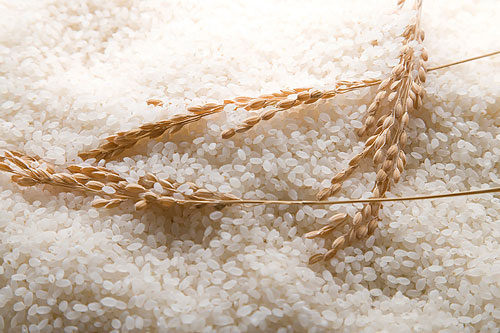

# 为什么我不推荐用公益网站freerice.com给世界上挨饿的人们捐米

** **

freerice.com是一个有名的非营利性网站。这个网站有趣的地方在于它让访问者回答英语单词问题，每回答对一个问题，网站就通过联合国世界粮食计划署向世界上挨饿的人们捐出10粒米。也就是说你回答对10道题就等于捐出了100粒米，100道题就是1000粒米。

这个网站从2007年存在到现在，很多人都听说过，网站看似是个双赢的局面，访问者增加了词汇量，挨饿的人们得到了米。

但是我从听说这个网站开始就反对人们用这个途径来给挨饿的人们捐米，我不只一次写文章吐槽过这个东西，今天我又看到有人宣传这个网站，所以我决定再写一遍。

首先我来说一下我的一些假设:

—联合国的国际援助项目出了名的没效率，很多援助并不能完全到达原本计划的受援助人们手中。但是在我以下的讨论中我假设这个项目的效率是百分之百，也就是说所有的项目运营费用全部不计，并且假设这个网站捐出的每一粒米都到达了受援助者的手中。

—国际援助项目多少都会对受援助方造成一点负面效应，比如增加受援助者对于援助的依赖，打击受援助者的工作积极性等。在以下的讨论中，假设这个援助项目对于被援助者没有任何负面效应。

以下我用到的一些数据：

—根据freerice[网站自己的数据](http://freerice.com/frmisc/totals)，从2007年10月7日开始到2012年3月26日为止，这个网站共捐出了95283196930粒米。也就是952亿8319万6930粒米。

—按照联合国估计，到2012年7月1日，非洲人口约为10亿7009万6000人，组成这个数字的国家/地区有57个，其中最大的尼日利亚人口约1亿6663万上，最小的英属圣海伦娜岛4000人。也就是说非洲国家平均人口约是1900万人，比较接近这个数字的国家是人口数量排名全非洲第17的安哥拉，人口约2000万人。[百科链接](http://en.wikipedia.org/wiki/List_of_African_countries_by_population)

—按照[freerice的数据](http://www.slideshare.net/GreenBeingNancy/400-grams-of-rice)，一个成年人每天大约需要400克（约19200粒）米

—[富士康员工的平均时薪](http://www.pcpop.com/doc/0/766/766503.shtml)是1.78美元

造成了多大的影响：

那么我们来计算一下freerice网站和利用它来捐米的人四年半以来一共造成了多大的影响。

—按照每人每天19200粒米算，这四年半所有捐出的米够496万人(95283196930/19200)吃一天。

—当然每人每天19200粒米是一个成年人的量，我们假设把老幼也算进去，再进一步假设一个非洲国家的人们因为常年粮食不够的缘故吃的比一般人少。我们把19200粒米对折一下，也就是9600粒米，大家吃个半饱。这样的话这四年半所有捐出的米够992万人吃一天。

—前面数据显示非洲国家平均人口是1900万人，安哥拉是2000万人，也就是说这四年半所有捐出的米够半个非洲国家的人吃一天，还是吃个半饱。

—那么在四年半时间里，这个网站和所有热心的访客为了让这半个非洲国家的人吃一天吃个半饱花了多少精力呢？因为1道正确的题是10粒米，一道错误的题没有米，所以访客们一共正确回答了9528319693（95亿2831万9693）道题目。

—因为回答问题有快有慢，有错有对，我们保守估计答对一道题目平均耗时5秒钟（包括读题、点击、网页载入和回答错误的题目），那么答对这么多题大概花了476亿秒，合约1323万小时。

总结：

所以说这个网站造成了什么影响呢？总结一下就是：

花了四年半时间，累计耗时1323万小时，在不考虑项目效率和任何负面影响的情况下，产生的作用相当于把57个非洲国家/地区中的半个的人们喂了一天，还只是喂个半饱。

你不觉得很没有效率吗？

要捐米就捐，要捐钱就捐，做善事途径很多，如果你能上freerice这个网，你一定有基本的网络能力来找到你喜欢的慈善机构和贡献途径。但是把时间浪费在这个网站上面是没有效率，哪怕是利用这些时间去富士康打工把工资捐掉都更有效率。

按照freerice自己的数据，[这几年来每年的捐米数量都在下降](http://freerice.com/frmisc/totals)，我觉得让这种没有效率的东西慢慢消失也是不错的。

友情推荐： 拓词链接：[http://towords.com/](http://towords.com/)

  

（采编：薄然；责编：应鹏华）

 
