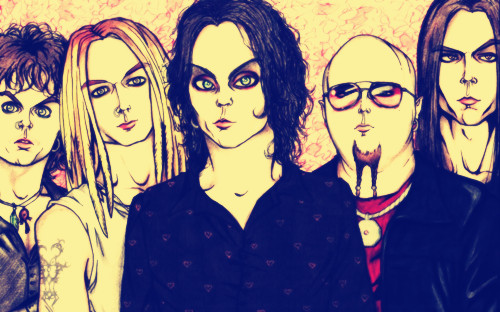
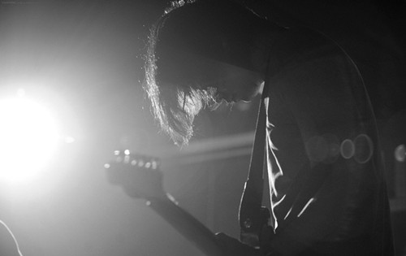

# 主唱死了

一
    
主唱死了，我们可以玩后摇了，可是我高兴不起来。

第一次见到主唱是在一个下雨天。那天我刚拿到网购的599新人贝斯套装，打开箱子我发现贝斯很丑，长得像鸡巴。说好的“包学包会简单粗暴的教程”“也不过是几张打印的百度文库的贝斯教程，而且纸质很差。我拿着那根烧火棍望着窗外陷入了悲伤之中。感觉因为轻音少女，Mio，面纸姬，HJ伪娘，冷雨夜和卡农而萌发出来的学贝斯的热情就快消失了。啊，就像那落在地上破碎的雨滴，消失啊，消失。

我得出一个结论，刚开始学乐器的时候还是买好一点的乐器比较好。穷逼就不要玩摇滚了。

悲伤的时候有一个长发男子路过宿舍门口，他走得飞快，以至于我只注意到了那飘飘长发。五分钟后他回来了，并走进了我的宿舍。长头发，黑框眼镜，络腮胡子，叼着烟，文化衫，牛仔裤，帆布鞋。我一边看着他一边像撸着鸡巴一样撸着那根烧火棍，他一边看着我一边猛抽那根烟，他的腮帮有节奏地动着，那烟头的红色一闪一闪地。

他在我面前蹲下，深吸一口烟，缓缓吐出，烟雾缭绕间他对我说：“我们乐队少贝斯手，有兴趣吗？”

我说：“我刚开始学，为什么找我呢？”

他说：“我们对贝斯没要求。”

我说：“好啊好啊。”

他说：“再问你一个问题，为什么不学吉他学贝斯？”

我说：“我长得丑。”

他说：“吉他手会喜欢你的。贝斯手是乐队的灵魂啊。”

就这样，我加入了人生中第一支乐队，乐队名字叫“你妈死了”。

二
    
辅导员打电话告诉我主唱死掉时我并不意外，毕竟人早晚要死的，而他那样的人一定会在老去前死去的。不是自杀就是被别人杀掉吧。我们的代表作《你妈死了》里面就有一句歌词“再不死我们就老了”。

印象最深刻的是某次小型表演，主唱在台上歇斯底里地吼着“再不死我们就老了”，而旁边是刚刚唱完《再不疯狂我们就老了》的某乐队，名字我忘了，好像叫crazyman，号称当代第一地下朋克。主办方比较傻逼，临时让我们两支乐队同台表演，说早唱完早结束，再不完警察要来了。主办方来协商时，第一朋克乐队的三个家伙都非常激动，纷纷表示警察来了就和警察干。面对此情此景，主唱说：“傻逼。”主唱经常说别的乐队傻逼，圈里人都表示这是朋克的体现，不和他计较。但谁说他朋克他就说谁傻逼。那天第一朋克的主唱指着我们主唱说：“真朋克。”于是他又被主唱骂了一句“傻逼”。主办方的人对着一群骨瘦如柴目光涣散不知道从什么地方的垃圾堆里跑出来的观众说：“接下来由两支朋克乐队为我们同台表演。”那些观众顿时就躁了起来，一个个摇头晃脑地做着金属礼。主唱对着麦克风说了句：“傻逼。”这我同意，不能因为我们歌曲简单只用到三四个和弦就说我们是朋克乐队。你妈死了乐队的定位一直是流行，这是主唱强调过无数次的。我们唱完《你妈死了》后，第一朋克明显不耐烦了，因为我们唱歌时台下那群家伙明显比听他们唱歌时躁。如果是我们遇到这种情况，主唱一定会对着观众说“你们是一群傻逼”的，然后那群傻逼就躁起来了，不过第一朋克明显没那么朋克，他们的主唱对着人群说：“反光镜是傻逼。”我不知道他怎么冒出这样一句话，不过台下的人毫不意外地躁了起来。我们主唱很淡定地对着麦克风来了句：“crazyman是傻逼。”然后第一朋克的两个家伙抡起乐器就往这边砸，架子鼓不太好当武器，鼓手扔了两根木棒过来，正好砸在我脑袋上。我们主唱扔掉吉他赤手空拳就冲了上去。现场更加躁了。

	

最后我们都被警察叔叔拘留了。在警察局里，主唱涕泗横流地表示我们是傻逼，什么早唱完早结束是扯淡啊，居然没看出来同台唱不同的歌和分开来唱歌没什么不同。后来crazyman一下子就走红了，演出经常爆满，大家都想看看传说中“为了维护地下尊严被警察拘留”的乐队是啥样的。不过你妈死了没有红，据说是我们乐队的名字不太好，那些小公司不愿意推我们。
    
我一直觉得主唱这样子的男人早晚有一天会被人家砍死的，没想到他不是被人家砍死的，不过我也不知道他算不算自杀，他嗑药嗑多了，然后被自己呕吐物噎死了。被发现时一丝不挂地倒在浴缸里，像极了某个乐手。
    
我感到奇怪的是为什么是辅导员是第一个发现主唱死掉的人。主唱那样的人，没有爸爸，没有妈妈，没有女朋友，没有亲人，手机几乎二十四小时关机，被发现时怎么着也应该全身爬满虫子吧。每当提到他的爸爸，他都说：“我爸在迪拜卖军火，被基地组织干掉了。”每当提到他的妈妈，他都说：“我妈嫁给穆斯林了。”
    
我想，应该是辅导员痛恨主唱，所以一直悄悄关注着他吧，即便主唱退学了她还是关注着他。那天辅导员去我们位于郊外的荒废了很久的只有主唱一个人住的地下排练室找他，然后就发现了死在浴缸里的主唱。
    
主唱上大学时已经23岁了，他说他曾经作为一个流浪歌手在祖国的大地上漂泊，后来跑回去考大学了。问他为啥还要回来上大学，他说他读了一本关于西南联大的书，就想看看大学是什么样子的。我问他漂泊了那么久会不会不适应，他说不会的，他的灵魂一直在当代贫瘠的思想荒野上漂泊，肉体在哪儿都一样。我不懂他说的东西，不过我觉得他挺厉害的。
    
从我认识他起他就一直和辅导员发生冲突，我们的辅导员啊是一个小姑娘，刚刚毕业没多久。长得挺漂亮的，不过主唱觉得她丑，主唱说过：“没有思想的女人我连操的欲望都没有。”我觉得他说的有道理，虽然我不知道什么样的女人才算是有思想的女人。
	
于是他就给我讲了他的前女友的故事。有一天他在南京的街头饿的瑟瑟发抖，我提醒他“应该是冷的瑟瑟发抖”，他说“闭嘴，我就说饿的瑟瑟发抖”。他在南京的街头饿的瑟瑟发抖，即便这样他还是拿出吉他弹唱了起来，“琴声呜咽，一如我肚子发出的呻吟”，主唱一边啃着面包一边和我讲。他发现了一个姑娘，或者说一个姑娘发现了他，那个姑娘在他面前站了一天。当夜色降临的时候主唱唱不动了，饿的浑身颤抖，我再一次指出“应该是冷吧？”主唱没理会我。然后那个姑娘带着主唱去觅食了。“你看，这是只会出现在小说里的情节，不过被我遇到了。”后来他们在一起度过了甜蜜的半年。我问：“为啥分手了啊？”主唱说：“她去国外学艺术了，我期待有一天她能在纽约办画展，于是我们分手了。”主唱一脸幸福，叙述着想象中的画展，仿佛她的成功也是他的成功。我不懂其中的逻辑。主唱说“有些东西就是没逻辑的，不要沉迷在逻辑中无法自拔。”我问他什么是有思想的女人，他说只能意会，“我讲了这么有趣的一个故事，你意会不到吗？”我摇摇脑袋。他像敲架子鼓一样敲我的脑袋，“傻逼，我耍你玩的，漂亮的女人我都有操的欲望。”
    
主唱和辅导员的矛盾源于一次学校活动。党委要求全院学生都去上形式与政策课，主唱也去了，我们坐着看一部名字叫《什么是邪教》的片子。看到一半主唱想上厕所，他站了起来往厕所去，院长发现了他，一声怒吼：“干蛤？”主唱说：“我不干蛤，我上厕所。”院长甩甩手说：“坐下来，不准去。”主唱站在那儿，盯着院长，此时片子中传来“邪教组织经常把一群人聚集在一起进行洗脑教育，有时连厕所都不准上……...”的旁白，大家都笑了。主唱对着院长竖了竖中指。然后他就被处分了。
    
辅导员一边在院长面前道歉“不好意思啊，院长，这学生归我管，我没管好。”一边拉着主唱让他一起道歉，主唱拒不道歉。院长说：“打电话给他妈啊，让家长来教育。”主唱说：“我妈死了。”然后院长气死了。
    
院长气死这件事情直接影响了学校的权力格局，领导班子立刻换了一批，原来我们的辅导员是很受器重的，她一下子就不受器重了，从一个可以给学生开假条的辅导员变成了连假条都不能开的辅导员。辅导员和同学们都恨死主唱了。主唱也恨死自己了，心地善良的他为这件事情吃了一个礼拜的素。
    
还有一次，主唱挂科太多了，他被叫到办公室去，我也一并被叫去受教育了。
    
辅导员说：“你挂科这么多怎么回事啊？”
    
主唱说：“很正常啊，我不喜欢。那帮猪一样的老师只知道照本宣科，猪一样的学生只关心考试怎么过，大家对书中人物的激动漠不关心。相应的，觉得恶心的我对考试这种东西也漠不关心。”
	
辅导员明显没听懂，不过她还是坚定地说：“就算你不喜欢，也得考试过吧，这是大学生最基本的……...”
    
主唱说：“扯淡。大学生在大学中最基本的任务是找到自我，知道自己喜欢的所在，寻找到值得一生奋斗的道路。去他妈的考试。”
    
然后他像念诗一样地说：“对每个人而言，真正的职责只有一个：找到自我，然后在心中坚守其一生，全心全意，永不停息。所有其他的路都是不完整的，是人的逃避方式，是对大众理想的懦弱回归，是随波逐流，是对内心的恐惧。你们知道黑塞吗？”

辅导员明显又没听懂，不过她还是坚定地说：“我知道你什么意思，理想是吧？我懂。不过为什么不能拿到文凭工作稳定了再谈理想呢？”

主唱说：“又扯淡。安稳之后谁还谈理想啊。你扪心自问，你信吗？有理想的人大抵可以忍受穷困的生活，但他们大多受不了安稳生活的腐蚀。”

辅导员明显不信，但她还是坚定地说：“有本事你别学啊，你退学啊，实现理想去啊。”

主唱当场就写了一份退学申请。教育不成反被教育的辅导员红着脸不知所措，主唱一边抽烟一边欣赏着“一阵子以来我写过最好的东西”，我在一旁目瞪口呆。

主唱的理想挺俗的，那就是做音乐。不过主唱的经济来源是什么呢？他垄断了学校的汽水瓶子回收产业。每天晚上，你都可以看到一个拖着垃圾袋的男人在学校里游荡。他经常说：“经济独立是最重要的，你们懂吗？”我们都懂，但我们都不会去收瓶子。

三

回想完这一切我打了个电话给吉他手，告诉他主唱死了。他没说什么，好像挺高兴的。我问他在干啥，他说他在录音棚，“死就死了吧，我录音呢。”

吉他手是主唱在“一个阴暗酒吧的阴暗角落里”发现的，那天主唱去一个叫MIDI PUB的酒吧玩耍，顺便看一看附近的三流乐队，在那里他第一次遇到了crazyman，他断言这样的乐队是不会火的，但是他们火了。主唱把吉他手带回来时对他说：“将来你一定会火的。”可是他没火，连五月天的solo都弹不下来。

从一开始我们就排主唱写的歌，由于一开始你妈死了的定位就是流行，所以主唱写的歌还挺好听的，就是歌词有点阴暗。吉他手觉得我们应该改名字，然后把歌发到豆瓣去，他描述的很美好“一下子都是仰慕我们的女孩子，摩登天空找我们签约，成为摇滚巨星”，主唱坚决反对。主唱说如果真那样的话我们乐队就完蛋了，再也不会写出好歌的。“变成只会迎合受众的傻逼。”主唱很悲观，吉他手表示那样挺好的。不过由于不会再有另外一个乐队要吉他手了，吉他手一直没和主唱闹翻。

直到有一次，本地的一群乐队聚在一起玩耍，主唱表示我们不会和那群傻逼混在一起的。可是吉他手一个人偷偷跑去了，主唱知道后也跑过去了。

由于我不在场，我也是听别人说的，他的这段故事已经成为一段传奇。

那天吉他手一边喝酒一边诉苦，“那傻逼坚持什么狗屁理想，不准我们出名，我他妈凭什么帮他弹吉他啊？！”周围一帮乐手都纷纷表示主唱是个傻逼。这个时候主唱到了，他没有理会周围一大堆乐手，他拿起一瓶啤酒就往吉他手脑袋上砸，吉他手顿时头破血流。周围人正欲动手，主唱操起一把吉他就开始弹，从披头士到大门，从pink floyd到metallica，然后是slash，最后他唱起了何勇的《垃圾场》，“有没有希望？！有没有希望？！”众人都被震住了，“你们他妈的会吗？你们这帮傻逼除了唱些傻逼歌，把你们的鸡巴塞婊子阴道里还会干什么？你们他妈的为什么搞摇滚啊？！”

	

 周围都是号称第一朋克第一金属第一英伦并列第一朋克金属英伦的乐队们，他们均沉默不语，看着主唱发呆。
    那天吉他手乖乖跟着主唱回来了，后来再也没有瞎逼逼过。

四

我打电话告诉鼓手“主唱死啦”，“死啦？”，“嗯恩，死啦。”然后鼓手哭了。

鼓手是个没什么故事的男人，他的鼓是主唱教的，就像我的贝斯。我也是个没什么故事的人。没有故事的我们活着，也创造不了什么故事。有故事的主唱死了，他的死也成了故事。

辅导员告诉我们会有一个追悼会。我感到很搞笑，追悼会除了我们几个不会再有别人了吧。果然除了我们三个就没别人了，吉他手在录音，没来。

我们在追悼会上回顾了主唱短暂的一生，不过我们对他以前的人生不太了解，所以整个回顾的过程也就几分钟。

我们乐队没多久就解散了，不是因为钱，不是因为技术，不是因为音乐理念。那天主唱把一摞纸交给我，他一边抽烟一边说：“你妈死了今天解散，以后你们不用来了。”

我说：“为什么啊？”

主唱没回答我，他说：“那是我这几年写的所有歌，我这辈子要写的歌都写完了。兰波19岁就不写诗了，我已经25岁了。你们知道兰波吗？”

我和鼓手摇摇脑袋，吉他手冲上前来把我手里那摞纸抢走了，鼓手冲出去追吉他手。主唱让我坐下来和他说会儿话。然后我们就坐了一下午。

主唱说：“本质上我是一个坏人。”我点点头表示同意。“我不务正业，伤害周围的人，伤害自己。王尔德说啊，从艺术的观点来看,坏人是非常吸引的研究对象。他们代表了色彩、变化与特异。好人会激怒人的理性,坏人则引发人的想象力。你知道王尔德吗？”我摇摇头。

他说：“很抱歉让你知道了，如果你以后去看他的东西，被他吸引了并且改变了灵魂上某一点的话我是不会负责的。”我点点头。

他叹了口气说：“相信我，你们只希望迪安莫里亚蒂活在小说里。”

他又说：“不好意思让你们知道了那么多。”

然后你妈死了再也没聚到过一起，主唱死了我们也聚不到一起。

辅导员说：“怎么这么不负责任，就这么死了呢？”

我说：“没有亲人，没有朋友，没人关心他，没人理解他，他不欠这个世界的，没什么好负责的。”

辅导员说：“太年轻了。”

我说：“没人爱他。”

辅导员说：“我爱他啊。”

我说：“他不知道啊。”

我说：“啊？”

五

我现在在精神病院写着这个不长的故事。

一个人死了，有人悲伤，有人高兴，有人得到了些什么，有人无动于衷。主唱曾经给我讲过，有个叫乔希尔的抗议歌手，他死了，然后另外一些抗议歌手就吃下他的骨灰，他们死了后再让别人吃下他们的骨灰。

于是我在某一个睡不着的夜晚挖开主唱的坟墓把主唱的骨灰吃了。我觉得那早已死去的主唱一定在天上看着我。不过大家觉得我是神经病，就把我抓起来了。

这个简短的毫无意义的故事还没讲完，吉他手唱了几年主唱写的歌，由于你妈死了乐队一开始定位就是流行，他挺受欢迎的。不过没多长时间他就被安稳腐蚀了，不会写歌，吉他弹得差劲，终日酗酒嗑药，最后他挂掉了，以和主唱一样的方式挂掉了。不同的是，他揣着大把银子去了那个世界。

听说鼓手一直在打鼓，特别的幸福，他和辅导员在一起了。

而我嘛，整天在精神病院里臆想着在我身边曾经出现过像迪安莫里亚蒂那样的人，疯狂的生活，疯狂的表达，同时对一切事物心怀渴望。不管别的，只是燃烧，燃烧，燃烧。来到世界上做完自己想做的，然后在最美好的年龄将自己燃烧殆尽。

不过我好像真没遇到过这样的人。我只遇到过毫无才能一味地在不切实际的幻想中麻痹自己的懦夫和从来没有过灵魂一味地斥责别人中二的傻逼以及像我这样有臆想症的loser。	

（采稿：朱燚；编辑：张蔚涵；责编：刘铮）