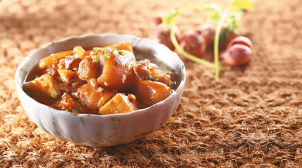

# 乳猪蹄

** **

## 

 

老太太在的时候，为我做成许多事情，比如由她手制赠予我的全村第一强弓（后我以此弓连发三矢，射哭了曾打过我的大孩子），八月节和过年时候的糖饼，为我捡来的八哥编的鸟笼。我很感激她。但是十年已过，我却不大记得清她的样子，只想得起那一双晦暗又深邃的眼睛，还有黄白的眼垢。这很让我遗憾，因为我对人的相貌极其敏感，几乎过目难忘，并且往往能一眼看出对面人老去或年轻时的样子，却记不住这位家里老人的面目，实在是一件令人悲伤的事。

只有一样我永生难忘。有一年夏天，约莫一两点钟，太太倚在墙根吹风躲太阳，她只穿了裤子，上身光溜溜的，低头闭眼，一动不动。太阳很大，她的胸很白，我不敢多看，心里想，太太这么大的人，怎么不怕不好意思？现在想起来，那人倚着女墙，盘腿席地，日大风高，岿然不动，像极了一尊菩萨。那胸口，白的像观音娘娘的莲座，我不敢走近了看。再有机会细看时，她已如黎明残灯，奄奄一息。

那时我受学校命令被隔离在家，几位姑奶奶给她洗澡，我拎了水过来。她依然低头闭目，只是不停流汗，冠心病、肾炎实在是考验这可怜人的忍耐极限，我们不时听到微弱的呻吟。我也终于认真地看到那胸乳，那瀑布一样垂悬挂在心口、如同纸一般的薄的物事，直落到肚脐眼，就像两匹白色的帘幕，似乎微风都可以叫她们飘荡，她全身几乎都成泥色，唯独这两片残乳，还保留着初生的白。

这户人家的奶奶三十岁才得生养，对孩子的疼爱世所罕见。我同她一张床睡到十一岁，我们一头，老头儿一头，晚间听完故事，总是要搂着她柔柔热热的脖子睡。她，还有她们、他们，睡觉是不穿衣服的，因为过去缺穿，包着衣服睡容易和被子摩擦坏了，舍不得。我躺在她怀里，多时摸到过奶奶的乳房，大片的褶皱，里面也不平坦，像塞了几层棉絮，也像脸盆里刚揉完一遍的面疙瘩，一捏一个塘。没有脖子光滑温热，我不大喜欢。

后来在她上路前一天，我搀着她下楼梯，踩完最后一级台阶，她像一个面人人一样瘫在我怀里，我被压在地上，使劲想扶她起来，心里有些奇怪的、麻木的仓惶，最终所有试图站立的努力都无济于事，反而把她的内衫撸上去了，露出了万分褶皱的胸乳。我的惶恐变得更加奇特，似乎有一瞬间思维走的很慢，就那样抱着，看着那褶皱和黑色的乳头。如此平整的、如同摊煎饼一样覆盖在胸口，又如水银泻地，只被一层包子皮般的薄膜包着，四散开去，毫无力气，放佛一团死物。我的妈妈是个好人，她很严肃地皱着眉，飞快地蹲下来，一把扯下衣服盖住将亡人的肚腹，把我拉回到这个世界。

我的妈妈是个好人，自从十一岁末离家进学，我就和她睡一张床。因为从未单独睡过，一个人躺在黑暗里，怕。这习惯一直延续到我渐渐生出胡须，然后才要求独占一铺，并不许开灯。妈妈本性太好，就算嘴利如刀，也绝对生不出半点害人之心的。她年轻时曾多次与她婆婆争吵，故而在大人离去之后常常后悔不已，也因此信了佛。我们开始也睡一头，但从我记事起，就没有捉过妈妈的奶，似乎有种天然的抗拒，让我一想到此事便有绝大的恶心。她对我说一岁多断奶时，哭声震天，闻者皆悲。我能想象，那种遗憾和痛苦和二十年后大人灵堂上的哀嚎并无二致。

我知道妈妈的奶并不一样，它们十分健硕。中学二年级妈妈给我搓澡，她弯着腰，面目因充血变得赤红，我若有若无意地看到一对丰满、动力十足的奶，然后赶紧偏过头去，提醒道：你露出来了。她愣了一刹，然后匆忙整理，又似笑非笑，我再看她，脸更红了。从此我每忆起这回事，都感觉无地自容，真是十年来做的最错误的一件事。那以后，我就和妈妈分头睡。

大一没有女孩子在身边的时候，我们经常学幽灵在校园里游荡，南师是出了名的姑娘多，环肥燕瘦，淡妆浓抹，定不会叫人失望。我对胸口鼓鼓的姑娘尤为钟爱，没有办法，应当是天性使然。这当然是一种审美，但不能说与性欲绝对无关。高中见过一幅图片，好像是法国出土的一件裸女石像，源自数千年前的土著先民，这女子的面貌几无刻画，却过分突出了巨大的乳房与生殖器，我想如能亲见必然更具震撼。生命诞生的神奇和对延续血脉的敬重，让人一下子想起那个热血沸腾的蛮荒，数千年下来，人类不就是凭着这股血气引领苍生，干成了许多事业么。

提及乳肥，就不能不讲大唐。唐的开放，从女子衣冠可见一斑。如果我们自秦以下至满清，串联一下帝国时代的历史，便会发现唐不仅是最开放的帝国，同时也是帝国时期由盛转衰的转折点。中华帝国的兴衰区间恰恰与统治阶层的开放程度密切相关，唐以前是上升期，以后愈见晦暗。而看一个古代国家的开放程度最直接的观察点就在于其对于女性的包容态度，看其对女性之态度最直接莫过于察其时代女子之衣冠服饰，唐以前我先民衣服宽宏大气，多有容纳，到唐朝可谓巅峰，女子著抹胸披轻纱，一步三抖，摇曳多姿，唐亡之后，衣裳愈见小量严谨，女子地位亦愈低下。可以毫不夸张的说，唐的辉煌，是乳房赐予的荣耀。

五胡乱华之后，中原士族十不存一，确属汉室文明的大溃决，是我民族的一次深重灾难。但是百年后居然能崛起出一个荣光万世的盛唐，却不能不说有胡人的功劳了。我们的民族总是在和平的时期才能有大的光辉产生，但是和平日久，必定陷入固步自封的保守境地，文明的前行就难免举步维艰。这也是农耕文明的致命伤，守成是根本，保守为天性。而此时外民族的侵略往往意味着融合与催化的开始，注入新的血液，使本就具有强大生命力的汉室文明迸发出新的活力。李唐王室体内，正是流着鲜卑人的血。也许正因如此，才把这些“异族”的鲜活、不拘沉法、对母性的敬重带入了汉人的世界。当然，也有例外，譬如拿尚未完全进化成人的物种血液也来融合（如蒙、满），结果必然适得其反，轻则重疾缠身，重则排异致死。

保守对于文明而言无异于自我灭亡。正是鲜卑人裁去了汉家女胸前一块厚布，换上轻纱羽衣，使那处动人若隐若现，才奠定了大唐三百年的旷世基业。这又怎算违背圣人教诲呢？微露霞光，似有若无，美色而不淫，正是贴合中庸之道啊。天尚且不绝人之路，圣人敬天，又如何能绝了凡夫的一点念想呢？

区区三年，我的羞涩已经变成了坦然，每次在路上经过迎面的姑娘，如果她的胸口鼓鼓的，总是忍不住要多看几眼，于我而言，女性最美的地方是手，最惹人脸红的是胸。这种毫无理由的爱恋，就像我在众多食物中对于猪蹄的情有独钟。

童年时我并不爱猪蹄，无他，嫌肥。我出生的年代物质虽不丰盈，却也能知道瘦肉的好，至少不像妈妈给我讲过的故事，有位小姑姑小时候过年上桌吃饭，总喊着要吃“胖的”、“胖的”，因为肥肉一咬一嘴油，最能解馋。我少时不知好歹，一块肥肉，就着饭嚼都咽不下去，当然也不喜欢肥硕的猪蹄，尽管它的高价仅次于腰子，属于珍贵的食材。食品口味因人而异，而非因价而异，这道理我老早就懂，我的家乡临江建城，江鲜极品刀鱼也不是难得一见，但我从不伸箸，包括甲鱼螃蟹河豚，一概无视之。一往情深的，大约有搭粥的酱洋生姜，奶奶酿的米酒、扬州四美酱菜、煮干丝、三味凤爪和青菜肉圆汤。

很多时候，时间给我们一个结果，却不告诉你答案。我也不知道自己是什么时候开始爱上了猪蹄，是老大人临终时？还是因为初一时东兴街的红焖猪手？总之当初太太还能坐起来的时候，奶奶给她送过两次白煨蹄，她不大能吃下去，就叫我过去到跟前，看着我连汤一起喝尽，兴许是沾了老大人将行时的回光之气，那种前所未闻的鲜香至今难忘，像是嗅到了死亡的气息，没有腐臭，原来，死也可以是香喷喷的。她没能尝到第三顿汤。

猪蹄也不都是肥的，咬去头一层韧性十足的皮囊，会露出白白的脂肪层，如果下口猛一点，就能吃到最嫩的瘦肉，那是一切精肉中最精华的部位，腿肉比它差太多。然而最属珍品的，还是那勾人魂夺仙魄的蹄尖，就是猪蹄沾地的一部分，相当于猪的脚掌，像海豚的额头般圆润，比被敲打了一百万次的牛丸还要韧劲，我每次买回卤猪蹄，必得留下这两块蹄尖，细细观赏，不忍下口，有时还要小心包好，带到学校去点饥，吃尽心肉，也不忍吐出，总要在嘴里慢慢吮吸好多时，至索然无味才不舍地丢弃。

放在现在，万记冷菜的卤猪蹄和东兴街的红焖猪手也都价值不菲，我们大多数时候还是自己做。被洗尽的蹄白得像云，放锅里煮到半沸，翻滚的也是洁白的汤水，像妈妈的奶。白的好啊，漂亮，明亮，观音娘娘的莲座也是这样的白。在乡村，人家还是难得见到大片的白的。就像不能常买猪蹄，这么贵，怎么敢呢，家里有孕妇也不会，多数拿鲫鱼汤代替了。如果有一户人家一连好多天买着一副蹄回去，那么，这人家要遇到悲伤的事情了。

两年前一次变故，我又尝到蹄汤的味道，但是那次大人挺过来了，她看着我啃肉，慢慢叹息：我死了，他们就会过得好了。这措辞和语气，同老大人当年一个模样，我觉得汤实在太鲜了，鲜的发苦。临近死亡的味道，如同猪蹄一般的芬芳。可是为什么还有那么浓郁的雾气呢？

高三打过一个电话给爸爸，说我不念书了，回家学个车床工一样过一辈子，免得受世上读书人的百般恶气。爸爸没有一句责备，只说没事，儿子你回来吧。然后带我到一家叫做蓬莱阁的馆子要了一大盆酸菜猪手，那晚行道树上都结了冰，我父子烫了几杯椰汁，一言不发地同啃一盆猪蹄。雾气往上，汗滴朝下，我有些看不清他的脸，只有毛发日渐稀少的顶心上反照灯光，有些刺眼。我吃到一半，泪如雨下，如何用力也忍不住，嘴唇咬出血来，和着眼泪和嫩肉一同嚼咽。我父一言不发，只用汤勺不停在汤里翻找，把蹄尖舀到我碗里。

世间事业，败亡轻易，立业太难，四年已过，同样的业孽竟又发在我兄弟身上，虽无当夜的鲜汤美味，还要撒上一回重泪，叫人情何以堪？这也算是第二场了。

现今皮糙肉厚，再遇人间不平事，能解则解，不能解便上三楼，借钱买半斤猪手，一瓶二锅头，找个路口树后面蹲着，看来去穿梭的学妹，看哪家的姑娘玉指如葱，小衣裳下暗藏汹涌。

曾经好过的一个姑娘很喜欢靠在我胸口，说是那里有块软肉，头搁着异常舒适，后来发现我钟爱猪蹄、豆沙之类，不禁感叹，怪不得那么软绵，你这吃的都是能丰胸的啊。我看着她裹的严严实实也不怎凸显的心门，说以后要是你嫁给我，我给你排菜谱，炖猪脚汤，保管不出三年，羞巩俐赛柳岩狂甩莎拉波娃。她脸红很不好意思，粉拳作势要打。

可惜啊，等不到以后了。

 

（采编：孙梦予；责编：徐海星）

 
