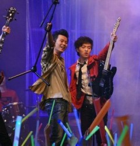

# 二十三岁的反骨

我刚来H公司W代表处的时候，第一个见到的部门内的人是X。

X浓眉大眼，戴着一副框架眼镜，说话时喜欢盯着对方的眼睛——作为一个总喜欢消解话语制造混乱的人，即使早就知道所谓“盯着对方双眼说话可以表示真诚”，我也几乎从不盯着对方双眼说话，而是嬉笑着顾左右而言，包括恋爱，包括面试——坦白地说，属于那种有成熟魅力的男人。

然后他转身领我去办公室，我看到后脑勺见缝插针的白发——高中的时候，我心里一直有点小人得志，就是我那质地糟糕的头发里，没有一根白的。那会儿，大家总喜欢标榜自己回家又一晚上没学啦，全玩游戏啦；上课又睡了一节课啦，什么都没听啦——每个人都想证明自己是聪明的，四两拨千斤的，凌驾于其他人的，以获得一种千人一面中自我确认带来的安全感乃至优越感。后来，我从黑格尔“主奴辩证法”中找到了对此现象的满意解释——也从中滋生了不少称为人性之恶也不为过的行为，诸如谎言啦，虚伪啦，嫉妒啦——那会儿我倒真是回家从不学习的。作为一个毫无天赋的蹩脚吉他手，我当时的理想是用摇滚乐拯救世界——而我们一小撮朋友比较喜欢挤兑的，便是谁谁谁有很多白发。我们称呼那样的人为“正点”，放到今天，就是“学霸”。扯远了。

当天晚上，X就和几个同事带我去吃了顿火锅——顺带说句，相较于内地不痛不痒的“肥牛”，W市的牛羊肉片好过了不知多少倍——实质上是测个酒，也就是在中国大多数做市场的人必须过的一关。一共有三关。

饭局上，我得知X是87年底出生的，也就是当时还不到25岁；我又得知X已经是骨干员工了；我还得知，X的儿子已经快两岁了。

我当时想：这哥们也忒快了，什么都比别人快很多。

后来，没过多久，X升官了，成为了我们部门的主管.。通俗点说，就是我的“领导”。而且，几乎肯定是H公司全球最年轻的同级别主管。

X是个做事谨慎，讷言敏行的人，即中国大多数官员——不管是政府，国企，还是私企——所应该是的那种。他向我夸赞某人很优秀时，很少说“ta很聪明”，而是说“ta做事很有分寸”。

大体上来说，作为某年某县的高考状元，某市某大学的优秀毕业生，X是个让人没太多怨言的的人——“很有分寸”——又或者说，你所有的怨言，最终针对的只能是这整个机器，而非你这可怜螺丝钉上的齿轮，rage against the machine——但在许多时候，你会像好不容易逃逸某种复杂引力系统的星体一样，使出全力绕道而行，甚至他成了黑洞一般的存在——当然这一切，都是后脑勺的某些见缝插针的东西在作怪，不是白发，而是反骨。

我承认从一种舒缓无涉的世俗角度来说，他的许多教诲极具指导意义，诸如“这些都只是生意”，诸如“老婆不工作，就赶紧生个娃给她带，要不总有很多不必要的争执”，诸如“职业规划决定了你能走多远”。但更多的时候，我脑子里总会闪过另一些莫名其妙的词汇，诸如“信马由缰”，诸如“仗剑去国”，诸如“终成眷属”。 我有时会想，我们终归是陶潜李白、苏轼唐寅的后人，血液里多少是应该流淌着这些语汇的——十七岁时曾表现为摇滚梦想的浪漫情怀又再泛滥。

然而，我看着X，看着Y，看着X，看着XYZ，看他们结婚生子，买奶粉着急择校；看他们加班打卡，领工资拿年终奖；看他们买房买车，还贷款筹划投资。我知道也许这才是生活真正的模样，也是我最有可能将要成为的模样。十年前，我关心许多人的年龄：我知道窦唯是1969年的，罗纳尔多是1976年的，韩寒是1982年的，我由此确认自己还很年轻，未来是一条无尽延伸的光明大道，只等我青春作伴呼啸而过。而现在，我已经知道我很可能永远成为不了自己曾经想要成为的人，永远到达不了自己曾经想要到达的地方。我是一匹被皮鞭不断抽打，以致于匍匐路边无力前行的马，或者是没有勇气。明年是我的第二个本命年，一定有一些马，想回到古代，可他只能一直朝前走。

二十三岁的反骨在后脑勺如鲠在喉，仿似十七岁时日夜担心却终未生发的白发一样。
