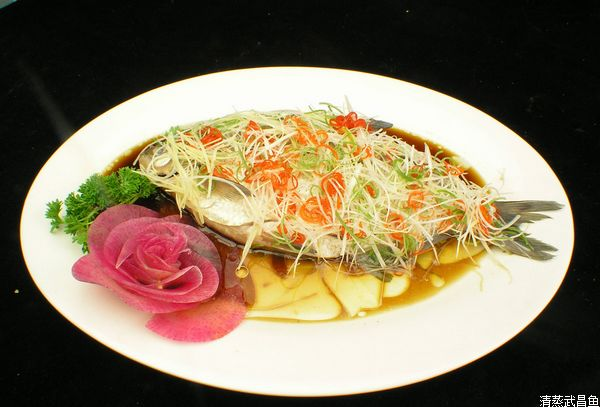

# 云梦泽边烹小鲜

** **

闲来无事，整理以前的饮食笔记，发现独独少了家乡的鄂菜这一大体系，所谓饮食笔记，也就是一个绿皮的小本子，密密的积攒着到过的地方，吃过的美食，读过的历史，要是有缘面见大厨，往往还能附上美食的详细做法，这一百来页的本子虽说不如日记本来的亲切，也算是个安放时间的地方，偶尔翻来还能闻到一阵菜香，然后勾起些许混杂着口水的零散记忆，在无缘饕餮的日子里勉强算个慰藉。

不写家乡菜的原因现在回想起来能列举个七八条之多，归根到底，不如用个“太熟悉”来概括。“如数家珍”这个词我向来以为它只属于《红楼梦》里的王熙凤，现实里“家珍”对于我来说往往是最难数的东西，有时候我们能对故宫里的建筑布局舌绽莲花，却很难对自家一把椅子的来龙去脉道个点滴，我们对巴黎时装周上的春季款评头论足，却很难给自己身上的一丝半缕打个分，刨去传统意义上的谦卑带来的尴尬，我想影响更多的还是我们的“熟视无睹”。

当然，鄂菜的地位也着实尴尬，若按传统意义上的八大菜系算，鄂菜是不入流的（十大菜系中倒是有一席之地），因其在饮食文化的延续中丢了几分正统，业界名家整理菜系时发现竟然难以给鄂菜一个准确的定位，只得作罢。但追本溯源，作为楚文化的载体，鄂菜也当属名门之后，《楚辞·招魂》里的“大苦咸酸，辛甘行些”等句，生动地从味觉上描述了一场楚人祭祀的盛宴，而其中提及的多种食材和烹调方法，大抵算是鄂菜乃至整个南方菜系滥觞前的雏形。只可惜后来乾隆爷给武汉冠了个“九省通衢”之名，人马来往间，烹饪方式的融合，食材的互通，百姓口味的变更，给荆楚大地带来经济繁茂之余，却凋零了鄂菜本来的面貌，川菜，湘菜的辣，淮扬菜的甜鲜，鲁菜的咸，五味杂陈，让鄂菜面目全非。更有码头文化造成的快餐业的兴起，以致“热干面”、“豆皮”等小吃也开始在鄂菜中慢慢唱起了主角。要说鄂菜本来什么样，后世之人早已难以言说，我们只能勉强从汉赋《七发》里记载的“牛脯烧蒲笋，鲤鱼缀紫苏”这些干瘪无味的菜名里猜测其中的奥妙。不过有一点倒是能肯定，鄂菜的食材选用是极为考究的，云梦大泽的涵养，江汉平原的沉淀，让楚地的物产得到了极大的丰富，荆江水系改造前，鱼米之乡的嘉名得由湖北与苏南地区平分秋色。《吕氏春秋·本味篇》里载了一段伊尹的评价：“鱼之美者，洞庭之鲭……菜之美者，云梦之芹，果之美者，汉上石耳。”要知道中国传统饮食对食材的要求很是严苛，大厨伊尹对楚地食材的不吝赞赏，让人对鄂菜之美倒也能揣测个两三分出来。

想起在自己的绿皮小本上给鄂菜添上一笔，说起来也是机缘巧合，前两天和几位友人在路边烧烤摊旁小酌，三杯两盏间倒也提到了吃的话题，一时兴起便把各地的名菜几乎说了个遍，末了还不忘把桌上的烤鱼评价一番，要是烹饪方式能分个三六九等，我常常是把“烤”放在末流，从“色”“香”“味”“意”“形”“养”这几个维度来看，烧烤是将“色”，“形”，“养”完全抛开不谈的，再加上孜然，胡椒调味，食材的本味全无，对“味”的评价可能也得两说。一条活鱼，经这么一折腾，着实可惜。可这鱼究竟怎样吃才妙呢？周国平在《平淡的境界》里倒是借做鱼给写散文打了个很好的比方，这里不妨借喻还本，他说鲜鱼的烹调目的就是一个，保持原味，做法上讲求凝练，避免冲淡了味道。这几句话着实切中肯綮，由是观之，当属日本人的生啖之法最好，将活鱼宰杀洗净，薄薄的切成片，好重口者轻轻挂上些许芥末入口，味轻者直接就着清酒下肚，鱼肉的甜鲜与脆嫩在唇舌间展露无遗。中国向来是礼仪之邦，认为生啖之事乃蛮夷所为，常是深恶痛绝，为了将鱼做熟又保持原味，便有了清蒸这一变通之法。蒸菜不求厚味，调料的添加以少为上，水汽在慢火细煮中轻腾而上，在笼屉里飘荡徘徊，混合这木香与这屉中食材若即若离，食材之味蒸出后断不会散出，合着水汽一道将菜肴轻轻包裹，以食之味煮食之身，其精妙自是不可言说。鄂菜里，清蒸当属最为常见的烹调方法，常见诸市井的清蒸武昌鱼，珍珠丸子，沔阳三蒸当属代表，再加上鱼糕，肉糕粉蒸肉等家常菜肴，无蒸不成席一说在荆楚大地间广为流传。清蒸一活，颇显手艺，看似只有腌渍，烧水，上屉，出笼几个动作，对火候的考验非比寻常，坊间常将鲁菜的调味，淮扬菜的造型称作勺上功夫，那么这清蒸便拼的是锅底功夫，而对这锅底的火的掌控，根本没有现成的方法可循，因为食材，分量，蒸屉，木材四者有一个发生变化，火候的拿捏就不尽相同，好的厨子往往是凭经验掐算时间，而这套经验通常是在失败无数次之后才慢慢习得，这就给蒸菜无形中带来了不少神秘与灵动的色彩。

自以为还算走了不少地方，吃过的蒸菜也不少，但是真正能如梁实秋所说，让“喉头像是有馋虫虱抓作痒”的当属五年前的一次洪湖之行，时值傍晚时分，村野间求旅店不得，只得转向湖边渔民求援，也是有缘，其余村民多已回家，独一老翁为守渔场尚在湖边巡逻，问清来意后，老人极其热情，将我们带到了晚上守夜的草棚里安顿，老人刚好准备淘米做饭，便邀我们一道进餐，这等盛情自是推却不得，便欣然落座，草棚里空间狭小，只容得下几把椅子，一口大锅便架在了棚外，晚餐倒也简单清新，唯有其中的一道清蒸鲫鱼让我挂念至今，鱼是晨间刚从湖里打捞上来，待我们看到时还仍在一个大盆里游弋，老人驾轻就熟地将鱼刮鳞洗净，除去内脏，细细地抹上一层盐，肚里在藏上几片洋姜，接着便在锅里做起了水，这水让我着实吃了一惊，因为它既不是自来水，也不是井水，而是老人从不远的湖里打上来的水，倒进锅里里面漂浮的绿藻依然清晰可见，我本想问个究竟，但一想到毕竟是做客，怕老人怪责自己挑三拣四，便把嘴边的话又憋了回去。水不一会儿就沸腾了起来，接着他便将鱼放进纱布垫好的蒸屉里，然后一并放入锅中。湖面上已经起了一层薄雾，让夕阳映下的一抹血红变得不再那么刺眼，锅上的蒸汽和锅底的柴烟很快便与这雾融在了一起，老人也不掐算时间，只是静静地坐在锅边，似漫不经心地在锅底添柴扇风，我们就这样远远地瞧着，仿佛老人连着这棚外架起的蒸锅也成了这湖的一部分。约摸有十来分钟的光景，老人才微微抬起了头，似乎是瞧了一眼蒸汽的形状，然后便笑着对我们说：“鱼好了”。再看那鱼，与入锅前并无二样，似乎还摆着“空游无所依”的姿态，只是鱼肚的翻卷处透着些许雪白。初入鼻中的是微微辛辣的一丝姜香，接着变成了大雨将至前的泥腥味儿，猛嗅一口，这才闻到了鱼的甜香味儿。我迫不及待地第一个冲上前去，筷子刚落下方才感受到这火候的精准，鱼肉与鱼骨间若即若离，仿佛轻轻吹上一口气，整条鱼便能散落一地，小心翼翼地夹起一块儿来，颤颤巍巍，在夕阳的一丝余光下还能看见隐约间泛着的一丝透亮，入口时，淡淡的咸味如同羚羊挂角，刚刚能触碰到便消散开去，留在舌尖的便只剩下丝丝甜意，仔细嚼来这才知道当初用水的精妙，这湖里绿藻和水草的清香，居然也混在这鱼肉里，化在口中竟像是吞下了整个洪湖。我们这一行众人本是说笑着回忆这一路上的见闻，待这道鱼端上后，席间再无多言，只剩下纷纷落著的脆响和嘴里的啧啧称奇声。这一道清蒸鲫鱼，还真有林清玄笔下让人“舌头打结”的味道，一切对食物的评语在这道菜身上似乎都能沾上边儿，却又都不准确，唯剩“不可说”三字儿尴尬地挂在嘴边。

这“不可说”三字倒是长久以来萦绕在这荆楚大地间，似乎成了数千年来楚人向天地间求索问路的精神注解，楚人精神家园的构建要按历史学家讲是得比中原文化慢半拍的，当中原礼乐文化正散发着理性的光辉时，楚文化仍然没有摆脱对鬼神与自然的敬畏，“楚人信巫鬼，重淫祀”成了写进《汉书》中的不争之实，可要说中原文化没有与鬼打过交道，是绝不可能的，毕竟孔子有云：“周人事鬼敬神而远之。”相比这敬而远之的态度，楚人则显得洒脱了许多，“思公子兮未敢言”这样带着调情的语句，楚人也敢披着湘君的装束对着美丽曼妙的湘夫人说。一段舞蹈，两句民歌，便让人在与自然的通灵间潇洒自如，将祸福旦夕寄托给天与地的楚人，似乎少了不少烦扰，了却了不少心尘。一旦有了安顿生命的地方，对色彩的观感，对音律的体察便显得那么细腻而丰富，就在与神鬼的一唱一和间，楚人与山川河流一道，描绘着一幅幅壮丽诡谲的图画，谱写着一首首灵动超然的诗篇。从用洪湖水蒸洪湖鱼的老人身上，似乎能看见楚人千百年来与自然共通留下的血脉，依旧在这片土地上流淌，而这鱼的美味，更像是对自然最热烈的礼赞，“不可说”此时倒变成了“不用说”。

又想起袁宏道的“至理本无非，从心即为是”了，先王熊绎筚路蓝缕留给后人的正是这样一种超越历史，超越理性的精神遗存，这才有了庄子的“天地有大美而不言”，这才有了屈原的“身既死兮神以灵，魂魄毅兮为鬼雄”，这才有了无数后世楚人对浪漫的坚守与超越，这才有了云梦泽边烹鱼的老人。

于是，鄂菜之美，不在于奢华，不在于绝味，而在于烹饪的姿态。

 

（采编自投稿邮箱，责编：麦静）

