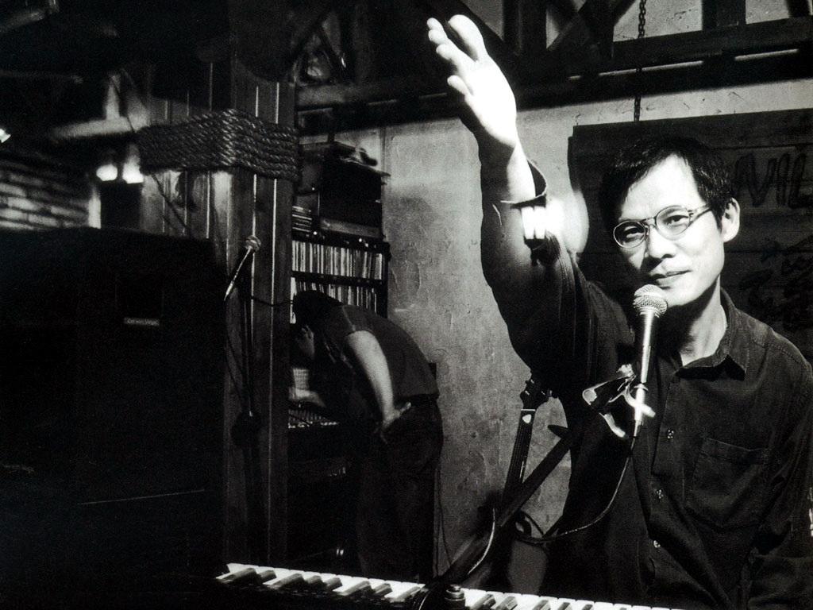
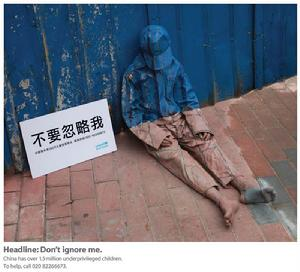

# 亚细亚的孤儿

** **

西门町，台北最喧嚣的地方之一，吃饭、购物、聊天、看妹各种功能一应俱全。这里和所有的商业街区相比，没有什么不同，我基本不期待这里能带给我什么惊喜，最多是看看帅哥就好，从来都只把西门町当成随意路过的备选项目，没有哪次是专门为了西门町而去西门町的，对于我来说，西门町太浮夸了。究其原因，我不会化妆，一脸菜色总不好意思和浓妆艳抹的黑丝美女们拼脸。所以我只好找个借口说人家西门町浮夸。

在我印象中，西门町是个没有内容和故事的地方，这已经成为思维定式。既然是定式，那就是用来打破的。

今天路过西门町，索性就进去逛了一下，本以为会脚步不停，走马观花散步一下，可是就在我正准备去搭捷运回淡水时，我的脚步却停在了一个小型“乐队”前面。一个扎着头巾的年轻人，弹着吉他在唱歌，旁边的人是贝斯手，再旁边的人拿着旗子，上面写着“人民民主阵线”（人民民主阵线——主要关注劳工权益、妓权、移民者、同志权利、原民权、环境保护、身心障碍权益等议题）。我一愣，这才发现原来这个乐队不是在卖艺，而是在为立委候选人站台拉票。

在我印象中的站台拉票就是搭个台，喊个号，唱个戏，骂个蛋，鼓个掌，散个场，这也是思维定式，但是，今天一下子就修改了我的两个定式。

这个辅选团队为两位候选人拉票。候选人中一位是坐着轮椅的残障人士，另一位是位头发花白的老妇人。整个团队只有10个人。候选人2位，扛大旗的2位，弹唱的2位，讲故事的1位，发传单的2位，摄影的1位。和蓝绿的天王巨星豪华版站台阵容相比，这个台站的寒酸至极。他们甚至连个“台”都没有，但是，并不妨碍他们的演出。

我站定的时候，正好是吉他手唱完一曲的间隙，这时一个女孩走吉他手旁边的歌词版前，换了一块歌词版，这首歌便是罗大佑的《亚细亚的孤儿》。

关于这首歌，台湾人都不陌生，至于想了解背景的陆人，请自行求度娘。在这里我觉得有必要把歌词贴出来一下：

亚细亚的孤儿在风中哭泣 黄色的面孔有红色的污泥 黑色的眼珠有白色的恐惧 西风在东方唱着悲伤的歌曲

亚细亚的孤儿在风中哭泣 没有人要和你玩平等的游戏 每个人都想要你心爱的玩具 亲爱的孩子你为何哭泣

多少人在追寻那解不开的问题 多少人在深夜里无奈地叹息 多少人的眼泪在无言中抹去 亲爱的母亲这是什么道理…

我今天不想讲这首歌背后那些不能说的秘密，单单就这首歌的歌词来说，可以引起很多幼年时有过被欺负、排挤经历的人的共鸣。而换歌词板的那位女孩，也就是团队里要讲故事的那位，则是对这首歌感同身受。

她父母是台湾人，幼年随家人和他们的樱花梦移民到了日本。但是在日本，她所面对的是来自同学的霸凌和老师的冷漠。但是她并不十分憎恨那些欺负她的日本同学，因为她相信，自己是台湾人，她一定会回到台湾去。但是当她真的回到台湾时，她才发现，她根本就回不去了。中文对她来说犹如外语，她拼命想逃避的日本，却成了她和同学老师唯一的共同话题。但是，她周围的人都将她视为日本人，叫她“小日本”“日本鬼子”，没有人把她当台湾人。

她曾经是异类，她是弱势，痛苦的生活经历给了她站出来的勇气，所以，今天的她，为弱势发声。

这个女生今年30岁，目前在日日春关怀互助协会工作。日日春的宗旨就是关怀性工作者，为她们谋取正当的权益。这个组织我在大陆时就知道，那是在一期《看天下》上看到的。那期的主题就是有关台湾开放红灯区。

的确，在每年轰轰烈烈的“全力开展扫黄打非专项行动”的大陆，开放红灯区是件不可想象的事情，小姐几乎可以与罪犯划上等号，而她们其实是最好欺负的弱势。没有人会想到要去为她们发声，也没有人敢，大家都会觉得为小姐发声，那是在败坏世风。多少人提着裤子从板房、旅馆、洗头店出来后，皮带扣还没扣上，就骂上一句婊子无情。到底是谁比较无情，自己爽了，还要怪人家让你事后阳痿，回家让老婆骂。这话讲粗了。罪过。

其实在台湾，娼妓一直也是灰色职业，她们是很没有安全感的一批人。目前台湾政府想做的是开放红灯区。想达到方便管理，消除歧视的目的。但是，我觉得这并不是个好办法。第一，有谁愿意自家隔壁就是大型综合怡红院？开在闹市，住户们不答应；而开在远郊，小姐们不答应。第二，这个做法只能是带来社会对于性工作者更大的歧视。这个红灯区开在哪里，哪里就会立刻成为新闻媒体的焦点，哪里的地名就马上会成为新的侮辱性的代名词。没有红灯区时，社会大众对于性工作者的歧视相对较虚，只是一个概念；而当专门的红灯区建立以后，社会大众的歧视马上会被具体化，有靶子射，总比空打飞机来得准。

这样的做法的确方便了管理，但是是否会消除歧视，这个是未知的X。

只要社会文化中对于性工作者的歧视不消除，做再多宣传解释都是徒劳。很多人说消除歧视要从娃娃抓起，但是哪本教科书里会告诉孩子：不要歧视性工作者。所以很大程度上，这是个无解的问题。

扯远了，回到这个女生自己的经历和那首忧伤的歌词。我从小就跟随父母离开家乡在外漂泊，对于她的困扰感同身受。虽然没有被狠狠欺负过，但是也曾很长一段时间被当成异乡人对待。而今来到台湾求学，成了不折不扣的异乡人。

本地人排斥外地人，本国人排斥外国人，这都是常有之事。新的溶液滴入原有试剂大多会产生化学反应。只是看这反应的剧烈程度而已。很多本地人一开始会难以接受你和他分享食物、水源甚至空气。最极端的例子就是俄罗斯的光头党。就我个人而言，我当然不希望作为异乡人的自己遭遇排挤，我也不希望和我同样境遇的人在他乡被人当成异类而遭边缘化。

我觉得排外的态度和做法本来就是一种缺乏安全感和包容力的表现。类似古代皇族要保持“血统纯正”的近亲繁殖，反倒最容易出傻子。

而当很多身处他乡的人说起“异乡人”这三个字，就会很自然的将自己归为小众。小众们自己的第一定位就是，我是少数，我是弱势。既然是弱势，当然希望受到关爱和保护。但其实别人没有义务去关爱和保护你，大家都很忙，很多人会来关爱你，那说明他们真的很善良。

大部分的异乡人，初到时都是神经相当脆弱敏感的，这个是可以理解的，刚进入一个新环境，因陌生而害怕，担心遭排挤，这都是难免的。“弱势们”总是活得小心翼翼，生怕自己受到伤害。但是这并不是自我封闭和满身竖刺的理由。有的“弱势们”感觉，只要别人一抬手，巴掌就是打向自己的。但其实很多时候，对方只是伸个懒腰而已。

认为周遭全都要与我为敌，这样的人与其说是“弱势”还不如说是弱者。生活的强者，绝不会去浪费生命在这种自我意淫出来的阴谋论里。与其保持清高的姿态，时时刻刻提醒自己“我是个异乡人，我和周遭的人都不同。”还不如放低姿态，删繁就简，入乡随俗，将自己定义为：我就是个人。用人的方式和人交往，不要刻意贴上“异乡”或是“本土”的标签。放弃你的那套“我家乡就是这样”的特立独行，大家都会喘口气，过得轻松很多。

当那个讲故事的女孩声泪俱下的唱完《亚细亚的孤儿》后，我轻轻地问同行的人：“你觉得他们会选上吗？”他摇摇头。其实他们何尝不知道，他们是很难选上立委的。在蓝绿为主菜的大战里，他们只是调味剂，让选举看起来更加丰富好吃。我不想深究这些民运者提出来的主张是否靠谱。也许他们不上街头，通过行政申诉的方式也可以解决问题。但是他们愿意让更多的人了解知道他们所关注的弱势群体，关心关爱这些被边缘化的弱势，甚至露出善意，伸出援手。他们愿意在寒风里，站在闹市中为自己身后的人发声呐喊，这样的精神已经足够让人感动。你可能会说他们很傻，但是总是需要有人做看起来傻得冒泡的事情，这样才会有美好存在的空间。世界已经这么狂乱了，再不来点美好，让人怎么有动力活得下去。

弱势没有一竿子定死的标准，它是相对的概念。某种程度上来讲，我们每个人都是亚细亚的孤儿。所以，请善待我们的同胞，因为，那是我们关爱自己的前提之一。

 

（采编：楼杭丹；责编：麦静）

 
