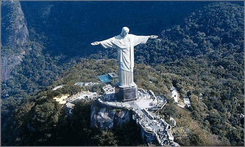

# 亲爱的阿廖沙

** **

在我万分敬仰又万分恐惧的陀思妥耶夫斯基的史诗性（epic）小说《卡拉马佐夫兄弟》里，阿廖沙在一个小酒馆里，对他的长兄发出了一个预言式（prophetic）的提问，你信什么？

可以说，这个问题不仅贯穿了整部小说，也贯穿了陀思妥耶夫斯基的所有的创作和整个人生。我对这位俄罗斯最伟大（prominent）的作家和哲人的敬仰和恐惧，也都来源于这个无法逃避的问题：你信什么？

这个问题是急迫而撕裂性的。信什么，上帝是否存在，对我来说，并不是仅仅是一个在聚会时可供娱乐的辩论主题和思想活动。就如陀氏力图表现的一样，它是一个关系到生活的每一个选择，灵魂分分秒秒的安宁的切身问题。我时常想象，若一个冬天的雪夜，在一个破旧的小酒馆，面前热气升腾的茶炊中，阿廖沙坐在我的对面，问我，你信什么？我该如何对亲爱的阿廖沙作出回答？

信仰的对立面不是不信，而是怀疑。我之所以恐惧陀思妥耶夫斯基，因为他的人生，投射（mirror）了我的信仰之路，一条在“绝对信的喜悦”（absolute joyfulness of faith）和“充满折磨的怀疑”（tormenting doubt）中的荆棘路途。在我人生的前二十年中，我活在一种人文的、文艺的想象、陶醉和虚无中。而在我21岁的那年，受洗成为基督徒的时候，我也没有想过，这会是一条如此漫长的、生存性（existential）的信仰之路。

很多时候，我发现谈论这个问题，只能使我陷入更大的失语中。对于我不信主的朋友来说，提出这个问题本身就是荒谬，而这个问题也有一种不值得一辩的简单性。而对我甚至没能对我任何一个基督徒的朋友表达过这样的怀疑和困惑：第一，这种困惑是致命和不敬虔的；第二，他们提供的不加思索的答案，只能让我再度沉默。

对这个终极问题的探索，让我不断地翻阅各个时代不同国度的神学家的著作，企图在他们那里寻求解答（我的基督徒朋友们会质疑这种阅读，说，回到圣经去！去祷告！所有的答案在圣经中！）。就像美国当代神学家和哲学家John D Caputo在What Would Jesus Deconstruct中所指出来的一样，在当代信众那里，信仰被简化到了一个荒谬和娱乐性的简单维度，他将此称之为“bumper sticker simplicity”。Caputo说，信仰并不是那种被当代的福音派基督徒们（evangelical Christians）穿在T-shirt上，贴在汽车玻璃上的口号。信仰是一种“不可能的可能”（impossible possibility），是最深的怀疑、最大的否定面前的肯定。而当代教会的一系列发展和运动，却慢慢演化出了一种黑白分明的、简单肯定的意识形态。在这种意识形态面前，我们只能看一种存在与保守派和自由派之间的近乎于搏斗的对立。对立的结果，是堕胎、同性恋和税收等社会、政府问题的政治化。当今的美国，难倒不正是这种政治化在撕裂和分离着大众吗？

而我面临的，是这种简单纬度带来的另外一种危险。就好像我的基督徒朋友会让我“回到圣经去！”一样，在我看来，信仰的衰落并不只和信众的减少有关（事实上，信仰跟教堂的多少、信众的多少可以说完全没有关系，难倒不正是耶稣表明，信仰正是于无信仰之处兴起的吗？）。新教运动否定了对教会和传统的偶像化，但却带来了另外一种危险：严肃的思辨、阅读不再受到鼓励，消费主义入侵了圣殿，信仰不再是苦难和虚无的斗争，而是心灵鸡汤和安慰剂。我不再惊异于好莱坞制造出Book of Mormon这样的音乐剧来调侃穿着无可挑剔、带着近乎讨好的虚假笑容的摩门教徒。因为，宗教人士遭到这样的调侃，很大程度正是因为这个时代的信仰不是别的，而是赚人眼泪的奥普拉脱口秀和Dr.Phil。

在这种政治化、消费化的信仰兴盛中，表面上看起来，上帝向亚当伸出的那只手，已经和亚当准确无误地握合了在一起。我们不再质疑和经历中间的距离，而这距离，这种张力，恰恰是上帝存在的确据。而这只握住了他们的手，真的是上帝吗？当一个当年我信仰的路上给我诸多启示和影响的牧师宣称不推开所有的个人事务来守安息日是罪，当我一个在美国南方教会长大的朋友跟我说，所有同性恋在审判日来临时都要下地狱，我却在心里默默想，如果这样的问题放在人子耶稣面前，他会怎么说？

在陀思妥耶夫斯基的另一部短篇小说中，耶稣的再次来临时，不是被不信他的人，而是被以他的名义存在的教会处以了死刑。这对于我们，难倒不是一种警示吗？今天支配着我们的意识形态，和两千年前耶稣要废除的律法，中间有多远的距离？

奥古斯丁说，能被理解的上帝并不是上帝。在这些福音教会中听到的无比肯定的Amen、谴责和论断前，我一次一次陷入沉默。Philip Yancey在Reaching For the Invisible God里面说，真正的信仰将永远和怀疑相随。那么，他们的，没有怀疑的信仰，又是什么呢？

亲爱的阿廖沙，这一系列问题，就是我给你的问题的回答。

 

（采编：董一儒；责编：应鹏华）

 
