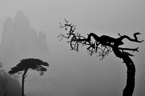

# 人生——在漂泊中栖居

给自己要写的东西取了这么一个感性的名字，可能是我自己都没想到的。一直以来，过于理性的学科式思维桎梏了我们的想象力，也抹杀了我们在生活中的敏感，即使是“文学”，也不例外。人何以为人，人生何以为人生，在任何情境下，都是见仁见智的话题，也可以说是斗智斗勇的问题。面对这个话题，我们可能会有百千争论，一较高下；也可能会旁征博引，用那些鸿儒大哲的智言睿语去炫耀我们自己的博学和睿智。但面对“人生”、“生死”这些终极命题时，我要如何去认识？至少是现在，我也没有什么清晰的头绪，抑或这是不可规划的。我们没有好好的体悟自己的生命，没有好好的经历自己的过往将来，便拿出那一堆堆看似有理的论述，在面对这个严肃的话题时，是不是过于草率了？

面对灵魂，理性是无力的。（感谢我还不曾相识的王也君）而我想说的是，面对生命，理性同样无力。

**关于生死**

我们可能真的会认为自己参透了生死，如同得道修成正果的人一样。面对生死，我们可以慨然而论，侃侃而谈，用年轻气盛压倒死亡的恐惧，把它封印在意识无法触及的角落。甚至，我们会以为灵魂真的被肉身囚禁，死亡会让人得到解脱。但面对肉身遭遇的种种危险、磨难时，我们表现出来莫大的惊恐，所以这种说辞也只是自欺欺人。面对那个必然的终点，没有人能够真的坦然。一场意外的疾病、天灾、人祸，甚至是远在天边的恐怖主义，都可以夺走那些看起来无论多么顽强的韶华。这不是什么宿命，而是一种必然—当我们被抛到这个世界上来的那一刻起，生命就只是一个可能；我们随时都可能会赴死，但我们不会有充足的准备。爱护自己的身心，不是自私，而是一种责任，是对死亡的坦率。

那么，死亡，是必然的终点吗？也不尽然，生命是一个将来完成时；但人生却永远都是一个未完成时。在生命的长河中，我们随波漂流，或逆流直上；偶尔可能需要一个栖身之地，这个地方就是长河中某个停泊的码头。它可以是一个家、可以是一个爱人或者只是此心安处。但既然是停泊，就不会驻留太久，我们会扬帆起航，驶往那个未知的终点，停靠前方那些未知的码头。人生何必执着，它本身就是向前。

**关于欲望**

欲望和激情，是人生的动力。清心寡欲，与世无争，只存在于落魄士人自我抚慰的诗篇之中，或者存在于圣贤聊以麻醉大众的哲言圣理之中，或者就隐藏在犬儒们借以逃避的怪诞言行之中。这个世界中，平凡的人多。大家也不需要那么高深的道理，其实很简单，活着，就是要争名利。圣贤们忙着著书立说，不也是在为后世立言，为自己留名嘛。食色，是人的本性；名利也是。我们想要过好的生活，需要物质；我们想要影响别人，需要能够慑服他人的威望；我们想要在身后留住这些，需要的是言说。

当然，爱欲在这里是少不了的。流俗的说，爱欲是关于情爱的欲望，是一个不可分割的精神实体。它可能没有那么多理性的成分在，包括同性之爱，异性之爱乃至更多。复杂编织的爱欲成网，网住了每个人，用它内涵的激情点燃了每个空洞的灵魂，为他们注入了灵性。

还有恐惧。对死的恐惧不是每个人都有的，它可能暗藏于意识中的某个角落，以至于我们有时候感觉不到它的存在。但是，对生的恐惧，则是每个人切身面对的，以至于人们会认为生比死更难。人生而能“群”，借助别人或者仅仅是“与别人”来强化安全感，可我们要面临种种现实的威胁：竞争失利、亲人离去、朋友反目。夹在中间，可能真的会有生不如死的感觉。这也许是恐惧在我们情感上的一种直观映射吧：渴望安全，害怕孤立。

这样说似乎会失之偏颇，但还有一种恐惧没有提及：恐惧某些信条、价值——担心它的荼毒；恐惧某些技术——担心它的钳制；甚至是对美的恐惧——担心它会涤荡谎言……这些似乎都是恐惧自身。

**匆匆过客**

没错，我们在这个世界只是个过客。生不带来，死不带去，能留下什么？我们不需要答案。每个人心中都有一把标尺。

我生于乡土，长于草根，身体中流淌的是平凡的血液。乡土是一个永恒的栖居，它生养了我，也生养了千千万万个和我一样的人。我依恋那片生养我的土地，它充满了母性和温暖。我们都向往新奇，渴望冒险，期待邂逅，于是那种凝固的生活可能不是我真的想要的。但是，拿到大学通知书那一刻，我心中却涌起一阵恐惧，因为我猛然发现：在这一刻起，就要和这个母体彻底割裂了，未来的生活可能漂泊无依，何处是归程？何处是吾乡？踏上一段注定要漂泊的旅程，前面迎接我们的是什么，我不知道。我只知道，在生命的长河中，我们只有停泊的驿站，没有终点。在任何一个系泊的港湾，我们只是过客。

在这个将来完成时的生命中，在这个只有未完成时的人生中，或许，我们只能在漂泊中栖居。

（荐稿：周拙恒；采编：黄梅林；责编：佛冉）
