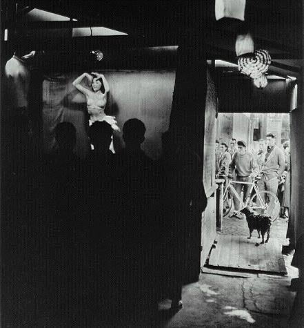

# 从《伤不起》看我们这个社会伤不起的买卖逻辑

** **

本文试图对新神曲《伤不起》作一个牵强附会的文本解读，本文定位为吐槽。

《伤不起》这首歌已经出了多时，我好多天前就在校内新鲜事里看到大家分享兼嘲弄这首歌的MV。而恰好就在当天的晚些时候，我走进复旦校园里的一个打印店。一进门就听到：“伤不起真的伤不起，要想你想你想你想到昏天黑地……”我稍有些惊讶后立马就淡定了，在这个外来打工者经营的家庭作坊式的打印店里听到这个歌很正常，要是一进来听到放李志的《你离开了南京，从此没有人和我说话》才让人惊讶。看看四周来打印的复旦学生，听到放这首歌一个个都鸟屎掉到头上的表情。打印店里操着安徽口音的小伙计，则在忙里偷闲地就着音乐大声谈笑。回头这小伙计肯定还得在qq上跟自己的朋友说，我听到一首歌叫《伤不起》推荐给你，很有感觉啊，仿佛成了他自己的发现。等我要走了，听到播放器换到下一首，小jb开始唱：“Baby baby baby oh baby baby bay oh……”呵呵，当然不会放的是The Doors的旷世名曲《The end》。

本来还想在此着墨谈谈文本和受众（文化社会学里叫阅听人）的关系，但我们先简单地理解就是不同阶层选择属于自己的歌，而不同的歌反映自己阶层的想法——布迪厄把这叫Distinction。 从《爱情买卖》到《伤不起》，我们可以很容易地看出这个阶层，大概可以叫社会中下层，在我们这个社会其实就是大众，对爱情的价值观的现状：爱情是一场买卖；而且这场买卖的形势不容乐观。我听《伤不起》的时候也有点皱眉头，因为《爱情买卖》语气还是比较婉转，《爱情买卖》认为爱情买卖是不好的，但到了《伤不起》就把感情表达得更露骨更没有艺术性，语言也更粗糙。《爱情买卖》似乎还想宣讲一个道理，而《伤不起》唱的就是一个卖身未果的故事。

爱情是用来买卖的，谁说不是呢。我原来跟朋友聊天时候作为笑话谈论过，年轻女性开好车，有两种情况：如果是个美女，一般就是老公或者情人买的车；如果不是美女，一般就是老爸买的车。像郭美美开好车，虽然声称老爸买的车，但还可以归到第一类里，英语里的sugar daddy就对了。还有一个例子，为什么公交车上从来看不见美女？其实我坐公交车经常看见美女——在公交车里，经常透过窗户看见外面经过的好车的副驾驶上坐着个很惊艳的美女，腿还特细特白。美貌是一种资本，可以换钱，成为了有钱人，是不会做公交车的。美貌换钱，这个命题对女权主义者、道德主义者和穷挫矮丑来说都是个难以接受的事实，虽然社会中有不断的大量的事实来验证。也许社会学家还会对什么可以用来买卖有所争论，但对买卖是这个社会关系中的第一交换逻辑已经基本没有什么异议了。比如布迪厄就认为随着资产阶级和资本主义精神的诞生，一种经济场域的规则，依照在完全竞争市场下的经济人模式，对最大利润及最低成本的追求，就在特定的时空下就被建构出来。“在发达资本主义社会里，显然，很难坚持主张经济场域并不发挥特别强有力的决定作用。” 场域是布迪厄用来描述社会空间结构的概念，社会的逻辑就是场域的逻辑。当然这只是社会学家的保守之言。经济学家们已经兴冲冲地认为他们可以解释当今人的一切选择的行为。这种解释就是说，人没什么不能卖的，只要看出价高不高。朋友原来问我：给你一百万让你卖菊花你卖不卖？我说：当然不卖。他说：嗯，给你一亿让你卖菊。我赶快说：我卖我卖我卖我卖……

所以你看，虽然《爱情买卖》刚唱完“爱情不是你想买，想买就能买（卖）”，《伤不起》里的那位开始唱的时候就已经卖了。而且卖的价格我们都能知道。请大家再来看下《伤不起》的那个MV里——不是看主唱业余而且可笑的舞姿和没整过的牙——看到那个作伤不起哀怨状的女生手里拿的ipad了么，这大概是定金。后来出来了一个带着墨镜的金链男，说：“不必再考虑不必再犹豫，我要送你一辆跑车，夜晚你和我咬耳朵，不要怀疑我的爱很多……别再考虑别再犹豫……”那么这就是全款了。语言虽直白露骨，但语义清楚集中，所以这作者也算口水歌界的乔布斯了。当然这里值得一提的是，虽然《伤不起》是给人民大众听的，并不代表别的阶层的歌反映的不是这些内容。其实内容都是一样的，形式有所不同，小资们要更文艺腔也更虚伪一些而已。而上层，他们不听歌的，都在忙着数钱呢。

买卖有什么不好，毕竟现在很多人已经只能据此理解人际关系了。礼物交换一直是人类学中的一个重要议题，人类学家据此理解社会结构。从莫斯到涂尔干，法国社会学的这一脉一直把礼物交换当做一种社会团结的方式。你送我一点东西，我回赠你一点东西，赠与回赠都是道德要求，这样我们就被联结在一起，社会也被团结在一起。我们现在已经不是前现代的礼物交换了，而是本着经济原则的买卖交换。那么我们为什么不能也把买卖交换想得好一点呢？你买我一点东西，我卖你一点东西，即使买卖不成还能情意在不是。爱情的买卖要谈好，婚姻才能顺利，人类才能繁衍；资本家向工人买劳动，所以才能组织生产，才能生产产品，经济才能发展。的确这也是一种很不错的视角啊。所以我们看到现代的人，对买卖交换的这种关系，是有所批判滴，但归根结底还是为其辩护滴。大家质疑的是买卖的不公平性，而不是买卖这种方式的本身。这就像去酒店开房，你的女友会抱怨下床单怎么不干净，可是换了干净的床单，你们就满意了然后该干啥干啥了，不会去追问为什么会床单不干净，是服务员偷懒还是酒店管理机制有问题（启示自还没读完但图书馆超期了的《流动的现代性》）。可是买卖真的有那么好的话，为什么在买卖结束后，还会有人说：伤不起真的伤不起！

很显然，这买卖中，有，至少有一方是很不爽的。首先我们可以确定的就是，这场买卖，是，至少看似是公平的。这个手拿ipad的美女，利益是没受损的，手上的ipad不就是么。但她觉得伤不起是因为，她还想继续买卖，“我想你想你想到昏天黑地”但“电话打给你，美女又在你怀里”，买家不理她了。这场买卖，虽然是等价交换，但其实是由权力促成的。为什么美貌换钱？因为男权。当然美貌换钱里除了有一个性别的维度，还有就是阶级的维度。至少在《伤不起》里，我们可以很清楚的看出是一只金丝雀和鹰隼的交易。为什么工人要用劳动力换工资？资本的权力。所以，买卖无时不刻都在进行，但我们总是不得不在做买卖。我们不得不买房！我们不得不买动车票！我们也不得不买大学教育！原来英国人，把中国作为殖民地，就是为了原料和市场。那种买卖关系，我们很不喜欢。但现在，养鸡场把一批批肉鸡养大，也是为了跟我们做买卖。被迫卷入买卖关系，就是我们的价值啊（请参照本人的[中国养鸡场论](/?p=5244)）。

正如马克思批判斯密之流国民经济学家的初衷，这些古典经济学家庸俗经济学家们，虽然从经验中抽象出了一些规定，但遮蔽了更多。比如斯密把商品价格看成是利润、地租、工资的加总。这样一来，价值源泉便与各自独立要素分别联系起来，商品价格脱离价值基础，劳动价值论由此事实上转化为要素价值论。价值的源泉和剥削的关系就被遮蔽起来了。“斯密教条”体现不了资本主义的本质。资本主义的本质就是人和人的剥削关系，人的异化。所以马克思的真正意义，不是创造了一个共产主义的蓝图供我们意淫，而是贡献了一种批判性和反思性的视角和方法和范式革命的意义。（据我所知，马克思一直在谈的也是共产主义不是什么。而我们却以共产主义的乌托邦性来指责他。这种指责，是最低级的批评。）

这个买卖的社会，教我们变得投机。我们现在只是想换个干净的床单就好。我们只是想在买卖中赚点便宜该多好！可是爱情失败了，你知道不能买了！买卖失败了，你知道伤不起了！在这里我并未想鼓动大家去挣脱买卖，就像马克思想做个好事鼓动大家去革命结果惹得一身骚。买卖谁也挣脱不了。但是在参与买卖时，我们可以想想，这个买卖真的那么重要吗？呵呵，这有点像不要计较得失的心灵鸡汤。只是，我们可以变得更敏感一点。在抽象的规定与道理下，我们真的可以触及到什么具体。马克思在他未完成的鸿篇巨制《政治经济学批判》（资本论只是其一小部分）的序言中写到：“我的见解，不管人们对它怎样评论，不管它多么不合乎统治阶级的自私的偏见，却是多年诚实探讨的结果。但是在科学的入口处，正像在地狱的入口处一样，必须提出这样的要求：‘这里必须根绝一切犹豫；这里任何怯懦都无济于事’。”

如果你做好准备，站在这个社会面前，人和事会像澎湃的海浪打过来，碎成无数可感的冰冷的又咸涩的水滴，当你被淋到时，还会自己骗自己吗！

 

（采编：佛冉 责编：黄理罡）

 
