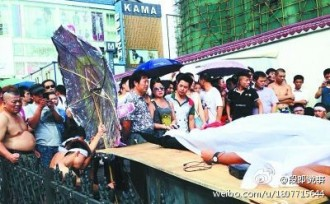
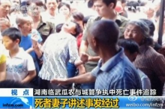

# 从城管说开去

当下城管执法失当所激化的矛盾反响越来越激烈。通过社交网络随处可以看到城管打人甚至打死人的新闻。有人因此呼吁取缔城管；也有人担忧缺少城管，小贩因为占道经营产生的拥挤和喧闹等外部性怎么处理。政府的考量也有可能出自用城管替补目前法律上的空缺，占道摆摊这种问题都不至于警察和法院受理，群众也投诉无门。 

在权衡这些矛盾之前，我们还是要先厘清现实中一些情况，以及在这些情况下究竟有没有必要保留城管。 

首先从法律层面上来说，城管在目前我国宪法和行政法上根本没有对其地位加以确认，是一个很灰色的执法组织，。也由此因为身份的模糊，权责没有明确的规定，打人的时候是执法，打死人的时候是临时工，这是我国法律在社会事务上普遍缺位的大环境下催生的一大特色。 

有人说小贩占道经营，有碍市容还堵塞道路，难道不需要城管的存在吗？ 

“有碍市容”理论，估计也是中国特色。我去过的几个国外的大城市，公共场合推个小车卖汉堡冰淇淋的，敲锣打鼓卖艺驻足围观的情况很多。但是从没觉得这些城市哪儿市容不整。伦敦、巴黎和罗马皆是如此。要是根据“有碍市容”说的逻辑，我国何不向丑人征收“丑人税”？

占道也分情况。在我们学校园区的门口，每天早上都会聚集很多流动商贩买早餐。因为学校食堂供应早餐的类别有限，学生习惯在早点摊解决问题。这样的确会造成道路拥堵。但是反过来说，要是强行取缔这些摊煎饼果子的，食堂不免在早上就排起长队，甚至有的学生干脆不吃早餐。所以问题就转变为让学生在早起和排队的成本与门口拥堵的成本之间进行权衡。这意味着小贩的存在即既有制造拥堵的负外部性，也有提供了早餐多样性和可口的正外部性，在小贩数量使这两者在边际上达到相等时（学生在此时觉得小贩制造的拥堵和便利刚好相抵消）为最合理的状态。 

大家觉得尽管有小贩，但是道路的拥挤还能接受，而且小贩能提供早点还挺不错的。城管要是在这一状态下出现要驱逐小贩就不解风情。因而负责我们园区那带的城管选择七点半之后，人流车流的高峰时期派出一个便衣招呼小贩收摊。这样一来顾及了上面的检查，二来保证了学生的就餐，三来过路的车辆也还舒服。 一般人觉得小贩占道摆摊制造拥堵，这是一种小贩自己不用承担而行人要承担的负外部性，增加了社会成本。因而单纯鼓吹驱逐小贩，实是忽略了另一个角度能看到的问题。 

但如果很多小贩看到园区门口的生意很好做，纷纷赶过来制造更多的拥堵呢？这时城管的出现是不是就合理了？这是下面要讲的问题。 

所谓公路就是公共的道路。道路往往可以看成“公共品”，公共品具有拥挤性和非排他性两类特点，传统经济学认为，在这些条件下私人市场存在无法提供和无法定价的问题。因而只能由政府出面提供。

道路具有拥挤性但是不具非排他性。道路的拥挤性在行人数量增至每一个行人感觉到拥挤的那一刹那就出现了，但是拥挤时行人之间无法拒绝杜绝新的行人加入进来，这是道路恒具备的非排他性。 

如果道路上只有小贩和行人两种使用者，在拥挤的时候人们习惯性主张排斥小贩。因为行人拥挤时感受到拥挤（成本），这种成本小贩却不用支付。私人成本与公共成本相分离，小贩的出现就具有负外部性。相反小贩还利用公共空间获利，更使得行人心理不平衡。因而普通人会自然地认为：“道路是走道用的，不是摆摊用的！”。

一种解决办法就是动用城管大军，不由分说驱逐小贩，但是城管因为法律地位上的模糊，权责边界不明确，经常动用过激的执法方式造成了更大的社会成本，给法制建设带来很坏的影响。况且有的时候道路根本不拥挤，小贩没给人带来任何不便，财产权也遭到野蛮的侵害。 

另一种解决办法是化道路“公有”为“共有”。公有的道路名义上能走行人，当然也能摆摊。但是共有的道路名义上的所有权范围进一步明晰化，比如小区的道路，只有住在小区的人可以使用，这就建立起了排他性致使拥挤的情况不会发生。

如果园区门口两侧的人行道也划入园区物业公司的管辖范围，那么当小贩数量过多的时候作为消费者的学生（业主）可以向物业反映，物业有义务请求有专门执法权力的有关部门（警察）控制小贩的数量。反之学生有早餐需求，门口出现小贩是大家喜闻乐见的事情，也不必有城管横加干涉驱逐小贩。 

推而广之，在市政建设中，一块商业用地周边的公共区域都可以把一些浅显的管理权交付开发商或者终端的业主。业主向消费者征价让其有途径购买这片区域的“不拥堵”，价格厘定在边际成本和边际收益相等的位置就能成立。具体的例子就是有些高档的住宅区往往禁止养狗，这一措施也是通过间接交易的方式使得住户有途径购买“安静”。

把这个问题往理论高度提升的话，小贩占道本质上是一个“公地悲剧”的经济现象。当一块土地被宣布公有的时候，每个人出于自私的考量都会利用这片土地，当参与者达到一定数量的时候继续有人参与进来，土地就会因为拥挤导致边际成本（拥挤带来的不便）高于边际收益造成无效率。这个时候需要土地所有人的代理者（政府）应该把土地拍卖出去，或者收取准入费用筛选出最能利用土地发挥出其最高租值的个人或群体，把拍卖所得以公共开支的形式分摊到原先名义上所有人的身上。

如果政府规定野生动物是公有的，任何人不得杀害或买卖，还是目前来看还不能阻止偷猎，最终野生动物越来越少直到灭绝。如果允许公开买卖，等于承认野生动物有私人产权。自私告诉人们对待有产权的财产都不会竭泽而渔，有需求就要创造供给。 

类似的道路是公有的，争先利用的人太多会产生无效率。而目前政府想出来的办法是出动城管，送身份上识别那些他们认为不配使用道路的人（这层合理性就有很大问题），用暴力保证不拥堵。只会产生新的外部性。 

现在的人们普遍看到城管执法上的问题，也看到了没有城管的情况下可能产生的问题。这两者并非有此无彼。根本上的办法是降低厘定产权的交易费用，开放对公共地界的私人所有权，利用市场机制把空间交给能用它创造最大租值的人。 

（采编：张舸；责编：张舸）
