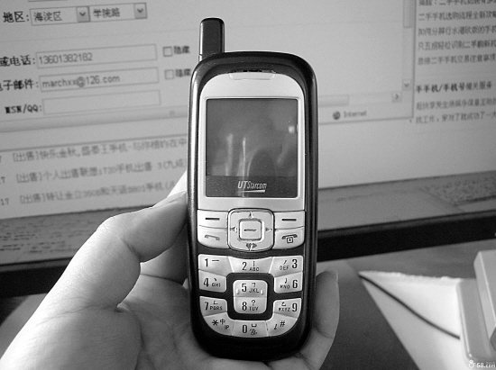

# 从小灵通清频退网说起---生于1950年代

**“同样是极受关注的张维迎却声名狼藉，在网络上，他被无数网民大骂成‘祸国殃民的主流经济学家’、 ‘走狗’。但令人啼笑皆非的是，那些貌似道德崇高的愤青们其实压根就没完整看过他的文章，仅仅凭着一篇断章取义的‘主流经济学家语录’就无限上纲上线。那些用着手机、小灵通的年轻人们或许不知道，正是张维迎的一篇关于电信改革的论文在理论上确定了中国电信改革的思路，其后电信公司从邮电局拆分出来、联通参与移动市场的竞争等等的思路都来源于此。要是没有这些改革，全中国的手机用户都不得接受远比现在高额的垄断收费。”** **“然而我却迷茫地发现，我该说的其实早已经被人们说完了，而说了也无能为力才是这个国家的悲哀。”** **“就在我敲下这些文字的时候，成千上万的热血青年正在‘抗议’铜首事件，我总觉得，要是他们也能以如此热情抗议某些部门肆无忌惮侵害他们自己权益的行为的话，那么对自己、国民或许更有价值，特别是当看到他们的权益需要4个生于1950年代的老者捍卫的时候，更可悲的是，其中的一个还被热血青年们视为敌人。”** ** **

# 从小灵通清频退网说起----生于1950年代

## 文/三戒法师 上海财经大学学生

一纸诉状，时玉琛把工业和信息化部告到了北京市第一中级人民法院。 在此之前，工信部做出的将在2011前对小灵通清频退网的决定已经在电视、报纸、网络等媒体上引起了轩然大波，无数时评作家、专业人士、网民纷纷撰文质疑工信部的决定，说的最多的还是工信部作为政府机构有没有权力决定一种产品的生死。不少时评专家认为，在市场经济里，适者生存，只有市场才能淘汰竞争失败者，消费者才是“上帝”。然而，在最开始的一段时间里，7000万小灵通用户仅仅是在网络上表示抗议，并没有人打算通过法律来捍卫自己的权利。 这是个庞大的沉默大多数，直到时玉琛站了出来，这个59岁的北京市民认为工信部在没有举行任何听证会的情况下仅仅用一个文件通知就终止了小灵通服务侵害了消费者的权益。他的起诉无疑得到了无数网民的支持。 但吊诡的是，作为小灵通服务的提供商，中国电信、网通却令人费解地沉默着。在这两家公司的收入中，小灵通占了不小的份额，在商言商地说，只有小灵通不赚钱了，他们才会舍弃这项业务，而不应该是由一个政府主管机构干预他们的经营。只是，这两家公司已经拿到了进入手机移动业务市场的许可，或许，他们更愿意集中资源抢占即将开始的3G市场份额，更何况，微利的小灵通业务被退市后，消费者们将被迫只能选择他们的手机业务，这样一来，它们的回报将更丰厚。 我不得不承认这是个并不坏的商业构想。工信部收回频段后，中国的移动业务市场将由几家寡头垄断，只提供手机业务，就算是不少收入低下只能使用小灵通的消费者也只能被迫使用手机，这将给寡头们拉来更多的市场份额。更何况，早在2000年，工信部前身信产部的官员就宣称将收回小灵通系统所使用的频段，该频段将预留给“3G”宽带移动网络，当时迫于地方政府的压力，信产部宣布不再执行这一计划，然而9年后的今天，该来的还是来了，躲得了初一躲不过十五。 做为小灵通技术的开发、技术提供商，UT斯达康公司此次也诡异地不愿过多的评论，或许是因为工信部是它的主管部门，在中国是没有企业敢于直接对抗实权主管部门的权威的，也或许它多年来多元化经营已经有了成效就算小灵通退市也不会令它失血而亡。而它的创始人之一，那个同样生于1950年代（1959年生）的满脸大胡子的吴鹰，2000年他领导UT斯达康度过了危机，而2007年6月在公司的“权力争斗”中他被洗牌出局，一年多后的今天，他再次见证UT斯达康命悬一线。我不知道他有何感想，毕竟他已经无能为力，小灵通业务作为中国信息产业化浪潮中“本应”不存在的东西，经由他们一手发展到今天已经算是个奇迹了，它的消亡是迟早的事情，而“扼杀”它的并不是消费者，它的退市也并不是因为竞争失败。 “小灵通之父”徐福新至今还记得这么一件事：1998年小灵通在余杭、广东肇庆推广时，由于实行单向收费且话费便宜，压得对手喘不过气来，它们就曾向原信产部“告状”，试图以“技术落后”的罪名封杀小灵通。在此之后的十年多时间里，小灵通一直背负着“技术落后”的“原罪”，并在很长一段时间内被禁止进入大城市市场，只能在农村、中小城市里战战兢兢地发展，然而，在市场经济中，一个产品的“好坏”与否并不取决于它的技术，而在于能不能满足消费者的需求，消费者会“用脚投票”，他们的购买选择才真正能决定产品的价值。徐福新，余杭市的邮电局局长，吴鹰，UT斯达康的老总，这两个人打乱了信产部前身邮电部的宏大计划，他们的“农村包围城市”的策略无疑像条鲶鱼一样闯入电信市场这个平静的池塘，成了原邮电部部长吴基传的“心腹大患”。 

 

关于小灵通的争议，我想关心新闻的人一直都还记得前些年新闻媒体的一些报道，比如中国电信“打枪的不要偷偷地进村”“未经批准悄悄在上海架设基站”、“小灵通被指技术落后遭信产部封杀”、“小灵通辐射低”等等报道，你只要在百度、谷歌里打下“小灵通”三个字将会出现数以万计的记录。倘若你有时间，你还可以找来《十亿消费者》这本书，里面第六章详细记录了中国电信业的改革进程，原本我打算依据这些资料分析撰写好这篇文章，然而我却迷茫地发现，我该说的其实早已经被人们说完了，而说了也无能为力才是这个国家的悲哀。 正如时玉琛，他的诉状很可能被法院驳回不予受理，就算受理，他也基本上胜诉无望。还有吴鹰，就算在十多年里他费尽心机几次三番力挽狂澜保住了小灵通的命，然而它终究还是个“私生子”，入不得政府主管部门的“法眼”，甚至在UT斯达康营业额迅猛增长的时候，主管部门随意一手通知就很可能让他的努力付之东流。股价急剧下跌，不是投资者不相信公司的盈利能力，而是担心——在中国这个公权力无法无边的国家，主管部门能决定一家企业的生死，一纸通知就能抹杀掉一家公司，哪怕它深受消费者的欢迎。 经济学家张维迎认为，在法治的市场经济中，企业家只需要承担市场风险，而在中国，企业家还需要承担朝令夕改的“政府风险”，权力不受约束的政府部门出于自身利益或者“大局观”以“国家利益”的名义就能随意干预市场，中国的法律也并不建立在正义的基石上由经国民授权的立法部门立法公正的执法部门执行，而是在很长时期由像邮电部这样的行政部门“立法”并由它们执行，这样的“政府风险”无疑损害了企业的利益也侵害了消费者的权益。然而具有讽刺意味的是，中国国民对此相当沉默，而张维迎在网络上经常被大骂。 提到中国电信业的改革，就不能不提到张维迎。诡异的是，他也生于1959年，相比徐福新被尊称“小灵通之父”，吴鹰受商界的尊敬，同样是极受关注的张维迎却声名狼藉，在网络上，他被无数网民大骂成“祸国殃民的主流经济学家”、“走狗”。但令人啼笑皆非的是，那些貌似道德崇高的愤青们其实压根就没完整看过他的文章，仅仅凭着一篇断章取义的“主流经济学家语录”就无限上纲上线。那些用着手机、小灵通的年轻人们或许不知道，正是张维迎的一篇关于电信改革的论文在理论上确定了中国电信改革的思路，其后电信公司从邮电局拆分出来、联通参与移动市场的竞争等等的思路都来源于此。要是没有这些改革，全中国的手机用户都不得接受远比现在高额的垄断收费。 中国电信业的改革进程可谓步履蹒跚。我记忆中的1990年代，那时候装一部座机需要两千多块钱，还必须到邮电局排号。1997年福州市有两兄弟独自开办了IP电话业务竟被逮捕判以有期徒刑。移动收费长期都是双向收费即使消费者极为不满。等等等。 我不知道倘若没有这四个五十多岁的前辈（徐福新六十多岁了），这个国家的消费者会不会依旧逆来顺受边满腹牢骚边不得不接受高昂的垄断收费。我也不知道时玉琛老人的一个人的战斗会有什么结局。我想起阿夫纳.格雷夫说过“政府颁布规则是否有效率，取决于官僚体制中的官员是否有激励实施这些规则”，也就是说只有了解他们的动机，才能理解政府的影响，无疑，在中国这个官僚控制的“国有”资本独大并由政府部门为之保驾护航的国家里，政策对谁有利不言而喻。 制度是个很广泛的概念，倘若我们从小点说就是“通过政治过程人为设计出来的规则或有效率的合同”，那么它提供的是一种“确定性”，它使各方参与者能运用“理性”揣测对方的行动意向，在“确定性”的约束条件下采取行动。但是在公权力不受约束的国度里，政府部门常常朝令夕改，政令混乱不堪，人们根本不能确定明天它又会出台什么决定，人们唯一能“理性确定”的是——我们无法确定它下一步要干什么。正如小灵通，十多年来，人们根本不知道它何时被勒令退市，只知道它随时被“扼杀”。 但是，我还是有些乐观的。格雷夫指出“只有制度改变了支撑现有规则或利益的知识，制度变迁才会发生”，从广义上说，市场本身也是一种制度，中国的市场化进程走到今天，它已经不可能完全由政府部门一家说了算，还必须听听消费者们怎么说，时玉琛老人的起诉、网民们的抗议、小灵通的继续热销无疑就是一种“对抗”，它将继续塑造这个国家的未来。 就在我敲下这些文字的时候，成千上万的热血青年正在“抗议”铜首事件，我总觉得，要是他们也能以如此热情抗议某些部门肆无忌惮侵害他们自己权益的行为的话，那么对自己、国民或许更有价值，特别是当看到他们的权益需要4个生于1950年代的老者捍卫的时候，更可悲的是，其中的一个还被热血青年们视为敌人。
