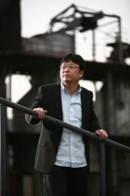

# 从段子到锤子——我眼中的老罗

这篇文章的中心思想是向老罗表示感谢以及表达钦佩之情,并向Smartisan OS的问世表示祝贺以及对其美好前景的祝福。

老罗是一个传奇。如果说世界上真有“现实扭曲场”的存在，那么老罗算是我认识的为数不多的拥有这种能力的人。他能把他的价值观通过一种你难以察觉和难以抗拒的方式输出给听众。有人喜欢他欣赏他甚至崇拜他，有人讨厌他鄙视他甚至恶心他，但不管对他的态度如何，有一个事实是没有争议的，你没法无视他：即使你拉黑了他或者他拉黑了你，他的消息还是能时不时的出现在你的时间线上。誉满天下、谤满天下，老罗之谓也。

 **老罗与段子** 

与大多数同龄人一样，最初听说老罗是在网上热传的新东方课堂录音的MP3中。老罗出名于新东方，当时他任GRE填空的老师，但他闻名的原因却不是他的GRE应试指南，而是他在讲课中间穿插着的段子。虽然他之后一再强调他的教学水平在中国应名列前茅，但长期以来，他停留在人们心中的形象却是“讲相声的”。

老罗讲段子的格局，是和别处不同的。别人家的段子多是用来消磨时光，听过哈哈大笑，然后一笑而过，而老罗的段子是可以让你在笑过之后有所反思。听老罗的段子，是可以修正世界观的，或者通俗点说，是可以洗脑的。在老罗的段子里，引人发笑不是唯一的目的，通过笑声，让你放松戒备，乐于接受他传递出的价值观，就像糖衣炮弹一样。

我开始听老罗段子的录音是在2004年，大一大二时。那个时候的我刚接触网络，第一次开眼看外面的世界，但当时自己的精神世界匮乏，理论准备不足，使我对所看到所听到的世界充满着困惑。通过老罗的段子，在笑声中，我了解或修正了很多看法，户籍制度、抵制日货、民族关系、大饥荒等等。现在看来，这些观点不一定全对，但对那个时候的我而言，足以醍醐灌顶。

启蒙是痛苦的，因为启蒙意味着对自己之前信仰的否定。所以除非有外界更大的刺激，通常人们更愿意固守自己一直以来的价值观。老罗段子的意义在于，用一种喜闻乐见的方式告诉我，你所坚信的不一定就是唯一正确的，你应该尝试着去理解你不认同的观点。这样的劝告，不是通过苦大仇深的说教，不是通过义愤填膺的号召，而是通过嬉笑怒骂的段子，却意外的具有了更大的说服力。老罗的段子，对于浸淫在应试教育里多年的同学而言，是启蒙很好的前戏。

 **老罗与我** 

2009年我在宁夏支教。年底我突然计划出国读书，决定下得很仓促，当时什么准备都没有，想着GRE考试总是需要的，所以想着着趁着寒假报一个辅导班。在新东方的报名页面上，正准备按下“确定”按钮时，电光石火间，我突然想起几个月前曾看过的老罗“我的奋斗”全国高校巡回演讲视频，当时还和同学打趣过他创办的英语培训学校的名称：“老罗和他的朋友们教育科技有限公司”。于是改了主意。当时没有想到的是，这样一个在最后一刻改变的决定，竟一定程度的改变了我之后的人生轨迹。

我在支教的时候偶然发现山区的学生们使用的竟然是盗版字典，而且因为印刷模糊，纸张粗糙，字典里竟然会有错别字。我一直想着做些什么来改变现状，在老罗英语培训学GRE的时候，突发奇想，这事找老罗不就得了。我不擅长当面表达，于是把事情的来龙去脉写成了一封求助信。我还清楚地记得，在北京上课期间，我住在雍和宫旁的青旅。那天晚上，我在青旅的客厅，在A4大的稿纸上手写这封求助信，并在第二天下课时交给了老罗。

第三天，我正在上课，他打来电话，说看完了信，很有感触，见面再聊聊。再见面聊的时候，他说这事他愿意帮忙。我最初的计划是给自己带的两个班的学生每人买一本《新华字典》，总共要两千多元，让老罗直接捐了就行。但老罗表示，那其他班的学生呢，不如你做大一点，他在牛博网上帮我宣传，这样能让更多的学生受益。

2010年3月，“一本正经计划”启动，第三天，老罗介入，在牛博网首页推荐并背书。当时牛博网已在墙外，但影响力依旧，只用了一天，原计划募集4万余元的目标就已达成。事后我对参与者进行了问卷调查，几乎九成以上的人是因为老罗的宣传才得知此事的。没有老罗的帮忙，这事是不会做的这么干净利落的。也是从这个计划开始，我对公益、媒体、围观、互联网的力量有了新的认识。

之后和老罗的交集就少了，基本上都是从微博上看到他的消息。逢年过节的时候会给他发个短信。2011年的春节，我给他发了一条祝贺新春快乐的短信，半小时后，收到一条回复，打开一看：“恒爷，你也新年快乐。”当时我正在边骑车边看手机，看到这句，差点没从车上摔下来。想到的第一个词是“魏晋风骨”。2011年底，老罗给我发来一条短信，问我有没有空，去听他在保利剧场的演讲：《一个理想主义者的创业故事II》，他给报销路费和住宿费。因为他许诺门票收入要捐给梁晓燕老师的西部阳光基金，所以门票我买了，但从上海往返北京的路费和住宿费都是老罗给出的，感动良久。

 **老罗与新东方****** 

老罗和新东方的恩怨历史悠久，自立门户后又成为同行，按郭德纲的话，“同行间才是赤裸裸的仇恨”，但老罗对新东方的攻击一直都是有理有据的。比如新东方剽窃老罗英语培训的广告创意，比如新东方名师上课不务正业等等。而每次当老罗在微博上嘲讽这些的时候，总有一拨人会跳出来说，好歹新东方是你的老东家，没有新东方你就不会出名，你怎么能这么的忘恩负义呢。

这种指责基于一种很奇怪的假设：新东方是一个慈善机构，而老罗当年穷困潦倒，如果不是新东方的接济，老罗早已饿死街头。但如果静下心来思考，当会发现，公司与员工的利益关系并非是单向的。公司固然是给了员工一个平台，但公司的运营也是需要员工的付出的。严格意义上，公司养活了多少员工的说法不科学，正如不存在政府养活了多少人民，因为实情是人民养活了政府。而且如果指出的确实是老东家实际存在的问题，而非造谣捏造，那更不应该因此被指责。一家值得尊敬的公司会正视自己的缺点，会感激提出意见的人，而不是先用动机论，尔后占领自以为的道德高地给对方扣帽子。

 **老罗与西门子** 

老罗和西门子死磕事发偶然，看上去不是个大事，但老罗出乎意料的坚持了下来并做到了“小事化大”。事件的高潮是某一个周末的早上，老罗带着一干人马在西门子楼下用大锤砸冰箱，被国内外多家媒体报道。对此，表示欣赏的人不少，腾讯2012的“年度致敬”中，便以此事将他列为当年的十大反对者之一。但相当多的人表示不认同，比较典型的负面评价：一、这是自我炒作；二、这是柿子捡软的捏。

近些年，“炒作”、“做秀”成了一个大杀器，似乎这些词一旦被抛出，自己就占领了智商高地，对方就毫无招架之力。这是很荒谬的，因为任何宣传，都可视为炒作。不管是做公益还是做环保还是做生意，只要你希望你的理念、你做的事被更多的人听说，在这个信息爆炸的社会，通常就要借助炒作， 这没什么不好意思承认的。当年党以民主、进步的形象出现在民国的媒体上，其实也算是一种炒作了。因此，我们更应该关注他所说的是否是事实，他所宣扬的观点是否正确，至于他采用什么样的宣传手段，也就是何种炒作方式，并不重要，只要不触犯法律。老罗在为消费者维权，在合法的范围里，那么就算是炒作，那也值得佩服。

一些资深的异见人士对老罗的行为也嗤之以鼻，他们认为老罗之所以敢如此嚣张，是因为西门子是外企，有完善的行政架构，是个按规矩出牌的企业，因此老罗占尽了便宜，更何况老罗针对的问题其实根本不算什么，有本事应该找那些作恶更多的国企去斗争。他们说的都是事实，但这种看法值得商榷，因为他们误把老罗当成公权力机构：当行政权力要严格市场规范时，确实是应该从老虎开始打起，并且不能选择性执法，因为这是这些行政部门的天职，他们拿薪水就是做这个事情的。但老罗作为一个个体，他完全可以根据自己的喜好去做选择。同样的道理，你不能指责方舟子选择性打假，因为他并没有不选择性打假的义务。正是相关公权力拥有者的不作为，才有了这么一批“公民打假人”，他们做的已然比这个社会的多数人多了，何必再苛刻。

斗争是需要技巧的，老罗的胆大心细在砸冰箱事件上体现的淋漓尽致。如何既影响群众，又不将此事演化为群体事件；如何以最小的代价获得最大的收获；如何将一次抗议做的滴水不漏，不落人以口实。老罗交了一份接近满分的答卷。这是值得每一个项目经理和有志成为反对者的年轻人学习的。

 **老罗与锤子手机** 

相比于“彪悍的人生不需要解释”，我更喜欢老罗的另外一句话：“不被嘲笑的梦想是不值得去实现的”。近十年来，老罗一直走在追求梦想的路上，一步一个脚印。从一个高中未毕业的学生成为新东方的任课教师；再从高薪的新东方辞职，创办了网络各路“公知”集聚的牛博网；之后创办了英语培训学校；之后创办了手机公司。期间，做过为汶川赈灾的公益活动；出过书；在全国高校巡回演讲过；拍过电影；成为了意见领袖；生活过得丰富多彩，而这一切都几乎是从白手起家开始做起的。老罗能够如此跨界发展，除了林志颖的故事外，还能有比这更励志的故事么？

即使我对老罗十分佩服，但当一年前他放出风声说要做手机时还是忍不住笑了。这跨界的步子未免跨得太大，容易伤筋动骨。老罗一直自诩为一个诗人，诗人可以教英语，可以拍电影，可以出书，这都没问题，但诗人怎么做得了手机呢？但我很快开始反思自己的第一反应，老罗曾说过的一句我很认同的话，大意是嘲笑别人的梦想是自己衰老的标志。对啊，从什么时候开始，我们的脑海中有了一个个无形的框框？我们会下意识的预先判断什么事情会成功，什么事情会失败，如果会失败，那就别去尝试。而且，我们不止用这个框框套住自己，如果别人不按这个框框行事，我们还会因此老羞成怒。在嘲笑老罗的人中，不少比老罗年纪还要小，是什么让他们年纪轻轻的就不再相信梦想了呢？

在宣布做手机之后，老罗颇被人非议的是他无情的嘲讽同行的行为，以及高调的自我夸耀。老罗公开吐槽同行似乎在中国不受欢迎，但诡异的是，大家对背后插刀的行为却睁一只眼闭一只眼。在历次互联网企业之间的战斗中，企业老总通常都显得文质彬彬，而暗流涌动下却是水军、抹黑、诬陷、悲情不断。而在不少消费者看来，似乎只要台面上好看，底下有什么小动作都无所谓。快意恩仇的老罗可并不理会这些，合心意的怒赞，不合心意的痛骂，不亦快哉。

相当一部分人不满老罗是因为看不惯他的自我吹捧。自老罗宣布做手机以来，所有的宣传都是通过他的微博来完成的。那些看不惯他的人，纷纷在他的微博下留言咒骂。这一点实在是让我理解不能，因为你如果不喜欢，完全可以选择不关注。不仅没有取消关注，还能坚持骂一年，这是真爱么？另外还有一大批人显得很好为人师。主要表现是，针对老罗的高调，他们留言表示，什么都没有做出来，怎么就敢吹的那么好，这样下去这个企业是做不下去的。有趣的是，这样留言的人可能自己并未创业过。这是怎样的一种精神啊，就好比一个从未下水游泳过的人在岸上指挥在游泳池的运动员，你应该先伸腿再划水。

我同样难以理解的是有好多人表态，坐等看老罗笑话。我惊讶的是这些人的身份往往并不是老罗手机的竞争对手，而是普通的消费者。作为一个消费者，难道不应该是觉得市场上有越多的手机生产商越好么，因为只有充分的竞争，才能优胜劣汰，让消费者最后得到实惠。小米的产量一直跟不上，其售后受人诟病，这多少与他们家在国产手机界一支独大有关，没有有分量的竞争对手有关，如果多几个老罗一样的人来当竞争对手，小米一定能改进的更快，最后小米的用户不也能从中受益么。真心难以理解，这些坐等看老罗笑话的普通消费者，心理得是有多不健康啊。

总结一下，老罗敢自带干粮，涉足一个他自我感觉良好但大家并不看好他的领域，并能坚持下来，这本身就是值得钦佩的。对于心怀梦想的人，我们要佩服；对于心怀梦想而且朝梦想在前进的人，我们更应该佩服。至于梦想能不能实现，尽人事，安天命罢了。即使因故不能实现，又有什么好嘲笑的呢。只有一直躺在地上的人才不会摔到坑里。

(采编：周凌希；责编：孙梦予)
