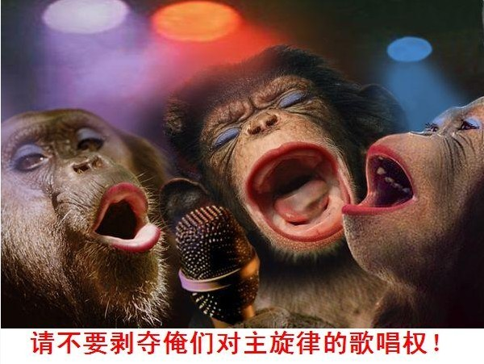
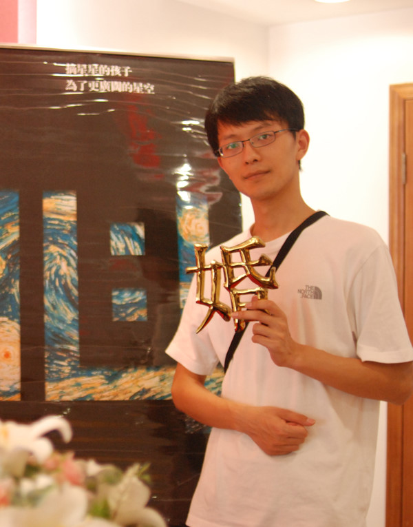

# 从民主的漏洞谈起

民主的第一个问题：不可能每个人都参与到决策之中，有些人机制性的不能参与到民主之中，因而民主仍然会侵犯不参与者的利益。

就比如老人去世前让四个儿子投票决定财产分配，恰好其中一个失踪了，那么剩下三个人会如何分配老人的财产呢？显然我要说的不是那些有投票权而自愿不去的人，这些人其实仍然参与了决策，只不过他们的选择是弃权而已。

但是有些人机制性的不可能参与，我能想到的前两个例子是移民和未成年人。忘了在哪个地方看到的19世纪美国的排华法案的背景，里面提到，当时为什么美国出台了排华法案而没有出台排英排爱排德法案呢？肤色问题显然有关，但是关系更大的是，西方移民到达美国以后都尽快寻求入籍，从而获得投票权，自然其利益受到政治家的重视，而中国人对于加入美国国籍或者获得投票权都不感兴趣，他们认为自己是来打工的，赚了钱就回家——入籍率低的结果自然是票数少，于是没人在乎中国人的利益。经济繁荣的时候，多你一碗饭没有问题，但是经济出了问题，那行政权力自然会拿你开刀。出于同样的逻辑，很多地区对于移民权益都是持有否定态度的，在民主国家这些问题可以体现为政策，而在不民主国家，这些问题往往只能体现为“民意”：相信这种排外性的民意并不少见，外地逼、硬盘、乡下逼以及早年的“民工”这种说法，都是很好的体现。

而未成年人的利益，似乎其实没有由于当事人的缺席而被侵占，或许这可以从人类的本能出发找到合理的解释。

我现在要强调的并不是上面的两个情况，因为上面两个情况对于民主来说，其实只是小问题。但是基于同样逻辑的第三个例子：未来人的利益，就不是小问题了。很多决策往往具有时间上的延续性，而偏偏其影响范围内的人又不一定能来到现在投票，那么结果就是他们的利益被牺牲——从理论上说，显然环境保护是这些例子之一，不过我现在要谈的是政府债务的问题。政府债务是什么？如果我们不考虑利息，那么累计的政府债务就等于往年的政府收入与政府支出的累计差额。换句话说，那些前人们的政府花掉了比他们挣的更多的钱——而这种透支，就是基于后人可能的收入上，而后人需要为此付出自己的收益（或许他们可以再拿走更靠后的人的收益，反正现在人就是这么做的，但是肯定有人要为此买单，永远不可能发生赚100块却可以花110块的事情），而他们显然又无法出来对现在人的行为表示反对。换句话说，未来人的缺席，必然导致他们的利益被侵犯——而这将会表现在民主决策的短视上，这种短视是机制性的“不在乎”。这种短视因而主要体现在民主政府的糟糕财务问题上，最终以政府/主权债务危机的形式体现出来。所以说，欧洲人在债务问题上的互相指责是没有意义的啦，欠那么多钱，谁欠的找谁去啊，除了你们自己的老祖宗，还能有谁帮你们欠钱啦？

上面是第一个问题，而第二个问题，其实更加严重。政策与政策的结果之间的因果关系并不显而易见，至少在非常多的经济政策上这一点非常明显——我要特别指出，我这么说并不是对于自己所学的经济学知识的不自信，而是：虽然我非常确信自己的所学，但是在对这些问题没有系统学习的人面前，我的说法和那些反对我的说法看起来除了结论不同是没啥不同的，真理不是那么不辩自明，谬论也不总是显而易见。这一点决定了——如果让没有系统学习过相关知识的民众去决策，他们很容易选择错误的政策。

曾经有人跟我提到“试错”机制有助于解决这个问题。所谓的“试错机制”（我不确定是不是trial-and-error），其实就跟小白鼠跑迷宫一个原理，小白鼠在迷宫里刚开始是随便跑，但是跑对了有奶酪，跑错了就被电击。只要这么训练，过一段时间以后，对于完全没有变化的一个迷宫，小白鼠能一次不被电就跑到终点。有人认为同样的机制适用于民主决策：民众的确可能没有学习过相关知识，但是如果他们表决出了错误的政策、选择出了错误的领导人，那么这种错误将会使其生活恶化，从而使选民受到惩罚；如果选择了正确的政策、正确的领导人，选民就会因此受到奖励，那么他们就会受到奖赏，久而久之，就会掌握什么是正确的，什么是错误的。

上面的机制在多数生物学习中都是成立的，但是在我们所描述的公共决策这个例子中，却很难成立。因为，显而易见，试错机制必须得在因果关系明显的情况下才成立。如果你让小白鼠跑错路的一天后对它进行电击，你仍然认为它能学会走迷宫么？而且现实中民主决策的因果关系比这个还复杂：如果说决策对应的结果在一个固定的时间后显现，这种复杂程度是人类可以掌握的，而如果决策对应的结果在一个不定的时间后显现呢？你总不能几年只给一个政策吧？那么你怎么知道不良结果A是政策X还是政策Y的结果？甚至还有可能是两个的共同结果。再比如，一个政策是否是好的，很大程度上要看其是否适应客观条件，同一个政策，可能今年用就是好的，而去年用就是坏的，客观环境始终在变化，我们很难通过试错说清到底哪些因素有影响，哪些没影响。事实上，探索政策和政策的结果之间的因果关系就是政治学和很多经济学分支终生的目标。但是你也看到了，即使在有这么多现实例子的情况下，这些领域的结论仍然有很大争议，你怎么能指望普通民众通过“试错”来学会？

（来段私货：其实“试错”也不是完全没有结果。我看过一个统计，在美国，年龄越大，投共和党票的比例越大。但是呢，人口又不是一成不变的。人们在变老，这个不假，可是小屁孩在不断出生。（我称这段是私货，因为我举这个例子是因为我是共和党的支持者。而且，如果你真的理解了这段前段的那段话，你应该发出这个质疑：为什么说“年龄越大投共和党票的比例越大”是“试错”机制的结果？这个因果关系很容易被质疑。）

我在私下聊天的时候，如果聊到这个程度而没有亮明身份，那些对我不太熟的朋友已经开始跟我讲：“你在课本上学到的、在新闻联播里看到的，很多都是被政府选择出来骗你的。”——仅仅是质疑民主，已经足够让很多刚入门的小草们把我当成五毛了。但是可能是我孤陋寡闻吧，看了五毛那么多质疑民主的文章，还真没看到像我这种从机制的角度出发的。五毛传统的质疑民主的思路不外乎以下几种：

  1. 网上有些支持民主的人素质比较令人遗憾，一些言论被人抓出来当成负面典型——但我觉得从这个角度去攻击民主制度只能说明攻击者本身逻辑有问题。我相信多数监狱里的罪犯每天都要喝水，这能推出每天喝水容易导致犯罪么？我觉得这是充分必要关系搞反了。支持民主的人不是一个经过选拔的有门槛的群体，没有人能把那些素质低的人排除在外，以个别人的言论去攻击民主是不充分的，甚至攻击支持民主的人的整体也是不充分的（如果你不能论证这种言论是支持民主的必然）。
  2. 举出部分国家民主化之后恶化的指标来说明民主是不好的。这一点，我觉得谢至理写的一篇关于美国入侵伊拉克的文章已经可以充分的对这种例子进行反击。我以前也专门论述过：世界上发生这么多事情，以至于对于任何一个观点，我们基本上都既能找出足够多的支持的事例，也能找到足够多的反对的事例——好比一块金属，一个人认为它是金，另一个人认为它是银，他们决定通过轮流举出一个具体原子直到一方无法举出这种方式来决定这金属是什么——即使是99.9%的黄金，这样的举例也足够持续一个人一生。这种毫无意义的辩论是幼稚的大学生才玩的，我就不奉陪了。

我充分意识到上面的话可以被反过来说，用来帮五毛群体辩护，虽然对于这样的结果我并不喜欢，但是鉴于我相信我的逻辑，我也同样承认，类比上面两个角度而对五毛群体的攻击也是不恰当的。

我前半篇关于民主的问题那些分析，虽然是我个人思考的结果，但是我觉得这是如此浅显以至于肯定有前人提到过了。似乎我前两天看某人分享的照片中有关于某本书的简介，从那三两行字中，我认为他可能要谈的问题就是这个，但我偏偏还记不得那个书的名字和作者。

你问我支不支持“专业政治家比普通民众更可能做出正确决策”，我可以回答一句无可奉告，但你们又不高兴，我有什么办法呢？我讲这话的意思啊，其实不是支持独裁。我想问看到这篇文章的各位，你们支不支持“对于多数商品，商家的了解都比你深入得多”？那么支持这个就等于你以后去商场买东西就到商场跟销售人员讲“把性价比最高的拿来”就买么？这么买东西的人啊，请你跟我联系。商家的建议肯定是要的，但是我们的选择权也非常重要。如果你放弃了你的选择权，那么你该如何保障商家给你拿来的是最合适的，而不是他能从中赚到更多钱的呢？请你参照这个类比去理解这样一个论点：民主的目的从来不是为了因为民主能选择出更明智的决策，而是因为民主之下，我们能更好的确立这个决策的出发点是好的，即，你有机会选择那个你认为对自己有利的选项。于是就有人质疑了，好的出发点和更好的决策能力比起来，到底哪个更重要？其实你自己心里就有答案。如果你比较相信“更好的决策能力”，你早就可以在购物上省很多时间了：到了商场，让人家把最好的商品给你打包，看都不用看一眼，这不省事儿么？但我相信没有这样的人。或许有人说：商人我不相信，但是我相信政府、相信中国共产党啊！——我一直为人们的这种思路感到深深地困惑，中国共产党始终在强调自己是可信的，而这种可信仅仅来自于“中国共产党本身”。我可能需要编造一段对话来让你理解这个观点：

“嫁给我吧！”

“为什么呢？”

“因为我爱你！”

“谢至理也爱我。”

“我有钱！”

“谢至理爱我且有钱。”

“我身高187。”

“谢至理爱我，有钱，也有187。”

“我同济的。”

“谢至理爱我，有钱，有187，是江苏畜牧兽医职业技术学院的。”

“我叫刘一舟，行了吧？”

“…”

上面虚构的对话中，刘一舟列举出了很多条应该嫁给他的理由，但是问题在于，除了最后一条，他都不是唯一的，那么如果无视最后一条理由，女神其实没有非刘一舟不嫁的理由。

而共产党正是如此：的确共产党宣传了很多自己可信的理由（我们暂且不吐槽这些理由，我相信对这些理由的吐槽本身足以写成一本书），但共产党在强调自己的唯一性，这不仅仅是当下的唯一性，更包括否认其他政党将来可能拥有共产党所拥有的这一切的可能性——就好像一个人来面试，他不仅仅自吹自擂，还把所有其他的面试者都赶走——他一方面用自己是最好的来证明自己赶走其他面试者的正当性，一方面又用没有其他面试者了来证明自己的确是最好的。这种循环论证的问题就不多说了。

很多人理解不了决策意图和决策能力的不同，所以当指责国家领导人的错误决策的时候，总被这句话噎住：“这是党中央的一盘大棋，国家领导人那么聪明，怎么会犯你都能看出来的错？你说他不行，你怎么不当国家领导人？”——说真的我不反对这一观点：国家领导人比我们更有能力做出更好的决策，但是我对他们的质疑，并不是建立在对其能力的质疑上的，而是意图。这个人不是我或者民众所选择的，我如何能知道他的意图真的和我的或者民众的意图是一致的？我如何判断他做的某些决策的确是出于国家利益而不是出于个人利益或者家族利益？需要再补充一句：我相信国家领导人比我们更有能力做出更好决策的理由，并不是出于对他们智力的信任，正如你相信商家比你更有能力判断他所卖的商品的好坏，不是因为觉得自己智力比不过，而是因为你知道他比你掌握更多的信息。即使你是哈佛博士，也难免在中关村买电脑被坑，就是这个道理。

（顺便补充一点：有很多小朋友一直对于当公务员很热衷，自然也会对公务员招录中的各种不法现象表示不满。但是请你想一想，到底某个位置对于公务员决策能力的要求能有多苛刻？说真的，对于绝大多数公务员的位置，绝大多数人的能力足以胜任，这点我求证过一些专业人士。但是问题在于，既然多数人都能胜任，能力根本就不是选拔的关键，就跟你找老婆之前不会先问是否有生育能力一样——多数女人都能生育以至于这个问题直接被跳掉了。对于很多岗位，公务员的关键不在于其智力水平，而在于其协调各方利益的能力，而这能力很大程度上来自于其是否能够代表某方利益。而直接来自某方的人显然最适合代表这方的利益了。所以，其实各地公务员选拔中，笔试高分屡屡被官富二代踢掉是再正常不过了。老子认为儿子最能代表自己的利益，干嘛要选你呢？就跟比尔·盖茨生了傻儿子，你也不会要求他把财产继承给你一样——你应该清楚地意识到“利益代表”这个位置的重要性。同样，正是因为前文所述，以多数人的能力，可以胜任多数公务员岗位，其实官富二代顶包也根本不会对其保质保量完成政务产生负面影响。所以奉劝各位朋友，考公务员不是不可以，但是如果你是没啥背景又指望公务员混出名堂的，还是三思吧。）

我们最后再回到民主的问题上，因为我想，其实很多人对于民主只不过保证决策意图就比独裁（或者不民主）好表示不信服。

其实我们不妨把上面总结的，民主的问题拉过来，看看对于这些问题，独裁（或者不民主）是如何解决的。

第一个问题：不可能每个人都参与到决策之中，well，这对于不民主来说真是更加成立，所以在不民主的情况下，执政者对于非执政者的权利侵犯是更加明显的。在独裁国家，似乎前任独裁者对后任独裁者的亲子关系可能还会促进其出于保护后代的利益而减少提出不可持续的政策给后者留包袱。但是在某些既非独裁也非专制的国家，连这个优势也没有了。在这种既非独裁也非专制的国家（可能是没有独裁者，也可能是因为只有名义上的独裁者，而由于种种原因，例如国家广大，这个独裁者实际上没有能力决定其国家内的很多事情），这点儿优势没了，而且这种国家还将面临另一种悲剧——公地悲剧（如果有一片公共草地，所有人都会过度放牧，因为如果你不多放而别人多放了，那么别人就赚了。而如果把这篇草地产权明确，所有人都会规划自己的放牧量防止草地退化）。没有独裁者，也没有民众组成的虚拟主权，却有庞大的政府权力和政府资产，这简直是当权者的盛宴。在这种情况之下，所有者缺位本身已经比前面民主国家面临的“未来人缺位”可怕多了，所以，虽然中国不是民主国家，但是中国的政府债务仍然庞大。我觉得袁剑有句话说的很好：中国的官员一方面借助政府的力量把巨额私有财产共有，一方面再借助市场把巨额公有资产私有——所以很多人所谓的国进民退，根本上是没有发生的，根本没有人在乎国家财富，因为独裁者无力在乎，那么怎么会有人推动国进呢？只是人们只不过一只眼睛看见了政府往里拿钱，又另一只眼睛看见政府从口袋里漏钱，却联想不到这其实是一个完整的产业链而已。

第二个问题：政策与其结果关系的不确定性——在这一点上，我相信独裁政权是有能力看的更清楚的，或者说：在其意图明确的情况下，独裁政权更有能力预测其行为的结果——如果他们真心想要为人们服务的话。

所以，丘吉尔说过：“除了那些一次次被尝试过的政府形式之外，民主是最坏的政府形式。”

**后注：**人人上发布的时候，有人总结说本文并未给出一个解决方案，只不过是给出了民主和独裁的各种问题而已。关于解决方案，我倒是有一个解决民主短视问题的初步想法，但是这个想法只能适用于巨额债务出现之前，而不能用于解决现有问题：如果立法免除政府对于前届政府的债务的继承责任，那么问题就解决啦~请不要想当然的将这个立法理解为欠债不还，因为我提到了：这个方案是适用于债务产生之前的。我认为这个立法的效果将会通过让债权人不愿意借钱给政府的方式来防止政府欠债到下届。

**原文链接：**[http://blog.renren.com/blog/248825802/896975751?bfrom=01020650100](http://blog.renren.com/blog/248825802/896975751?bfrom=01020650100)

（采编：陈肃；责编：彭程）
