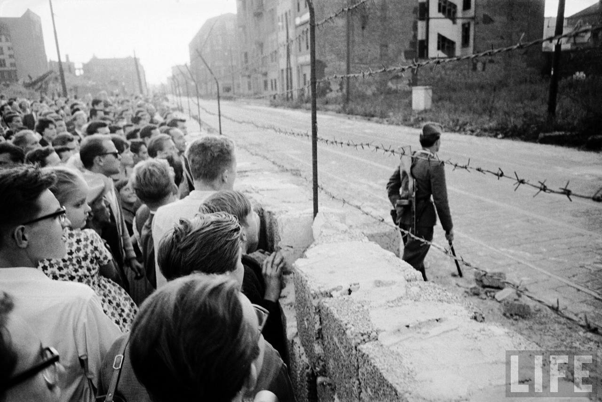
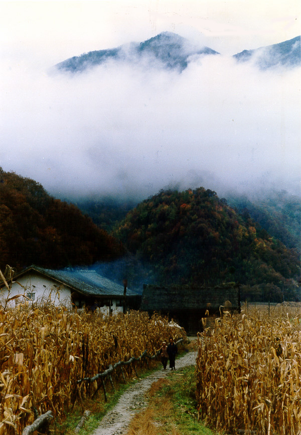

# 他人的生活

** ** 一 在南京回定西的火车上，看完了刘瑜的子弹和半本生死疲劳之后，我有些困了，懒洋洋地歪在座位上听身边的人们侃大山。 火车前往的终点站是西宁，身边乘客大多为西宁人。在对身边人的对话略听一二后，简单地判断出他们的身份：从南京前往西宁看楼盘的房地产大叔一只，家住西宁刚刚结婚买房的小夫妇一对，家境殷实靠父母关系进入军校的小哥一只。人员虽少，但身份极具代表性，话题极具争议性，作为一只喜欢以观人为乐的无业人员，我的兴趣还是得到了极大满足。 房地产大叔首先抛出了一个很有新闻价值的话题：西宁那边，拆迁好不好对付啊？ 小夫妇作坦然状：西宁人都很老实的，拆迁嘛，给补偿点钱就好了嘛。 富家小哥作无谓状：拆迁还不就是给政府和流氓给点钱嘛，很好搞定的。 房地产大叔谨慎低头，略作思索，抛出第二个很有新闻价值的话题：西宁那边，政府好不好打交道啊？ 小夫妇作精通状：政府你肯定得有人啊，先要有人打点才好办啊，如今直接塞钱也不行啊，当官的也都学精了啊， blablablabla…… 富家小哥继续作无谓状：打点政府还是靠钱，总归就是靠钱，你搞房地产好歹得留个一套两套的给人家吧，blablalblabla…… 房地产大叔默不作声，眼神捉摸不定的在几个西宁人的脸上飘来飘去。我定定的听着几个普通的西宁人给南京的房地产商献计献策，如何搞定政府，如何搞定拆迁，如何搞高房价，如何赚个盆满鉢满。 二 刘瑜在书里谈到了德国影片《他人的生活》(Das Leben der Anderen)——国内似乎也翻译成《窃听风暴》。她说她很困惑于一个问题，就是这个片如何描述坏人变好人的这一过程，到底是哪个步骤扭转了一个糟糕的灵魂，使其升华。看到最后，她的结论是，那个最终帮助了监视对象的国家秘密警察，根本从一开始的时候就是个好人。她蛮失望。 那么问题就变了，变的更加复杂，一个好人，是如何心甘情愿的为虎作伥的？一个好人，是如何允许自己作恶的？ 数据显示，在柏林墙倒塌前的数年间，为国家秘密警察服务的人总数约为50万。（[http://www.infzm.com/content/41425](http://www.infzm.com/content/41425)）这五十万人，为东德超过三分之一的人口建立了秘密档案，从待友会客，到上床睡觉。这五十万人，没有一个是青面獠牙三头六臂，没有一个从生来就心如蛇蝎，没有一个，是天生的坏人。他们可能是好的父亲，好的儿子，好的母亲，好的女儿。他们可能用尽了力量将灾难挡在自家的门外——以将灾难推向别人家的方式。他们或许一边开着幽默的玩笑，一边监听着电话那头值得怀疑的聚会，或许会前一分钟在路边扶起摔倒的老人，但丝毫不妨碍下一分钟封杀老人言行不当的儿子。在柏林墙倒塌之后，这五十万人中只有极少部分的人承受了罪罚，而绝大多数的人，像蒸汽一样消弭在欢呼雀跃的人群中，好像他们从未存在过，好像他们再也不会存在。 

 在面临责问时，他们最大的最强有力的抗辩理由，好像电影《朗读者》中的女纳粹汉娜所说：我还能怎么做？是他们让我这么做的。 我只是不得已mitmachen，他们这样想。 人们似乎倾向于相信，人性是不可信赖的，所以先行者立下了制度。但人们似乎很少质问，如果制度成为人性缺陷的护身符，那究竟谁还能为被倾轧的人们买单？ 刘瑜书中谈到，苏联倒塌后，曾狂热参与这威权政治一步步建立的人这样反省：我们被选择，是因为我们愿意被选择。而在我看来，他人的生活，这个影片的名字，最说明问题。无论是什么制度，无论是什么外力，只要一个人根深蒂固的相信，他人的生活，是可以因不得已的理由而被自己牺牲，而为自己牺牲，那国家秘密警察，就永远不会失业。 这似乎很好的回答了火车上的那一幕，为什么同样蒙受高房价之苦的人们，待自己有房之后，就可以坦然地为房地产商拆迁大计出谋划策，因为拆迁也罢，贿赂也罢，统统都是“他人的生活”。 然而，mitmachen这个词，除了不得已的mit，还有心甘情愿的machen。 他人的生活，斗转星移，便是你自己的生活。 三 回来就风尘仆仆地赶到老家，在滴水成冰的老屋里，看着爷爷裂开口的双手为我添煤加炭，吃着他为我从秋天留到冬天，活生生留成了葡萄干的葡萄。 七十多岁的爷爷。固执的孤身生活在这小村，乐得守护着他的一亩三分地，晨耕暮辍，春种秋收。种无污染的蔬菜，种好大只的玉米，种满园的花朵李子与草莓。最大的乐事，莫过于在冬日的大太阳里叉着腰，眯着眼，看着满院整整齐齐码好的玉米棒子，笑咪咪。一年的收成到了年末，给身边穷困的亲戚和乡邻们散发殆尽。身为乡村小学教师，领着有限的几个被拖欠的退休金，即使如此，一分钱都不留给自己，是他固不可彻的原则。 

 老实说，我没见过他这么可爱的老头。厨房永远是一尘不染，花园永远是郁郁葱葱。早上一定要顺时针方向绕着小院子跑个12圈，一圈不多，一圈不少；晚上一定要在炕上做完八段锦健身操，一段不多，一段不少。晚七点天打雷劈都要坐在电视机前看新闻联播，一秒不早，一秒不晚。很认真的皱着眉头让我给他看看手机，说手机时钟走的慢了好多，我问怎么个慢法， 极其严肃的告诉我：比新闻联播的报时慢了长达一分钟……我顿时凌乱了…… 在老家，只住了一晚。第二天要走的时候，爷爷从自己亲手搭好的塑料棚里挖给我家一箱子胡萝卜。 知道我爱喝豆浆，又兴冲冲地拿了大碗给我装黄豆。边舀边骄傲：看看爷爷的黄豆，多结实！给你家拿走这些，我要把剩下的都粜了。 我乐呵呵地打趣老头：卖了干嘛呀，攒钱买房子啊？ 爷爷憨憨地笑，说，卖了豆子我要买彩票。 我一愣，乐了：没看出来爷爷你还有点财迷样儿啊，彩票那不就是赌博么？ 爷爷继续憨憨的笑，说，买了彩票，万一中了，我就能给村头那边修个小桥。 我一下语塞。 随即默默地揽住爷爷的肩，心里是铺天盖地的骄傲。 爷爷说，那座桥，差不多十万吧。 我想，十万吗，我来努力奋斗吧。 我忽然想，眼前这可爱的老头，对他来说，什么是他人的生活？什么是自己的生活？ 或者，他从骨子里就明白，为他人，便是为自己。 四 我希望，很多很多年以后，当我像爷爷那么老的时候，我能像他一样，在一个星辰如钻石一般璀璨的小村，有一个开满花朵的小院子。 当我像爷爷那么老的时候，我能像他一样，有一颗温暖的心灵，和一个干净的灵魂。 

(采编:黄理罡 责编：黄理罡)
