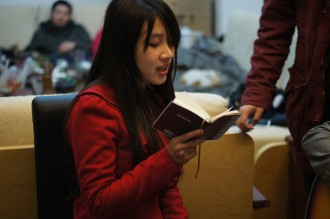
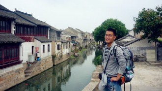
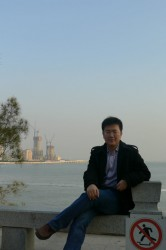

# 他们的春节——专访“带着思考回家过年”的年轻人

春节里，放鞭炮是小孩子的事，逛庙会是老年人的事。那些二十出头的年轻人，除了吐槽春晚、被亲戚“围攻”和智斗“熊孩子”，还能做些什么呢？---热闹是别人的，他们什么也没有。

或许也并非如此。不同的眼睛仍能从春节的烟火里看出不一样的味道来。想看看别人的春节是怎样的吗？看看他们在与家人的相处中有什么苦恼，在与老同学的见面中有什么感悟，在最寻常的一句话、一个动作里，又有怎样的心绪起伏。

“带着思考回家过年”---他们或许就是你们。

**_王卜玄 北斗七星说法编辑_**

_ 1998__年春晚，在黄宏和宋丹丹主演的小品《回家》里，小两口将置办年货看作是和回家过年同等重要的大事。__15__年之后，成长起来的__80__、__90__后似乎摒弃了“年货”这一概念，他们在过年回家之前或是有心、或是无意的准备一份礼物，作为自己长大成熟的一项宣言。但在父辈眼中，又份礼物又意味着什么？__ _

 **王卜玄：一份礼物******

我一向是个无敌自私贪心的人，喜欢收礼却甚少送礼。对别人尚且如此，对家人更加不上心。在外上学，一向都是父母主动打电话来，说寄了这样那样的东西给我，从来觉得天经地义，收着便是。

但我男朋友不是这样。他顺路去看爷爷奶奶，要带礼物；放假回家，也要带礼物；年年给他妈妈带礼物，都要发愁带什么东西才不重复了。我知道后，忽然觉得这个举动很贴心，打算效仿。于是离沪前特地去买了一大盒上海特产礼包，从春运的人流里千辛万苦地带回了家。

刚出车站，就见到父母急急迎上来接包。父亲接过礼盒，语气先是一沉：这是什么？！我解释说带回来的上海特产。父亲脸色刷地变了，斥责我不懂事，乱花钱。我一下子万般委屈，却噎在咽喉无从辩解。接下来的一整天，全家都是在闷闷的气氛中过去的。

终于某天，适逢父亲心情舒畅，说要回老家看爷爷奶奶。我建议可以带上那礼盒，都是孩子爱吃的东西，父亲这才解释生气原因。他说我尚未工作，原无甚进项，实在不必额外增加开支。我没再说什么，点头称是。

回想在上海的生活，虽然与周围其他人无异，更谈不上骄奢，在父亲眼里怕也是充斥着额外开支。与都市中的年轻人不同，这世界上还有一种生活方式叫做父辈的生活方式，以前一起生活时没能明显察觉。

 **_李胜博 休学一年穷游中国的年轻人_****_ _****_正在烦恼新书的名字该叫“走着瞧”还是“_****_SB_****_在路上”_****__**

_寒假期间，人人网上传着这样一个段子：__什么叫亲妈？只要你一顿没吃就觉得你会饿死，只要发现你在熬夜就觉得你会暴毙。只要你少穿衣服就觉得你会冷死。这，就是亲妈。_

_春节回家，母亲大人的母爱来袭，让不少已是成年人的孩子招架不住。_

 **李胜博：难以承受的母爱******

我也有一个爱我的妈妈。春节回家，我在书房看电影，把门都关了，和妈妈说了不要来打扰，她还是会不自觉地过来看看：拿着水果过来，拿着新买的衣服过来让我试穿……听说我毕业了不想回温州，她就要时不时地从各方面游说我。大致意思是要我留在温州。

我很难承受她的那种爱，她总是要把一切事情与我分享，要把我——她的骨肉——放在她伸手可及的地方，保护得好好的，占为己有。想起当初我高中需要住校，她会忍不住流泪；出门上大学，她会担忧；得知我要休学一年去旅行，更是伤心欲绝。

有时候，我会很疑惑，为什么其他人对我的些许关心会让我感动不已，但是父母的唠叨却总是让我难以消受。后来我发现，“关心”也和其他东西一样，它需要有个“度”。当超过了那个程度的时候，被关心的人就会不由自主地产生一种不被信任的感觉，一种自我生存能力的被质疑：仿佛我就是个没长大的孩子，要是没了她，便肯定活不下去的。

也许，每个热情洋溢、过分关心自己孩子的妈妈，也该如此地对自己的孩子：多放手一些，不把孩子死死地按在胸前，烫得他嚎啕大哭，让他安全地远离自己。

不要担心他会离你而去。在迷茫的黑暗中，他会看见你的光，他能感受到你的热。他会想念从你那儿获得能量和勇气，并以此去探索前方的未知。对于我而言，这才是最伟大的母爱。

_ _ **_李硕 **_毕业于中国人民大学国民经济管理系 现就职某股份制商业银行 喜好读书 思考 与写作_**_**

_在一些人眼中，春节期间的同学聚会是比家庭聚餐更令人期待的事情。对于刚刚步入社会的年轻人来说，装逼、炫富还太远，同学之间真诚犹在：谈工作、谈生活、谈感情、以及偶尔谈谈理想。然而，变化已在悄然发生。___

 **李硕：同学的变化******

春节回家，昔日的老同学总会聚在一起，聊聊工作和生活。我最深的感受就是大家在观念上存在着有所分化的趋向，而这种分化主要在于个人所处城市大小的不同。

就工作而言，身处一线城市的同学，大多数已经经历了不止一次的跳槽，并且正在考虑“逃离北上广”的计划，开始有回归二三线城市的想法。而在二三线城市工作的同学，虽然也不时跳槽，但是不管怎么跳槽，都还是在这个城市内。在县城工作的同学，基本没有考虑过跳槽的事。他们的工作变换仅限于“调动”。

从婚恋观上看，处于不同城市的同学也有不同的想法。一线城市的同学基本是先有经济基础再结婚。这个经济基础不一定是房子、车子，但起码要有一定的积蓄。而二三线城市的同学基本在婚前都能买房，一般都实行先买房后结婚的方式。县城的同学这方面观念不明显，有些甚至结婚了也还和父母一块住，基本保持了他们上一辈的生活方式。

越往基层，同学们思维的内容越不相同。在县城的同学考虑的多是行政、人际等内容，带有较多计划经济成分。而一线城市的同学视野相对比较开阔，市场意识、科技意识相对较强。

大家相互间的看法基本是围城心态，大城市的同学羡慕小城市的惬意和低成本，小城市的同学羡慕大城市的繁华、高收入及视野。

 **_马特_****_ _****_北斗文摘部责编_****__**

_从父辈身上，我们看到自己的未来；从祖辈身上，我们又看到父辈的以后。想到我们在长大，父母在变老，这已经有些心酸；要是还要想到我们在变老、父母还要为__ __我们变老之后如何生活__ __操心，都有些心痛了。这篇日志是不是也触到你的泪点了呢？___

 **马特：等我老了，长辈会怎样******

这次春节，家里给了我最后一笔属于我的钱，就是我小时候的压岁钱，父母一直替我存着。这样一来，家里就再也没有义务给我一分钱了，好在我自从来北京之后就不再依靠家里开销了。但这并不意味着我绝对不能花家里的钱，而是意味着我再也不能无“条件”地花家里的钱，这个“条件”就是我要回家乡。当然我短期内是肯定不会考虑这一点的。

在我妈娘家聚餐的时候，我外公哭了。舅舅的女儿在国外，外公担心舅舅以后老了，没人养。我就在想，我爸爸以后会不会也因为没人养我而难过呢？

这并不是自作多情，我大概想了一下，按照家族老人的平均寿命来看，我父母至少还能活三十多年，而那个时候我大概五六十岁。这就很可能出现一个情景，我父母将有一定的几率目睹自己的儿子单身到五六十岁，孤苦伶仃老无所依。

这个残酷的现实似乎也可以避免，就是大概四五年后，等到我差不多快三十岁的时候，估计会面临相亲，也就是纯粹为了结婚过日子两个人在一起配对，这也有一定的几率结束单身。

我对于所谓的终身大事都可以这么随便，而外婆对于自己的信仰却越加虔诚了。她每天按时做礼拜，从清真寺拿回来各种小册子阅读，学习简单的阿拉伯文，学习抄写古兰经（她识字，但不太会写）。这次回北京我准备在淘宝给她买伊斯兰风格的礼拜毯、挂画，再买一本精装的古兰经，让她高兴高兴。

大概就写到这里吧。

 编辑：万晓华 责编：郑萃颖 
