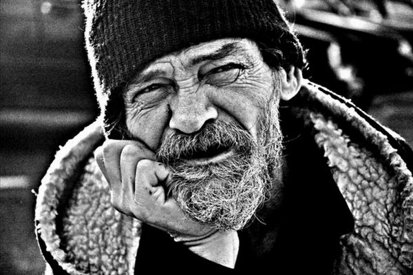
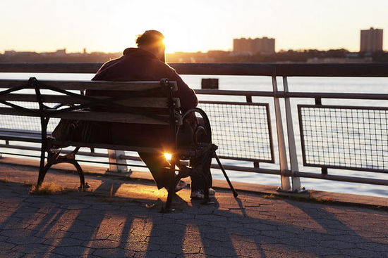
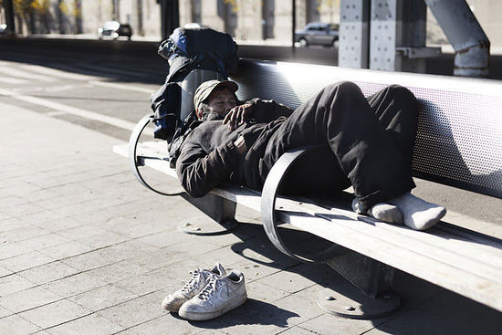

# 他熟知每一个滥情者

“老乞丐熟知这个城市里的每一个滥情者。”——前些日子，当我想到这句话的时候，我像每个得了夸奖的孩子一样，炫耀、自鸣得意。

其实，一旦接受了生活，获得这样的句子并不是一件难事。但是，生活总是易于陷入日复一日的单调乏味中——对于我们脆弱的个人主义来说，这是一个让人不安的事实：无论如何为自己的“自由”感到欣喜，我们最终还是会回到循环往复的静止中。

我选择接受自己的生活，它相对严格地重复着：起床，吸烟，喝茶，散步，晚餐，阅读，睡觉。在这个过程中，我蔑视自己的个性，虚构一切，蔑视一切。
 
3月29日，是个阴天。如同往常，饥饿而无聊的下午，我去乌云笼罩下的玄武湖公园散步。

从高大的玄武门进入公园，我沿着自己固定的路线向着菱洲走过去。湖面上没什么风，结着混沌的雾气——一切看起来铅色沉沉，站在桥上看的时候，更是这样。桥的右侧，一群老人正围着一个老先生。老先生手里操纵着风筝的线，凝视远方。我沿着空气里的细线找过去，并没有看到风筝，只有一片片乌云。我想象：老人是一名巫师，风筝线的另一端确实只是乌云——老人通过这巫术，为南京带来雨水（尽管对于这个季节的南京，雨水已经够多了）。

因为这个想象，我再次洋洋得意了，脸上也许已经禁不住露出笑意。而当我看到桥的左侧，那被众人忽略的左侧的时候，我的得意到此为止——一个双腿膝盖以下被截掉的流浪汉正从那里经过。他衣衫褴褛，蓬头垢面，双腿用黑色的橡胶皮包裹着，动用腰部的力量挪着步子，几乎是跪行着。而令人有些惊异的是：这样一个在人道主义滥情者眼中十分可怜的人，脸上自得的表情却是如此地不加掩饰。

绝对的好奇心让我看了他许久，当我转身走开的时候，我犯下一个“错误”：我自作主张地开始虚构起他的生活，试图围绕他展开一个故事。

他有什么样的动机？他的生活中有什么样的矛盾？一切会如何发展？如果不问自己这些问题，我大概会简单地说：

“这个叫花子还真有闲情逸致，工作日不好好去乞讨，还来公园散步。”

是的，他不仅在散步，脸上的表情还彰显出悠闲和快乐。他简直比国王更有权势，他从未真正地向任何人乞讨。

我自顾自地想着，走出很远。直到我的自大让我回过头去找他——沾沾自喜地去求证自己虚构的一切。
 
尽管事实上已经是一种冒犯，我依然用礼貌的语气去掩盖自己的高傲。是的，我为什么不能高傲？我应该高傲，我高傲到可以放下它去和一个乞丐交谈！高傲在我面前简直一钱不值！

“您好，我能陪您在公园里走一走，顺便聊点事情么？”

流浪汉抬起头，语气意外地礼貌而温和：“可我只是一个普通人。”

这句回答让我的求证从一开始便落空了。心底的好奇则再次被激起——难道不应该好奇么？一个假设中的乞丐怎么会说这样的话？难道他不应该对我的行为不解而傻笑么？难道这句“我只是一个普通人”不应该由我或者我生活中的任何一个人来说么？

虽然好奇被激起，对话却没有按照我的思维进行下去。流浪汉大叔的表达虽说带着浓重的河南口音，逻辑却超过我认识的很多学生。同时，他所展现的表达欲之强也远在我的预期之外——即便是面对我这样一个突然出现的陌生人，他也没有流露出常见的紧张和抵触：回答很长，往往超出我的问题。这种意料之外堆叠在我的心里，我甚至不知该如何发问，心里的好奇越来越多地聚集起来。

与此同时，我注意到，路人的表情显示出不解。这很容易理解，一个外表整洁的人似乎总是被期待远离流浪汉的。我并不介意，我介意的是我的脚步——我得时刻注意放慢它，防止激怒这个我毫无了解的男人。这种担心在随后显得很多余。

大叔在每个垃圾桶边都会停下，检查里面的垃圾。据此，我揣测着他日常的生活方式，组织着随后要问的问题。而这种思绪在公园地图前被长时间的打断，又是一阵频出的出乎意料。
 
地图前，我出于对流浪汉行动不便的考虑，自作多情地帮他指出了离开公园最近的路线。而大叔却没有理会（我认为这种不理会并非出于不屑）。流浪汉自顾自地看着地图，嘴里嘀咕着（这也许是他生活中的常态）。对此，我并没有太多惊讶，因为我了解长期独处的人：他们多少都会出现低声自语的情况。而后面的情况却着实超出的我想象——

他指着地图问我：“我们现在在哪个洲，到环洲了么？”

说着他又指了指地图边的介绍文字。

他的这个举动让我发觉了一个巨大的意外：这个看似叫花子的人是识字的，而且识字对他来说没有一点困难。于是，一连串的问题涌了出来——“他是谁”、“他是做什么的”、“他曾做过什么”、“他的腿是怎么被截肢的”、“关于他，我原先的假定到底错到什么程度了”。

在他研究那幅地图的时候，我仔细地端详他的模样：蓬乱的头发，油腻而纠缠；两鬓是连绵细碎的胡子，延续到嘴边，变得浓密杂乱；皮肤黑里透出健康而坚实的红色，沾满了污物……

“这里的每个小洲都是连起来的么？”

我的观察被这个问题打断，我的表情想必有些遮不住的惊异——难道他想把每个小洲都去一遍？以他的行动能力？要知道我每次也只是绕着西南湖走一圈而已！

“我每一个小洲都能走到么？要钱么？”

“能……我看看……不，这个洲要坐船才能去。”

“是么？这样……”
 
此时，我已经深深地觉得：我只是这个城市里又一个滥情者。
 
“大叔，不介意的话，我想知道你的腿是怎么回事？”

“车祸，是车祸。小时候调皮，就出了车祸。腿被撞断了，送到医院去救的。后来就只能跪着走了。再后来就去上学了……”

上学，难怪识字，我没有机会问他上了多久的学，大叔便继续自己的陈述。他需要表达，我便倾听。

“……一些其他的孩子帮助我，我就去上学了。上完了学就一直待在家里，后来又安装了现在的假腿……”

我并不能理解假腿的代指，就我所见，并不是指义肢。

“……八八年，九八年，零八年，就这样也快三十年了。”

“大叔您今年多大了？”

“我啊？五十四了。”

“那倒和我父亲年纪差不多。大叔，您的家人呢？”

“家人？就是我妈，她以前会给我弄吃的，很好。后来别人给我钱，我就根据钱多少来买票，到处走走。出来了，我有我的信仰，家人和别的什么就不管了。”

“信仰？”

“是的，我是基督徒。”

“您怎么接触到基督教的？”

“我妈带我去的，我学会了做礼拜，后来我就有了信仰。”

“大叔，您来南京多久了？”

“几天了。”

“就这么到处转悠么？”

“嗯，今天去了鸡鸣寺。”

“嗯，鸡鸣寺……还有呢？”

“还有北极阁。”

“那为什么还来了这里？”

“我从140路公交车上下来，就随便走。然后看到一个墙洞，我就进来了，门卫跟我说是玄武湖公园。”
 
谈话间，我继续打量他：他里面穿着一件开襟的T恤，外面是一件布外套，背后和两边的下摆缝着提包大小的口袋，想必是用来装东西的。下身的着装基本很难看清。

“大叔，您平时吃什么？”

“我从来不缺吃的。”

我从刚才他翻弄垃圾桶的举动猜测着他食物的来源，他满足的表情让我觉得这世上的各种选择并没有那么严格的好坏区别。

“那您平时睡哪里？”

“不下雨的话，哪里都可以睡。”

联想到南京这几天的好天气，我不禁觉得大叔是个走运的人。我继续问道：

“可是，这几天就要下雨了啊。”

“下雨的话就会麻烦一些。”

我在心里宽慰着担忧中的自己：这关我什么事呢。我的好奇心一点点地被满足，最初的滥情被这种习以为常的情绪取代，我有点想走了。不过在那之前，我还想看看还会不会有别的惊喜。

“大叔，您平时除了这么到处走，还干嘛？”

“我也没什么事，偶尔会写一些东西。”

我被惊得有些一时语塞，愕然地看着他。他仍旧费力而悠然地走着。

“孩子，环洲到了么？”

这声“孩子”让我想起了吉普林的《吉姆与喇嘛》。

“再往前走就是环洲了，我要左拐回去了。”我不自觉地开始为自己的逃离做铺垫，然后问出了我最大疑惑，“您都写些什么？”

“一些关于信仰的东西。”

“那您写的东西在哪儿？”我的目光在他脏兮兮的口袋里扫着，仿佛要找出什么宝贝一样。我心里打着鼓：会是什么样的东西？所见所闻？所思所想？我如果看不懂他的字迹怎么办？

而大叔似乎没有明白我问的内容，他回答道：“我只是想到什么就写什么。”

我没有继续问，在湖面雾霭的背景下，我看着大叔有些发怔：我不知道这样一个流浪汉会在哪一天突然死去，而他写的那些东西只会和他一起被埋掉，绝无可能被看到——这是多么隐秘的故事，多么隐秘的生活。
 
我想我再也问不出什么了。我跟他道别。最后，他对我说：

“孩子，我的生活太单调了。”

我苦笑了下，不知道如何化解我心里的尴尬。

“大叔，我先走了。再见。”

大叔看着我露出憨厚的笑容，操着浓重河南口音说：“中。”

我背过身离开，我能感觉到我的脚步要比平时快上一些——也许是潜意识里想要逃离什么。直到走出了很远，我都没有放慢——我不想让大叔看到，他会觉得我之前加快的脚步只是为了逃离他吗？不会的，我想多了，可我控制不了这些，我被操纵着——就像每一天，就像我的滥情，被操纵着，被我所接受的生活，以及一切。

（采编：王佚菲   责编：曹楚）