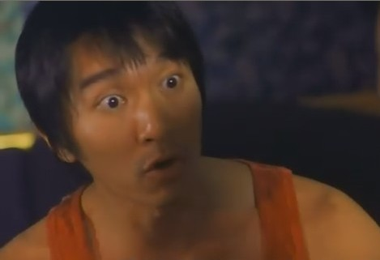
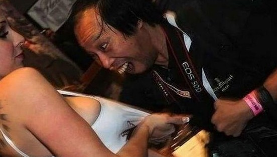

# 伪屌丝现象及其背后归因刍议

** **

之前有人提出了伪屌丝的概念，我希望在此借用这个词汇，但描述的对象可能会有所偏差。这一类人群，他们大多身高178往上，身材匀称，五官端正，有不少还蛮帅。他们喜爱运动，待人友善，风趣幽默，没有太多不良嗜好，对打游戏也不甚热衷，但有时候会喝酒。这样的男性理应受到女性的欢迎，但事实却并非如此。我认识不少这类的男生，他们中虽然不乏高帅者，但仍以屌丝自居，你说他谦虚，他的确能列举出很多自己的悲惨事迹让你同情，无论是暗恋无果亦或是苦追未成。他们中的很多人虽然条件看起来不错，但总会因为各种各样的问题没法找到女朋友。

他们和真正的高富帅有很大的区别，这区别一般在富。我们不谈真正的高富帅，因为我们也许并不了解这个人群。而富与不富的确是相对的，是难以界定的，所以我们暂且认为在谈恋爱过程中的开销影响到平时正常生活的为不富好了。

说到此，我们大概明白了我这里界定的“伪屌丝”是一群怎样的人。简单来说，他们就是高富帅到屌丝之间的这一群人。必须肯定的是，这些人鲜明地存在着，因为他们在生活中面临一个尴尬的问题：明明不是高富帅，还总被周遭的人们“戏称”为此。这一点我对原文保持认同，这些人的实际生活方式（甚至是思维）是世俗理解的“屌丝”，而乍一看却又是令人艳羡的“高富帅”。这类人群，实在是称为“伪高富帅”也没什么错误。但我们还是遵从原来的定义，先这样指代着。

有些人在你和他熟识以前，完全把此人判定为高富帅的存在，但当你和他有了一些接触后，你会发现事实上并非如此。他的纠结脆弱，甚至那点小心思你都会看在眼里，并会深切地为这个大男孩感到惋惜，甚至是捉急。如此nice的男人，不应该为感情所困扰啊？

在情感上，他们期待爱情的发生，但不信奉死缠烂打的追求。为什么呢？伪屌丝们的尊严很强，认为自己和屌丝是有本质区别的。如果说当备胎还可以接受的话，那至少也得明明白白的，喜当爹就必然是不能忍受的。所以他们往往会在追求无果后迅速抽身，重新以朋友的形式存在于你的生活，或者干脆消失，这取决于他们对你展开攻势前你们的关系。是的，他们会展开攻势，诸如了解你的种种情况，想办法制造偶遇，努力让你注意到他，要到你的手机号微信号之类。但他们的进攻绝对不会在热脸贴到冷屁股的时候再多蹭两下，当他们感觉到在你这里收获不到爱情时，他们便会收拾心情劝自己趁早放弃。这并不能说明他们不是专一的，在情感投入得更深之后，他们会专注于你，就看你是否愿意享受这个福利了。

当然，他们更加向往的是你也中意于之，这就省事多了，走过场式的追求是他们最擅长最乐意去做的。打一场已经胜利的战斗无疑是最潇洒的耍酷，在这个过程中他的浪漫天赋会彻底激发，而女孩则会欣喜于自己真的选对了人，从此幸福快乐地生活着……这看起来很美好，等等，问题在哪呢？所有这些假设，都是建立在女孩同样中意的基础上的，所以如果女孩开始对这个各方面还不错的男生没有很大兴趣，或者没有表现出适当的兴趣，伪屌丝们可不愿意再劳师远征了。女孩若没有兴趣也就罢了，但如果真的是郎情妾意，女孩在被追求时则不应该表现得太过高傲冷漠，并天真地以为他会因此对你兴趣更浓。

总体来说，在被追求的过程中，女孩如果也觉得可以考虑把眼前这个帅哥哥变成自己的男朋友的话，她应当表现为“主动地被动”。这个度不太好掌握，但我相信女孩们都有自己的标尺，并在看见这五个字时会心一笑。你不可以太热切地就贴上去，让他少了征服的快感，也不可以太冷漠并以此考验他的真诚。永远有所表示，含苞待放，若隐若现，让他知道你是可以被追到的，但他需要付出一些诚意。说得有点跑题了，往回拽一下。

试问在男多女少的大学里，什么是最稀缺的资源？不是中午12点半食堂的饭，也不是考前自习室的座位，而是美女啊！什么比美女更稀缺，单身的美女啊！雄性的本能让男人们在择偶上都是考虑对方外形的，无耻一点说，他们是在为人类种族的优胜劣汰繁衍而考虑，虽然在被你击中的那一刻，他可能没意识到。这倒不是说你非得美若天仙，但至少也得得体。从打分系统来说，满分为十分，可以认为女生综合分数在四分以上都是会有市场的，而伪屌丝们则清高地把目标瞄准在六分往上，听起来有些惨烈，但请相信他们每个人都是配得上一个及格分的姑娘的。但配得上，并不代表就真的会每人配一个。

用“眼高手低”这个词来形容他们，是再合适不过了。不甘心屈就，是因为渴望登对的爱情，不乐意死缠烂打，是介意自己的脸面。在“狼多肉少”的现实中，理想主义者们只有唱响悲歌。同时，对于那些六七分甚至更高水准的妹子，追求者中也会有一些用恒心用毅力用无耻的甜言蜜语用学长学妹的关系乃至就是用金钱等等打动妹子的其它人群，这让本来就惨烈的竞争变得更加残酷。帅哥们站在校园的主干道上怅惘，满眼的好姑娘都挽着其它男人的胳膊。

同时，资源的分配本来就不合理，大学和大学不同，院系和院系不同，甚至有些寝室的妹子质量都会远超其它寝室。这种不合理的存在让伪屌丝们十分捉急，为什么呢？因为他们总是没有很好的办法获得优势资源。综合类的大学就好很多，自私一点说文科院校便更好了。但如果是理科或者工科占主流的大学，那种除了男人就是男人的感觉，作为男人是非常不好受的。你是个好姑娘，你渴望一个专一的型男，但你不认识这个型男，型男也没有渠道认识你，就像我想买片儿，但是现在由于开会等因素买不到片一样儿。这种不合理造成了非常合理的结果，伪屌丝们在被黑作高富帅的同时，遭受着屌丝的孤独与苦情。

妹子们也许还在奇怪，诶？好男人都哪去了？其实好男人都在琢磨着怎么认识你们，因为他们的好男人属性让自己羞于搭讪。他们不想通过搭讪来认识心仪的姑娘，因为他们不掌握正确的搭讪技巧，只是怕这样做会让本来你对他的印象从零点跃迁到负值。同时他们也许又自命不凡不甘寂寞，总希望和一个可爱的女孩一起生活。况且真正的好男人都会认为如果他突然就这么闯进你的生活是件很没礼貌的事情，所以他们都在等着，等待着一个合适的时机来接近你。这一等，也许不知是何年。也许你被某个混蛋搭讪到，并误以为他就是你的真命天子，而那个在角落注意了你很久的清秀男生，只能叹口气，把写满情话的纸条揉成团。认识好姑娘的伪屌丝是幸运的，至少可以光明正大地从朋友做起，而另外那些资源稀缺的，就像坐在枯井旁的老农一样，看着枯萎的心田，等待着女孩的甘霖降来。

呐喊还是低吟，不甘寂寞又放不下可悲的自尊，孤独一生还是被伤得不会再爱？所有的努力换来你是个好人，所有的关怀换来我们只是朋友，所有憧憬在告别的回信中幻灭。你看着那个妹子，离你大概只有两个班，却不知道如何开口和她讲第一句话。在无数次磨练后鼓起勇气和女孩搭讪却横遭白眼。看到某个女孩状态下各种男生的回复的你一个一个把鼠标放在他们名字上。女孩的高不可攀在某个愣头青面前土崩瓦解时，你是否内心也在隐隐作痛？这许多也许都只是你的想象，但有些又是现实。没有钱没有自信的气场，伪屌丝的路走得不如高富帅潇洒，把悲伤遮遮掩掩，当然也不如屌丝走得坦荡。

有人说伪屌丝只能通过努力变成高富帅，或者消沉堕落变成无可争辩的真屌丝。我对此持保留意见，总要有那么一些人处在这个高不成低不就的位置，来弥合社会差距的鸿沟。我相信伪屌丝们也许会摆脱苦情，在未来的市场成为抢手货。屌丝们还要去相亲，在此之前，这些人已经将广大女同胞对比筛选，并把那些因为个中原因不入眼的，作为剩女送给他们。差不多一个意思。

鸣谢：李芳宸同志及其它豁然研究院成员给予的指导与帮助。

 

（采编：佛冉；责编：佛冉）

 
