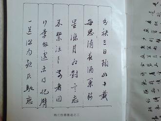
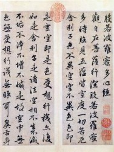

# 似此星辰非昨夜

我小时候练字，偶然见到赵孟頫的字帖，一下便喜欢上了，想学赵体。我外祖父却不让，非要我学颜体，还说了四个字“字如其人”。年纪大了点，细细体味，好像是这么个意思：颜鲁公壮年抗击安禄山，晚年出使李希烈，有始有终坚贞不屈，学颜体，就是学那股子浩然之气。而赵孟頫的字，端丽柔靡，媚若无骨，总有几分曲意逢迎的味道。

所谓“字如其人”，好像也没什么科学依据。但话说回来，一个人的性格，会在姿态言语种种行为间不经意流露几分，从笔迹探究人的性格，还是有点道理。要是反过来，“人如其字”，大概是说练字也是磨性子，练什么笔法久了，性子也就往模子里去了。

对于赵孟頫的字，历来说道很多。傅山年轻的时候推崇赵孟頫的字，甲申国变之后，一改平素所为，反过来最鄙薄赵孟頫。这显然不是艺术原因，而是政治原因——赵孟頫身为赵宋血脉，却做了元朝的官，现而今大明完了，大清坐了龙庭，写赵孟頫的字，岂不是有几分不快。真要论起来这没啥必要，傅山这么做，更多是种姿态和自我期许，连赵孟頫这种人的字体我都不写，你还指望我做赵孟頫那样的人？

说起傅山傅青主，的的确确是位奇人。我到太原，到处都是傅山，什么傅山公园、傅山酒店，还有傅山医院，就差个傅山武术学校。晋祠里面有傅山的字画，饭店里面有道小吃，叫头脑，据说也是傅山的作品。在自己的故里享受如此待遇，傅先生怕是独一份。当然，太原人民如此敬重傅山，也是有理由的，说起十项全能，傅山怕也是中国知识分子独一份。傅山的书画自是极好的，还写过文章专门阐发书法理论，看他的诗，还是喜欢赵孟頫的，只是嘴硬，非要“划清界限”。傅山诗曰：秉烛起长叹，其人想断肠。赵厮真足奇，管婢亦非常。醉起酒犹酒，老来狂更狂。斫轮馀一笔，何处发文章。虽然对赵氏夫妻用了侮辱性的字眼，但还是想他想到断肠，而且认为赵管夫妻“足奇”、“非常”。这种政治正确的心理暗示也好，心口不一也罢，我看到这段，总是嘿嘿一笑，毕竟文化人，还是得端起来些。

当然傅山除了书法理论，还写过很多书。其人心思机巧，涉猎多门。傅山通医术，你去查，能查到几本书：《傅青主女科》、《傅青主男科》、《傅氏幼科》。因为妻子体弱多病，为照顾老妻，傅山尤其精通妇科。除了医书，查着查着赫然发现一本《傅山拳法》，这老先生还是位习武之人，不仅自己练，还写秘笈，据记载，还有过实战经验。想也难怪，当时天下多事，行走江湖，不会几招，的确难办。

我最早知道傅山，是看梁羽生的小说《七剑下天山》，里头有位不穿缁衣穿红袍的道士傅青主，是天山七剑之一。在《鹿鼎记》里面傅山也出过场，大体是和顾炎武一起出场，顾炎武有句话半是恭维半是钦佩：超然物外，悠然天机，吾不如傅青主。陈査二先生读书底子厚，把傅青主写进武侠小说里，大概和他练武有关。明亡之后，傅青主为了不削发，于是当了道士，为了表示效忠前朝，穿一身红衣，红就是朱嘛。

傅青主、顾炎武一代人，被时局搅了一生。抱定气节也好，责任也好，新朝的官是不做的，但这种对抗，渐渐地也就弱了下来。他们自己不做官，大多却默许子孙与清朝和解，黄宗羲王夫之都是如此。总说书生误国，国又如何不误书生呢？

黄景仁有首诗，说傅青主这批人，也说他自己。照录如下：

仙佛茫茫两未成，只知独夜不平鸣。

风蓬飘尽悲歌气，泥絮沾來薄倖名。

十有九人堪白眼，百无一用是书生。

莫因詩卷愁成谶，春鸟秋虫自作声。

世人提到这首诗，基本都用来论证读书人的“无用”。但要看原诗，分明是不平和无奈。正因为十有九人堪白眼，方才百无一用是书生。中国这地儿，权力从来都比思想更好使。所谓得民心者得天下，分明是味正能量的麻醉药，实际情况往往相反，不是得了民心，才得天下，而是得了天下，自然就得了民心。

清诗我最喜欢两个半人，其一就是黄景仁。黄景仁只活了三十五岁，大多在颠沛流离中度过。郁达夫写过篇小说《采石矶》，写的就是黄景仁。当然郁达夫通篇，都有他自己的影子在。郁达夫赞许黄景仁，也对黄的经历心有戚戚。说实话，郁达夫过的可比黄景仁好多了，既能鞭名马，还会累美人，黄景仁可没这日子。黄景仁除了在毕秋帆门下当幕僚，过了两年太平日子，其他时间大多在躲债，最后死在躲债途中，要不是洪亮吉出手相助，连葬都下不去。郁达夫对黄景仁的心动，更多是那种忧郁孤愤的诗人气质。但是郁达夫吧，文人多情，而且有点痴。对郁达夫这种才子来说，他爱的就不是姑娘，而是他自己的那种感觉，那种让他有“诗意”的感觉。他爱的是美，姑娘只是美的载体，于是乎——见一个爱一个，还都真挺用情，美的载体何其多哉，哪里有一无是处毫不可爱的少女呢？文人的傻气，是少了点决绝的狠辣，多了点呆傻的可爱，他们总爱别人，也总会有人爱他们，但也正因为缺乏否定自己的决绝，敢拼一把的狠辣，难免沦为一事无成的零余者。襟抱难开，只好写字，太宰治也是这路人。

除去黄景仁，清诗我喜欢的另一人即是傅青主的同代人吴梅村。吴梅村为什么是个好诗人，也因为他“一事无成”，哪头都顾不好。秦淮八艳，侯朝宗有李香君，冒辟疆有董小宛，江左三大家另两位，龚鼎孳有顾横波，钱谦益更是把到了柳如是。他倒好，给陈圆圆写了首诗，可陈圆圆毕竟是别人娇客，卞玉京倒想嫁他，他却不敢和国舅抢，真是懦弱到让人想揍他。身为钦点的崇祯朝榜眼，还是耐不住，和龚、钱都做了清朝的官，晚年又因此极其后悔，真是彻头彻尾的半吊子。也正因此，他的诗写的曲尽心事，能打动人。“冲冠一怒为红颜”、“我今不死非英雄”都是一等一的好句子。有年我路过太仓，想起这位纠结了一辈子的榜眼郎，便送他首诗，有一联是“徒然消息张苍水，如是衣冠钱牧斋”，不知他泉下有知，读到这句，会作何想。至于两个半人那半个，是陈寅恪之父散原老人。

当然，吴梅村黄景仁水平一流，名气只能算二流。清代最有名的还是纳兰容若，我和王国维一样，最喜欢“夜深千帐灯”，因为开阔无小儿女态。纳兰词名曰“饮水”，恰如其分，如人饮水冷暖自知。纳兰擅长白描，无论是当时只道，还是人生若只，都是一种技法。这种技法，就是“与有情人说情事”、“与有故事人讲故事”，因此动人。就像失恋的人听苦情歌，会觉得句句都在说他。就像文艺青年听《董小姐》，不管有没有故事，都感觉自己好像有了故事。

只是人生苦短，天下无不散之筵席，于是诗人便要代人诉说哀伤。黄景仁和自己的表妹有过一段，最终不了了之，黄景仁有诗记录此事，中有两句“似此星辰非昨夜，为谁风露立中宵”。是啊，星星总是相似的，月夜也还是那样，但昨天早已回不去了，在此自伤自怜，除了徒增烦恼，又能有什么用呢？

人在江湖，有聚有散，不过是同行距离的长与短，终究还是要分别。只不过别后重逢，说起的不仅是一言难尽，怕是有些话，也难以开口吧。

（**采编**：张山骁；**责编**：王卜玄）
