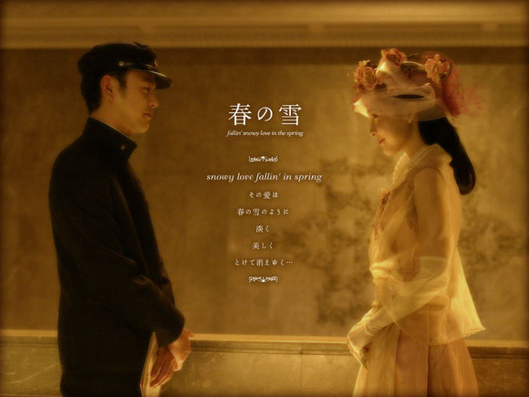

# 体验沉重或者轻浮——《春之雪》影评与杂想

** **

当我们生活在一个时代模式里的时候，谁也无法不通过这个模式认识事物。——三岛由纪夫 《丰饶之海 卷一·春雪》

 电影的坏处在于，将三岛由纪夫这样一部以呈现心灵万象为野心和企图的小说，降低到了一个通俗而平面的爱情故事。在三岛由纪夫那里，人的心灵和爱情是时代之下的立体影射，而不是电影中变换的场景、道具和制服。在小说中，清显不仅是一个美少年，也是一个发出“那么，完完全全占有这近于无限的漫长时间的又是什么呢？”的疑问和誓言要追求那“绝对和不可能的”美的，一个变革时代中的得以与时代保持疏离关系的侯爵公子。而本多这个“希望自己的理性一直这样光亮，却又无法抛弃容易被狂热的黑暗诱惑的心”的角色，则被压扁为一个毫无特色，仅仅为推动剧情而存在的男二号。电影作为资本和市场之产物，尤其当其根基是三岛由纪夫最为野心勃勃的一本长篇的第一卷时，出现这样的由经典到偶像剧的落差，是完全在预料之中，却是我们每个人，起码每个身负些许责任感的人，都应该认真对待和质问的。 小说中的灵魂对话，发生在清显和本多的尚未出现命运重大变动的少年岁月。本多的疑问，无疑是此书的关键： “你认为这种概括以什么为标准？是那个时代的天才的思想吗？是伟大的思想？不是。后人给那个时代定性的标准，就是我们和剑道部那些家伙之间无意识的共性，即我们最通俗的一般性信仰。无论什么时候，时代总是被囊括在一种愚神信仰之中。” 自然，这样的精神和对话氛围在电影中已经荡然无存。而你也看到了，这正三岛由纪夫所担心的事情，即导演和大众，都在这样的“无意识的共性”中，对小说做出了阐释和理解。在这种理解中，针对生命和存在的疑问，或者起码对于现世的注视，已经不复存在。于是这个故事，起码呈现在电影中，甚至并不如一个三流的讨巧的爱情片。读过原著的人，只好心痛地看着这个故事沦为一个家族恩怨个人取舍中女出家男病死的老生常谈，剩下的无非是男女主角的讨巧俊美的外貌，可是，就连这点，电影也没有呈现出哪怕是原著的三分之一。正是三岛由纪夫指出的这种“愚神信仰”，借市场之名，甚至要剥夺掉和占据掉真正的、动人心魄的美，以一种轻巧的姿态，使人记住的这种轻薄和不负责任的漂亮和快感。 而放眼望去，这种轻薄和不负责，几乎成为我们最可怕的毒瘤。人们，不仅是年轻人，不再关心一切本质问题，因为他们惯于逃避“沉重”并以此为荣。陈丹青说他初到美国时发现街上的青年的脸上写满了自由，而我更关心的，是这种自由是否已经沦为对一切肤浅无聊的迷恋：当我发现他们的语汇和思维已经单一和贫乏到只会欢呼“cool”并只追求这样近乎于最简单生理反应时，当我在一场高质量的音乐会大厅和独立电影的放映厅已经看不到一个60岁以下的脸孔时，当摇滚音乐充斥着对金钱和性爱的迷恋时。你知道，这场是否选择无关自由和奴役。而最终，E.M.Forster所指的人类当中于隐没的精神贵族，比任何时代都处于艰难独行的困境中。天哪我多希望这只是一种可笑幼稚的迫害妄想症…… 隐居于小城的腰乐队发出过“究竟该面对谁唱歌”的疑问，而我想，我们又该对谁说话？身处异乡的微妙之处在于，潜伏在你身上的一切，庸俗，病态，美和欢乐，无法避免地被透过“一般性模式”来被认知和理解，而人最终活在一种同样的失语中。这是精神的，而不是地理上的放逐。我们沮丧地发现，这种放逐其实于我们漂洋过海前，就已经开始。请记住，我们曾经将一切归咎于强权之恶，而最终，我们会发现，这恶，只不过是普遍的黑暗和罪的一种。 就像我从来没有相信过，人类漫长的历史中，有过一个更好的时代和国度。我愿意跟你说，一切罪恶统治一切人类，我们或者体验沉重，或者体验轻浮。 书中本多说到： “一百年，两百年，三百年后，也许历史才突然变成与我毫无关系的，正是我的梦想、理想、意志所追求的哪种形态……仿佛正以我看来是无以伦比的美丽，微笑着冰冷地俯视着我，嘲笑着我的意志。”  编者注：主标题“体验沉重 或者轻浮”为编者所拟。 

(采编: 黄理罡 责编：黄理罡)
