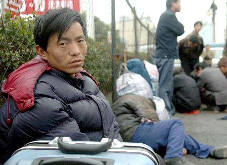

# 何处落脚？——读《落脚城市》

落脚城市（arrival city）是什么？在阅读道格·桑德斯这部作品的过程中，我一直试图寻找经验中的直观感受，以对应文本进行理解。但发现，虽然自己走过一些地方，做过一些调查，却没有真正深入过城市边缘地区的生活。我惭愧于自己的浮光掠影，也发觉这批都市边缘的人们，因为过于沉默，淹没于日常生活的来来往往中。

他们确实就在身边，却太不起眼。围绕广州恩宁路旧城改造的抗争持续至今已近四年，但大家似乎都忽略了，打从一开始，那些外来租户就悄悄地搬离了。没有户籍、没有产权、没有历史，他们与这个地方的连带是如此之弱，即便是抱怨拆迁，他们可以凭据的资格又在哪。本地的业主们，还有抗争的话语可以表达，有抗争的策略去学习，有自己的利益可以去努力，而他们呢。

我们曾走进恩宁路纵深的西关大屋，那里由里到外住了四户人家，搭了上下两层的楼板，木制的大屋里私拉了各种电线。住在最外屋的是个朴实的外地男人，在和我们说完拆迁队偷窃和占住的行为后，问到他自己下一步的打算，他笑笑，说那就只能搬走。那样淡漠的语气，是因为被热烈讨论着的赔偿，与他一点关系都没有。

后来他们去了哪里？当恩宁路的老住户们开始为麻石街抗争，开始真的将保护西关文化当做自己职责而被我们赞扬的时候，那些曾经落脚于此的沉默的人们，又在这个无法扎根的城市的何处为自己找到一个屋檐；当我们欣慰于建立在地方感与产权之上的主体意识逐渐成长的时候，那些离开自己故土的他们是否可以在这座城市找到自己的“地方”；当他们安顿于一处想要慢慢积累，踏实地开始创造未来时，不断地拆迁和搬离是否让他们也觉得不安和疲惫？

昨天逛完“北京有机农夫市集”，走过填满了“左岸咖啡”们的朝阳公园，便蓦地拐到了一个村。抬头看见门口绕成弓形的大字，“某某庄欢迎您”。我忍不住越来越对这座城市好奇了，三环内的地段，也有这样城市与乡村的直接断裂。走进村里，一片片一层平房，中间夹着尺度适宜的街道，有着数量惊人的小炒餐馆，红色的招牌和水果摊杂乱地横竖了一条街。店面狭小低矮，拐角处公厕原始的面貌和气味，告诉人们这里的确是农村。如果没有男友在身边，我想我一个人会缺乏勇气提脚走进其中一家狭窄油腻的小炒店。

这个是六七平方米的店面，拥挤着五六张小桌子，门口搭出的小阳篷充当了厨房的角色。各色食材盛在小碗里，向客人展示自己的信心。男主人在忙着炒菜，对着墙壁上手写的大菜单便可以和女主人点菜，铁制的三脚小板凳有细心修补过的痕迹。客人们多是男性，有治安巡逻员，有结伴的建筑工人，也有穿着西装皮鞋的白领。上菜的是主人的孩子，刚上初一，有着和他母亲一样乐观憨实的嘴唇，和他父亲一样坚定明亮的眼神，利落地上菜、洗碗，回答我们的提问。爷爷负责在客人离开后慢慢地清理桌子。几位客人离开了，女主人端了一大碗热腾腾的面在空桌上放下，抢过爷爷手里的抹布，督促着他先吃饭。我们的菜上来了，有着和价格相比着实厚道的分量，每盘都藏着几段红辣椒。

看着他们一家忙活在这小小的空间里，我看到了桑德斯在世界各地的落脚城市一再遇到、一再描写的，那些努力适应从乡村迁徙到城市的生活，在落脚城市积极地寻找机会、认真工作的面孔。他们不是贫穷绝望的流民，他们正当壮年，是乡村里最聪明能干的人尖，是潜藏的下一波中产阶级——只是需要政府提供他们成为这个城市公民的基础，包括产权、户籍、基础设施、信贷支持、营业许可、免费的教育以及主流文化的接纳。

他们努力地展现自己的诚意，并逐渐放下回到农村的想法，试图找寻能够在这个城市安身立命，使得自己的下一代能够成功融入城市的机会，被迫与自愿交杂着，成为人类几个世代以来持续的城市化浪潮的一部分。而他们生长在城乡来回迁徙中的下一代，也注定要去面对乡村与城市之间，本土文化与新进文化之间，归属感的挣扎与矛盾，即便未来他们已经在城市主流文化中取得了成功。

这样的面孔，我在广东也曾遇见过。

那是更年轻的一对夫妇，新婚，还没有孩子。在无法适应制衣厂每天10多个小时的机械工作与复杂的人际关系后，选择租了村里的店面开一家水果店。店面里面搭了床，支了个锅灶，便是他们的家。那天天热得很，妻子躺在床上玩手机，丈夫还在烧菜，吃饭时我们就蹲在门口聊天。他和妻子刚在川北农村老家结婚盖了房，积蓄因而所剩无几，在福建打了六七年工，又跟着妻子到了珠三角。

水果店才刚刚起步，但他流露出憧憬和信心，说一行都有一行的门道，慢慢学习。妻子抱怨丈夫做的菜太清淡，丈夫高兴地对我说这是你们福州的口味，他讨厌广东粤菜，喜欢福州菜的口味。我觉得奇怪，再问，他说，这里人都排外，本地邻居不搭理他们，可福州过个节街坊都敲门互送小糕点，感觉非常亲，他很怀念那里。

没有意识到自己将对街坊的喜好和对口味的喜好混杂起来的他，却清晰地感知到自己的命运。“80后是最可怜的，我们的上一辈经过各种动荡，没什么积蓄，也没有能力供我们结婚、买房，我们只能靠自己。而等我们有了孩子，孩子需要消费和我们这辈相比又会大大提高”。听着他说，我点着头，意识到，这位浓眉大眼的小哥，说出了人类学家阎云翔用《私人生活的变革》一本书来阐明的道理的一大半。他们守在故土的农民父母，正是在之前的城市化浪潮中被逐渐落下的人们。没有足够的积蓄，也没有城市生活的经验和人脉，他们在子女面前的威望大为下降，农村家庭的权力结构逐渐由以长辈权威的老人为核心转向以年轻夫妇为核心。而对这些年轻的夫妇来说，农村没有发展的机会，他们不得不前往沿海城市，为下一代更好的生活积蓄力量，而他们不断汇回乡村的钱币，供养着年迈的父母，供养着已无法自给自足的小农和乡村。

然而我们的城市，似乎还没有为他们的到来做足准备。

我们需要正视他们的权利和价值，尽管现在他们可以住着500元的城中村的房子，没有暖气、空调和卫生间，可能明后年又要拆迁，搬到更远的地方。尽管他们看起来还都双眼有神，乐观积极，能够相信分量充足的菜肴和水果将打造他们落脚的基础。但在我们走出小炒店的时候，不远前的十字路口正中央停下一辆摩托，后载的音响里飘出诡谲的声响，所有的人们都忍不住侧目。车上是一个男子，他攥着脖子上棕色的围巾，咧着嘴哼哼笑着，带着挑衅的眼神观察每个人听到这段录音的表情。音响里播放的，是一段似哭似笑的男子呻吟，夹杂说着：我痛啊，哼嗯。

我觉得全身血液凝固，和男友迅速交换了眼神，都流露出不自觉的恐惧。他解释并安慰说，那一定是个行为艺术家。但我知道不是，那一声缓慢的“我痛啊”一直徘徊在脑海，描绘出一个巨大的黑色旋涡。那种身体的极度疼痛与刻意地暴露，一定与处境的绝望相关联。我更相信，那是夹杂在乡村与城市之间多舛而挣扎的个人命运的躯体化。而这种由精神到躯体的疼痛，因为无法在城市文化中找到合适的发声介质与渠道，最后竟用这样一种自我携带装备的方式进行直接地抒发、以他人的关注与恐惧所带来满足感作为精神补偿。而地点，则依旧小心地选择在最熟悉、也知是最安全的地方。凯博文曾用躯体化的精神医学概念来阐述半个世纪前的文革与传统文化给中国人留下的神经衰弱和抑郁症，那么今天正在发生的城市化，要留给这一代的乡村移民，也是未来城市的主人们，什么样的精神痕迹？

相比于世界其他的落脚城市，中国的乡村移民们似乎更为沉默，中国的落脚城市的铲除，似乎更加悄无声息。我意识到，没有办法发声，这是他们一直被透明化的原因。他们不是握有选票的选民，可以依凭人数的优势，在某一天选出这个国家来自落脚城市的总统；他们没有一纸户口，被称为“流动人口”，这意味着这个城市从来没有将他们当做扎根的主人，提供福利和帮助；他们没有强有力的凝结纽带，宗教信仰、种族认同、宗族同根，均没有或者无法复制到落脚城市，唯一仅剩的地缘联结，也甚少在迁入地的政治方面发展出派系群体。桑德斯指出，落脚城市如果遭到忽视，又被剥夺了政治参与的机会，自然就会产生自我防卫的政治发展。在巴西是毒品帮派的猖獗，在孟买是印度教的民族主义，在欧洲则是伊斯兰教的激进主义，那么中国的落脚城市呢？

面对本地人和城市文化的强势，他们常常不自觉地自我矮化。唯一激怒他们并使得他们联结为一体的，是本地人和外地人之间的资源抢夺与文化互隔，但这些冲突事件多以情绪的暴力发泄和松散的组织无疾而终，自我发育出来的管理组织甚少见到。他们缺乏自己的公共媒体，他们缺乏来自他们群体的占有主流话语权一席之地的代表。他们唯一拥有的，是乡村给他们提供最后的基本安全网，国家的缺席由乡村来填补。但更为悖论的是，提供安全网的乡村也是他们无法离开的地方，他们的田地与宅基地无法凭借他们的意愿兑换成为供他们迁入城市的资本，乡村的土地也就无法集中进行大规模的农业经营，而被迫维持小农分散的状态。他们似乎还拥有乡村，但他们实际上并不拥有乡村。这一整套的制度设计背后，无从看见支持与鼓励他们迁入城市的逻辑，他们仅仅是城市的劳动力，而不是预备的主人与公民。

然而，尽管缺乏群体的表达，他们每个人都在进行自己的表达，那是小炒店男主人锅里滋溜溜冒起的油烟，是水果店的小哥专注地按照规律的摆放方式垒起的苹果，是围着棕色围巾的摩托车主用音响放出的笑声与苦痛。

新浪微博 @CoCity

（采编：周拙恒；责编：周拙恒）
