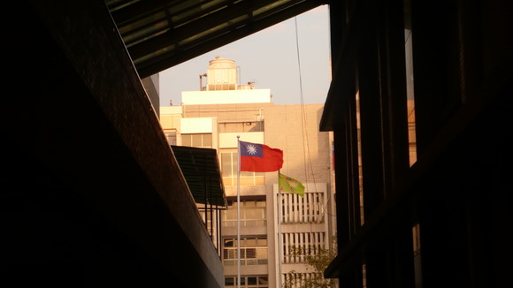
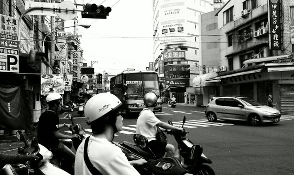

# 你们

** **

1

小学时候，班上都订名字好像叫《少先队员》的那种小开本杂志，里面总有些同龄小朋友的榜样故事激励我们成长。到现在印象最深的故事大概是这样的，说一个小姑娘去什么国家代表中国的小朋友参加一个国际会议，走在会场的路上一个一个数旗子，发现居然没有中国的五星红旗。小朋友向组织方提出严正的抗议，没有挂我们的国旗，我们就绝不出席会议。无能的组织方左找右找找不到旗子只会摊手和挠头，于是小朋友深夜里自己找布做了一面旗，美丽的五星红旗终于飘扬在了会场的上空，小朋友们维护了祖国的尊严，心中感到无限的自豪，胸前的红领巾更鲜艳了。

类似的故事还有很多，比如中国代表团出席某个国际会议却看见了台湾的代表团、中国的代表发现在某个国际场合居然出现了青天白日的旗子、中国的代表去哪个国家参观访问对方挂出的欢迎的旗子居然是红蓝白，这时候，中国的代表们就“愤然离场”表示抗议。

“愤然离场”。

这四个字组合在一块儿真是特别带感，不然你脑补那种毅然决然的场景：

“啪”一拍桌子，头也不回，转身就走。谁劝也没用。没得商量。没什么好商量的。决不妥协，决不让步，决不允许你跟我同时出现。有我没你，有你——？绝对不能有你！宁可不参加这个会，也要维护国家的尊严。会场大门“砰”一声打开，代表们迈着坚定的步伐伟岸的身影消失在外面射进来的万丈光束中。会场中一片寂静，组织者惭愧地低下了头，祖国方向准备好了热烈的钦佩、鲜花和掌声。

这样的场景我脑补过无数遍。我也想维护国家的尊严，就是为国争光，然后就能在《少先队员》上留名。而这样的事想想其实特别简单特别容易，只要睁大眼睛挑刺儿，看见那个岛和跟那个岛有关的东西，“啪”一拍桌子转身走，就行了。

离这种机会最近的一次，是大学时的英语课《英美文学鉴赏》。课上有一个美丽的俄罗斯姑娘。可惜那课我选到又退了。不知课上文学鉴赏到了什么地界儿，就说起了台湾和西藏的事儿。美丽的俄罗斯姑娘坦率地表达了自己的看法，美丽的中国姑娘们拍案而起义正言辞地予以坚决的回击。我没赶上这样为国争光的场景，姑娘们的拍案而起在我的脑海里一直是个传奇。

后来，后来我居然要到台湾了。办手续的时候看见“参加学术会议”的事由里注明说“寄送资料之讨论议题中不得出现中华民国等字样”，心里其实就暗暗端着，一直到上飞机都揣着一颗维护国家尊严的心。我嘴笨，争辩不来，可是我也可以为国争光，隐隐约约是那四个字：

“愤然离场”。

2

《全球化与区域发展》这门课是在一个讨论室上，没有讲台和椅子，就是一个中空的长身圆头的会议桌。课上1个老师，6个台湾同学，2个大陆同学。老师坐在圆弧边上，同学坐在两边的长边上。

上课的格局一直特别诡异——只要大陆同学坐在老师的左手边，台湾同学就坐在老师的右手边；下次大陆学生坐在老师的右手边，台湾同学就坐在老师的左手边。总是一边6个人，对面一边就俩。

老师课上对台湾同学说，这是难得的机会，你们有什么感兴趣的问题可以跟大陆来的同学多多交流。

台湾同学开口是这样一句：请问对面的中国同学。

咦？

有什么不对的么？其实也没什么不对的，确实是“中国同学”，没错。

可是，这边一直是两个“中国同学”，对面一直是六个“台湾同学”，中间被会议桌的空当隔开，总觉得，有点怪怪的。

奇怪的地方还很多，总有些时候觉得很别扭。

去年平安夜到一个教授家过圣诞，跟一个博班的学姐在校门口等着老师的车。迎面一群中学生模样的孩子在几个大人的带领下从我们身旁经过。领头的大人挥着导游旗，说的竟然是粤语。

我特开心，问学姐这是不是香港来的青少年参访团。

学姐说：

“是啊是啊，快去打招呼啊。

那可是你们的同胞呢”

“你们”？？？

怎么只剩我们了，你们呢？

这太奇怪了，听起来像……像是外国人。

同期在其他学校的大陆交换生拍了一个片子，采访台湾人对大陆人的看法，一个问题特直接：“在你们眼里我们是不是外国人”。之后我也拿这个问题去问台湾同学，在打球的间隙，大家坐在地板上聊天。

我问：

“你们觉得我是外国人吗？”

他们说：

“没有啊，大家，大家都差不多，都一样的，又不陌生。”

——这话在大陆货听来多温暖，可是紧接着还有后半句话——

“就像马来人、新加坡人和越南人一样啊，大家都差不多的嘛。”

我察觉到自己对这称谓的敏感。这些相处、讨论和对话里都丝毫没有敌对的意思，气氛都是平和友善自然的，坐两边的同学一起拉着老师请吃饭聊天说笑在FB上打情骂俏，学姐最后嘻嘻哈哈地说好嘛好嘛也是我们同胞圣诞的大餐依然其乐融融。可是自己能清晰地触摸到意识里那些潜藏的硬石块，就像是揉面团的时候那些包裹在绵软里的疙瘩，像是卡带绞带以后打上的坎儿，到那些特定的音符，就会硌一下。

我回想这些时刻的时候忽然很害怕，如果这些对话和场景出现在大陆，或者其他任何这座岛之外的场合，自己会不会真的拍案而起，愤然离席，对着他们咆哮：请说大陆！！请说对岸！！一个国家的人还说中国，请说咱们这儿！！！

我想到张绍刚的名字，浑身一阵一阵发冷。

3

如果真的就是要拍案而起，愤然离场呢？

这不是我们的原则吗？到任何国家访问跟任何国家签协议发表任何公报都要申明的原则吗？这不是我们遇上外国人说到敏感问题绝不退让的原则吗？原则问题怎么能因时因地而变？

拍！拍案而起！

可是如果真的这样，那这日子就过不下去了。

老师讲观光节庆活动规划，说我们台湾在努力成为“观光大国”——拍不拍，离不离？

他们自己管台湾地区领导人叫“总统”——拍不拍，离不离？

同学报专题讨论，论文里都写着“我国”“我国”“我国”——拍不拍，离不离？

梦想家演出，开场起立唱“国歌”——拍不拍，离不离？

拿到的文献资料报告都是“中华民国”，“内政部” “立法院” “行政院”……——拍不拍，离不离？

满坑满谷的都是“国旗”，爬上杆子去扯下来不成？

同学说起他有门必修课的老师是深绿，经常在课上发表各种言论。他把有些话转述给我们听，真的很不舒服。可是怎样？去当面反驳投诉抗议召开新闻发布会强烈谴责？

也许你会问，为什么不？

我只能说，我们要在这里修课，我们要跟同学相处，我们要在这里拿学位，我们要在这里生活。

没有拍案，没有愤然，缠住我们手脚的，是生活。

我渐渐觉得，那些简单易用、是非分明、直来直去、大刀阔斧、利落的、带感的、手起刀落的判断是非常粗暴的。这些判断无疑有着庄严的力量感，而这种力量的来源就是粗暴，它之所以庄严，正因为它与生活无关。

我们之所以那么轻易地就接受了别人告诉我们的论断，甚至讲出要岛不要人之类的残酷冷血的话，也正是因为那与自己的生活无关。

我开始犹豫，存疑，因为看见了这些人在这里的生活。

如果是认真的考虑未来在一起的可能，我想我们无法用把“中国同学”换成“大陆同学” “对岸同学” 这样的方式让自己获得自欺欺人的舒适感。我们必须直面那个让我们不适的无法接受的难以表述的区隔的存在。

在他们的语汇里，他们是他们，我们是我们。

4

看见新来的交换生，我总会想起自己刚来时候的感觉。

没有时差，没有语言障碍，每天早上醒来都有种不真实感。街上都是黄皮肤、黑头发、黑眼睛，只不过是口音不同，街道的样子长得不一样而已。我不过是到另外一个地方住一阵子，就像当时去深圳和上海一样。

我们都是一家人。一家人最后一定会在一起。

我想福建省每天往平潭岛上砸进一个亿的时候，是不是也是这样的想法呢？

大陆规划了海西经济区，台湾也在辐射范围之内。台中地区和厦漳泉一带历来往来甚多，厦门和金门更是几近同城。人员往来，经贸互通，一派祥和景象，仿佛假以时日，美好的愿望定会成真。

厦大的一位教授就带着这喜悦和信心来做报告，讲起平潭实验区眉飞色舞，大力的投资，快速大量的基础设施建设，优惠的城市政策，开明而富有远见的愿景——

“建立一个先行先试的政治实验区，吸引两岸的人民在这里一起共同生活，一起选举社区代表，一起参加政府决策，什么都可以试，为未来的最终的共同生活探索可能性。”

换做从前，我也会开心。我能体会到教授身上的、对岸当局的喜悦和热情，像一个小伙子对心仪已久的姑娘告白——

“你看，我有能力建立我们美好的生活，我们一定会幸福地生活在一起，让我们试试看。”

可是当时我在旁边看教授讲着，听着听着却觉得很难过。因为我看到参会的台湾教授的谨慎措辞，看见了身边台湾姑娘的不解和困惑。更让我难过的是，我跟她们一样困惑。

“我为什么要跟你生活在一起。”

“我们为什么要试着跟你们生活在一起？”

“若说是选举，我们自己本身就可以选立委和总统了，为什么要去跟你们做一起投票的实验？”

“我们在自己的国家生活的很好。”

“我们。”

“在自己的国家。”

“生活的。”

“很好。”

 

原文地址：[http://blog.renren.com/blog/222800772/807097096](http://blog.renren.com/blog/222800772/807097096)

 

（采编：楼杭丹；责编：应鹏华）

 
