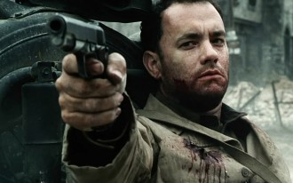

# 你凭什么说好莱坞“个人英雄主义”片不好？

****

对于一个影商不高的人来说，批评一部好莱坞电影一般分以下几个步骤： 

逻辑漏洞——为啥坏人杀人前总是废话连篇？为啥英雄在枪林弹雨中总能毫发无损？为啥关键时刻手机肯定没信号？总而言之——为啥这个该死的主角还不死？ 

剧情好猜——胸口的怀表关键时刻肯定能挡子弹；死不见尸的反派肯定关键时刻捅刀子；打开的镜柜关上时一定能照出反派狰狞的面孔 

我睡着了——《变形金刚》真无聊，我都睡着了！《阿凡达》真无聊，我都睡着了！《2012》真无聊，我都睡着了！ 

虽然这几种论调都存在不同程度的错误，但至少还都是可以破解的。 

第一种说法显然是没搞清楚影视剧作逻辑和现实生活逻辑间的区别。主流好莱坞电影的隐含读者必定是大情节经典叙事的簇拥，所谓经典叙事，就是讲述一个主动主人公追求自己欲望，在一段连续的时间和一个连贯的虚拟现实中与外界力量对抗的故事，比如超人保护地球，擎天柱保护地球，查克·诺里斯保护地球等，而这种对抗，在好莱坞电影中又常常是以主人公的胜利结尾的，没人会想让主人公在完成自己目标之前就被反派枪决或身中流弹而死，因为这样会让整部片子的立意毁于一旦。 

任何一个心智正常的观众都是去看主人公如何成功——而非如何失败的。但退一万步讲，假如真的有主人公不敌外力而惨遭非命的电影，持这类论调的人就会获得极致的满足么？ 

很遗憾，答案还是否定的。 

有一位女文青，在看拉斯·冯·提尔的《黑暗中的舞者》时就对其中的励志元素嗤之以鼻，认为一个生活窘迫的女人根本不可能凭借对音乐的热爱战胜残酷的生活，认为这是导演不切实际的主观意图，还认为女主角愚蠢至极，活该穷困潦倒。 

最后女主角在绞刑场被吊死，女文青哭得死去活来，说电影不能这么残酷，电影怎么可以完全扼杀希望，女主角一路奋斗怎么落得如此下场。 

我在一旁哈哈笑。 

于此相比，持第二种论调的人逻辑就比较自洽，因为预测剧情永远是展现自己谙熟叙事套路、通晓剧作门道的高逼格行为。但好莱坞身为当今最发达的电影产业，不可能没有自省和改革。其中有《灾难大电影》、《惊声尖笑》等片娱乐至死的自嘲，也有《林中小屋》、《海扁王》等片在讲故事的同时反省。在这一系列创新浪潮之下，守旧和俗套反而会慢慢变成标新立异，如今商业上大获成功的好莱坞电影，在剧作上可预测的俗套元素也变得越来越少。批评剧情俗套没错，但在日新月异的好莱坞，这种批评注定持续不了很久。真正优秀的好莱坞大情节电影不靠打破那些牢不可破的规则取胜——每个观众进场时都知道结局是正义必胜，但如何讲出这个结局，就决定了你的电影是《画皮2》还是《夺宝奇兵》。 

第三种就不说了，该补觉补觉。 

用以上三板斧去砍好莱坞电影那是过去的事了，现在就靠一板砖——你这是个人英雄主义！此大棒一出，天地变色，日月无光，一棒打得你《钢铁之躯》、《超人归来》一视同仁；《暗夜骑士》、《蝙蝠侠与罗宾》傻傻分不清楚。 

只要这部影片有一个主角（是一个复联也没事，我们还有集体英雄主义！），只要这个主角不是坏蛋（是坏蛋也没事，我们还有个人反英雄主义！），只要这个主角最后战胜了邪恶（死了也没事，我们还有个人烈士主义！），那么文青们在走出电影院后都会捶胸顿足、摇头摊手：唉，又是一部个人英雄主义脑残片。要是不看见他们手里的电影票上《环太平洋》四个大字我还以为他们买的票是安德烈塔尔可夫斯基的《安德烈·鲁勃廖夫》结果进了场被五花大绑撑开双眼严刑拷打强制看完这部个人英雄主义电影的呢。 

****

英雄情结是人类所共通的，古希腊戏剧就大都取材于神话、英雄传说和史诗，近代弗·雅·普罗普的《故事形态学》作为结构主义叙事学的一座里程碑，其中为故事主人公列举的角色的31项功能也有浓重的个人英雄主义成分。 

其中： 

主人公离家出走 

主人公经受考验、审讯或遭到攻击等 

主人公获悉使用魔力的方法。 

主人公与坏人殊死交锋。 

主人公遇难得救 

坏人败北 

最初的灾难与贫穷得到解除 

主人公返回家园 

这一系列的角色行动可以概括大部分好莱坞“个人英雄主义电影”的主线情节了。除此之外，还可以参考约瑟夫·坎贝尔在1949年出版的《千面英雄》，通过对东西方神话、宗教、传说的分析，用12个元素总结出了一个英雄的原型，适用于绝大多数好莱坞电影： 

1. 平凡世界（Ordinary World） 

2. 冒险的召唤（Call to Adventure） 

3. 拒绝召唤（Refusal of the Call） 

4. 与智者的相遇（Meeting with the Mentor） 

5. 跨过第一道门槛（Crossing the First Threshold） 

6. 测试、盟友、敌人（Tests、Allies、Enemies） 

7. 深入虎穴（Approach to the Inmost Cave） 

8. 苦难（Ordeal） 

9. 奖赏（Reward） 

10. 归途（The Road Back） 

11. 复活（Resurrection） 

12. 拿到神药（Return with the Elixir） 

好莱坞大情节动作片的本质就是当代神话、现代寓言，其中寄托了受众对寓言故事的每一分期待，也自然而然地具备了对个人英雄主义的传承。让我们以《霍比特人》为例，看看电影是怎样运用这一结构讲故事的： 

比尔博是一名普通的霍比特人。(1. 平凡世界) 

比尔博与甘道夫会面。(4.遇见智者) 

一天晚上，十三名矮人受甘道夫之邀在比尔博家中开会，并邀请他一起去冒险。(2.召唤) 

性情随和、爱好和平的比尔博拒绝了他们的邀请。(3.拒绝) 

比尔博在第二天终于决定离开自己熟知的夏尔，加入了冒险队伍(5.第一个门槛) 

加入冒险团队之后，比尔博认识了十三名矮人，经受了外界危险环境的考验和首领索林·橡木盾的质疑。(6.测试) 

随后比尔博与众人失散，掉入山洞中，遇见了魔戒持有者咕噜(7.深入虎穴) 

比尔博赢得了与咕噜的猜谜游戏并获得了魔戒 (9. 奖赏) 

与众人汇合后(9.奖赏)，他们准备继续前进。(10.归途) 

众人在悬崖边被白面兽人重创后，甘道夫召唤巨鹰脱围(11.复活) 

比尔博获得了宝剑、魔戒与索林·橡木盾的友谊。(12.不死药) 

《霍比特人》可以说是一部在技术与艺术上双重成功的电影，无论是故事的紧凑程度还是硬件对其的基调烘托都可圈可点，但这样一部电影走的也恰恰是个人英雄主义叙事的老路，与众不同的是它将个人英雄主义走得漂亮，走得新颖，用细致到极致的美工和精致的场景完美地润色了一个经典到近乎老套的英雄故事。同时它也是一部严格遵循《千面英雄》中英雄历险模式的电影。可见，结构的模式化并不会导致影片落入俗套，显得陈词滥调，令观众厌烦。好莱坞主流商业电影的高明或优秀与否，往往不在于它是否有完全的创新，打破这些叙事规则，不在于它是否是一部“个人英雄主义电影”。反而是看它能不能“戴着枷锁跳舞”，在规则中玩出新意。所谓“清风明月常有而四时光景常新”，说的就是这个道理。 

个人英雄主义本身并不是好的或者坏的，也不能代表一部影片的主控思想或质量，真正的问题是如何在你的冒险历程中展现全新的细节、场景，如果借结构更好地完成角色塑造，表达出新的思想与态度。并且由其在寓言故事中的生命力来看，个人英雄主义是人类叙事学上不可或缺、不可撼动的叙事美学，与此为敌无异于把自己放在了人类几千年叙事习惯的对立面上。批判个人英雄主义是显然不可取的。 

更何况，相比于批判性的、冷冰冰的“个人英雄主义”这个词，美国大片里更多表现的是对个人的尊重，承认和关怀。孤胆英雄是不少，但他们往往都是肩负着责任或目标的，本质上并不是“自私”而是与其相对的“无私”：或在战场上舍身照顾队友，或与歹徒周旋勇救家人。亲情、友情、爱情三大感情一直与美式个人英雄主义相辅相成，宣扬的是对个人的杰出成就和巨大牺牲的肯定和承认。 

同样是一部战争片，国产抗日神剧中常常出现的情景是士兵为了遵守命令壮烈牺牲，上级永远伟光正；而美国战争大片里主人公则经常是为了照顾队友/完成任务违背常理或上级的直接指示，比如《拯救大兵瑞恩》中用八个士兵去换家中最后一个儿子的故事，就是美式精神的完美体现，这种行为几乎不可能发生在其他任何一个国家的军队中，但整个故事逻辑严谨，剧情精彩，在观众对其中战争场面大呼过瘾之余也能认同其价值观。虽然英雄都有铁一般的原则，但美国战争片中也不会强调士兵要机械地服从命令，相反，以《全金属外壳》为代表的一系列电影反而在批评战争中对命令的机械遵守和对人性的泯灭。士兵对上级也并没有达到国产战争片中努力弘扬的绝对服从，保罗·格林格拉斯的《绿区》讲的就是一个个性强硬的士兵对抗美国高层腐败的故事。美式的影响之所以是英雄，是因为他们不代表任何一个利益团体，而是将众多理想品格具象化的体现。 

****

同样地，美国大片之所以能够引起全世界人民的共鸣而成为人民喜闻乐见的主旋律，是因为它不针对任何一个种族，也不歌颂任何一个集团。其中的亲情、友情、爱情、公平、正义与人文关怀是属于全人类的精神，美国大片场面宏大，效果震撼，但无论多大的压力下都要花大量篇幅来体现家庭有多么温暖；友情有多么重要。《飓风营救》中孤胆英雄千里单骑只是为了家中的小女儿，《怒火救援》里的保镖大叔可以为萍水相逢的友情献出自己的生命。美式的个人英雄主义代表的往往是我们身边最渴望的和最珍视的，美式个人英雄主义的主旋律其实是全人类的主旋律。 

最近肯尼亚商场的恐怖袭击事件中，一名正在度假的英国SAS特种部队士兵靠着随身携带的手枪，从枪林弹雨中杀进杀出12回，救出了被困在商场内的100名游客。这位英雄比好莱坞电影《虎胆龙威》中的布鲁斯·威利斯可谓是有过之而无不及，英国作为欧洲文化大国，受好莱坞个人英雄主义的影响自然是不小的，而相比于这位英雄，今年8月18日蚌埠一名女孩被歹徒勒住脖子、用刀捅死时，两位民警就在面前，却不敢挺身而出上前制止。直到歹徒自残倒地后，两位民警才上前将其控制。如此文化下的观众批评个人英雄主义时，是否缺了几分底气呢？ 

**(采编**：王卜玄；**责编**：王卜玄)
