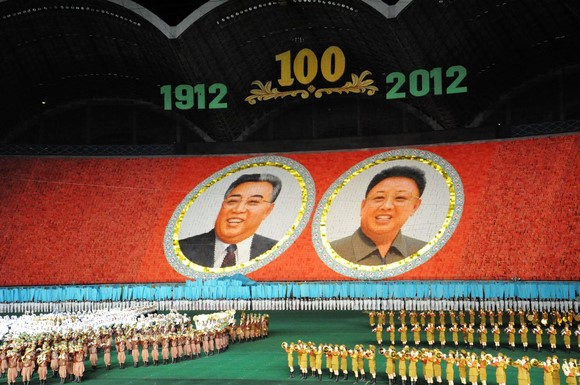
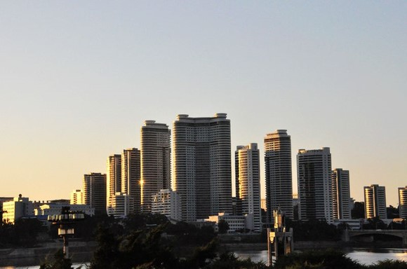
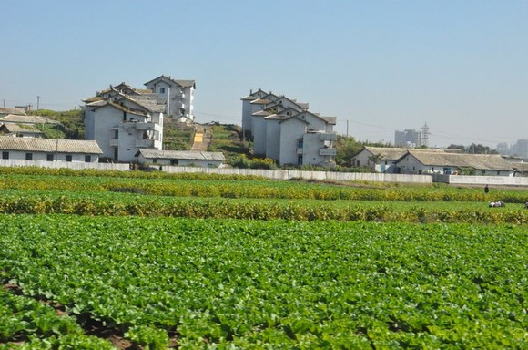
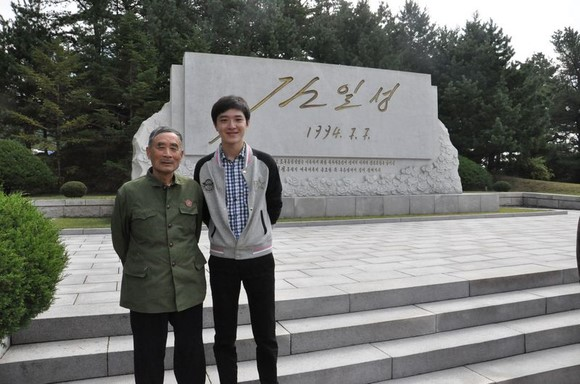
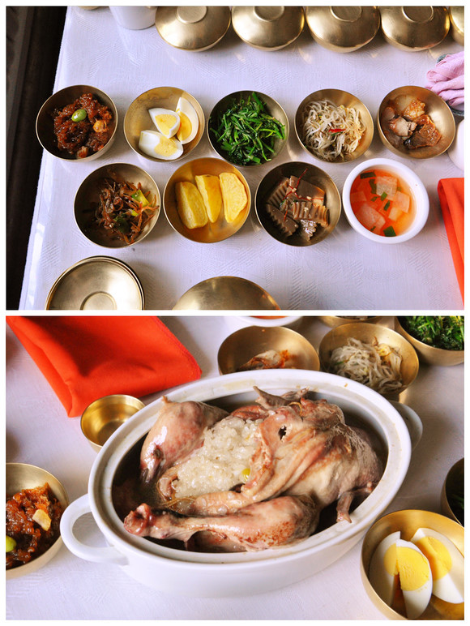
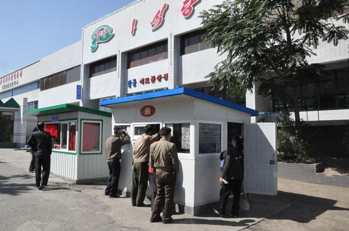
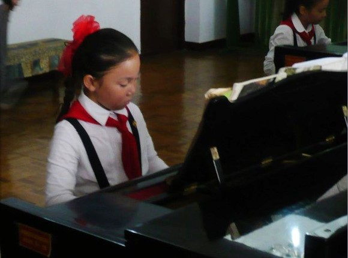
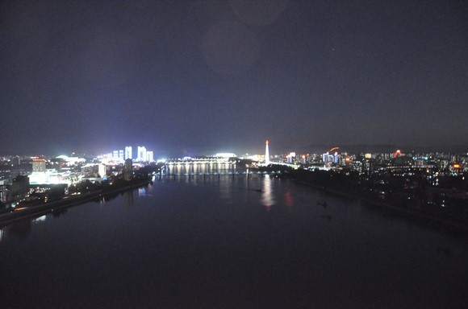

# 你去你的香港，我去我的平壤

** **

当我告诉别人这次国庆要去朝鲜旅游的时候，很多人都不解“你去看什么”，我告诉朋友们，首尔也好,东京也罢，未来的五年十年都不会有什么大的变化，但是朝鲜不一样，它正处在一个历史的关卡，不管未来走向何方，改变是必然的，这种改变意味着此刻的朝鲜会显得“稀缺“，有些人与事、物与景再过几年想看也看不着了。

所以，我不是去看风景，是去看历史。

 **【女人拿出了领袖袖章】** **地点：首都机场2号航站楼** **北京时间：9月29日11:30分**

快上飞机了，给老妈打个电话。

她问我，“你们团里有年轻人吗？”

“不清楚，因为在门口找中方导游拿了护照和机票，就没有再集合了。但是我身边坐着几个年轻人，应该都是去平壤的吧。”

当我挂了电话，发现身边的年轻人都开始排队登机了，只不过是在旁边去香港的登机口。

再一看，身边真的只有大爷大妈大哥大姐们了。

我当时的想法就是，千万别跟睡觉打呼噜的大叔住一屋，别的都接受。

候机区域里很好区分中国人和朝鲜人。

中国的大叔大妈们总是显得很忙：大叔们忙着读旅游须知，发现兴奋之处还习惯大声朗读出来，就跟在单位搞政治学习一样；大妈们总是坐不住，过一会儿就到登机口问一下“啥时候登机”，或者就是在老伴身边唠叨：“要不你再去上次厕所？”

朝鲜的乘客也几乎是大爷大妈，只不过很安静。朝鲜大爷们都穿着松松垮垮的西装，坐在座位上闭目养神或者观察四周，估计这个场合很容易碰到熟人；大妈们坐得倍儿直，不时也会凑到老伴耳边说上两句。

快登机了，只见坐我对面的朝鲜大妈掏出了一个精致的小首饰包，拿出了两枚金日成像章，很认真地给大爷别在了胸前，又给自己别上。两人都确定了一下彼此别得很规整，然后起身登机。

 **【中国的社会主义是染了色的】** **地点：位于平壤市中心的金日成广场** **平壤时间：9月29日下午5点15分**

刚进入这个国度，兴奋劲儿是最强烈的。从机场到市区的12公里，我的相机就没有放下，一直拍个不停。看什么都好奇，瞅什么都新鲜，说白了，真的没安好心，就想捕捉这个国家贫穷的面貌，肌饿的身影。

导游并没有回避自己国家曾遭受的苦难，她谈到90年代中期老百姓的日子曾经到了最低谷，她甚至用了“落魄”这个词。当然，一切的罪过都是美帝国主义造成的。

三天下来，我的判断是这个国家最起码已经走出当时的苦难，街头的老百姓瘦的可能偏多，但不至于说缺乏营养。当然，贫富差距也是可以感觉得到，哪个孩子稍微胖一点还是很“鹤立鸡群”，偶尔会有些年轻女子打扮得比较入时或鲜艳，划破着街头的沉闷色调和僵硬体态。

有一大一小两个东西，是我初到平壤的两个关注点。

大的是楼房。整个城市的建设似乎都停留在了上世纪八十年代，高楼大厦很多，但形态都是廉租房的形态，呆板僵硬的建筑造型、密密麻麻的窗户阳台都显示着这里的容积率不是一般的高。尽管不少建筑的外立面都涂上了各式亮色，但难掩砖瓦之间被岁月磨损的痕迹，焕发的是一股半老徐娘的尴尬气息。

小的是手机。路边不时有在打手机的人们，其出现的频率超出了我的预想。导游说手机在朝鲜仍是个“稀罕物”，普通人买不起也用不起，但我的确看到很多人在使用，即使是一副邋里邋遢模样的人。不要小看这个通讯工具的普及，它意味着一种管制的放松和发展的动机。

导游是位很漂亮的年轻姑娘，我很满意她的服务。

一路上，她都忙着跟我们介绍朝鲜的基本国情，我很赞赏她的是一种自信、乐观、开诚布公的姿态。很多时候她不像导游，更像是新闻发言人，解答着人们关于这个国家的疑惑，回应着那些带有挑衅性质的问题。谈到有些话题，她也会流露出一丝说不清道不明的笑容，我们都解读为“反正我得这么说，至于真相嘛，你懂我懂大家懂”。

摘录几句她的话语：

“我还是处女，车上有处男吗？”（她说完这句话的时候，我想全车人都为朝鲜的尺度给吓到了。其实，我想是汉语老师没教好，她只是很单纯地想介绍自己还是未出嫁的姑娘，但在措辞上没有意识到“处男处女”对于中国人不是一个很能放上台面的词语）

“北朝鲜比南朝鲜人少，原因是因为南朝鲜都是平原，北朝鲜更多是山地。”

“中国的社会主义是染色的，黄色的。当然，这只是老百姓的看法。”

“希望大家不要乱走，当然，你们也不会叛变到我们国家的。”

（带着优越感的语气）“我们国家有三大免费：教育免费、住房免费、医疗免费，现在窗外的房子都是免费分配给普通平壤市民居住的。你们中国没有分配房子了吧，都得自己买吧？”（这就叫哪壶不开提哪壶）

  

五点一刻，我们来到金日成广场。

无数次，这里都是朝鲜向世界发声和展示威力的场所。那些雄纠纠气昂昂的阅兵、那些向领袖效忠的山呼海叫在这里都发生。朝鲜，总少不了这般的亢奋或聒噪。

而此刻，广场只有和蔼可亲的领袖像、随风招展的红旗、忙碌一天走在归家路上的人们，在广场上练着轮滑的孩子。夕阳西下，一切都显得那么的温馨、安详。

我跟团友说，我要坐在广场上拍一张。

在某些不成熟的国度，广场变得越来越敏感，老百姓坐不得站不得哭不得喊不得，这里想必也是如此。但作为外来者，我没有企图，只想坐着享受一下夕阳余晖的灿烂，看看高挂前方的领袖笑容，也不枉费这广场打扫得这般整洁。

 **【旋转、跳跃，我不停歇】** **地点：平壤八一体育场** **平壤时间：9月29日晚上8点到9点半**

这次旅行很幸运，赶上了今年最后一场的阿里郎团体操表演。

比我想象的更精彩、更壮观，说实话，奥运会开幕式和闭幕式要不让朝鲜承包得了，由人制造出来的排山倒海、千姿百态，是任何声光电美技术都无法达到的。

由两万人组成的背景翻板很可怕。团体操看似是人海战术，但是容不得一丝的懈怠，场子里谁跑得慢了一点或者动作跟别人不一样，观众就开始指手画脚。整场表演不知道有多少次背景的转换，但是画面转换之迅速和统一，都会让你忘了那是一个一个的孩子在操作在辛劳在流汗（或者憋屎憋尿）。

小朋友参演的部分都很精彩，只能说这一代的朝鲜人筋都被拉得很开，各种介于体操和杂技之间的动作看得人拍手称赞。

同行的游客有对阿里郎表演的合理性提出善意的质疑。10万人，他们是谁？

导游说，百分之八十是平壤大中学校的学生，每年专门抽出两到三个月来参与表演。

“那你参加过阿里郎表演吗？”

“我不用，我是重点学校的学生，可以不用参加表演”导游回答得很腼腆，但那份小优越感真是藏都藏不住，一个朝鲜白富美的形象就这么树立起来了。

 **【城里的人啊，乡下的人呀】** **地点：平壤前往板门店的高速公路上** **平壤时间：上午9点左右** 

我们都戏称这块新建的高层公寓为平壤CBD，这是平壤的仓田街公寓，霸占平壤最黄金宝地的地段，一边紧靠金日成广场、国家图书馆，另一边远眺大同江。这也是金正恩上台后的一个样板工程。（不怀好意的南朝鲜媒体说现在就是一个空壳，根本没法住人，据我目测，确实不像有人在里面大规模地居住）。

平壤郊外的农村小楼。

导游姑娘很敬业，从不推销商品或自费项目，在景点之间都忙着给大家介绍各种情况。

当然，她不主动说，游客们的问题也攒了不少。在去往板门店的路上，大家问起了收入和分配的问题。

导游介绍到，目前城市仍然实行着计划分配的制度，每个平壤市民每个月有15公斤的粮票和1公斤的肉票，农村仍然是“人民公社”的形态，每个农民在合作社挣工分，到年底基本是可以分配到260公斤的粮食，为了鼓励生产生活积极性，也允许农民有少量的自留地。

导游总是强调，虽然自己工作是导游，但是是公务员的身份。

“那你的月收入呢？”

“折合成人民币五百元左右，平壤一般老百姓的收入可能在三四百左右。”

 **【首尔，70公里】** **地点：板门店** **平壤时间：9月30日上午11点到12点**

当路旁的指示牌上写着“서울 70Km”，板门店到了。

朝鲜人想展示的内容很简单：美国的失败和朝鲜的胜利。

中国人想看的内容也很简单：“我们也胜利了。”

但是，无论是停战协定的签字场所还是联合安全区的蓝色小木屋，中国的历史痕迹呈现得很少。这方面的吐槽，网上已经积攒很多了，我就不参与了。

四川话里有句歇后语叫做——“大哥不说二哥”。我只能说，我理解朝鲜人的做法。

此次旅行团里有位老大爷，他是志愿军老兵，在儿子的陪同下再访朝鲜。

他曾经是一位冲锋陷阵的前线步兵，他轻描淡写着战争的无情与残酷“美国佬飞机打的散弹，最近的时候打到我脚跟前，三个，每个打到地上都有一个碗那么大”。我问起他牺牲的战友，他的回答简单而无奈“数不清”。

看得出来，虽然50多年过去了，那场战争仍然是老人这一生最光荣的回忆，这份光荣真的不是盲目的爱国，而是一代中国人真正觉得自己站起来了的自信与荣耀。

参观前，他特意让儿子给自己换上老军装，别上了自己所获的一枚和平勋章，昂首阔步地走着。来往的中国游客都投向敬意的目光，我相信老爷子那一刻很幸福。

对于那场战争，能涌起荣耀感的人已经不多了。新的一代更多是在质疑，“毛主席当时是否头脑发热？”“帮了半天就帮出朝鲜这样的国家，何必呢？”

大家在质疑的时候，多去回望一下那些历史的背影吧，这世上怎会有无谓的牺牲，哪儿会有白来的和平？一个独立且稳定的朝鲜，起码意味着一个安宁的东北。

思考未来也迫在眉睫，没有永远的朋友，只有永远的利益，我们如何继承好老一代留给我们的战略遗产？让老大爷这一辈人的牺牲不白费，让这“中朝友谊”不求真情实意，最起码多一点“步调一致”！

 **【别人不会以为中国没有地铁吧？】** **地点：平壤地铁** **平壤时间：9月30日下午5点** 

这是在开城吃的午饭——铜碗套餐加参鸡汤。

这之前，我们顺道参观了所谓的高丽博物馆（也曾经是朝鲜的最高教育机构所在地——国子监），真是小啊！

我就不发表“中国随便一个富农家都比他们这国家机关要大气”之类不利于中朝友谊的话了。

回到平壤之后，我们先去了他们逮住的美国间谍船，然后在火车站附近下车，体验了一站的平壤地铁。之前网上有人说，朝鲜地铁就是为游客所开，里面的乘客都是“演员”，这次我们搭乘地铁正赶上下班时间，那个滚滚的人流彻底击碎抹黑平壤的这些谣言。平壤地铁号称世界最深，此言也不假，反正我在北京地铁里没经历过那么久的下降或上升过程。

一进站台，我们这行人就high了，站台多么宽广，装潢多么华丽，完全超出想象。

一进列车，我们这群人又彻底打破本来的平静。由于知道时间短暂，各种忙拍照。一位大叔特别热情地跟我让座，我只能不停地说“고맙습니다”，连连摆手。

最后还是坐到另一边的空座上拍了一张，不好意思闪到大家了。

一站之间真的不远，也就一分钟左右就到站了。出了车厢，我跟同行的伙伴说，“我们搞得这么兴奋，这么没有见过世面，别人不会以为中国没有地铁吧？”

出地铁的电梯上，我跟导游一直在聊天，小哥俩一直盯着我们，我就拿起相机给他们照相。第一张的时候，后面那位小弟还害羞，躲到了前面那位的身后。我照好之后给他们看，那小弟这下搂着前面的小哥面带笑容地来了一张。

地铁出来之后，我们来到主体思想塔。本来是应该登塔俯瞰全城的，但是导游说，正好中秋节，工作人员也早下班了。

 **【我和你，男和女，都逃不过爱情】** **地点：平壤国家礼品馆** **平壤时间：10月1日上午10点**

由于去往妙香山的公路被大雨截断，本来去往妙香山的行程改为了平壤市内景点游。

一早去的第一站是，9月才刚落成的国家礼品馆。导游介绍，这个馆是朝鲜全国和全世界朝鲜族同胞赠送给金家三代的礼品。

整个馆修得很大气，由于禁止拍照，里面的展品没法儿给各位呈现。

有一份礼物我印象特别深刻，是一个玉雕，一只大老虎盘踞在地球仪的西半球上，一只前爪踩着加利福利亚，一只后爪按着阿拉斯加，呈虎视眈眈跃跃欲试状，很霸气。另外我对于金正日将军骑在老虎上威风凌凌的画作也表示毫无抵抗力，太英武神猛了，这不是在抢普京的戏码吗？

来去的路上，导游都在跟我们一本正经地聊着男女关系的问题。

她无奈地表示，朝鲜仍有很强的男尊女卑思想。

在朝鲜，只有男人有权利参与分房，所以两个人结婚的话是男人出房子，女人出嫁妆、购置家电。但男人的房子本来就是国家分配的，说到底，还是女人出钱。

出完钱之后，就是漫漫一生的出力。在朝鲜，伺候一家老小的家务活是女人的专利，如果哪个男人上街买菜，会被人耻笑。她说不久前在菜场看到有男人买菜，旁边的人都在笑他们“没出息”，后来她仔细观察，才发现应该是驻朝大使馆的中国男人。（我们的外交人员就这么被朝鲜落后的人民群众嘲笑了）

有人问，“朝鲜有离婚吗？”“朝鲜的离婚很少，特别是领导班子成员（估计有些词语只有中朝人民才会使用）都不敢离婚，如果离婚，他们的前途会受影响。”

有人问她的感情生活，她说朝鲜女孩有三大择偶标准：一是军人（入了党更好）；二是出身名牌大学（就两所，一所是金日成综合大学，一所是金策工业综合大学）；三是没那么大男子主义。她说她相亲而来的男朋友已经具备了前两项，然后无奈地表示“该同志男尊女卑思想还是有点严重的”。尽管如此，所有人都意识到，这么一对拥有平壤户口的高富帅和白富美的结合是显得那么的夺目和充满光明。

 **【改革开放？那是说不准的事情】** **地点：平壤市光复地区商业中心附近** **时间：10月1日中午12点**

毫无疑问，平壤是一个橱窗城市，它展示着这个国家最希望别人看到的一面。走自己的路，走得挺好挺幸福。当然，信与不信就是我们的事儿了。

中国游客也按捺不住那好为人师的冲动，说事实、摆道理，不停地推销着“改革开放”的这剂良药，想必这样的话，她已经听得够多了。导游姑娘只得不停地捋自己的头发，最后来了一句“改革开放？那是说不准的事情。”

作为一次短暂的旅行，你很难深入到这个国家的内部，去窥探真实的社会面貌或者人心向背。但是，街头活跃着的小店铺其实已经显现着这个国家变革的迹象。

整天穿梭在平壤市里，你会发现，那些真正的门面店铺非常冷清，透过窗户看到能里面无精打采的店员、空空荡荡的货柜，让人不禁怀疑其存在的合理性。（按导游的解释，每个社区的人只能去该社区的商店购物，有些商品还是得凭票购买）反倒是街头有很多临时搭建的小屋，里面买着各种生活用品，一些食品小摊位前还排着长龙。

吃过午饭，我和一团友提前溜了出来，门口有四个小店铺，一个花店，一个冰欺凌店，一个杂货店，最让我好奇的是还有VCD碟片的租赁店，一个母亲正抱着孩子在那儿挑选动画片，此情此景，我倍感熟悉。

对于朝鲜的未来，一个人的统治就意味着任何的可能性都能发生，他可能是打通国家转型之路的蒋经国，也可能是顽固到底自寻死路的卡扎菲，导游的那句“说不准的事情”里是有着无奈，但我相信也有着乐观和期待。

午饭中间穿插文艺表演，有位女歌手邀我上台唱了一曲《月亮代表我的心》，我拿出平常唱唱吧的投入和认真，结果不出所料地走调了。哎，这都走到朝鲜去了。

 **【最具时代感的画面】** **地点：平壤市少年宫** **平壤时间：10月1日下午5点** 

图为给中朝友谊塔献花，表示对志愿军将士的敬意。

下午的行程很匆匆，先后去了金日成故居、凯旋门、友谊塔。

说实话，不好玩，没亮点。

一番购物之后，前往最后一个行程点——平壤市少年宫。

走在少年宫里面，我会感觉非常熟悉，我不知道现在的少年宫是什么样，但我觉得我小时候的少年宫就是他们这样，一间间的教室，各种稀奇古怪的吹拉弹唱交织着，各种拉着画笔或毛笔的孩子在穿梭，当然，没有每间教室正中挂着的领袖像。

我们先参观了正在进行课外活动的几个小组——书法组、手风琴组、钢琴组、吉他组、手工组。走进每个小组，都会欣赏到一段表演。

走进书法组教室，我听懂了老师说的朝语，她问导游“是中国游客吗”，然后便吩咐一个很乖的小女孩写起来。只见小姑娘气定神闲地写下了“朝中友谊”，送给了志愿军老大爷，老大爷的幸福指数应该再次飙升了一下。

照片没照好。这是钢琴班的一个小女孩，特别像是从中国五六十年代的宣传画里走出来的，胖胖的脸庞、专注的状态，惹人喜爱。

参观完之后，便欣赏了一台少年宫小朋友们表演的晚会，很精彩，掌声连连，其乐融融。我把花献给了一个小男孩，他表演了一段传统的朝鲜舞蹈，高超的技艺、诙谐的演技，赢得了最多掌声。

 **【ENDING 点点头承认自己会怕黑】** **地点：平壤市** **平壤时间：10月1日晚上7点半**

行程结束之后，我们享用了一顿平壤小火锅。

在这里，我还想再表扬一下这次的导游，我和她有些聊天是以“悄悄话”的形式进行的，我觉得不便把所有的谈话都放到公开的文章里，但是她的坦率和热情让我知道，那里的青春不是我们想象的那般热血或僵硬。

她的美丽，她的聪慧，她的汉语底子，她的敬业精神，她处在这个国家开放的最前沿，再加上她难以掩盖的白富美家庭背景，我相信她能抓住时代可能的机遇的话，不久的未来她会收获一个精彩的人生。我祝福她！

在回酒店的路上，导游姑娘开始进行离别的环节，先演唱了一首《我只在乎你》，又发动了我的“室友”、一个年轻小伙唱了首歌，他唱的是周杰伦的《世界末日》，最精彩的高潮是，抗美援朝老大爷也被这温馨的气氛感染，主动要求演唱一首《抗美援朝志愿军军歌》——“雄赳赳气昂昂杀过鸭绿江“，老爷子中气十足，唱得铿锵有力，大家也跟着一起哼了起来。

我们的车快速穿梭在夜色中的平壤市区，夜晚的平壤并未如传说般黑暗，只不过缺少路灯和商铺的灯光，所以显得城市不亮，但是家家户户的灯光仍然在告诉着外来的人们——“我们不黑，我们有电！”

 **【续篇 你们的导游会因此受到惩罚】** **地点：从平壤的羊角岛饭店到高丽饭店，一个来回** **平壤时间：10月1日晚上**

本以为回到酒店，收拾行李，早早睡觉，第二天一早的飞机，圆满结束行程。

可知我们这个团的人，从大到小，都非善类。大家决定晚上出去“走走”。

前几年，来平壤旅行的游记都会抱怨这一路上的监管。

“整个旅行会有一个人专门负责监督游客。”我们这一路也有一个男青年一路陪同，导游姑娘解释是“这是我们的英语导游，因为现在没有那方面的团，就来配合我为大家服务。”大家也都懂他的角色，但一路下来，我印象里他就没有说过“不准”，十分友好，不会让人有“被监管“的感觉，很多时候也确实是在跑前跑后地帮忙。

“行车途中不能拍照。”这次完全没有这方面的要求，我走一路拍一路，只是到了板门店和国家礼品馆，稍微有所禁止。

“不能与普通百姓接触和交谈。”只要你真的会朝语，你要去跟路人说话，没人拦你；偶尔我也会逗逗那些路边的小朋友。

所以，这个国家是在自信着的。

（从酒店窗户往外拍摄的夜景）

但有个规矩，导游还是提示了的：晚上不要离开酒店。

去朝鲜的外国人大多都安排在羊角岛酒店（所谓的朝鲜特级酒店），这个酒店盖在平壤市区的羊角岛的一角，这个酒店的位置就是让游客既处在市中心，又不会轻易地接触到市民或走进这个城市。

我们的导游讲这规矩的时候，给出的原因是“平壤市路灯少，出去不安全，大家就乖乖地待着”。

但是，第二天晚上，我们有团友已经侦查过了，走向通往市区的道路上并没有关卡，要出去不是不可能。

在平壤最后的一晚，大家决定“走过路过，不能错过”，出去走走。

因为团里面有位大哥，做旅游的，这次来也有点考察的意味，就想去另一家特级酒店——高丽饭店瞅瞅，所以我们的目的地就是那酒店，路程大概有三四公里。

我们这个团的11人，扶老携少，浩浩荡荡地就走出了羊角岛。那阵势，真有点要叛逃的感觉。这一路虽然招摇（想想看，我们这里面即使穿得再朴素的人，放到当地人中间也会显得格外的与众不同），但没有人阻拦，偶尔碰到穿制服的或当兵的，也会有点心虚，但那种没有人盯着的兴奋感占了上风。

一路很顺利地走到了高丽饭店，其中还穿过人最密集的平壤火车站。在高丽饭店，大家喝了点啤酒，吃了点花生，那儿的服务员知道我们是从羊角岛步行过来，都表示不可置信，然后又装没听见。

可是，冒险是要付出代价。

当我们回到酒店，快进大门的时候，一个朝鲜男子拦住了我们：

“你们跑哪儿去呢？”

“就在这门口转悠。”

“你们去大街上了，有人举报你们了，说你们导游是谁？”

“我们导游是谁呢？哎呀，忘了。”

“你们的房号我们都知道，反正你们的导游会因此而受到惩罚，你们去跟她解释吧。”

我当时真的不安，这种不安不是不安自己，反正我明天就飞走了，你难道还扣留我啊？我不安的是导游。什么惩罚？会对她工作或收入造成影响吗？

大家初步判断，那人应该还不知道我们导游是谁，不然也就不会问了，所以决定进了大厅之后分头行动，有些人去酒吧，有些人去商店，不要直接回所在楼层，要跟“敌人”周旋一番，去了趟朝鲜大家还实地玩了一把“潜伏”。

第二天（10月2日），大家都担心，别突然换个导游给我们送机，咱们连给别人道歉的机会都没有了。

幸好，仍然是她。

一切都像没有发生一样，她仍然热情地把我们送进了安检口，和我们依依话别。

但愿惩罚不是在我们走之后开始的，但愿。

这就是我的平壤之行。

短暂的三天三夜很充实，所见所得超过我的想象。

我没有被洗脑，一些价值判断并没有丝毫的动摇，但我对这个国家多了几分祝福，它值得一个更好的前途，去犒劳那里勤劳的人们。

 **【一点遗憾】**

很多朋友都在问朝鲜旅游的事宜，其实赴朝旅游非常方便，报团就可以了。

只有一点叮嘱，同时也是我的一点遗憾。在中方旅行社发的旅行须知里，有提示“希望游客能够准备一些小礼物给导游、讲解员和小朋友”，我这次没有准备。

在分别的时刻，真心后悔没有准备一个小礼品给导游；同时在少年宫的时候看到那些认真且可爱的孩子，觉得如果有点小文具给他们，那就更好了。

 作者关于朝鲜的另两篇文章链接： [《我们活得很好，不用大家担心》](http://blog.renren.com/blog/220847527/865617342?from=fanyeOld) [《在朝鲜，Nothing To Envy》](http://blog.renren.com/blog/220847527/791111775?frommyblog)  作者微博：http://weibo.com/zhangjintu  

（采编：孙梦予；责编：徐海星）

 
