# 你应该关注的台湾史上最大规模选举

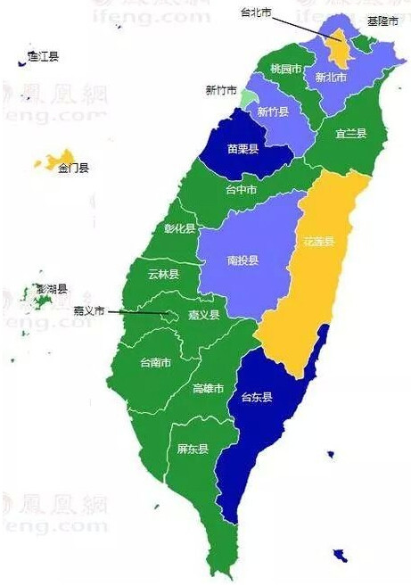
 
选取后版图

 

###1“九合一”选举是怎么来的？###

“九合一”选举实际上是将原来的“直辖市”地方选举和“县市长”地方选举合并而来，目的是为了节约成本。

过去，台湾地区领导人、立法机构民意代表、“直辖市”地方选举和“县市长”地方选举分别举行，呈现出几乎年年有选举的局面。台湾当局为了改变这种情况，在最近两年进行了重大改革，2012年将领导人选举和立法机构民意代表选举合并，实现了所有“中央”层面的选举同一天同时举行。而今年的“九合一”选举，则实现了所有“地方”层面的选举在同一天举行。

###2“九合一”选举都选哪些职位？###

“九合一”选举，具体选举的职位包括九种，“直辖市”长、“直辖市”议员、县市长、县市议员、乡镇市长、乡镇市民代表、村里长、“直辖市”山地原住民区区长、“直辖市”山地原住民区代表。

这九类职位又有非常详细地划分，台湾地区年满20周岁的未被剥夺选举权的居民，每个人至少要投3张选票，有的还需要投出5张选票。

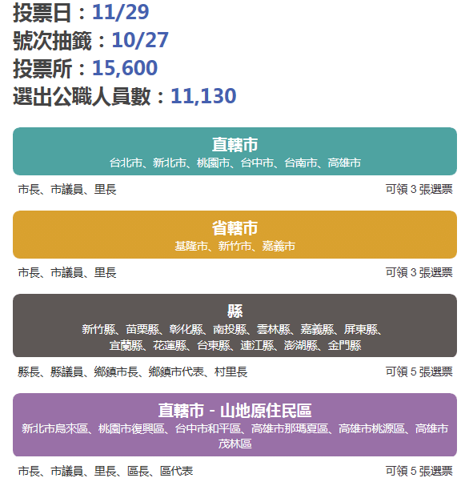

这些职位看起来比较抽象，我们把它对应成大陆的对应职位，就很好理解了。

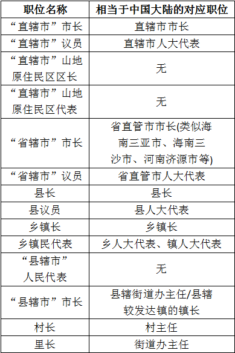

上面这些职位，在台湾地区都是选民“一人一票”选举出来的。

###3预计本次“九合一”选举的结果如何？###

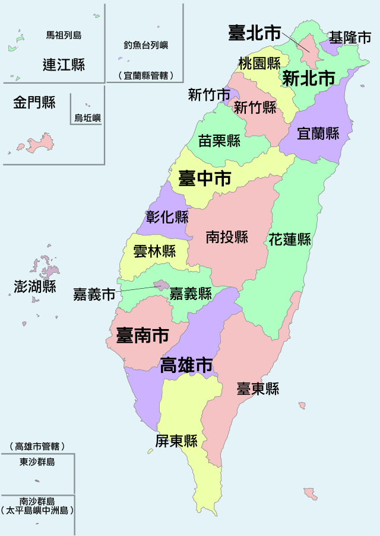
 
台湾目前的行政区划(选举后“桃园县”将改为“桃园直辖市”)

 

根据台湾当局的规定，在选举日的十天之内不能公布关于候选人的民意调查结果。因此，在选前十天各大媒体和机构发布的民调被称为“封口民调”。智谷趋势研究中心（微信号：zgttrend）整理了台湾TVBS电视台的“封口民调数据”，台湾所有县市的选情大致如下：

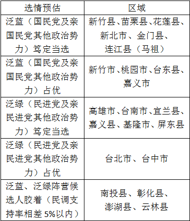

将上面的表格和台湾行政区划图相对照，基本可以看出，“北蓝南绿”格局虽然坚固，但存在动摇的可能。

在所谓“直辖市”选举方面，2010年“五都选举”中国民党籍候选人获胜的台北市、台中市，在本次选举中民进党籍候选人民调都明显领先，国民党有丢掉除新北市和桃园市以外其他“四都”的可能。

在“县市长”选举方面，民进党在南台湾优势比较明显，而台北和新北的传统国民党优势地区基隆市，因“泛蓝”阵营分裂，民进党籍候选人林右昌也几乎笃定当选。剩余的选情胶着的地区，也集中在中部农业县，但在这些地区民进党的候选人也往往略微占优。

总体来说，本次“九合一选举”很可能出现自2001年起十三年来，首度由泛绿阵营执政的县市总数超过由蓝营执政的县市数。而民进党的总得票率高于国民党甚至超过半数，也将是“大概率事件”。2016年，台湾发生新的政权轮替的可能性非常大，投资者需高度关注民进党势头上升乃至执政给两岸关系可能带来的潜在风险。

###4台湾的地方执政版图经历怎样的变迁？###

1994年起，台湾实现了所有地方（省、县两级）行政区划的直选，在县市（含“直辖市”）一级，台湾蓝绿阵营的政治版图变化如下面的图片所示。

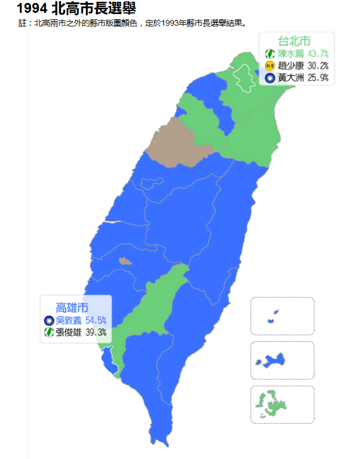

1997年“县市长”选举，国民党惨败，历史上首度总得票率低于民进党，民进党在一半以上的地区执政，值得注意的是，当时台湾并没有所谓“北蓝南绿”现象，在北台湾民进党也大获全胜，这次选举对于台湾政治发展具有标志性意义。后来人们用“地方包围中央”这一话语，描述此次民进党胜选对2000年民进党取代国民党执政的先导意义。

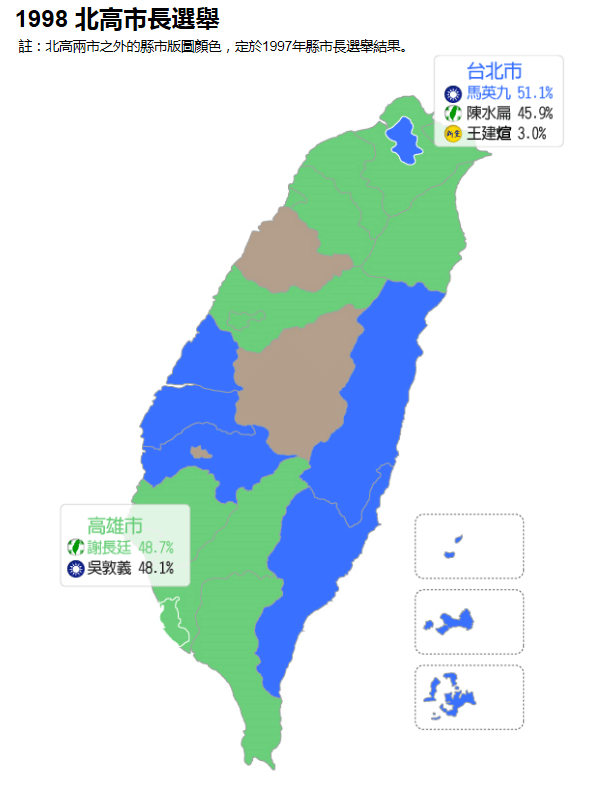

1998年“北高市长”选举，任内满意度极高的陈水扁得票率较1994年增加了2%，但由于最后关头新党候选人王建煊呼吁选民都将选票投给马英九，1994年选举中的“蓝营分裂”情况未再出现，陈水扁败选而马英九胜选。在高雄市，民进党籍谢长廷挑战国民党籍吴敦义成功，高雄市从此之后一直由民进党执政。值得注意的是，在这次选举的十年后，2008年台湾地区领导人选举，当时代表国民党和民进党参选的候选人正好是这次选举的台北市长当选人马英九和高雄市长当选人谢长廷。

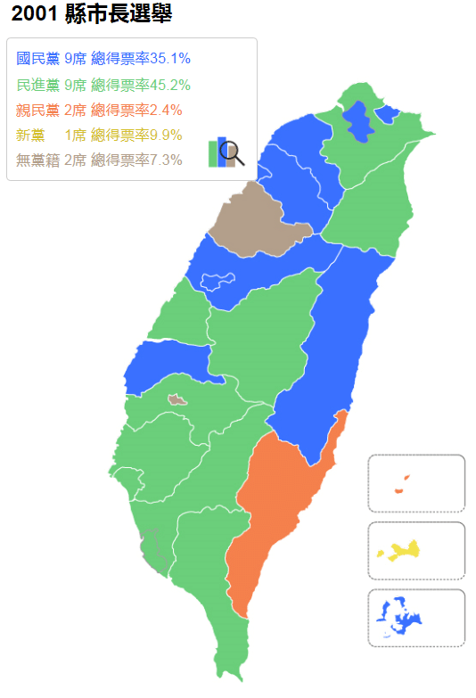

2001年“县市长选举”，国民党“否极泰来”，“光复”北台湾的基隆、桃园、新竹市、新竹县以及台中市、台中县，“北蓝南绿”。而民进党则攻克中南部的彰化县、嘉义县，台湾政治版图的“北蓝南绿”情况出现固化。

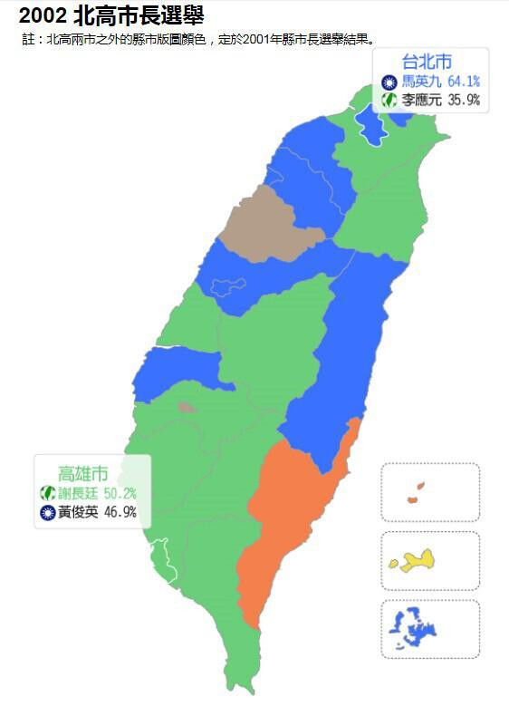

2002年，“北高市长选举”波澜不惊，马英九、谢长廷均顺利连任。其中马英九的得票率高达64.1%，接近民进党籍候选人李应元的两倍，表明国民党在台北领先优势明显。

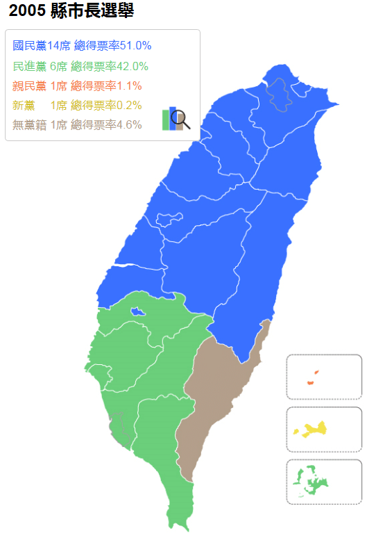

2005年“县市长选举”，民进党惨败，总得票率比国民党低将近10个百分点。民进党在“地方”的执政版图全面退守到“浊水溪”以南，国民党在北台湾和中台湾的所有县市执政。这成为2008年台湾“大选”国民党“重新执政”的先行信号。

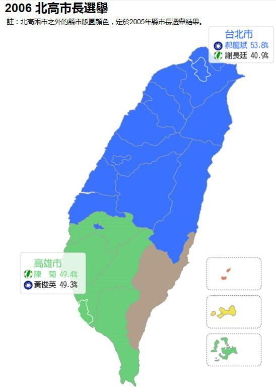

2006年“北高市长选举”，曾任高雄市长和台湾“行政院长”(行政机关最高首脑)的谢长廷北上挑战郝龙斌，但得票大幅落后。而高雄市长选举，国民党籍黄俊英以0.1%的微弱劣势败给陈菊，但得票率较2002年有所增长。

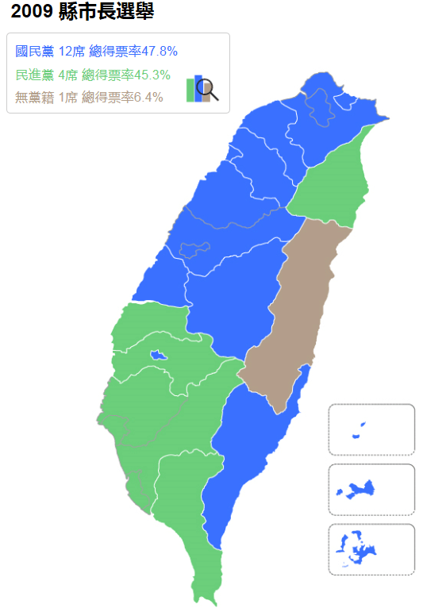

2009年“县市长”选举，民进党夺回云林县和宜兰县。（由于第二年要举行“五都选举”，台北县、台中市、台中县、台南市、台南县、高雄县未举行县市长选举）

2010年是“直辖市”增加到5个之后的首次“直辖市市长”选举，这次选举国民党和民进党分别保住了固有地盘，但民进党的得票率大幅提高。

从历史上来看，在台湾“地方选举”中得票率出现增加的阵营，在接下来的一次台湾地区领导人选举中，得票率也会增加。同时，执政的阵营容易在历次“地方选举”中丢失地盘，而在野的阵营更容易“攻城略地”。这也和台湾选民的选举心态有关，一些“中间选民”（即没有固定政党倾向的选民）往往在一次选举支持这一阵营后另一次选举改投另一阵营，这被称为选举中的“钟摆效应”。

###5台湾是什么时候开始实行“县市长”选举的？###

台湾实施“地方自治”，早在1950年。从那时起，台湾地区除了“直辖市”以外的县长、市长就是由当地居民“一人一票”直接选举产生。

“两蒋”时期的台湾选举，在国民党的严格控制之下进行，但并不完全都是“内定”的。国民党之外的人士也可以参选甚至当选，1950年产生的台湾第一位民选县长是花莲县的杨仲鲸，他就不是国民党人，而是在内战中亲国民党的小党“中国民主社会党”的成员。

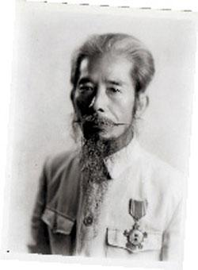
 
图：杨仲鲸)

 

“两蒋”时期，甚至有公开反对国民党的候选人，通过地方选举当选为公职人员。其中知名代表之一是台湾前领导人陈水扁，1979年年底台湾爆发“美丽岛事件”，这是台湾民运史上的重大事件，陈水扁为“美丽岛事件”的主犯之一黄信介做了辩护，跻身公开反对国民党统治的社会人士之列。1981年，陈水扁成功以最高票当选台北市议员，1985年，陈水扁还参选家乡台南县的县长，最终仅以一万票的微弱优势败北。彼时，台湾还在蒋经国统治之下，还属于“戒严”时期，但“公开对抗中央”的候选人参加地方选举，并没有被严格禁止。

###6台湾的“直辖市”是怎么来的？###

1967年，台湾当局将台北市升格为所谓“直辖市”。1979年，高雄也改为“直辖市”。所谓“直辖市”，和大陆的直辖市意思相同，就是说只对“中央政府”负责，不受任何省的约束。

从那时起，台北市和高雄市就脱离了“台湾省”，台湾当局的行政区划变为“两省两市”，分别是台湾省（管理台北、高雄之外的台湾、澎湖地区）、福建省（管理金门、马祖地区）、台北市和高雄市。

“台北市”脱离“台湾省”之后，“台湾省”的省政府和省议会都迁到了台北市以外。台湾省“省政府”设在台湾南投县的“中兴新村”。

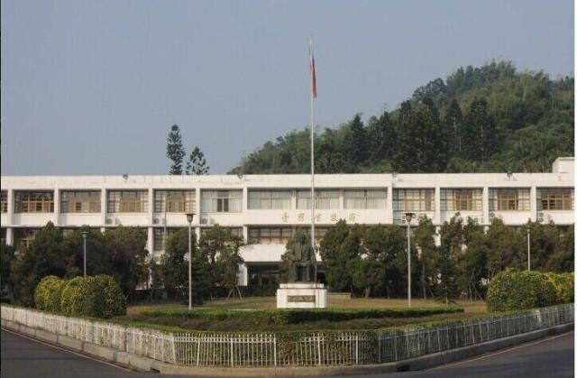
 
“台湾省政府”所在地)

 

而“省议会”则设在台中县雾峰乡。

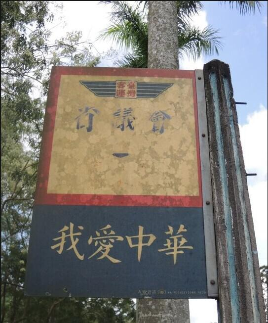
 
“台湾省议会”旧址附近的指示牌)

 

台湾当局重划“省界”，并不是闹着玩的。以前，在台北市和高雄市和台湾其他县市之间，还有实体性质的“省界”，标明其他县市是由“台湾省”管辖，而台北市并不属于“台湾省”。

 
“台北市和原台北县（现新北市）交界处的省界)

 

威权时代，台湾地区的“地方自治”仅限于县市一级，并没有上升到省级。在省级行政区划（“直辖市”、省）和“中央”，选民只能选举议会的民意代表，但并不能投票选举行政首长。也就是说，台北市、高雄市改成“直辖市”之后，台北和高雄的市长由台湾当局直接任命，不再进行选举。

1987年，台湾当局解除了“戒严”。1991年，台湾当局宣布终止从1947年内战时期起宣布的所谓“动员戡乱状态”，从此台湾的行政首长选举上升到所谓“省一级”。

上世纪九十年代以后，台湾固定将“县一级”选举在地区领导人选举之后一年举行，而“省一级”选举则在地区领导人选举之后两年举行。1994年，第一次举行“北高市长选举”（台北、高雄市长）的时候，同时举行的还有“台湾省长”选举。当时当选“台湾省长”的是亲民党主席宋楚瑜，他是历史上第一任“台湾省长”，也是最后一任。

###7“台湾省”现在还存在吗？###

根据台湾当局的理念，一个施行“地方自治”的省，其行政首脑应该由全省民众选举产生，称“省长”。而如果一个省不能作为“地方自治”的主体，行政首脑就要由“中央政府”直接委派，不称“省长”，而称“省政府主席”。

1997年，时任台湾地区领导人李登辉以“台湾省”和台湾当局“中央政府”机构叠床架屋为由，通过修改台湾当局“宪法”实施“冻省”，从此“台湾省”不再进行省长和省议会的选举，台湾省的“省辖县、省辖市”实际上直属于台湾当局。但在名义上，台湾省仍然保留，“省辖市”称谓依然沿用。

台湾当局目前所设的“台湾省”和“福建省”，分别由一位“行政院”（台湾最高行政机关）政务委员兼任“省政府主席”，现任“台湾省政府主席”是林政则，“福建省政府主席”是邓振中。但他们都已没有实际权力，基本上是象征性的。

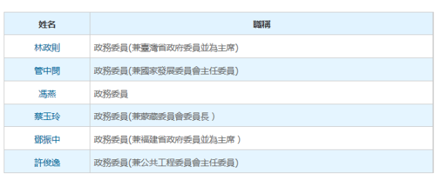
 
“台湾当局现任“行政院政务委员”名单)

 

###8台湾的“直辖市”为什么越来越多？###

在2010年之前，台湾只有台北和高雄两个“直辖市”。2010年台湾“地方制度”调整之后，原台北县升格为“新北市”，原台中县和台中市合并，组成新的“台中直辖市”，原台南县和台南市合并，组成新的“台南直辖市”，原“高雄直辖市”和“高雄县”合并，组成新的“高雄直辖市”，这五个“直辖市”遂被称为“五都”。

虽然实际上“直辖市”和“省辖县市”都已直属“台湾当局”所谓“中央政府”，但“直辖市”明显可以获得更多的资源倾斜。本次选举之前，台湾“省辖县”中人口最多的桃园县“改制”成为“直辖市”，所谓“五都”升为“六都”。这些城市不仅在政治上地位重要，也被台湾当局视为整个台湾经济发展的重头。“六都”人口占台湾总人口的接近七成，“六都”选举的结果被视为本次“九合一选举”中最重要的部分，关系到2016年台湾地区执政权的轮替。

**（数据源自台湾当局选举事务主管部门，转引自台湾《联合报》网站，部分图片来源于网络 ）**

（编辑：蔡梦莹；责编：杨修）

**【元淦恭 北斗知名撰稿人、专栏作者。曾任职《新世纪周刊》，现智谷趋势资深研究员。】**

**（原文链接：http://mp.weixin.qq.com/s?__biz=MzA5ODA5MzgwNw==&mid=204014435&idx=1&sn=2f5414f7889d5c086c9aab3a11c51f47#rd）**