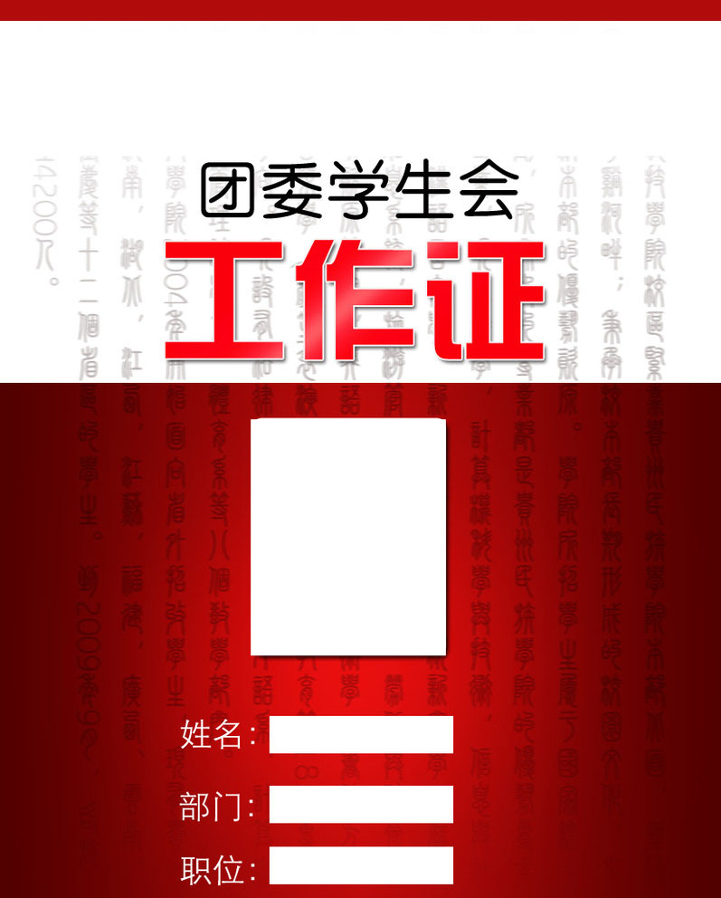

# 你所不知道的台湾学生会

**甄选的过程可以分为两段，前半段根本不像是面试，大家被分成小组做游戏，有好玩的有幼稚的，有新奇的有老套的。所有的游戏被安排成闯关形式，每关的boss被K.O之后，整个团队才能进入下一关。** ** 这些每一关里的boss小怪兽们其实也是学生会的干部，他们会在每一关的游戏中观察每一个玩家，然后悄悄把你的表现mark起来。整个过程中，大家都玩得很开心。**

# 你所不知道的台湾学生会

## 文/翻翻（淡江大学）

 

这是上个月的旧闻了，人大政治系副教授陈伟抛出“大学的团委和学生会，早已成为高校的藏污纳垢之地”。搁下结论不说，这是个舆论压死人的年代，而舆论中最活跃的群体基本就是学生。无畏者无所谓。年轻时的一无所有就是资本，大家什么都敢讲，谁都敢骂，勇气可嘉。而这位老师到了将知天命还能这么讲出，不管他所说是不是全部正确，必须给个赞先。

在台湾也有学生会，但是此学生会非彼学生会。两个名字相同，组成人员相同的机构，其实是完全不同的两个概念。

在大陆时，多少对于大学中的学生会有所耳闻，网路小说中的学生会，各种爱恨情仇的大戏永不断档，每个学校总有那么一个英俊潇洒的会长，总有那么一个漂亮聪明的副会长，更多的是干事干部之类的剧情铺陈人员，他们聪明勇敢调皮灵敏，在台面底下与团委的那批人展开生与死的阶级斗争，或者干脆井水不犯河水，各自占地圈人，发展己方势力。

但是大陆的学生会有个后台很硬的BOSS，BOSS不但管发钱，还管发权发好处，与此同时，组织当然也会加强对学生会的管控。

而台湾的学生会则完全不同。我到台湾两个月有余，基本知道些淡大学生会的情况。淡大学生会是完全的学生自治机构，每一届为期一年。每年的5月初由全校同学直接票选产生新一届学生会会长和副会长。选举由选举委员会筹备。所有在校学生均有资格登记成为候选人。除候选人之外，还有类似于“竞选办公室”的助选人当跟班。每一个候选人必须自己组织面向全校同学的政见发表会。之后，候选人还要上交政见登记表，竞选公约，政见发表会参与回条。

学生会是学校的大财阀，学校每年有高额补助发放，学生会自己又会吸收会员，会员缴交的会费也是相当的大数目，他们还可以在校外拉赞助，总之就是，学生会真的很有钱。

学生会下属的各个部门的部长由学生会内部选举产生。各部的部员则是通过每学期开学的招新“骗”进来的。我刚到淡江时就对学生会心向往之，随即参加了学生会的甄选。甄选有2次我参加了周四的甄选，一起的还有很多大陆同学。大家都对于台湾的学生会充满好奇。

甄选的过程可以分为两段，前半段根本不像是面试，大家被分成小组做游戏，有好玩的有幼稚的，有新奇的有老套的。所有的游戏被安排成闯关形式，每关的boss被K.O之后，整个团队才能进入下一关。

这些每一关里的boss小怪兽们其实也是学生会的干部，他们会在每一关的游戏中观察每一个玩家，然后悄悄把你的表现mark起来。整个过程中，大家都玩得很开心。

游戏基本结束后，就是最后一关，正式面试。

我站在面试的教室外面等，领队的学姐一个劲地叫我们不要紧张，其实经过前面的疯闹后，没几个人会紧张。不久，轮到我面试了。推门进去，一间很大的教室里被挡板分隔成左右两侧，左侧坐着3个人，右侧坐着3个人，每一侧有5张空椅子放在3个人面前。领队叫我们随意选择位子坐下面试。

我跟在2个同学后面坐下，抬头一看，中奖了，我正对着传说中英俊潇洒的会长，而旁边就是漂亮聪明的副会长。还有一位是秘书长。3个人依次发问，我们5个人轮番作答，3位边听我们的回答边做记录。问题还都比较实际，比如：喜不喜欢做事情。如果工作和社团学习有冲突怎么选择。持续了十几分钟后，左右两侧交换。这次我对面的3位依次是：财政部长、活动部长和公关部长。形式和前边的面试一样，问题不同而已。整个过程还是比较严肃的。终于让我在面试甄选结束前有了面试的感觉。

面试甄选结束后我们被带到了学生会会办去填写意见反馈表，会办里被布置得很漂亮，一条很长的桌子后面坐在很多学长姐，他们都是“退休”的老人，基本都大四将要毕业。学长姐很热情的发东西给我们喝，让我们坐下来填表。我有问他们觉得学生会如何，有学姐长叹一声，欣慰的笑着：我终于解脱了。当时我不明白为什么她会这反应，后来才在我室友身上得到了印证。

甄选结果出来后，我没有进入学生会，也许是因为当日甄选时显的锋芒太盛，吓到台湾同胞。我们宿舍三个人去甄选，最终还好有一位活着进去了，成为了学生会的成员。

但是一个月之后，我和没有被入选的那位，真心感谢天感谢地，而我可怜的那位室友，则处于快要抓狂的境地。不同于内地的大学生拼命想留在学生会，我的这位室友目前正想方设法的要逃离学生会。因为工作实在是太辛苦。

在她看来学生会有开不完的会，听不完的报告，做不完的事。她会经常开会开到快12点才回宿舍。而每次开会都是从会长开始向大家汇报工作，逐层下来，报告自己最近干了什么，计划是什么。整个过程冗长而繁复，会场也不是谨然有序，有很多人围成各自的小团体聊天说笑。拖沓现象严重，会议效率低下。

但是我不得不说学生会办的活动还是非常不错的。前段时间校庆的蛋卷节就是学生会一手筹办的。前期有“蛋卷传情”之类的预热活动：他们用半透明的粉红色纸将蛋卷包好，装进试管里，盖上软木塞。然后在学校里摆摊卖这些试管蛋卷，学生会提供场地和工具可以让顾客可以自己在试管上DIY图案和文字。顾客付钱后，会拿到一张明信片和关于周末校庆活动的宣传单，其实这才是宣传重点。

为了策划准备校庆的活动，我的室友日日晚归，累到回来洗了澡一句话不说直接睡死。校庆前的那个晚上是学生会的不眠之夜，很多人都在会馆忙了整整一个晚上。

周末的校庆搞的很high，有演出，有游行，有抽奖，有园游会，有校外场商推销，也有学生会的招牌保留节目：打怪升级闯关。其实就是领取一张蓝色的卡片，玩5个不同的游戏，然后收集每关boss的纪念小图章，集齐5个后，再加上另外一张填写调查问卷后得到的红色卡片，双卡合璧就可以换取礼物了。

且不说这些小游戏是否有趣，整个校庆的气氛还是非常high的。大家都很开心，这点就足够了。而我那位苦逼的室友也从中得到不少安慰。

在我看来，台湾的学生会更多的功能是服务同学，承办活动。他们不受学校行政权力的直接管理制约，大家的积极性、灵活性和创造性可想而知。可以说，学生会只是学校一个比较大的社团。只是因为掌握了太多资源需要监督。

说到对学生会的监督，我想到我一位已经读研究生三年级的学长。他是学生议会的议员，他告诉我上一届学生会和学生议会因为一个活动而吵得不可开交。事情的起因是学生会打算印制一套明信片，作为礼物送给全校同学，但是这一下就会花去1/6的预算。学生议会就不干了，两边吵到翻脸。最终各自妥协后，这套明信片还是出产了。但是由于印制太多，最终没有发完。

可以看出，淡江的学生会有制约它的机制和部门，一方面来自学校课外辅导组，一方面来自学生议会，还有一方面就是会员和普通同学。

学生会是通过民主选举产生，并且选上的人的确有丰富经验和很强的执行能力。整个学生会得运作还是比较民主的。但是，他们内部的纪律性不强，办事效率不高，同时也存在问题，比如压在如我室友这样的普通工作人员身上的任务太重，与学生议会关系处理困难之类的。但至少有一点，台湾的学生会是真正的属于学生的学生会。他们这批人热情，有创意，做事积极，愿意为同学服务，愿意为同学说话，愿意为同学谋福利。他们甚至可以为了维护你的权利，去和学校抗争，抗议学校的不公之处。

反观大陆的学生会，有哪个学校的学生会敢说自己是完全的学生自治，和“校领导”没有一毛钱的关系？我有问过我很多在内地读书的同学，不论是985高校还是普通高校，很少有学生会是有民主选举机制，很多同学自己都不知道自己选的是谁，甚至有人根本就直接被“被代表”了。

而很多进入学生会的人则打着自己的小九九，目的各种不纯，为了妹子，为了位子，为了票子，为了面子。有多少人是抱着服务同学的态度而进入学生会的呢？有多少人将学生会当成了入仕的跳板，磨练自己的各种官场必杀技能呢？有多少人是为了学分，保研，出国而去的呢？一次招聘会上出现六十多个学生会主席，比十几块一条的竹席还不值钱。这是哪招啊？！

我有问过台湾同学，台湾的学生会里有没有官腔，他说有，但是有官腔的人是基于自己做事的能力而自信骄傲，而大陆的学生官腔，腰杆子后面挺他的多半是学校这根拐棍赋予他的机会和权力。我一直觉得，一个人只有靠自己的脊柱才能一直站稳下去，不然只能是靠腰。

可是从根本上说，大陆学生会存在的问题，首先就不能怪学生。没有哪个人生下来哭声里就带着官腔。

大陆学生会的这一整套组织架构就有问题，将学校的行政权力和学生会、团委捆绑在一起，学校控制学生会，学生会控制学生，压制个性和创造力。以50、60后的思想观念控制80、90后的心，这就像是拿着文革时的红宝书告诉你该怎样活在二十一世纪。

学校以类似：学分、保研、出国之类的利益诱惑学生，完全就是一种诱导犯罪，手法相当下三滥。人都是经不起诱惑的。你若是以正直善良公平公正诱导他，他会接受，你若是以卑鄙阴险耍诈诱导他，他也会接受。但是诱导出来的结果，高下立见。

各位已经不惑之年或是将知天命的长辈们，请不要说你们对现在的学生很失望，这种失望很大程度上是你们自己造成的。如果你们中的人为官不贪，从商不奸，为学不抄。何来歪风邪气。很多东西是一代一代传承下来的。各位80、90后若是不想对二三十年后的学生们失望，首先不要让我们自己对自己失望。

前段时间看到《看天下》上一句话异常感动：不要把你的世界让给你鄙视的人，更不要说与他们同流合污。

大陆的学生会若是真的想有重大改变，首先的第一步就是去行政化，学校将学生会还给学生。放手让学生们自己去搞，慢慢建立完善而民主的机制，让学生会就是学生会。如果能做的这一前提，我相信，学生们的出色会吓你们一跳。会吓这个复杂的国家一跳。

（采编：佛冉 责编：黄理罡）
