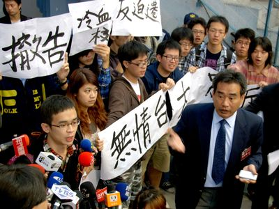

# 偽理性人

在我看來最該指責的就是知識份子的逃避：所謂逃避就是轉離明知是正確的、困難的、有原則的立場，而決定不予採取。不願意顯得太過政治化；害怕看來具有爭議性；需要老闆或權威人物的允許；想要保有平衡、客觀、溫和的美譽；希望能被請教、諮詢，成為有聲望的委員會的一員，以留在身負重任的主流之內；希望有朝一日能獲頒榮譽學位、大獎，甚至擔任駐外大使。對知識份子而言，腐化的心態莫甚於此。」

－引自愛德華‧薩伊德《知識分子論》

有一種人遇到高度爭辯性的議題時，例如近日紹興社區的案子，口口聲聲要人們有禮貌、維持社會祥和之氣，討論事情時要理性至上。「公正、理性、客觀、中立」是他們的信仰。這群人很難接受激烈的抗爭手段，例如黑衣人違反校慶秩序，以及參與抗議的學生各種憤怒的情緒。對於這些，這群人永遠搞不懂，為什麼一件事情不能坐下來好好談、理性地談、拿道理出來談，非要大吵大鬧搞得大家風風雨雨台大上報才要善罷甘休？我稱這群凡事強調行事要合乎體制、禮貌、理性原則且根本拒斥激烈抗爭情緒的人，為偽理性人。

上述界定這群人的方式太粗糙，或許我還得下一個但書，就是這群人認為和氣 (作為一種情緒) 最重要。我很難說和氣、禮貌或理性誰是誰的基礎，但大致上，偽理性人認為，所有談判的準則必須在和氣的狀況下被提出來，而且必須理性地談，也因為理性地談，所以整體而言就會是和氣的。秉持這種信念的人非常多，有許多種變形，舉凡BBS、報章雜誌、各大網路論壇或抗議現場，到處都可以看到這種人。在我開始批評之前，我必須說明的是，我並不認為強調和氣至上的人是不對的，畢竟和氣的、彼此互動氣氛良好的日子誰不想過？我要在這裡對偽理性人提出的批判是，偽理性人夢寐以求的祥和之氣，在缺乏同理與反身性思考的前提下，它根本性地鞏固了這個社會的不公義形勢。

偽理性人是最道地的和平份子，他們所想像的社會是「祥和」的，即便這個社會真的不是這樣，他們也非常希望這個社會正朝著祥和的方向行駛而去，所以他們希望大家都是這樣想：「社會要祥和，不要有紛爭」。這甚至成為他們的使命，成為他們認同自己的一部分。因此，當偽理性人遇到各種失控的場面的時候，包括抗爭場域中各種具侵略性的情緒如憤怒，而他們又無法控制場面的時候，他們會批評這些很情緒化的、非理性的行為。「怎麼可以這麼不理性呢？坐下來好好談啊！」然而，在他們如此要求之前，他們並未真正認知這些情緒究竟是怎麼一回事情，他們只想著，作為一個現代的、有文明的人，凡事就該理性地談、好好地談，最好引用現行的法條來談，在制度中談，但他們卻從來沒有認真地去理解，為什麼有一群人，在此時此地，如此憤怒、如此悲傷。當然，偽理性人沒有辦法閱讀這種激烈的情緒文字，因為這徹徹底底地違反了偽理性人的準則。我猜，他們可能只當這群人一定是無理取鬧的暴民。

台大紹興風波在一個根本八點檔連續劇的狀態下有了初步的協商結果。這個八點檔連續劇大概符合我們的認知，原本無法理解的壞人，最後竟然出面來個大和解，一個掉下眼淚跟大家說盡力支持，另一個則是抱著身體病痛展開談話。我沒有否認這之中彼此所展現的可能誠意，但這故事實在他馬的「祥和」。抗爭事件一定要和平落幕！ (廢話，誰不是這麼想的？) 偽理性人接受了極度祥和皆大歡喜的八點檔連續劇情般的結局，但對於過程中種種失控仍有諸多不滿，例如那些對當權者不禮貌的噓聲和言詞。他們堅信，這些失控是一種問題，是一種態度和尊重的問題。

偽理性人不滿這過程中的「非理性」情緒展演，但對於偽理性人的這種「不滿」，我也很不滿。因為偽理性人所認為的問題，我覺得根本放錯焦點，根本不該指責這群人的激烈情緒，而是應該嘗試思考，為什麼這群人會有這些反應？為什麼會有群人被逼得拋頭露面上街頭？ (要知道，上街頭然後在公眾空間展現自己無助的那一面，是要在心裡把尊嚴給摁著的！) 對於這些激烈情緒的思考，應該把情緒當作一種社會文本來閱讀，而非指責這群人的失控、不禮貌、不理性，也不是將這些令人不舒服的情緒拒斥在千里之外，就算耳根清淨。

偽理性人所要求的理性和祥和是一種霸權。他們不願意瞭解這些激烈的情緒，並將這些情緒給妖魔化，如此作為在另一面根本地鞏固了自以為的「祥和社會」，但偽理性人在還不願意顛覆性地瞭解這些情緒之前，他們根本沒辦法認知到，這種對社會祥和的幻想，究竟是屬於誰的「祥和」？他們所認定的祥和，從來都是沒有反身性思考的，他們從來沒有去思考，這個社會對誰是祥和的而對誰而言又不是。這個問題從來都是被偽理性人所忽略的。

有些偽理性人拒斥閱讀情緒就算了，他們可能根本失焦地戰那些對當權者提出挑戰的不禮貌態度，如此失焦，使得這一運動爭辯的「近用城市的權利」 (right to the city) ，如誰能近用及如何近用這兩大論題，無法獲得社會充分的對話。在這過程中，他們甚至強調自身的客觀中立，援引制度法律條文，展示他們那彷彿是唯一真理一般的論點，截然地告訴你這群居民不該爭，因為本來就不合法，而且這群人有些根本不能算是弱勢，憑什麼站出來搞社運反對迫遷？搞了就說學生民粹。對於這些，反對迫遷根本不是說要這些居民就在這邊就地合法，只是要一隻大鯨魚考量多一點的面向，例如這群蝦米為何落腳於此的歷史脈絡與時空背景等等，再來討論是否有其他可行方案，讓這些有困難的「違建戶」能「合理地」獲得妥善安置。不過這些明明有轉圜空間的各種討論，卻被一些偽理性人單假定人是追求極大利益的動物來說這些都是別有居心都是居民為了利益，這麼說一點實質意義也沒有，偽理性人只是再一次忽略口口聲聲說的那群弱勢者，並沒有去同理去瞭解，而只是用這種「並非全是弱勢」的說詞否定了那些發聲主體。而且凡事如此假定人們出面爭吵是為了獲得不當利益，那麼當這個社會對你我不公的時候，誰還敢出來向這個社會提出挑戰？一出來吵鬧就一定是要標成「不當獲利者」。如此一來，對於那些備受不完美制度困擾的人們，在仗還沒開打的時候，豈不是都要先揹上這個沉重的標籤？這樣只是再次地去鞏固了偽理性人自以為活得很舒適、屬於自己的祥和社會而已。殊不知，對許多人來說，這個社會從來都不是祥和的，從來都是鬧哄哄的、動盪的，只是站在偽理性人的社會位置上，是看不到這些也無法閱讀這些的。

如同我所說，偽理性人在沒有對自己進行反身思考之前，這群人所嚮往的理性和祥和，只是讓自己與這社會中各種憤怒的情緒隔離起來，如此隔離，使得存在於社會制度裡面可能的不公義遂被連帶鞏固起來。更有甚者，這群不多加思考的偽理性人甚至援引這些制度這些道理來批評某群人為何出來作亂，而不是去質疑這些制度有什麼問題、又對誰有問題。因此，我認為，偽理性人真正的問題從來都是在那未加反身思考的癥結上。由此觀之，可以說，這個社會的問題從來都不是偽理性人所指責的那群出來吵鬧的、被認為不禮貌不理性的人，偽理性人本身從來就是這個社會最大的問題。

偽理性人若對於過程中這些情緒和可能不合理的制度通通不加思索，無法思考甚至不願意看到自己的理性是站在哪個位置上，那麼講再多的理性和祥和，強調自己如何公正客觀，即便奠基其上的論點有多詳盡，看起來又是多麼地有道理，都是枉然。

Via: 文化與地理的關鍵性交會 [http://geosheep.pixnet.net/blog/post/47523262](http://geosheep.pixnet.net/blog/post/47523262)

採編：賴佳翎 責編：余澤霖
