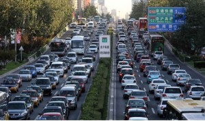
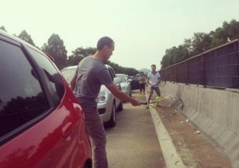
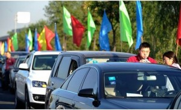

# 免费才是最贵的

**政府请客，车主争抢，乘客被困，路主付账，外人围观。此事不仅关乎百姓度假的质量，更关乎国家交通网络的发展。让我叙述几条朴素的经济原理，祈望对分析“节日高速免费”政策的得失有帮助。**  

# 免费才是最贵的

## 文/薛兆丰

 

政府最近颁布规定，要求在“春节、清明节、劳动节、国庆节四个国家法定节假日”期间，各地“收费公路（含收费桥梁和隧道）”必须“免收7座及以下小型客车通行费”。首次施行，便发生了全国各主要路段的严重拥堵，网上网下议论之声不绝。

政府请客，车主争抢，乘客被困，路主付账，外人围观。此事不仅关乎百姓度假的质量，更关乎国家交通网络的发展。让我叙述几条朴素的经济原理，祈望对分析“节日高速免费”政策的得失有帮助。

#### 一、道路是私人物品

许多人认为高速公路是“公共物品”，所以应该低价甚至免费。这种想法很普遍，老百姓这么认为，知识分子这么认为，连不少学过经济学的人也这么认为。但这是个误会。

公共物品（public goods）和私人物品（private goods），也有人译作“共用品”和“私用品”，是不可望文生义的一对概念。它描述物品“是否会引起争用”的自然属性。具体而言，公共物品（共用品）指一个人使用不影响其他人使用的物品；而私人物品（私用品）则是指一个人使用了别人就不能使用的物品。

旋律、知识、情节、电视信号和国防，都是一个人享用不会影响他人享用的，故属于典型的公共物品。鸡蛋、面包、台灯、领带和轿车，都是一个人享用别人就不能享用的，故属于典型的私人用品。剧院、教育、公园和列车，当争用的人数达到某个程度时，一个人的使用就会影响其他人的使用，所以它们也是私人物品。

公共物品和私人物品的属性，是物品本身固有的，它不以谁提供这些物品为转移，不以人们如何称呼这些物品为转移，也不以人们是否对这些物品收费为转移。例如，莫扎特创作的旋律之所以是公共物品，仅仅是由于它的使用不具有争用性，而与莫扎特的收入究竟来自政府、王侯还是私人无关，与人们是否把这些音乐定义为生活必需品无关，也与莫扎特本人或后继演奏者是否对音乐作品索取版权费用无关。

根据这一标准，道路是私人物品。确切地说，道路是可以由政府或私人提供的，可以收费也可以免费使用的，可以被称为必需品或替代品的私人物品。不少人以为，只要通过讲道理，把道路说成是公共物品，道路就能够低价或免费供应，而没有人需要为此支付成本。这种想法完全是一厢情愿。不管人们选择何种说法，既然一个人占用了道路，其他人就不能占用，那么道路就是私人物品，它就必然符合一般私人物品所遵守的经济规律。

#### 二、拥堵会造成经济浪费

因为道路不够多，谁都想在特定的时间使用，那就会出现拥堵。市区内没有收费站，但只要车辆足够多，也天天发生拥堵。拥堵会直接降低道路的价值。当拥堵达到数十公里长的时候，高速公路当然只是个停车场，不仅谁也无法享受它本来可以提供的服务，而且还不得不忍受它造成的各种痛苦。物理上有形的道路还在，但其实际功效或经济价值却已经荡然无存，甚至适得其反。用经济学的术语来说，那就叫“公地悲剧”或“租值耗散”，用日常语言来说就是“经济浪费”。

谁都不愿意对这种“经济浪费”坐视不理。大家乐于发挥想象力，提出了各种解决方案，从停止高速公路收费、呼吁政府修筑更多的高速公路、增加其他交通工具的供给、减少车牌发放，到调整放假方式以让人们错峰出行、监督私用公车的情况、增加本地景点和娱乐设施的吸引力，乃至改革户籍制度和取消举国长假安排等等。然而，人们没有意识到，这些对策不仅宏大遥远，而且即便实现了，也仍然会出现道路使用的高峰期，令道路产生“经济浪费”的情景。

#### 三、价高者得的竞争准则最经济

事实上，只要是私人物品，就有可能出现争用；而一旦出现争用，社会就不得不采用这样或那样的竞争规则，来替争用者决出胜负，以便让部分人得到使用权，而让其他人寻找其他的替代方案。这就是经济学所说的稀缺。这就是自从盘古开天辟地以来，人类社会乃至动物世界都必须面临的约束。人们无法改变稀缺的约束，而只能改变竞争规则，让不同的人胜出。

历史上，人们曾经选用过各种各样的竞争规则，包括暴力、聪明、官职、出身、性别、年龄、耐心等。经济规律指出，所有这些规则，都会引导人们去参与一些有助于自己胜出、但对他人没有好处的竞争，并由此引致无谓的损失，包括过分强壮的肌肉、不必要的应试能力、阿谀奉承和尔虞我诈的成本以及排队等候的时间等。

相比之下，只有“价高者得”的规则，才能引导人们向社会提供有价值的服务，并用赚来的钱去参与“价高者得”的竞争。当社会的大部分资源都按“价高者得”的方式分配时，整个社会竞争的成本就会下降，收益就会上升。一般而言，“价高者得”是最经济的竞争规则。

#### 四、价格能够改变需求刚性

一些听说过经济学术语的朋友会说，中秋出游是刚性需求。也就是说，无论驶入高速公路的价格被提得多高，人们也仍然会选择出游，所以提价无助于缓解拥堵。然而，这种说法显然与事实不符。

价格波动，哪怕轻微的价格波动，都能对人们的行为产生影响。好的经济学课本会直截了当地告诉读者，世界上不存在绝对刚性的需求，人们不可能不惜任何代价地追求某个目标。用经济学的术语来说，不存在垂直的需求曲线。毕竟，人是善于权衡取舍和寻找替代方案的动物。

据报道，有人为了节省200多块钱的路费，在高速免费期间耽误了探望病危的亲人。显然，此人并不是对亲情有刚需，而是对200元有刚需。各大航空公司出售的机票，只有中秋节晚9点后的航班才有打折。这是说，谁对“中秋团圆”有刚需，就应该不在乎多花几百块；而如果对几百块有刚需，那就应该调整行程，避免购买全价机票。金钱与便利，自古难两全；而人们从来就只有权衡和取舍，而没有绝对的刚需。

广州市政府曾经在2010年亚运会期间，推出地铁免费的“利民措施”，结果人满为患，令地铁系统瘫痪。然而，当市政府收回成命，恢复地铁价格后，地铁马上就恢复了秩序。事实上，广州市政府后来向市民发放人均约50元的补贴，市民拿到补贴后，也并没有拿着那些补贴去争抢高峰期的地铁票。这是说，票价并非在区分贫富，而是区分需求。也就是说，价高者得不仅是带来最少浪费的竞争办法，而且也是最公平的竞争办法。

#### 五、按需分配行不通

即使承认了价格对行为的调节作用，很多人还是会说“出价高的人未必需求高”。然而，除了出价高低以外，我们还能用什么手段来比较人与人之间的需求孰高孰低呢？单位介绍信？官职？离家远近？是否回原籍探亲？熟人关系？

要知道，过去搞计划经济，就是因为人们相信，他们有比“按价分配”更可靠的办法来比较人与人之间的需求，来甄别究竟谁才是“真正需要”的人，来实现“按需分配”的崇高目标。但大半个世纪大半个地球的计划经济试验表明，“按需分配”的甄别成本是巨大的，它给实施的国家带来灾难。直到穷途末路，人们才开始搞市场化改革，重新回到“按价分配””的道路上来。

对此，经济学里有共识，那就是“人际需求不可比（No Interpersonal Comparison.）”原则。我们没有办法比较，富人喝茅台的效用大，还是穷人喝茅台的效用大；我们只能观察，富人是宁愿喝茅台还是买全价机票，穷人是宁愿少吃肉还是宁愿按时回家过节。效用只能自己跟自己比，不能拿人与人比。也就是说，我们永远无法证明，通过价格管制的手段来进行资源（比如路权）的再分配，能够提高社会的总效用；相反，让每个人以自己的财富和收入为基础，分别根据市场价格的指引，来追求他们所希望的消费模式，才能自然而然地达到每个人的效用最大化，那也就是全社会的效用最大化。可见，价高者得不仅最经济和最公平，而且也是最可行的竞争办法。

#### 六、企业投资应该得到保护

据有关统计，中国的高速公路网的全长目前位居世界第一，即使从1988年第一条高速公路建成算起，至今也只是用了24年时间；而位居第二的美国，从1956年国会批准《高速公路的联邦资助法案（Federal Aid Highway Act）》算起，也经历了57年的时间。中国高速公路建设的飞速发展，完全得益于“分散决策、自主融资、用者自付”的经营模式。

上海金融与法律研究院傅蔚冈先生在《华夏时报》撰文解释中国“高速公路要收费”的原因，即在于“欧美等国用于支付高速公路建设的经费是来自于现有的财政支出，而中国的绝大多数建设费用则是来自于银行的借款，甚至有一部分是来自资本市场的融资”，因此“中国的用车者需要在纳税的同时，为高速公路的通行费埋单”。

当人们拿美国和欧洲某些国家的公路发展模式相比较的时候，往往只看到了收费模式的一面，而没有看到发展速度的一面。事实上，恰恰是由于我国采取了在经济上更合理的决策、设计、融资和付费方式，才使得中国这个落后的经济体，在极短的时间里赶超了欧美公路网的建设速度。合理的比较，不是中国目前的平均路费和欧美目前的路费，而是中国目前的平均路费和如果没有这些高速公里时中国的平均路费。显然，没有高速公路时的真实路费，不是很低，而是非常高，乃至无限高的。只有这样看，才能看出中国高速公路网发展模式，尽管具有巨大的改善空间，但也仍然具有很大的优越性。

既然高速公路是由企业兴建的，那就引发一个道德、哲学或法律问题：政府下令，众多媒体和公共知识分子欢呼支持，要建造和运营高速公路的企业在节日期间向车主送礼，这种甲和乙联合命令丙替丁做好事的过程，正当性何在？如果高速公路事后根据发卡数量向政府索取补助，而补助又是从纳税人那里征收的话，那让纳税人向车主送礼，正当性又何在？

我并非一概反对补贴穷人，而是说即使我们认准了节日期间应该补贴车主，把这看作是具有崇高社会意义的事情，那也仍然应该通过法定的议事程序，或从国库中取出钱来交给车主，让他们自行决定消费的方式，或让官员用这笔钱到收费站帮车主购买通行费，而不应该通过价格管制的方式，让自筹资金建造和运营高速公路的提供者们，单独承担资助车主的社会责任，并顺带造成大规模的高速公路租值耗散。

#### 七、高速免费并不额外刺激经济

还有一种观点认为，高速公路免费可以激发富人的内需，为假日经济创造消费。这种说法经不起推敲。如果这种逻辑成立，那节假日就不仅应该让高速公路免费，还应该让飞机、轮船、高铁乃至酒店都免费。

没有哪个国家这么做的，也不应该这么做。因为这种短暂的刺激政策，只会歪曲人们的需求，并排挤其他正常消费。高速免费，确实会增加汽油、酒店、餐饮、景点、商场的营业收入，但这些行业的增收，恰恰来自于高速公路的亏损。如果说这些行业的增收能带来乘数效应，加倍地刺激经济，那为什么高速公路自己的收入就不能带来乘数效应，加倍地刺激经济？

切中要害的比较，不应该是哪种消费具有乘数效应、哪种消费没有乘数效应——因为任何消费和投资都可以具有乘数效应，而应该是哪种消费更谨慎，哪种消费更鲁莽；应该是究竟市场能更好地指导消费和投资，还是价格管制能更好地指导消费和投资。政府乱调一下，凭什么就能刺激经济，而私人小心翼翼，却不能更好地刺激经济？事实上，哪怕再宏大的投资，只要把个人的审慎因素忽略不计，而假定官员能够做得跟私人一样好，就会引致不可估量的浪费。

#### 八、用者自付才合理

在讨论高速公路的建设和收费模式时，我们不应该只借鉴国外零散的经验，而应该借鉴国外带有规律性的经验。在作各种横向的国别比较以及纵向的发展阶段比较时，“用者自付”原则的执行程度，是一个非常有启发性的视角。不难看出，各国的经验都显示，越贴近“用者自付”的原则，高速公路的建造、使用和维护的效率就越高，越是背离这个原则，效率就越低。

美国公共道路局（The U.S. Bu-reau of Public Roads）在1939年给国会递交了名为《收费公路与免费公路（Toll Roads and Free Roads）》的报告，认为通过用者自付的办法是不可能筹集到足够的资金来修筑高速公路的，要修路只能靠政府资助。但次年开通的第一段宾夕法尼亚收费高速公路（Pennsylvania Turnpike）即否定了这个说法。收费公路显然能够自给自足。此后，收费模式立即引起各地的仿效，许多州都陆续修建了完全不依赖联邦政府资助的道路。

后来的州际高速公路网，是由艾森豪威尔总统牵头修建的，其融资方式也是基于广义的“用者自付”原则，即资金只从联邦和各州所征收的燃油税和其他驾车者支付的路费中收取。燃油税则从1956年的每加仑3美分，上升到今天的每加仑18.4美分。而整个高速公路项目，仅仅第一期就用了35年来完成。

在这一点上，中国值得与美国作比较。1997年，全国人大通过的《公路法》首次提出以“燃油附加费”替代养路费，但这一建议一再遭到否决和拖延，这为后来各地自筹资金修路，提供了动力和空间。这毋宁是好事。不难设想，如果全国高速公路网的资金都集中在一个大池里，那么对这个池子里的资金的争夺，将带来巨大的浪费；而高速公路的设计和建设，也将变得低效。

我曾经看过一部电视纪录片，叙述香港商人兼筑路工程师胡应湘在设计广深高速公路时，在望牛墩路段的成本抉择。修筑者若非自负盈亏，他们就不会有足够的积极性在“究竟是绕路而行还是凿通隧道”之间作精心盘算。同样道理，当公交系统以接受政府资助为主要收入来源，而不在乎乘客的车票投票时，公交系统改善线路和搭配容量的积极性也就会大减。越是大锅饭，就越缺乏精打细算。我国将来高速公路的发展模式，假如向“统一征收燃油税、统一规划线路、免费使用道路”的模式发展，那么高速公路网的设计、建筑和运营效率，也将会大打折扣。

美国著名智库出版的《加图决策者手册》，在谈到高速公路的融资方式时明确指出：“州际高速公路成功的关键，在于其用者自付体制，即资金只来自联邦和州的燃油税，以及道路使用者的付费。这不仅确保了人们只是在需要的地方修路，而且防止了成本的过度膨胀。然而近几十年来，国会越来越背离了用者自付的原则，让驾车者支付的税费，用来补贴地铁乘客的费用。这样做不仅不公正，而且还导致了市内的急剧拥挤，以及促成了许多得不偿失的交通建设项目。”美国发生的这种情况，恰恰是我们应该警惕和避免的。

事实上，由于道理修筑和维护成本的上升，也由于拥堵情况的日益严重，包括美国和德国等曾经一度以提供“免费公路”著称的国家在内，世界各国都逐渐在向“用者自付”收费模式靠拢，具体的做法包括批准更多收费公路的建设、征收高额的停车费、对运货大卡车实施收费、容许部分车道收取拥堵费等。是的，人们有追求免费服务的自由，却没有逃避付出代价的自由；而如果人们选择了一种效率更低的发展模式的话，要付出的代价就只会更高。

#### 结语

高速公路收费，有两个独立的理由。

一、投资者有权收费。高速公路由分散的地方政府或企业进行融资、建设和营运，比由中央统一运作，更贴近“用者自付”原则，更能降低寻租的成本，提高资源的使用效率。前者应该受到鼓励和保护。只要高速公路是由地方政府或企业投资的，不论是否出现拥堵，投资者都有权收费。中央政府就不应该以行政指令的方式，强行剥夺投资人享有收入的产权。

二、出现拥堵就应该考虑收费。不论高速公路还是市内道路，都是具有“一个人用了别人就不能用”的性质的私人物品。所以只要发生严重的和惯性的拥堵，那么哪怕它的产权不属于私人而属于政府，也应该通过收费的方式来调节需求，从而减少道路因拥堵而造成的经济损失。政府由此增加的收入，固然应该和政府其他来源的收入一样，得到恰当的监管。但如果仅仅因为担心增收得不到适当的监管，就放弃用价格来调节拥堵的功能，那就是因噎废食，错上加错。

只有看清免费公路的全部成本，才能理解它为什么是最贵的。

 

（采编：彭程；责编：佛冉）

 
