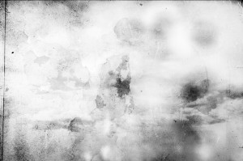

# 共青城

_“用不着你们教我如何悲伤”_ ** **

自杀是一种社会现象，也是医学问题。自杀意念是抑郁症主要症状之一，抑郁症与自杀之间存在密切的关系，抑郁症患者甚至视自杀为一种解脱。——《现代生物医学进展》

这是一个真实的故事。

接到儿子班主任的电话时我还在上班，她的声音断断续续，一连数日的大雪让电话线路有些吃不消。放下手中的书，隔着县医院薄薄的玻璃，电话里随即而来的忙音盖过了窗外簌簌的白。

街上死寂一般，不见一个行人。四境已是冰冷刺骨，尚明的路灯里电流叽叽喳喳。我想起外公的鸟，丑陋而聒噪，日里也是这样的叽叽喳喳。后来我与邻家的惠索性弄死了它，埋进后院的海棠树苗下，尔后便是被外公发觉，少不了一顿耳光，惠也被呵斥，后来便不再与我说话。

外公去世后的第二年冬天是全家的大日子。客家行捡骨礼，掘开坟茔，取出尸骨置于瓮中，再覆朱砂于骨殖之上，遂深埋立碑，乞求逝者庇护子孙后代，昌盛延年。二舅刨出那口褐色松木棺时，廉价的木板完全朽了，母亲上前启棺，不料脚下冰雪泥水一滑，一下跌倒在棺木正中，顷刻木片四散。

“爹！”

母亲惶恐地大喝着，瘫软在地上。舅舅们上前一看，也纷纷后退，连连嘀咕着阿弥陀佛，阿弥陀佛。外公的躯体僵卧在雪地上，腐而不化，双目变成两个黑洞，嘴角撕裂大开，露出两排惨白的牙齿和口中黑黢黢的舌头。老人们说起过，这是荫尸，皮肉不烂定有大恨，以至成了恨性八煞。若不火焚，恐后世家业都要被他吃个精光。

母亲哭着把一张黄色纸符压在柴堆上，外公依然直挺挺横在枯枝败草间。我不禁想起他在世时的模样，反而更喜欢现在的他：一声不吭，咧开的大嘴并不像大人们眼中那般恐怖，倒有几分可笑。两桶柴油过后，呛人的尸臭与焦糊味弥漫进我整个冬天的童年。

再后来，外公的鸟儿统统安眠在后院的树下，那株海棠愈发繁盛，年年新芽，岁岁开花。

说起惠，便是多年后冬末的事了。放学后我与她一起回家，过了破石桥的桥洞，再睁开眼，除了白色便只剩下几条乌黑的车辙印。我想站起来，不料额角一阵剧痛，几绺红色滚烫了半边脸，一番挣扎后还是匍匐下来。惠昏倒在桥下，上衣凌乱，至于裤子，完全成了一块破布，在枯黄的灯光里呼扇呼扇地，被风一卷，又撕出一道更大的口子。

在那个年代，流氓罪往往会被处以死刑。我知道警察局离这里不远，西郊的刑场也许久不闻枪声。我甚至可以欣慰地设想那伙人要面临的下场，跪在石墙边，一声响，一个窟窿。无奈我模糊的视线与轰鸣的脑袋终究记不清他们的模样。一如他们手持坚硬的车锁，呼啸而来，呼啸而去。

漫长的冬天是我消沉青春的起点与终点。惠不过是我幼年的短暂玩伴，少年时期的同路人。出落成少女的她长相平平，孤僻而少言寡语，除了路上的结伴而行，我实在想不出那日挺身而出的理由。总之，后来她再也没有在学校出现，家中也人去楼空。听说惠叔在省城谋得一个好位子，几年后甚至调往北京。九十年代初的同学会上惠也不见踪影，她兴许在京学业有成，兴许，死了，谁知道呢。

班长送来一幅画作礼物，画色黯淡，已经升任校长的班主任却喜欢，一扫墙上贴得乱七八糟的文件纸，把画不偏不倚挂在正中。寒暄后大家争先与班主任拥抱，不想她却提起强子。除了惠，唯独剩下强子不知所踪。

强子蹲在厕所最后一个隔间里，班长把门缝飘落的一叠草纸扔给了我。四五个男生的笑声中，我把草纸揉成一团，转身扔进了垃圾桶。那个下午，强子带着裤后大片污痕和一身臭气，惹得众人连连侧目，当然，这是常有的事。

我记不得强子第一次说话是在哪年哪月，教师们认得他，也自然识相地放任其连堂的沉默。那是绝对的沉默，安静到令人不安，低着头，身体缩进末排的墙角。这是班长的指示，后排的垃圾总是需要清扫的，而强子作为所谓的卫生委员总是长期连任，举手表决，全票通过。尽管在那个普选与民主尚是舶来品的年月，进步总是在小范围内循环着。不错，我们也恰恰需要某个人，以此突出其他人的团结与集体的伟大。

班长被市纪委双规时我曾为他感到惋惜，临近毕业我们的交情不错，每每回忆到此也总是闪过强子的面孔。那是强子的第一次抵抗，若不是因此，很难有证据表明他曾在学校与大家朝夕相处多年，多年来我们只知道他仅仅是一个强子。

强子被我们逼到门后，没有一丝表情的脸上分明可见上次意外的瘀伤，上次是哪次，大家都忘了。男孩子，打打闹闹在所难免，总之，我们总需要一个人来承受意外，以此证明其他人的勇敢与伟岸。

“你小子，记仇是不是？”班长把四周窗帘拉紧。

“不是……”

“你他妈说什么？”盛夏的阳光钻透窗帘，把班长的影子楔进黑板里，拉成一根锋利的线。

“不是……”

“大点声！”

“不是……不是我……”

“放屁！”班长咆哮道,“只有你经常不出操，总在楼道里闲逛。如果不是你，这钱还能自己飞了？”

“我……”强子依旧搓着衣角。

“他妈的，给句痛快话，到底认不认？”

班长把一份保证书交给了班主任，保证书的页脚赫然是强子歪歪斜斜的签名。

“团费是他拿的？”班主任接过那几页皱巴巴的纸，摇了摇头。

“是，不过，强子家也困难，有情可原。我们权当捐款，再交一次就好了。”班长的笑容僵了一半又咧开一半。傍晚，我们吃到了班长承诺过的冰棍。

那是强子第一次与最后一次与我们讲话。后来，他的身影从学校抹去，班主任说他也许因贫困辍学了,也许……有同学见他每日清晨依旧背着书包漫不经心地向学校走去，却止步在百米开外的土堆后，坐在那里静静眺望校门，直到黄昏，背起书包缓缓离去。

儿子出生后不久的一天，我无意中打开电视，忽地迸出强子刀刻一般的脸。那是县法制栏目，主人公正是强子，一个杀死全家的嫌疑犯。镜头走进溅满血迹的棚屋，死者的头发大把大把地散落在地上，有的花白，又不乏缕缕青丝。这贫穷与肮脏困扰的十余平米小屋里，实在想不出会与惊动全县的刀劈斧砍联系在一起。视角下的几个民警，还在不紧不慢地拍着现场的照片，领头的在窗台上掐灭了烟。

强子的尸体顺河而下，直到卡在了水库闸门上，被夹掉了半身。电视采访中不慎切换到了尸体的模样，被泡到肿胀的脸上，嘴角撕裂成一个大张的洞，一个开怀的笑。医专毕业，参与过急救的我不禁叫出声来，妻子睡眼惺忪地爬下床，关紧了房门。

教师和校医把我领进了校长室，还是熟悉的地方，甚至连陈设也不曾改变。陌生的校长抬眼瞟瞟我，从门外带来了我的儿子。他右手攥着一把裁纸刀，眼睛死死盯着闪过暖光的刀片，又看看左手的指尖，腥红从上面一点点浸透包扎后的纱布，咧出一张婴儿的嘴。儿子看看刀，嗤嗤地笑。

“他……是怎么回事？”校长的脸上堆满惊愕。

“没事，我已经习惯了。”

墙上还是那幅名画的仿制品，蹩脚的画工，却有着荡气回肠的题字：大河上下，浩浩长春。

这是一个真实到恍惚的故事。

警方在强子的衣袋里搜出了一张被水泡烂的纸片，那似乎是遗书一样的东西，人们小心翼翼地展开它，上面只有一句话，却怎么也看不清了。

 

（采编：欧阳银华，责编：周拙恒）
