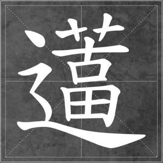

# 其他人的生活

现在人讲究混圈子，演艺圈，主持界，高翻，同传，背包族，山地，摄影圈，创业圈，金融圈，炒股圈，旅行圈，吃货圈，文字圈，八卦圈，PHD，留学党，媒体，体制内，世界飘儿。。。太多了，我的各种朋友们都在以上各种圈子混。

说其他人的生活，当然我说的就是我的朋友们了。

我的朋友或“好友”种类琳琅满目到尽管不算人生百态也是九教八十一流行行都有。有什么事我都先在人人上发个状态吼一嗓子，特别给力。所以如果你看我的人人网，会发现我一会儿高山流水，一会儿地痞流氓。其实我的人也是这样的，就是没什么固定的样子。

一百个人里分别有两个智商高出和低于其他的，剩下的是你我这样不笨也不天才的凡人。但是我的好友栏里，不幸汇集了太多来自世界各地的百分之二，人称大神的双手双脚数不过来，还不泛有天才级别。是真的。

如果你花一天时间跟我在一块浏览我的校内通，你会知道此时此刻世界各地区正在发生的事。如果是发生在民间的新闻，我一定是最早知道的人之一，几小时后你会看到当地的媒体报道，第二天会有国内媒体的报道。从那一刻起你会不再相信媒体。如果是国际性的官方大新闻，第一时间你就会看到来自民间的更靠谱更有实力的评论和分析。

你会看到总是有人发来各大展会，奢饰品发布会等等的第一手资料和照片，有人出人联合国总部，有人开飞机，有人开房车满世界走，有人正在阿尔卑斯山上，有人正在拍电影，有人说模特不听话经纪人不好当了，有人在非洲打鸟喂狮子，有人一天之内飞几个国家。有人又出了本书要做宣传，有人今天采访了谁。如果你看到那些字里行间涉及到商政文艺界的名人，或者外国某部长，一定不要惊讶。很多人退学休学，很多人毕业后去学厨师，有的人是世界飘，整个世界都是他们的游戏场，飞机当公交车做，出国像去菜市场。有的人搞投资，一会儿矿山一会儿电影。有的计划着在希腊买岛，有的在办移民。PHD博士一大堆，世界名校一大堆。有的刚接生了一个婴儿，有的刚策划了一个婚礼，有的刚给人做了一个手术。有的在赛车，有的在潜水，有的在盖楼，有的在搬砖。有的在办杂志，有的在开公司。有的刚刚在欧洲某个小岛上蜜月结婚，在城堡里拍了照片发了人人。有的在策划奢饰品战略，有的在买。有的正活在地震的恐惧当中，有的正遭受飓风，有的刚刚投了一张总统选票，有的刚给某某领导人做了随行翻译。有人刚失恋，有的在加班，有人同时约了几个炮友。有人刚摸了一把泰国人妖的胸，有人刚跟苍井空谈完活动。。。。

每一天我打开人人，世界各地的美食美景美人，世界各地的抱怨和牢骚，都铺天盖地的不停的在我电脑右下角跳出来。上面说的那些，就是我每天看的东西。他们年轻、美丽、有为，他们漂泊、努力和辛苦。

他们或多或少做过百里挑一的精英，或多或少现在正是很多人喜欢的大牛和女神，或多或少正在奔着那条路上走去。如果你对此噗之以鼻，我想告诉你，他们要比大多数人睡更少的觉，付出更多的辛苦，有过更多次的崩溃。半夜三点不睡觉，你以为人家在多塔嘛？！还傻呵呵地过去“你也没睡呀~我也睡不着哎，能陪人家聊聊天嘛~~”，能长点心嘛！

先不要忙着怀疑他们的真实性，what if i told u these motherfucxxxs r my real friends 

说了这么多你不是以为我在秀优越感吧？废话有这样多这样好的朋友你不要秀一下嘛！

但我要说的不是关于如何优秀，说真的，把世界上最好的香撒在你房里，闻个十分钟你也闻不出那个味道，闻个五天你就闻不出它的好来。我不但不觉得那是优秀，简直认为那是正常的。给我一个一整天看韩剧无所事事的姑娘，我才觉得她够特别够奇葩。

我既看到他们身上发的光，也看得到那些不忍直视的血和泪。所以我才知道他们就是人。所以我在看人的时候，从来只看人。

真正优秀的人，优秀的不是他们在TOP几的学校和公司做什么样的事情。优秀的是他们自己，是他们的为人处事，他们扔了一切光环在任何一个地方从零开始都会以最快的速度成为最优秀的那个。他们不穿任何名牌在任何一条大街小巷坐着聊天，你路过时都会知道那不是平庸的人。

我看人，常常想当他什么都没有什么都不剩的时候他还是什么。那个真正的他，有时候他自己都不知道。

人无癖不可交，以其无深情也。

我以为人是一定要有一些畏惧和鄙视的东西，这样他才可以活的正常和正直。

无所畏惧和无所鄙视的人，他们可以为了他们想得到的东西去做任何事情。

有时候我会不屑一些好像我完全没有权利和资格去不屑的东西，比如优秀。

人们把“优秀”给妖魔化，奔往优秀那条路上的人们在途中不断的变态——他们叫这个蜕变。

我有点像在银行工作的人，每天大把大把红色钞票从我手里眼皮底下过，虽然知道那不是我的，但我至少知道它是怎么回事。

优秀是一种人生态度，悠闲也是。

你要事事最好，我偏要事事舒坦。

千万别比较，千万别励志。看到别人有什么梦想，自己也定那样的梦想，既认不清别人，也认不清自己。去一趟商业街，发现现在的姑娘不但衣着发型很像，连长相也越来越相似了。连模样也有潮流，也要跟风。

比如我写这篇东西，发现就跟某些人写的好像！ 

如果此时你正在挤北京地铁，在熬夜加班，在苦逼赶paper，在说“我了个去让不让人活了”，在想你也很努力了，我想说的是，你们的努力，跟人家的努力是不一样的！

真正优秀的人，优秀的不是他们在TOP几的学校和公司做什么样的事情，优秀的是他们自己。是他们的为人，对人对事的态度，他们扔了一切光环在任何一个地方从零开始都会以最快的速度成为最优秀的那个。他们不穿任何名牌在任何一条大街小巷坐着聊天，你路过时都会知道那不是平庸的人。

如果你还在问那努力和努力有什么不一样！！！

你难道没注意到人家努力的背后都有一个曾经比他们更努力的爹（妈）或爷爷（奶奶）吗！！（我为这句话的委婉感动得快要哭了。）

再讲一个故事：

有一个男孩子，虽然很穷很苦逼，但他有才华，很努力，一直相信自己，相信未来，相信幸福和爱情！

最后，他依然很穷很苦逼。完。

这样的故事太多我简直不忍心往下写。

我说的故事里既没有希望，也没有爱情，也没有奇迹，更没有未来。因为以上都不是故事，是每一个此时此刻的生活，是每一个生活背后的有血和肉的人。

我说这些故事的目的，是听到很多人在抱怨生活。我要说的就是：“第一你没资格抱怨。第二你没资格抱怨！”

让生活回归生活，让自己回归自己。

热爱生活，有本事让它们充实饱满，有本事让它也爱你，这就是活着的尊严和底气。

珍惜你自己，别用尽了你的独一无二去成为别人，生的就不一样人干嘛要拼命活的一样？自己的路不好好走看到别人的路很好玩就要摸爬滚打过去？活在自己眼皮子底下就好了，用别人的方式活你活不过人家的。

世上原本只有活着，总拿眼睛看别人，就有了生活。

世界原上本没有深沉，话总说一半，就

（采编：佛冉，责编：佛冉）
