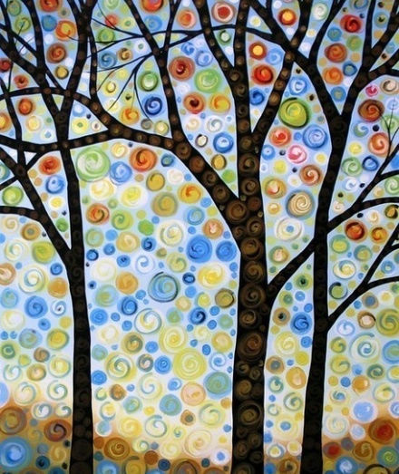
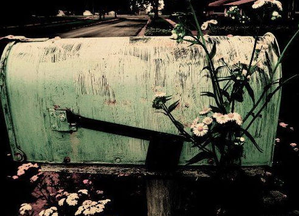

# 再见，酒精

** **

你让我的欲望苏醒，我会走向你所在的地方，未曾动摇我们间有百万英里之遥，请靠近我，靠近我。我没有家庭，也没有其它爱人，因为你给我的感觉不容混淆。

——恶汉

不得不说，酒精是我见过的人造品里极好的一样。因为在很多的时候，过度的清醒所带来的麻烦要比好处更多：零散的记忆就像镜子的破片，我向它看去，时而能看见通往别处的门。而如果我的记忆毫无偏差，它们也就失去了光亮，不再充满创造力——就像在某个故事里描述的那样：思索的时候，总是要先忘怀事物间的一些细微差异。而对于酒精，帮助别人达到这样的状态轻而易举。

不过，酒精也有着非常糟糕的一面：一来，醉酒是一种十分不舒服的感觉；二来，它总是让人为之倾其所有，却终于一无所获。同时，胃痛的隐患如有毒的孢子一般，悄悄地隐藏在体内，等待着某一天，它将从人们将要腐朽的身体中萌发。

为了更具体地说明，我会在这里给您讲述我一个关于酒精的梦。

这里就是蔷薇街了。这是一个怎样的世界啊：每件物品都有着永恒却无助的灵魂——无论是一支钢笔，还是一盏台灯，都是这里的居民。他们每天便在蔷薇街的旧黄砖上走来走去，每一个人都仁慈善良。但是，如果他们不慎展示了自己物品的特性，便会立即死去——这么说也许你还是不明白，但我曾经亲眼看见好几条人命坏在了我的面前。你知道么？我的一个朋友只是哼了个小曲就倒在地上死去了，变回了一支喇叭，而他的灵魂去了哪里呢？谁也不知道。而我，只是一支从不书写的钢笔而已。每一个人都在永生和本性的跷跷板上小心翼翼地活着，保持一种微妙的平衡和停滞。所以，我也只是每天坐在蔷薇街金色的街角，一边磨着玻璃镜片，一边同我的邻居们聊着这里发生的一切。让我们开启一个轻松些的话题：如果你想在蔷薇街生活，你就必须认识一个人。谁？他没有名字，也许他就是“谁”？哦，他是一张纸币，大家更愿意叫他“恶汉”。恶汉一直活得很好——当然了，他可从来不花钱。哪怕是一分一毫，你绝不会看见他从钱包里拿出钞票。谁让他是纸币呢？几乎是在神赋予他灵魂的时候，他作为恶棍的命运就开始了。记忆中的他穿着白色的衬衫，灰色的西装上衣，黑色的裤子和皮鞋。当他站在那里不动的时候，总是会把重心压在右腿上，左腿微微弯曲。无论是他整理领巾的姿势，还是取下毡帽扇风的样子，年轻人都热衷于模仿。他威风得像天上的太阳，明晃晃地走在街上，谁也不敢直视他。他出门又回家，仿佛太阳升起又落下，直到他陷入情网。也许像阅读，也许像旅行——我对恋爱的感觉真是一无所知，因为蔷薇街所有的姑娘都在银色街角的妓院里。所谓“妓院”更像是商店，区别是：这里的商品都是有灵魂的，它们变成了姑娘。你若是要买走她们，她们便无疑展现了商品的本性，你就只能看着她们迈上死亡的路，一去不复返。所以，就像死囚临行前获得的温柔一般，这里为爱情付出的努力只是徒劳。

恶汉却千真万确爱上了那个姑娘，她是一小瓶香槟酒——爱情啊，总是多灾多难。恶汉对于商品从来都是抢的，因此如果他把这姑娘抢出来的话，无异于要了她的命。那买呢？这可更是个“好主意”，他们正好可以一起死去了。

恶汉曾给姑娘写过一首没头脑的诗，原谅我糟糕的记性。而我也不能在这里给你们写出来，因为我是一支钢笔。我没有说谎，我的额头上没有因为谎言留下哪怕一滴露珠。为爱忧伤的恶汉终日躺在椅子里，不久后便令人惊异地死去了。

唔，这就是这个仓促的梦的全部内容。我恶趣味地揣测了神通过这个梦传达的信息——就像每个缺乏远见的人一样，最终，我欣喜地认为我掌握了这个梦的秘密：停止对酒精的思念，就像圣人们教诲的那样。我便挺起胸膛，仿佛身后就是恢弘的万神殿，向酒瓶宣读了神的旨意，决意与它们告别。

也许你没看到，也许你看到了——我说我的这个举动是“缺乏远见”的。之所以这么说，是因为不久以后，我又做了一个模糊不清的梦。那是一间破败的房子，它坐在泥泞的道路边唉声叹气，似乎不知要往哪里去。我走上前细细打量，瓦片已经被风掀去许多，仿佛旧毡帽上被细心的虫子蛀出的窟窿。墙壁尚且完整，不过有些地方布满了经年的伤口，露出了里面枣红色的砖块。门则半开着，或者说是被卡在半开半合的地方再也无法转动。一切看上去都陈旧而坚实，对于我的到来也无动于衷——带着好奇走进这屋子的风，也许也并不止我一个。

我走进屋内，一张落满了灰尘的椅子便呈现在我眼前：灰土和椅面间，隐约可以看到些什么。我俯下身向吹去灰尘，想要一睹究竟。可是，越是细微的动作，就越禁不起分毫的不当：要看的东西和灰尘一同扬起，我定了定神，发现那是一张纸币。

我好心的把纸币吹到了路上，一路护送它去往前方最近的小镇里——我一厢情愿地觉得：让它展现自己的本性是一件好事。我们在小镇的黄砖路上漫无目的地走着，忽然一个连衬衫扣子都系不好的醉汉不知从哪里撞了出来，绕到了我的前面。他拧着丑陋的脸笑着，发出令人生厌的笑声，显然是发现了那张纸币。他得意地捡起纸币，随即向街的另一端快步走去。我尾随其后，来到了小镇另一端的商店门口。看上去迟钝的醉汉此时迅速地付钱买下了一瓶香槟，满足地离开了，来到一个垃圾堆般的死胡同里，开始痛饮。嘴角汩汩流下的香槟一滴滴地落在硬币上——就是从醉汉手里滑落在地上的硬币上。

在他喝完的时候，我看到墙角有一个废弃的路标。我走过去想看看上面的文字，却忘记这里是一个会让风停下的死胡同……

“如果上面写着蔷薇街会怎么样呢？”

（采编：应鹏华；责编：麦静）

 
