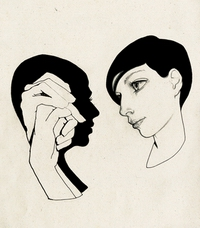
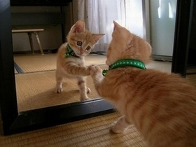

# 再高明的骗术，也瞒不过鲜血淋漓的生活

自大二军训以来，我有5个月没有动笔写东西了，这恶果，就是积攒、沉淀下来的许许多多记忆碎片，即便用尽全力把他们拼接成像样的影片剪辑，却只能让其中极小的一部分顺畅地播放，大多数，已然发了霉，不再是可口温润的记忆面包了。

这发霉的菌落里满眼是“欺骗”二字，固然这有些倒胃口，却很符合发霉的本性。一二三四部分是分离的，小清新可以直接试试第三第四部分，第一第二部分主要是写给初中同学，因为我似乎忘记在聚会上讲讲自己的见闻了。既然已经决定矫情，那就拿那些碎片般的话语，开始行文吧——

** 一、四个人的法医学，寒假十日见习**

**“就像CSI里反复强调的，‘我们是科学家，而不是政治家’。不过即使如此，现实还是比不上美剧理想。”——瑾**

枯燥的复旦医学院除了那些亟待修缮的、古寺般死寂的楼宇需要吐槽之外，唯一能留下一些期盼的是修建了一整个学期的篮球场，复旦留给医学院校区的期望值是如此之小，让枫林的一切都憋屈、自溶然后消化在这个小小的象牙塔里。

这大概就是我申请寒假见习的一个初衷：我需要一个更充分理由，让自己看起来像是在干活，而不是每天无所事事。这结果，便是10天里8点不到起床，5点下班回校的生活。

——2013年1月21日，申请在系里打下手的工作如期开始执行，这份见习，构成了那些我要说的“骗局”最细微的开始。

首日在车鉴组办公室阅读了大约30份车检的报告，而后搞定《法医学概论》教材——书末那些一份又一份冰冷的尸检和事故报告并无多大的借鉴作用，但真正工作处理的时候折射出来的，根本就是在鉴别这个复杂的社会中，每个个体各自逃避责任的方法。每个人都自作聪明，那些没有第三方的事故中，较年轻者几乎总是沦为受害人，或被诬陷，或被抵赖。那些轮胎上的血印子，都是“责任”这个词被孤立之后飞溅的火星，在照片里，像是僵直的战士。助动车单车的事故，车主拉上身边路过的骑车人，让我们验证碰擦，那飘渺的痕迹，根本无从取证，最后信手了结，交给警方判定事故责任。

似乎意图骗保的丰田车左一下右一下的奇怪撞击痕；上海地铁四号线微博管理员，年仅26岁的姑娘蔡方唯一，走在人行道边被大客车侧滑挤压在电线杆上严重内出血和挤压综合征身亡，身上缝合创口无数；摩托车驾驶员高速撞入集装箱挂车后部，头盔碎作数十块；六车道的七星路，一雪佛兰越野车经过，没有机械故障、天气原因和灯光原因，也没有酒精和疲劳因素，越野车竟然骑行至人行道、将一名在人行道上扬招的男性当场撞死并撞毁4道机非隔离栏。第二周的尸检组见习，仅4天就呆了10余个殡仪馆的冷藏室，头部碾压身亡、内出血、颅缺、多出骨折畸形者成百。上海市，道路交通的危险程度，远远超乎我原来的预料，以至于我甚至觉得，曾经我们吐槽的那些宣克炅学长的报道，实乃沧海一粟，其惨其烈，多数隐瞒于世人。

——或许人生来就有一个定数，或许哪个时刻里，一个司机的走神或者操作不当，就会让你的那个定数提前了结。没有任何影响司机判断的因素，只有“不幸”二字，能代为叙述。

然而这或许还是浮于表面了。有时候一份报告本身，也只不过是一个责任的转嫁者。中国的法医学鉴定有那么一部分不是出于人们期待的那些东西，譬如正义感，譬如道德原则，譬如法律。由于公检法的混乱分割，鉴定和报告的职责，是把所有的事故和伤亡转交给警方，让他们来处理这最后的责任。证据科学在无法履行进一步职责的时候，安慰自己：我们陈述事实，但我们不分辨善恶。正确，而非正义。

尸检最后一天里，跑了宝钢医院、宝山中心医院、南汇、青浦殡仪馆，见习的最后一站是中山医院。下午5点30结束在法医学系的见习。虽然没有机会遇到解剖的例子，但是抽心血、看到颅中窝、颅底出血造成的双眼青肿、裂创、擦挫伤，一并在尸体上摸到骨盆骨折、小腿/上臂畸形，也算是在最后一天里学到很多东西。这最后一天上海的天气甚是糟糕，行程又辛苦，下午1点30才吃上午饭，深感职业辛苦。

最后，再回到瑾在本段首的那句话。你知道，每个人都期待工作的简易和高效，但如果这种高效是由于职责分配的不明显而使得区分混乱、各方均逃避而带来，我这个新手，在一个道德至上的体系里，只能作营营的飞虫，那些看法就如同我微薄的生命，终究，只能“营营”。

这样，就自然叙述到了下一段。

**二、道德和规则的面具，血腥的狼人游戏**

** “本朝推行伦理道德以作为治国的标准，收效不如理想，可是也别无更好的办法。”**

** “有’阳’则有’阴’，既有道德伦理，就有私心贪欲。”**

**——黄仁宇《万历十五年》**

本段，将是本文的重点论述，事关道德，我自己这个畜生，以及许多糟糕的鲜血。

这般开始：根据学长的透露，上海市有三处拥有司法鉴定资格的机构，分别属司法部市检局、复旦大学司法鉴定中心、以及华东政法大学。

在如上三处的鉴定，以死因难定的尸体解剖为例，一例解剖委托书在市检局也许上万，而复旦约为两千；一例尸表检验在复旦约为五百；然而这之中，最奇怪也不合理的是，市检既然隶属司法部，作为国家司法部是不能开具任何具有第三方法律效力的鉴定报告的，而他们的收费，则着实高得惊人。

——国家司法部，难道可以称作第三方吗？

但有趣的是，我们这个国家如同1587年的明朝一样，跟着惯性走，苟延残喘也并不显得跌跌撞撞，在如此这般的事情上，早有惯例可依。换句话说，道德至上的社会里，道德显得那么微不足道，而规则又根本没有价值，一切都有成例，何必纠结于那些细枝末节？大家习惯了，也就不纠结有些部分究竟是不是国家所有的，他们要做些公检法鉴定，也顺其自然，墨守成规。

然而我们都已经不再是躲藏在高中这样封闭的象牙塔里的莘莘学子了，每个人都幻想着一些羽扇纶巾的梦，慷慨激昂，又受到八荣八耻的和谐感召，深深地打下了道德教化的烙印，满脑子逆袭的梦想。我也是如此这般的人之一。我们从小生活在追求优秀的游戏里，接受洗礼，追求高尚的美德，以为这个世界的根本秩序要依赖每个人心中那个仰望着的星空以及道德来完善和维持。结果呢？

常远老师的那句话我至今仍然印象深刻，“那些寄希望于自身素质完善的人永远没有好下场。过度苛求人性的自觉而非制度设计，历史上从来都是灾难。”

我不知道是否是我过于悲观，我逐渐开始发现，在一个道德至上的社会里没人可以改变自己的命运。社会阶层，早就决定了一个人的上限。你的家庭伦理，社会伦理，生命伦理，都指向着一个伟大和谐的支那，一个不解体就继续逶迤前行的庞大、古旧的帝国。我为了这个帝国服务，为了那些标准而表现出自己“阳”的一面，乃至屡屡“讪君卖直”。

但同时我早就学会了，“话语是一套，做法是一套”，这样面具形式的生活。这个过程如同一场血腥的狼人游戏，对着不同的人，说着不同的话，露着不同的嘴脸，背后干着不同的事。我生活的道德环境，教会了我必须在合适的场合维持自己的礼仪和道德，但私下里我绝不会手软放过任何可以践踏他人的机会——你死我活的观点和生活，是不是太过血腥？

——不。我一向认为没有体会过一件事的人永远不能说出这件事的感受。一如赚钱打工，一如家庭责任，一如爱情。一个人知道钱是不是真正的血汗钱，只有他经历过才能知道，一个人知道家庭是不是真正简单的相濡以沫，只有他煎熬过才能知道。

而我，恐怕还只是在做一个狼人游戏里的影帝而已，然而在生活中我愈发地入戏，愈发地变成自己当初厌恶的嘴脸，却心安理得。原因是，我的丑恶，并不会展现给你看。

我是一个支持支那解体的人，但不代表我就对历史这个烂泥滩下了“体制完蛋”的赌注。白天，我依然是鼓吹道德教化的汉族人；子夜，我完全可以问心无愧地认为，有些民族，天生是活该被屠杀的，一如斯拉夫人和犹太人。

这些话，有真有假，道德人士很习惯于设骗局，欺骗别人已经成为我的秉性，两面三刀，攫取利益，结果就是成了现在的样子——我深深被马基雅维利和1984吸引，尽管读他们已经是若干年前的事情，但面具早就厚得附上了一层油脂，成了我脸面的一部分。有时候我甚至不知道我是在说真话，还是在说假话，只要目的达成了，谎言并无大碍。

在这里，我猛然想起来袁涛这个学长。

北斗试图给袁涛这样的校园公知做群像的时候，我并不感冒，但是《浪潮》开出来一个坏头，让我对袁先生的为人感到嗤之以鼻——如此做，你是博得了同情和关注，但你的实际动作何在？南区筷子事件之后，你的游行是儿戏还是喧哗，你的网站的技术人员又在何处？看看万门大学的童哲，看看掷出窗外的吴恒，巴黎高师和复旦都不是坑蒙拐骗的旗帜，而是技术派、实干精神的源泉。

然而，袁涛真的就是一个激进的小丑吗？

袁涛恐怕早就是每个道德教化下的“人”的一部分了。

那些受人追捧而质询的复旦的问题，是教育顽疾，复旦的插班生事件不得理不饶人，我的高中校友的遭灾让我也很愤怒——然而，亲者痛，仇者快（谈修齐语），何尝不是生活消费点的一部分。袁涛把自己打造成一个自媒体，吸引了南方人物周刊的专访，虽然三番五次的无耻行径和自大表现让人厌恶，但也博取了甚多的支持者、同情者。

在这里，“复旦”两个字，是袁涛最依赖的东西之一。

引回我在本段讨论的道德教化问题，支那的道德教化很大一部分是“有知识的压制没知识”，自那之后知识分出了级别等第，高级的知识分子压制低级的，而再后有了学校血统论，有了陆遥遥“看出身即可断人优劣”之良方。

多么聪明的举措，“复旦”就像一块蜜糖，哪怕她早就被苍蝇们沾满了茅坑，仍然吸引了无数营营的飞虫，而真正的战士们，反倒不那么依赖道德教化，而是一心地专注在技术、实用和其他的问题上。

如要再有一例，不知缪赟同学对海风和文科生的讥讽鄙夷可否成例？“文科生永远不如数学生”和“数学生学什么都能行”的思路，和道德教化下的思想如出一辙，而言论之偏颇，也深得“讪君卖直”的精髓，恰到好处的引起了争论和关注。

嘴上一套，背后一套，尝到甜头的人群里，我也站在那里，抬头推挤着，要分到阴阳两面的羹——然后，羹洒了。

我意识到，我得真实地活着，健康，正能量，而不是抱怨和钻营。

这一切，在最后一段说。

**三、那些一直很乖的孩子，和鲜血淋漓的生活**

**“刚才跟你讲话的是你爷爷，还是外公？”——轶凡**

2013年2月3日，轶凡在初三五班聚会之前突然来了这么一句。

看似轻飘的一句话，我这个矫情的贱人却有点郁闷。那明明是我的老爸，52岁，1961年11月的老爸。

——但是老爸毕竟也52岁了对不对？（我知道我妈可能来看我的主页会读到我的文章，但这无关紧要）

如果你也曾读过朱小福的《我和他》，读过韦祎的《你的孩子一直很乖》，读过嘉倩的《我只想做一个有故事的人》，读过那句“ 我在夏夜的海风中无端打了寒战，我的人生中最大的秘密，其实他都看得一清二楚。”，读过那句“那个欺负你的人，是谁？他怎么敢！我去打他，我真的会去的！”，就已经隐约发觉，我们不再是可以没心没肺地欢笑的年纪了。

你知道，经常在夜里，看到昏暗的电视荧光前老爸瞌睡的样子，面前是吃了一半的瓜子；他越来越频繁地需要拔掉白头发，好让自己看起来和几年前差不多；感冒之后恢复得不那么迅速；但依然，一如既往地训斥，我也一如既往地，答应。我保持着曾经那个“一直很乖的孩子”的状态，我乐意，我不敢轻举妄动。

可惜的是，我已经无可挽回地长大了。我戴着的面具，在家里，很容易就被撕破，因为我不忍戴着那层厚厚的皮，去无声地抵抗那个喊了我21年的声音，这与那些腐烂的社会道德，没有关系。

那段《我和他》当中试图感天动地的，便是如下：

**“想来，我爸是这个世界上第一个为了我退出江湖的男人，他娶了我妈，生了我，他欠我的。他为了我铸剑勒石，放弃他的白马狐裘醇酒妇人，回到归云庄，长得越来越胖。**

**我决不会因为我年幼时做出的让他暴怒或者伤心的事而感到抱歉，我也决不会补偿他对我的付出，他养大的女儿就应该是这样，在沉默中与他对抗，与天地万物对抗，与这世界给我的一切善意与恶行对抗。**

**我也不会因为那些温柔的怀念父亲的歌而感动，我不需要怀念我爸。”——朱小福**

原因？和这位学姐一致的是，就因为我爸就在那儿，那个沙发上，瞌睡着。

**四、圈子，和爱情。**

2月3日，这一天一夜的聚会，2012年下半年的挣扎，让我突然发觉，时间已经不再那么友善，生活，撕开了奸佞笑脸的皮，开始滴血。

我开始不那么善于处理各个圈子之间的正常关系，我会混乱，我在演讲与口才协会的活儿必须做好，但海风这边我并没有完全放下，同时是北斗的志愿者，而高中、初中和大学，那些同学之间又有着无比微妙的联系。

我开始恐惧结识新的人。我没有心气花费很长时间来介绍我的经历，而是用那些数据化的语言一笔带过。我的社交开始萎缩在以前的同学圈子里，但却无可奈何地发现，由于当初的一些原因，我并没有那么深入和了解他们，甚至，我像是一个局外人，站在门口，张望着看那些已经尘封和尚且新鲜的风景。

2012年我无比期待着爱情，但最后以无物收场，这完全是活该。我戴着的面具太厚，我无法找出什么才是“浪漫”，我只有理性和判定，我不知道我什么时候会说真心话，而说真心话的时候，我看起来，像一个骗子。

然而，在轰炸了那么多负能量的罐头之后，谢谢2012年给我帮助最多的人。对于那些我加入的圈子，海风，北斗，演协，我爱你们。当然了，2群，初三五，高三五，折腾来折腾去还总是这些人，其实有趣的事情还是得自己人乐呵，哈……

2012，海风的那些面试班，演协的那些文案和朗诵组活动，我的那些演讲和PRE，或许我不经意间代入了我的世界观，我的面具和我的骗局，我只能期望各位都还好。

**五、我得活下去**

每天出门都会有顾虑，在面对了那么多尸体的惨烈之后，我异常担心那些我认识的人，回想起自己种种的不靠谱，都会战栗。我要确保自己，每天都得正常地回家，然后能够见到那些我想见到的人，你知道，法医学系，不是每天都能见到很多正常人。

我可以想起来麦静的《且让生活如烈风》，也可以想起来，《别向这个操蛋的世界投降》。

**但我确实已经无可挽回的21岁了。**

**纵使再高明的骗术，也瞒不过随着时间滴答流淌过去的、鲜血淋漓的生活。**

**我得活下去。**

（以上部分内容涉及医学专业，如有造成不适还望谅解）

复旦大学法医学-恺迪

13年2月4日

（采编：佛冉，责编：佛冉）
