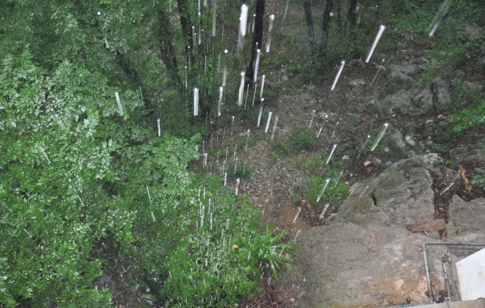
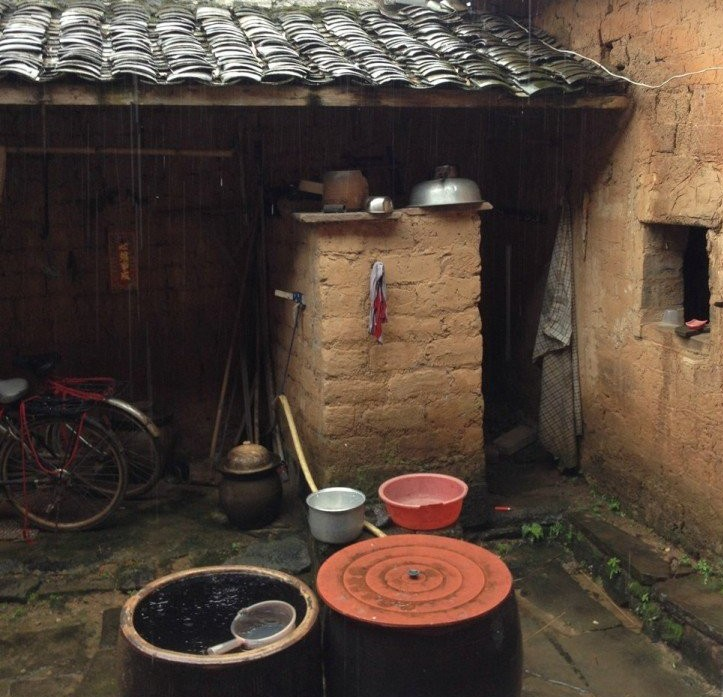
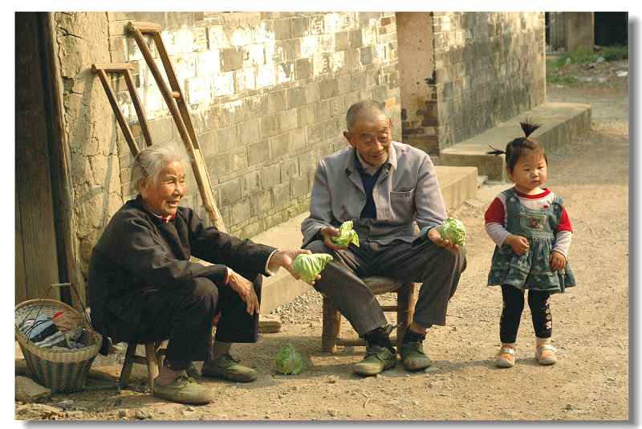

# 写代码的人

1 

1978年，桃子成熟的那段时间，神农架林区进入了一年一度的雨季。

雨水落在茫茫青山上，直入云霄的大树张开了树冠。雨水滴打在叶面上，随即顺着枝桠汇聚到树干，最后流进腐烂的枯叶里。它们沉默地在数百年累积的腐殖层下流动，几乎听不到任何声响。雨水从林区的原始森林聚合到一起，最终走到长江的支流——汉水，是亘古以来的必然规律。

至于在1978年，雨季在山川间肆意奔驰。整个山体变得柔软，泥石流带着土地和树木成块成块地塌下来，摧毁若干条乡村公路，阻断了无数远游人的归路。但于当时的世界而言，与以往的年份及将来的时间并没有什么两样。公路被陡涨的雨水冲断，班车开不进来。男人带着同乡的伙伴，背着铺盖卷儿，斧头插在棉絮里面。那天在太阳还没出来的时候，他们就启程了。

行程大概是这样的，从林区走到县城，在到木鱼、兴山，目的地是长阳，清江附近的一个村庄。两个人身上还有三块七毛钱，年轻的同乡扛着一袋红薯，一头扎进雾霭起伏的山峦。也不知道走了多少时间了，或是夕阳未落，这两个拾荒打扮的男人，一步步蹒跚行进。太多疲惫的脸上，是无法保留羞怯、难堪，以及无地自容的神态的。他们应该是每走一步，就与家乡更近了一些，有了这样短期的目标，再难与多少落魄及白眼相关联。

越过垮掉的那段公路，已经过了两个日出。饥饿与疲惫将精力侵蚀得所剩无几，于是在某个鄂西丛林中的小镇停下来。青石路通往掩映的房舍，镇子里灯火昏黄，异乡人家的感觉悄然滋生，怅然而入。在某一处房屋前，他们将铺盖卷放下来，铺在屋檐下，展开沉重的身体。也许是揣测而言，眼里摒除疲累和昏暗，还能映出房间里的年青姑娘。她的的确良衬衣整齐洁白，西南女性特有的肌肤，灯光下闪着诱人心灵的渴望。光芒转瞬即逝，抬眼望去，天上的星子在夏夜里清晰可见，虫豸声从荷塘里传来，荷包里已没有一分钱。

故事应该接下去，或者是每一个故事期待这样一个转折，但也没有故事可讲。唯能感受到的，是生活永无休止的运转。此刻，他应该进入梦乡，明天还有新鲜的路。

如果那时候是一个人，也可以畅快地走，看不到牵绊和负担。好像这世界上，只有自己一个人，随便往哪个方向走。每逢听到讲这些往事，他总是不厌其烦地后悔，又不能完全表露出来。如果不往南走，转而向东，不过是承担同等的艰苦，走出鄂西山地，奔行在江汉平原上，可以看到辽阔的江河湖海，这样一生再也不会被群山所桎梏。最后他沉默良久，浑浊的眼球让人不愿多看。没有一个人，能够给出这个假设条件下的答案。

幸好，行程是越来越短了，离家也越来越近了。班车开过来了，每个人要二块五，他们选择走山林的小径，日光下行路，夜晚在河流边生起篝火。谈不上有多艰辛，那时候男人有强壮的体魄，每顿可以吃上几大碗米饭，喝几大杯白酒，挣工分也算得上一把好手。因此，男人回家的路程，并不算是一个人的史诗。

这一天，应该是走到西陵峡附近的流域。

我快要死了，回不去了。男人感觉一阵一阵的头痛，彷佛稍不注意就一头栽到山崖下的河流。等到了平坦一些的木鱼县，老婆婆在公路边上卖桃子。同乡人搀扶着男人，讨来几个桃子。男人已快支持不住了，头颅滚烫。好心的婆婆带着他们回去，给男人灌下几杯热茶水，在竹林胜出铺上席子，男人睡了一觉，中暑的症状就消失了。

第二天早晨，老婆婆拿了五块钱，让两个异乡的来客坐上车。

得卖多少个桃子才能换来五块钱，他讲到这里，有些叹息。之后，终无回馈，与其他值得记录的交集。

傍晚，西边的云彩燃烧起来，男人敲响家的大门。阴郁脸孔的妻子，火烧云在脸上镀了一层金色，大一点的姐姐开始说话了，弟弟被女人抱在怀里。经过漫长旅途，此刻男人应该是什么心态呢？这个身无一文的男人终于回到家，有妻子陪伴，过着简陋却温馨的生活，各个亲戚互相关联，路上是熟识的面孔，闲下来左邻右舍聚在一起打牌，再无颠沛流离之苦，再也没有任何故事可讲。

从此以后，男人的以后，如同玻璃映照的昏黄灯火，三角形结构的山川，黛绿浓墨，静止无息，以及与每一行字，沉默着不言不语。平庸够了，总是习惯为那些宏大的场景而热泪盈眶，比如少年第一次看见姑娘如春天山脊的躯体，泛起了不可言喻的乡愁；山民离开那些溪涧和青山，抛下贫乏，尝试获到丰富，第一次靠近城市，惶恐的目光露出悲伤；姑娘离开中国北方的情人，绽放在忧郁的热带，不知从何处来，又将走向哪里，这种忧愁也无法言明。

这个男人，也就是这里远近闻名的乡村神经病，经过他身旁时，人们甚至不愿多看一眼。虽然若干次走出山脉连亘，但一生可记录的故事仅止于此，在故事以前和之后。其余所有时间，被毫无目的的劳动和生活所奴役，耕作割破其手腕，怯懦碾碎其脊梁。一头牛背负了大地的力量，在土地里划出痕迹，我们种上庄稼，发芽，开花结果。

2 

她蹲在灶底下，往灶台里添了一把火，开始做起晚饭。

她炒了一盘青笋加腊肉，为每个孩子的碗里加了一个鸡蛋。全家吃完后，她擦净桌椅，把剩菜都收拾了。刷完了碗后，把早晨割回来的草剁碎，掺了一些红薯和南瓜，把猪舍里的几头母猪喂完。做完杂事后，她走进院子里，天色已经转得昏暗，天空的星子已经从山崖那边升起来了。

她坐在门口的石头上，深吸了一口气，空气中泥土腥膻和瓜果芬芳。她忽然想起有几件事还没做完。她不再看夜色爬上山来，立即回到屋里，将女儿的书包洗干净，为儿子缝补上了衣服的窟窿。她晃晃头，再应该没有落下什么事情了。她回到里屋，顺手拿起墙角的半瓶农药，灌了下去。是上次打蝗虫用的，还剩下大半瓶，她没敢全喝完，拧上了瓶盖。

随后，她躺到床上，看见油纸窗从黄白色变得墨黑。

女人嫁到这户人家的时候，刚满二十岁，是农村姑娘最好的年纪。

老人是这样描述的。那天，女人穿了一件白色衬衫，胸口簪着一朵小红花，路上唢呐欢快鸣叫，整个农村金属队伍为嫁娶婚配展示出喜庆的气氛。婚礼的嫁妆自然说不上丰盛，王木匠做的几件实木家具和绣花棉被，上面落有民办教师描的大红喜字。

女人出家门时，穿着齐整，明眸皓齿，落下一串珍珠似的的眼泪，但并无丝毫失礼之处。那时她站在山坡上，回顾出嫁前的一生。乡邻十里，必然有个小伙子是她的意中人。然而怯懦的汉子，为工分和社会性压垮的汉子，并不能恰到好处地出现在此时此地，喝上一瓶子苞谷酒，为她这次远嫁，露出青筋崩裂的面孔，也还可以作为许多年后的缅怀。

但是什么都没有。不管是记录者在鄂西山地的深夜，虚无的想象，还是无数次曾经发生的现实中，都能确定他们并没有发生，也就此湮没在山峦连绵无尽的广袤中，听不到任何声音，听不到在这样的深夜，农药侵蚀过的女人面目青黑，悄悄来到身旁坐下，胆怯而卑贱，说着含糊不清的方言，低声说出这个记忆。

那些囫囵死掉的，和仍然存活的女人，当我年长后，我从不敢拂逆她们的任何一个要求。

女人嫁到这里后，勤劳和皲裂的纹路共同生长，言谈也难以左右逢源，相反是个极为寡言少语和安本守分的人。经常隔一段时间，男人就要出趟远门，去神农架林区做些木工活儿，倒也没赚什么钱回来。一块儿去的同乡回来后，逢人就说这家男人在外面找了个相好。也是从这些时候开始，夜半三更，也有村里的光棍来敲门，惹得远处的狗叫上一阵子。所以你看，汉子啊，你曾经背负斧头，走过山川河流，走过看不到日光的原始森林，走过看不到尽头的乡村公路，青筋毕露的胳膊砍出一条回家的路。但是任何人在此，找不出一个理由，说一句苛责的话。

隔了一会儿，两个小孩没看到母亲阴郁的脸，公公婆婆没等到烧好的洗脚水。发现她的时候，她闭着眼睛躺在床上，脸色青黑，不用说出一句话，讨一声责骂。

1983年的夏夜，世界乏有大事可谈，夏夜的风和闪电酝酿着一场暴雨的到来，藤架上的黄瓜散发草木香，长庚星在北纬二十四度有良好的视野，女人找出搁在墙角的农药，用袖子擦干了灰尘，打开瓶盖，浓烈的气息冲出来，喝了满满一大口，像是少女在干完农活以后，接过朋友递过来的搪瓷盅子，发疯似的狂饮。

3 

我也是爬了很久的山，才看到通往这户人家的道路，虽然并不是此行的终点。

当时抽很廉价的烟，六毛钱一盒的红宝花。这个地方位处海拔一千五百米的深山，四周望去只看得见群山起伏，并没有那么多“你得首先知道世界是什么样子以及然后知道自己是什么”的烦恼。那时候时候蒙昧无知，总觉得该走下去，不敢停留，去一座山背后的另一座山，娶一个女人回来。

黄瓜藤顺着杆子往上爬，青翠欲滴的黄瓜吊在菜园里。时值夏天，深山里天气不太热，暴晒了大半天，走进屋内，便觉得阴凉无比。这家人据说是老辈的一房远亲，家里只剩下一对老人和两个孩子。几年前，母亲殁去，家里的顶梁柱去了神农架，杳无音信，剩下老人和孩子生活在这里。

三四只鸡在门口啄食，燕子从外面衔着泥巴回到屋檐下，姐姐带着弟弟在院子里捏泥巴人儿，脸上糊着污渍，一看就是没有妈妈的孩子。我坐在屋子里，和老人有一搭没一搭地说话，耐心奉告老人家里若干熟人的近况，泡在杯子里的黑茶冲刷得淡而无味。

远处天空冒起了大朵大朵的黑云，阳光因此灰暗起来，看来不久即有一场大雨来临。我不禁为下午的行程担忧起来。一旦下起大雨，山涧在数十分钟内便会积出大量的水流，伴随着石头和泥土，脚下的实地也可能变得松软。对于在行走山路的人来说，这种天气随时都可能碰到危险。正在担忧的时候，午饭已经做好了。

爸爸什么时候回来，我在饭桌上问。

餐桌上，老人做了凉拌黄瓜和炖小鸡，以及其它不熟悉的野菜。过年的时候就回来了，他们告诉我。据说这家的男人已经出去很久了，大一些的姐姐继续在上学，小一点的孩子虽然早过了年龄，但是没有去上学。两个孩子古灵精怪，黑糊糊的脸蛋下有明亮的眼珠子。当时我实在是贫乏得可怜，在山里收一些货物为生，并没有准备新鲜的礼物可以给他们，而装在口袋里的货款，自然是舍不得轻易动用。

1985年的夏天午后，与第一节里的男人产生间接交集。

当时，坐在这户人家的堂屋里，翘着二郎腿晃晃悠悠，远没有这样男默女泪。风拂过附近的竹林，竹叶沙沙作响。看来是真的要下暴雨了，老人习惯性忧愁地望着天空。我没有打算今天在这里歇脚，扛起背上的竹篓，还需要再翻过两座山，才能达到那个位于群山间的小盆地，那里才能收到最优质的线麻。

后来的几年，我赚了一些小钱，就把家搬进了县城，从此不再和这些穷亲戚来往。

很少听到他们的消息，似乎也没有音讯传来，不管是好的还是坏的。两个孩子可能渐渐长大，坚韧生存，平庸度过一辈子，像这片大地上的皮癣一样；两个老人在日复一日的劳作中，积劳成疾，半夜里咳嗽声传来，扰乱了孩子善良的清梦。没什么人照顾，早上起来给孩子做饭，然后去地里劳动，到了七老八十。之后的节奏是这样的，丈夫先死掉，留下一个孤老婆子在世，松松垮垮地继续存活个六七年。最后卧在床上，喝上一段时间的草药。某天大清早，孩子从屋子里跑出来，脸上全是慌张和急忙，大声告诉左邻右舍，奶奶死了。他们被埋进屋后的土坡，陪伴他们一起的，还有那个熬中药的瓦罐。

老人总是要死的，男人不耐烦地说。石头垒起来的坟上长出绿油油的青草。旁边是暖温带常见的针叶林，常有松子迸裂出来，溅入落叶密布的地面。这时候，翘着大尾巴的松鼠就窜来窜去。日晒雨淋，坟前的石头长满了苔藓。刚开始的春节，男人或其它近亲会放上一挂鞭炮，插在石缝中的纸花随风摇曳；过了约莫一些年，青草围住这个地址，地上也鲜见鞭炮过后的纸屑。尸骨与土地长眠，与山脉融为一体，这一切自然的，就像是世上不存在经济学与律法一样。

前几年，我和堂弟前去吊唁。在回来的暮色苍茫里，吉普坏了。我们俩坐在地上，夜幕覆盖，看着山风刮过针叶林，传来呼啸的响声。你说，他们没有走在集镇上，没有在县城里看见市面，没有去过广州，没有看见衣衫亮丽的人啊，长着像他们一样的脸庞，他们应该看看世界。堂弟对我说，打火机的火苗映照着他，皱纹爬满了他的脸。我偏过头去，没有说话。

看过世界后，你以为结局铁定有什么不同吗？

半瓶种植物还没用得上的农药。青黑的脸孔，又是一个深夜，她无声又胆怯地，过来在我旁边坐下，夜色漆黑，说不出话来。

4 

从寄宿学校放假回来，走到家估计是正午。母亲不在家，门上挂着锁，

她在门口的大槐树坐下，从书包里拿出几本课外书，是从学校图书室借来的《呼啸山庄》。槐花落下来，地上铺了一层层淡黄的花瓣。夏天虫豸不停鸣叫，知了无休止的单调重复，蝗虫羽翼的振动，与溪涧的山泉击到岩石上的破碎，在她明亮而蒙昧的眼神中，几乎听而不闻。此刻，她沉浸于一个异国女性的情绪里，早已接受了生离死别，与情爱之痛。

若干年后，她若是愿意回忆往事的时候，那么一定%E
