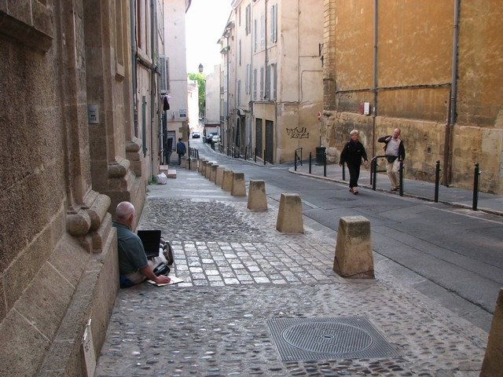
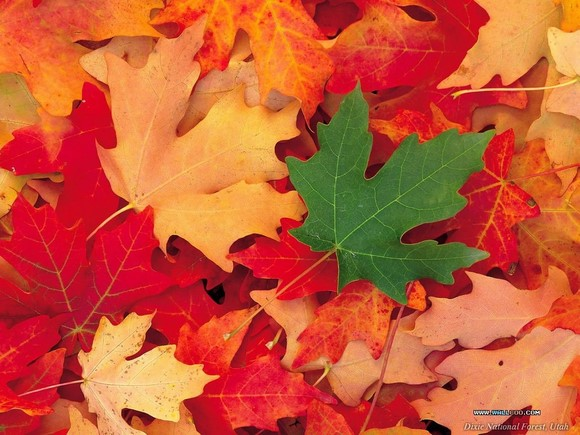

# 写字的陌生人

** **

我把脑袋从一大堆“原材料能源贸易raw material rohstoff”里拿出来，甩一甩这一头枯燥又黏人的词汇。秋天的太阳傍晚来图书馆散步，坐在我的位置，抬头就能看到它今天爱上了楼上土耳其姑娘的脸颊。她在抬头和阳光里的男孩子说话，影子拉的很长，眼睛照的很亮。

打开人人看见昨天的日志下一个一个的留言，觉得这世界好像不能对我再好点了。我心里暖的很，却又诧异的很。差点忍不住要一个一个的问过去，你到底喜欢这文里的什么呢。。。作为一篇半夜十二点之后开始动笔满脑子意识流一样就这么散散漫漫铺了一屏幕的字，虽然我是知道我在写什么，写哪句的时候想了什么，想起了什么于是很感触，这感触于是又催生了下一句的什么，但是因为心知肚明它有它的隐藏和节制，所以并不期待也不应期待被懂得，被欣赏。然而读到它的人，是怎么的就跨越了我这些抽象的没了边的意识流，珍惜了这些字呢？

让我满脸诧异不明所以的感谢你们吧。这世上最好的情怀，原本都是谈不上理由来的。

但是这么诧异着的时候，又想起了一个人。

几个月前了吧，夏天还没来，春天还没走。我和朋友约了在繁茂的大商厦底层的咖啡厅见面。

到的早了，她还没来，捡了个对着窗的座，把自己丢进了软绵绵的沙发里，一样软绵绵的坐着，眼神飘飘忽忽的四处游走。商场的人一向极多，这个咖啡厅也一向很火，紧邻着那个川流不息的旋转门，而我对着的大大落地窗外，是汉堡最繁华的购物街之一了。

我的眼睛在这样百无聊赖的飘忽中看到了窗外的他。

五十岁的样子吧？或许可以更年轻。因为显然，他不是过着优渥日子的人，否则他大概也不至于衣衫褴褛的缩在旋转门旁的垃圾桶边了。他坐在地上，侧靠着咖啡厅的落地窗。他把自己缩的那么紧，那种蜷缩的姿势里，有种难以被掠夺的安全感和温暖感。他深色的头发，清瘦的脸颊，几乎高的有些尖刻的鼻梁，嘈杂的一脸胡茬里看不清颜色的嘴。

我想他蓬乱的头发和一身污浊的衣物，在这人来人往光鲜亮丽的大厦门边，是已经惹眼的了，但这些并不是他让我目不转睛的原因。让我无法不注意他注视他的原因，是他在写字。

他拿着薄薄的一张纸，完全投入的写着字。写字人的投入，有一种凛然的气场，那种投入太纯粹，让人屏心静气。他粗糙的手指攥着那只笔在纸上很细致很细碎的挪动着，有时又会有很飞快的几下滑动，是在涂改着什么吧，因为上一句话是这样苦恼的不得心意？有时他会抬起头来，就好像我现在写着这些字的时候一样，眼神空荡荡的掠过眼前的所有，什么都看见了，什么都又没看见的样子。两手拎满了购物袋的贵妇们，女郎们，高跟鞋清脆的击打在大理石的地面上从旋转门鱼贯而出，鱼贯而入。她们身边的或两鬓斑白或大腹便便或时髦或不耐烦的男人们，绅士的为他们的lady推着门，扶着腰，鱼贯而出，鱼贯而入。站着的人总是看不到坐着的，坐着的又总是不注意蹲着的，蹲着的于是将那缩着的，也都忽略了。

然而他在这样的忽略里怡然自得的被冷落。因为他在写着字。他的身子当然是以一个不被文明世界看好的姿态缩在角落里的，但是他的心在很远的地方。他的身子一动不动，他的思想却欢天喜地无拘无束的跑去了很远的地方。我不知道那是什么地方，我不知道他在给谁，写着什么字。就好比我，在写字的时候，总是不由自主的，会把未来看到这些字的你们一个一个安放在我心里的电影院，每一个字，每一个词，都因为这种想象中的被注视，被挑剔，或许被珍视，变得谨慎而贴切起来。

然而他是在写着诗么？或许是写给家人的信？写给他久违的家乡，写给他满脸皱褶的母亲，写给他胸脯饱满的妻子，写给他苍白孱弱的妹妹?因为他在数个抬头望向空茫茫的远方的瞬间，唇边竟然闪过了那么自然那么精妙的微笑。那种笑容，是一个人毫无戒备的沉浸在愉悦中的笑容，或许连他自己都不会察觉。他那么陶醉在这书写里，好像他要将文字给予的那个人，已经在他眼前了，已经在他身边了，已经扶着他的肩对他调笑说：哦，你看你，缩在这里写字给我，把自己弄成了什么样子……

全是，全是我的想象，但是我目不能移。我好想马上从旋转门冲出去，蹲下来，看着他大大的黑黑的仿佛来自沙漠的眼睛，让他回答我的好奇：先生，告诉我，你在写什么？你在为谁写？你在笑什么？

是我这疯狂的念头在脑子里喊的太大声么？他居然回头看向了我。隔着商厦的落地窗，隔着一堆在卡布奇诺的香味里昏昏欲睡的先生太太们，我们的眼神窘迫的交会在一起，我略略尴尬的笑了。他于是也笑了。

那是真真美好的一瞬间。

天将雨，他收起纸笔，拾起身子来，将要离开了。原来是这样一个佝偻着，瘦小的人（为什么我无端的相信他是来自利比亚或者黎巴嫩呢。）他再次认真的冲我回首，点头，微笑，挥手，告别。我也一样，点头，微笑，挥手，告别。看他圾拉着吊在脚后跟的一只鞋，一步一步缓慢的走进熙熙攘攘的人群中。

那时我就想，有一天我一定会写写你。

那么，就是现在了。

想起他的时候我觉得我忽然不再那么诧异，你们究竟从我的文字里看到了什么所以赠我那么多欢喜。我甚至都没看到他的字呢，我甚至都不知道他写了什么故事呢。然而生活有时是这么粗糙而坚硬的，这么狭促而冷漠的，好多透明的窗啊，旋转的门啊，把人们的心都锁在一个一个精致的笼子里。所以还不眠不休不言不弃的写着字的人，总是想从这严苛生活的间隙里，偷出一个真切的微笑来，暖不了别人，暖暖自己也是好的。

写不出繁花无限，写不出落叶缤纷，就这么从春写到夏，从夏写到秋，也是好的。

 

（责编：应鹏华）

 
