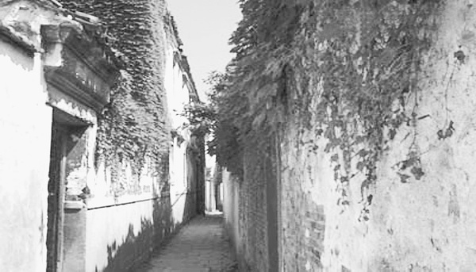

# 冬瓜

冬瓜是我爸爸的爷爷，我们那叫老太。

老太小时候念过私塾，留了一把大胡子，还戴眼镜，你们可以脑补一下他的形象，反正我是脑补的，我没见过老太，关于他的事情我都是从爸爸口中得知的。

冬瓜在洪泽湖边上的泗洪县长大，小时候跟着家里的船逮过鱼和螃蟹，冬瓜有个弟弟叫南瓜，英文是pumpkin，不是我扯淡，后来南瓜真有个英文名叫pumpkin。

冬瓜很聪明，上学时候老师经常夸，全家就他一个人脱产读书，这在小县城很不容易。冬瓜给儿孙取的名字很规整。我的爷爷辈名字都是三个字，中间有个敬字，我的父辈名字都是两个字，都带山字旁。冬瓜过世之后，孩子们的名字取得乱七八糟，比如我，叫农民工。

冬瓜小时候在湖边的草滩里咬芦苇，看水鸟，月亮上来了，芦苇荡里雾气茫茫，家里人四处找不见他。按照现在的说法，如果孩子从小和大自然融为一体，各种感官的潜能会被充分开掘，长大了很有灵气。冬瓜没什么灵气，天天往外跑成了野孩子，打磨得皮糙肉厚，生存能力强。

有灵气的是我爸爸。爸爸是家族里的长房长孙，冬瓜把所有希望都寄托在他身上，爸爸六十年代末上小学一年级，一个月之后被学校开除。老师让小朋友们站成一个圆圈，男女生结对唱歌，歌词是

找啊找啊找朋友

找到一个好朋友

敬个礼啊握握手

我们都是好朋友

我爸唱的时候把第三句唱成“亲个嘴啊握握手”，然后他对面的小姑娘哇的一声就哭了，跑去告老师。老师找来年过花甲的冬瓜，说老子反动儿混蛋，资本主义走狗的后代从小就是流氓。冬瓜疼惜孙子，没有责怪他，带他去邮电局看报纸，教他认字。

我爸说他自己不觉得没上学是什么大不了的损失，倒是老太生前经常自责，说我爸没受到好的教育是因为他。

日本鬼子进中国的时候，冬瓜三十多岁了，南瓜十五六岁，是个小孩蛋子。

两个人一开始在共产党的部队里面，吃不饱饭，还经常有斯斯文文的干部管着。冬瓜想你又不比我有文化，凭什么管我，带着南瓜跑了。

南瓜正处于青春逆反期，不愿意走，他没读过四书五经，在部队接受了革命思想，如获至宝。冬瓜说你不走就留这吧，我一个人走。部队再亲也亲不过哥哥，南瓜舍不得冬瓜，就跟着一起走了。跑了两个人，上级肯定要追究，到底是革命意志不坚定还是奸细特务？冬瓜带着弟弟躲在大草滩里，这是他们从小生活的地方，追逃的人当然找不到他们。兄弟两人在芦苇荡里生活了一段时间，运气好的话，能在草窝窝里捡到鸭蛋，饿极了戳个洞就喝了。

兵荒马乱，冬瓜带着弟弟又想吃饱饭，选择有限，就投奔了国民党的部队。冬瓜当文书，南瓜是娃娃兵讨人喜爱，给长官站岗。老太跟爸爸讲过打仗的事情，爸爸再转述给我，说你两个老太都打过鬼子。拼刺刀的时候都是从上往下砍，或是顺着鬼子的裤裆往上撩，一般不会往前扎，扎进去很难拔出来，等你费半天劲拔出刺刀，旁边的鬼子早把你弄死了。我觉得这种说法很专业很靠谱，至少和电视剧里放的不一样，冬瓜南瓜兄弟大概真的和鬼子干过仗。

抗战结束，南瓜二十出头，想继续留在部队，冬瓜没再勉强他，自己卷铺盖回家了。我说不相信，老太怎么每次说跑就能跑，共产党的部队是容易跑出来的吗，国军也不会让他回家的，还得打内战啊。我爸说反正他就是跑出来了，没人敢抓他，说明你老太在国民党混得还不错，不然文化大革命也不会把你三爷爷斗成那样。

冬瓜有三个儿子，大儿子就是我爷爷，很早就死了，二爷爷当时在东北当兵，三爷爷在水利系统工作，白天挑土修大坝，晚上挨批斗。三爷爷被斗得很惨，冬瓜自己却没事，据说他年纪大胡子大眼镜大，看上去有点吓人，小年轻一般不找他麻烦。

我上大学的时候，有个老师家乡在东北，文革时候他还小，单位批斗一把手，他跟着父母去围观。单位一把手是转业军人，性子刚烈，说老子没错没错就是没错，然后破口大骂，怒操一切围观群众。最后单位干部职工觉得一把手实在是太牛逼了，一致决定还是他来当一把手。

听上去跟闹剧一样，不过是真人真事。

解放以后，共产党的干部找过冬瓜，让他去县里工作，冬瓜不干。当时解放军刚刚打赢淮海战役，气量比较大，加上冬瓜没有参加内战，也就算了，没把他怎么样。

我的爷爷哈密瓜是冬瓜的几个儿子中最不成器的，一直不参加工作，天天在街上瞎逛，小县城就那么几条街，逛够了就跑到安徽泗县的亲戚家里逛。眼看哈密瓜不小了，冬瓜把他找回来说了一门亲。结婚当天晚上，哈密瓜把新娘撇下，跑到县里一个寡妇家打牌，冬瓜因为这事揍过他。浪荡子总是有点本事的，哈密瓜跟小寡妇勾勾搭搭，家里的新媳妇也被他哄得服服帖帖。

我爸爸西瓜出生不久，哈密瓜又跑了，既不是躲债也不是私奔，就是出去玩。我爸对爷爷没有印象，说他应该是个粗心大意的人，在外头成天疯不知道照顾自己，冬天着凉得了肺炎，不去医院继续玩，等病倒了已经很严重了，写了一封信给三爷爷，三爷爷赶到的时候人已经咽气了。哈密瓜虽然死了，三爷爷很生气，当时身上也没带什么钱，就在当地草草埋了。

我们家只有三爷爷知道哈密瓜的葬地，等我们想起来去找的时候，三爷爷已经老了，他说他忘了。

我的爷爷哈密瓜去世是五十年代中期的事情，冬瓜平静的生活就此打破。我的爸爸西瓜也是个调皮捣蛋的家伙，小时候跳进水塘里好久不出来，都以为他淹死了，结果他握着一枚刺刀浮上来，大喊“日本鬼子的刺刀日本鬼子的刺刀”。冬瓜晚年的大部分时间都在为西瓜操心，太阳要落山了，冬瓜就拄着拐杖在家门口等，孙子不回来他就不进屋，也不吃饭。我爸说老人私心重，大儿子死了，就特别看重长头孙子，生怕再出什么事。

有一次公社放电影，西瓜跑去凑热闹，年轻人都爬到树上看。电影放完已经晚上九点多了，他从树上跳下来才发现冬瓜已经等在那了，穿着蓝布褂子，拄着拐杖。西瓜把爷爷扶回家，路上说淮北建设煤矿在招工，他报名了，冬瓜笑笑，说年轻人就该这样，你和你爸不一样。

我爸还没从淮北回来，老太就去世了。

爸爸临走之前，嘱咐三爷爷的儿子好好照顾老太。三爷爷的儿子是我的堂叔，堂叔和爸爸是从小玩到大的兄弟，家里穷的时候盖过同一条棉被。爸爸被学校开除了，堂叔没有，因为三爷爷已经受到了足够的批斗。爸爸到了工作的年纪，堂叔也差不多要参加工作，他比爸爸有文化，出路也好一些。堂叔的爷爷冬瓜，是个国民党，堂叔就在入党申请书上写了“和冬瓜断绝一切关系”。当时的入党申请书不像现在，堂叔那么写了，也真的那么做了，冬瓜在没人照顾的情况下过完了最后的时间。

堂叔入党和老太去世在一九八四年，似乎年轻人已不至于为了政治进步而斩断亲情，但事情就是这样。

冬瓜的兄弟南瓜，参加了他们称为剿匪戡乱的战争，追随国军一路转进去了台湾。我在台湾做交换生的时候，家里叮嘱我一定要去见老太一面。

老头子身体健康，精神矍铄，带了一大家子人请我吃饭。寒暄之后，他问我最近在干什么，我说下个礼拜要在学校做个报告，但是要用英文讲，所以需要准备准备。他听了之后兴致勃勃谈起自己的军旅生涯，美国长官训练他们的时候教授过英语。

“我就有个英文名，pumpkin！”

我小心翼翼，尽量不触及敏感问题，他不问我就不说。老头子说东道西，好像完全不关心我们这边的情况。说实话，那一刻我有些感动，真真切切体会到什么是“近乡情怯”。分别这么多年，不敢问，又从何问起呢？

南瓜终于忍不住问起了哥哥的情况，我说了很长时间，尽量不遗漏我知道的任何细节。南瓜沉默一会，问老三家的孩子怎么能和祖父断绝关系，我没说话，他又问那时候邓小平不是上台了么，我说上台了，八四年阅兵的。老头子又问我爸是不是共产党，我说不是，又问我是不是共产党，我说是。他就问为什么，我说高中成绩好，他用手指着我，说了一句“小共产党”，然后大笑。

一桌人就他一个笑。

我看着觉得尴尬，就笑笑说，对，我是从匪区来的。这下大家都笑了。南瓜说你们是赤匪，我们是白匪，台湾以前也是匪区，现在不是了。

和我同辈的一个姐姐，比我大两岁，已经结婚了，丈夫是大学音乐老师。我问她叫什么名字，她说叫洁雅。我就开启自黑模式，说台湾女孩子名字都很好听很雅致，大陆这边好多女生的名字都是冠男、胜男、胜君什么的，典型的重男轻女加计划生育的产物，明明一个很文静的女孩子，名字特别吓人。大家又笑了，南瓜说对对对，共产党最没文化。

我听了，说不上为什么有些不高兴，就说我认得一个台湾女生，爷爷是国军军官，安徽人，撤到台湾，给两个孙女起名，分别是思皖、念皖。南瓜听了点点头，说我们的根在那边嘛，忘不了。

我挺喜欢南瓜这个老头子，说话有些神经大条，吃完饭临别的时候突然就哭了，从口袋里掏出手绢擦眼泪。他这一哭大家都乐了，话也一下子说开了，有人站出来批评南瓜，老人家也真是的，刚才不好好叙叙旧，一个劲骂人家共产党，把饭桌搞得跟谈判桌一样，现在又舍不得了。

洁雅的丈夫送了我一本书，是洛夫的诗集，《因为风的缘故》。到底是文化人，送的东西都这么雅致，我客气了几句，收下了。

我是二月份从台北回来的，登机之前，忽然下了一阵雨，天空被洗得湛蓝。我的座位靠窗，将行李放好，我就翻开姐夫的礼物。

昨日我沿着河岸

漫步到

芦苇弯腰喝水的地方

顺便请烟囱

在天空为我写一封长长的信

潦是潦草了些

而我的心意

则明亮亦如你窗前的烛光

稍有暧昧之处

势所难免

因为风的缘故

飞机引擎巨大的轰鸣声打断了我，空乘在广播里提醒大家系好安全带。在飞机爬升产生的眩晕感中，我的耳畔响起爸爸儿时唱过的歌：找啊找啊找朋友，找到一个好朋友，亲个嘴啊握握手，我们都是好朋友。同样的旋律，爸爸小时候唱过，我小时候也唱过，将来我的孩子还会唱下去。

姐夫用一口文雅的台湾腔介绍自己：“我是音乐老师。”

“Melody！”

南瓜在一旁插话，似乎要证明自己真的跟美国长官学过英文。

美好的旋律，总会有各种各样荒诞不经的变奏。

(采编：刘铮；责编：刘铮；)
