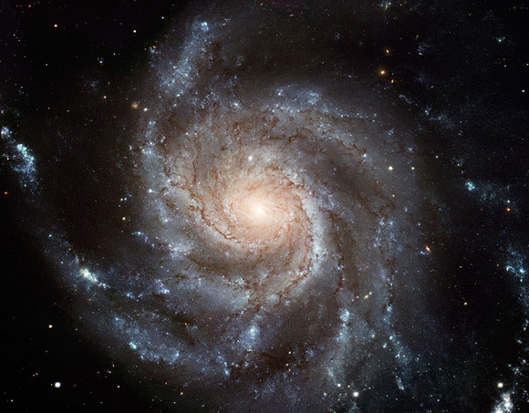

# 凡星

** **

#### 1.

在汉堡时认识一个也算不上朋友的朋友，将近60了吧，结过婚，离过婚，如今致力于实现终生不婚的playboy终极梦想。当然，我想，这一终极梦想的实现有赖于他是否能减一减他好似怀胎八月的大肚子。

是个有趣的人，说话辛辣而直接。有次一起吃饭，饭后坐在饭店的吧台边天南地北的海聊。吧台的酒保有张很帅的拉美面孔，看着顶多三十出头吧，轮廓清晰而优美，高挑的身材把饭店服务员清一色的黑衬衫穿的很有T台范儿。他一边不住手的收拾清理着吧台里的七七八八，一边时不时飞起一眼秋水，电倒吧台边一众男女老少。吭吭，不要采访我的感受，无可奉告，无可奉告。

致力于当playboy的老男人酒意微醺，就很哈皮的和酒保搭话：哎，小伙子，下班后的生活一定很精彩吧！说着拿出那种哥们儿我是老江湖了的过来人姿态，好似人家的生活他一眼参透一样。

那酒保居然就有点羞涩的笑了，说，什么精彩啊，养家糊口很累的，我都是三个娃的爸了。

顿时感觉饭店里的灯都为这句话和这张脸之间的违和感给震的颤了几颤，更不要提一众男女老少的心了。again，不要采访我的感受，无可奉告，无可奉告。

然后这边儿这位大叔就上来劲儿了，腆着他于酒池肉林中穿行而过积累的好大一肚子，和好大一肚子七七八八的人生经验，眼看着就开始为这三十出头已被老婆孩子热炕头锁的牢牢靠靠的美男子上课了：我的天啊！你怎么能这么浪费人生啊！有多少好风景还等着你去瞧那，你本来可以满世界旅游，好好享受人生的啊，啊，非洲的姑娘们多么迷人...你真是，没有尝试过人生的好味道啊！！

我眯着眼，看这个目测将至死不渝践行playboy路线的老男人，竭尽全力想唤醒另一个规规矩矩活在世上的男人对于生活的厌恶。那酒保显然不是善于言辞的人，他只是有点笨拙的辩解，我不是那块料了，大概不适合我的了。

然后老男人就自信满满的抛出一个无敌必杀的绝招问题：你没有尝试过你怎么知道不适合你啊！？

我默默的想了想，就问老男人，那你有尝试过与一个女人相守几十年，每天回家都有三个孩子在期待着你的生活么？

老男人就笑着打哈哈，没个答案。

酒保把一张帅脸笑的愈发迷人，点着头说：对啊对啊，我很爱我的孩子们。

#### 2.

说真的我觉得我这个问题还是不够严密。因为即使老男人曾体会过朝九晚五，幼子绕膝的生活，并确定这样的生活不适合自己，他仍然无法得出结论，这样的生活就不适合那位酒保。

问题是，很多人总是倾向于去相信，那个看上去的“多”就一定胜过那个看上去的“少”，一个把各种经历塞的满满当当的人生就一定精彩过一个朝九晚五模板一样平凡的人生。这些人里，包括曾经的我。的确，事实是，能够进入人们眼帘并被广泛传阅的人生，总是要具备一点不平凡的特质的，有名校毕业放弃高薪工作去做义工的人生，也有功成名就身退深山野林的人生，有徒步横跨大洲的人生，也有背包环球旅行的人生，当然，少不了也有playboy一样一辈子游戏红尘的人生。因为不走寻常路，这些人生容易进入到人们的眼球和记忆。但是是从什么时候开始，这些被贴上“不凡”标签的人生，有了藐视甚而呵斥平凡人生的权利了呢？

我不是一个多么离经叛道的人，也不是一个多么安分守己的人。在上帝和现实给我的时间和空间里，我尽可能的想霸占多一点的自由和故事。这种轻飘飘又沉甸甸永远在我心底的欲望，加上一些不早不晚被赶上的运气，让我在27岁之前走了些更远的路，看了些更多的风景，也经历了一些发生概率不那么高的事。有一度觉得这样小概率的人生貌似是个更高质的存在。也有一度有这样好为人师的嗜好，巴不得能给每一个双羡慕的眼神兜售我还不能称之为经验的经验。

但这种优越感在我想起一个人的时候遇到了瓶颈。

那个人是我妈。农村出生，小镇扎根。结婚，生子，转眼成为一个五十出头，服侍着生病的父亲，思念着远方的女儿的消瘦女人。直到今年，因为要陪同病着的外公去和舅舅团聚，她这辈子第一次坐飞机。前几天中秋，托我家乡好朋友的福，她第一次吃到新鲜的螃蟹。甚至是第一次看到吧。2009年之前，还从未走出过甘肃省。我也从来没有听她讲起过是否喜欢旅游，渴望旅游，看看大世界之类的想法。她的人生核心简单而明确：父母，老公，孩子。只要他们好，她就是好的。就是这么个小女人的人生，也就这么个平凡的妈，放到中国的泱泱人海，这样的人生这样的妈，一眼看去都看不到边。

但也就是这么个妈，二十多年来买任何小吃的时候都没有考虑过给自己买一份。吃任何好吃的都从来没想自己吃第一口。就是这么个没人辅助估计上个火车我都不放心的妈，09年的时候为了照顾生病的我，一句怨言没有跟着我千里迢迢到北京，在热死人的小阁楼里一个月一个月的住下去，故宫天坛一个没去，学校附近的菜市场菜价倒是记到今天还没忘。放着五大洲四大洋没边没际的世界，她没一丁点的好奇，但自从我到了汉堡，她就把德国搞的比中国还门儿清。被她密不透风的爱包围的紧，我浑身的刺啊棱啊都得不到伸展。我这么个重视自由重视浪漫重视理想还重视个体的人，和这个几乎忽略我所重视的一切而只重视我的女人，漫长年间不断的争吵，带着我年轻傲慢的优越感，我希望她过更加丰富的人生，我希望她肯去看更大的世界，希望她能对无限的可能如我一样充满渴望，也由此能够把那么深的山一样海一样的爱，分一点给她自己，好让我透透气。

而我怒，她就会流泪，一边又不知道自己错在哪里，只好不断诺诺的点头，应承我那些“高质量人生”的号召。

她的平凡，平凡得连她自己都不觉得被忽视被嘲笑有什么不对。平凡到至今一大家子人都不知道她喜欢吃什么东西。平凡到有时隔着山隔着海，我会愈发忽略来自那颗平凡心脏的疼痛和思念。

但是我带着她给我的这双眼，这双耳，这双脚，看了好多，听了好多，走了好多。不知道是从哪一瞬间开始明白，不凡的人生各有各自的精彩，也各有各自的代价。要冒险，就要舍得丢弃安稳。要出走，就要习惯没人等待。要体验英雄壮美，也就得忍耐帝王孤单。而且有时，讽刺的是，去践行所谓不凡的人生，反而还要比日复一日年复一年坚守一个平凡的人生要容易——你只要一心一意的守住你的自私与贪婪，不去被母亲的眼泪或者父亲的白发所刺伤，不去被等待你的男人或者女人心碎的声音所吵醒。有不凡人生在那里，有壮阔山水在那里，有一个大大的“我”字，占掉了天空和大地，什么别的，也都不用看到了吧。

只是有时候，我也很真切的怀疑，登上世界之巅的那一份狂喜，和辛劳一年的民工拿到年末的工资，异地相恋的情侣千里跋涉后的拥抱，年轻的男人初为人父的喜悦，年迈的父母在机场等候到异国归来的女儿....彼等喜悦，和此等喜悦，究竟有何质的不同。

这不凡人生里的悲欢喜怒，和平凡人生中的跌宕起伏，说到底，只是样貌有别，何来地位尊卑。

#### 3.

我觉得我这辈子大概都成为不了妈妈那样的一个女人。我没法牺牲那么多，委屈那么多，付出那么多。

我觉得我也注定还是要被一些小概率的人生所吸引，被枝繁叶茂的生活所蛊惑，也被海阔天空的情怀迷的时不时脱离了轨道。

但我把我的敬意，平平的端给所有认认真真过着自己人生的人们。不管那是畅销书封面上的人生，那是街头巷尾口耳相传的人生，还是默默无闻自得其乐的人生，密密麻麻隐匿人群的人生。

繁星满天，凡星满天。

#### 4.

老妈，我想你。我爱你。

 

（编辑：欧阳银华；责编：周拙恒）

 
